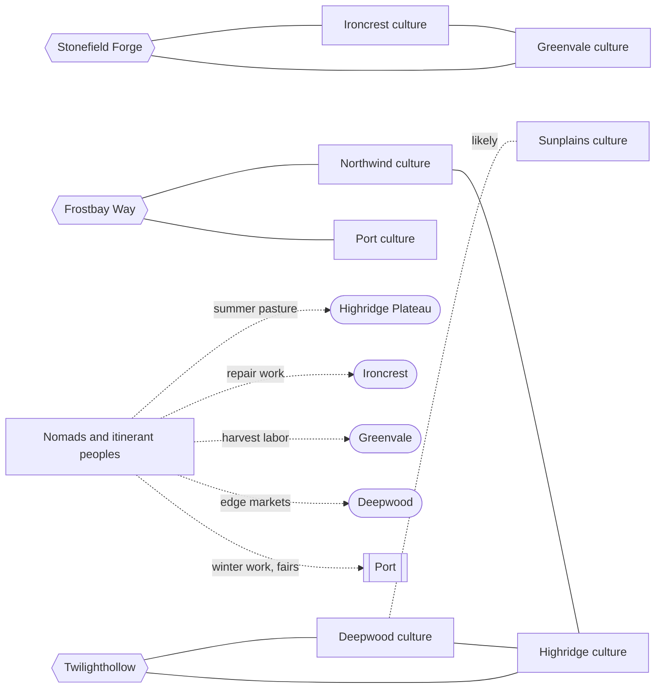

# Atlas Part 2: Culture

## Status

**Derived view, not canon. Generated; don't edit by hand.** Edit [`culture.json`](culture.json), then run `python3 atlas/tools/atlas_part.py` from the repository root. That rebuilds this page, the [image](culture.png) of this part, and the [combined board](../board/README.md) (interactive: https://claude.ai/artifact/XG2oKvVRes6f7su2dyMaWs). Every thing links to the wiki page it comes from; the wiki wins any disagreement. Part of the [Atlas](../README.md); plan in [PLAN.md](../PLAN.md).

How each region talks, builds, names places and celebrates; what people say about each other; where cultures mix; and the people who travel between them.

Food has its own part (Part 3) and religion and guilds belong to Part 4 (Power), so they aren't here yet.

**Counts:** 8 cultures, 1 mobile people, 7 in-world sayings, 28 festivals; 21 connections (15 stated in the wiki, 6 inferred).

## Gaps this part exposes

Things the wiki doesn't settle yet. Listed for James to decide; nothing here was filled in.

- Five culture pages carry no status label: Architecture, Language and Thought, Naming, Culture and Influence (whose title reads 'Cultural Inspiration'), and Border Towns.
- Region culture is written twice: each region page has its own inspiration, language and architecture sections, and the Culture pages repeat them across regions. It's two owners for one concept. They agree in substance, but the lists already differ in detail: Highridge is 'probably the most multilingual settled region' on its region page but only 'likely highly multilingual' in Language and Thought; Ironcrest's speech list differs (ordered, attempted, completed, inspected, guaranteed versus completed, inspected, merely claimed); Architecture lists Deepwood longhouses flatly where the region page says they may appear depending on climate.
- Half the festivals (14 of 28) are names in the calendar with no description.
- No named languages, dialects or scripts anywhere; naming languages and personal-name systems are still open, and several character names stay provisional until they're settled.
- The nomads have no name, no named circuits, families, camps or stopping places. The page says 'the nomads' shouldn't be one culture, but only one mobile people is sketched.
- Deepwood–Sunplains is the only culture mix described (forest raised floors with courtyard shade) where Part 1 found no border town.
- Three border towns have no speech, festival or building detail: Icestep Summit, Darkroot Gulch and Frostbay Way (Frostbay's identity items are listed: Northwind seafaring, Port credit and trade law, ship repair, immigrant merchants, seasonal labor). The Icestep building and speech links and the Stonefield building link are inferred from the general border examples in Architecture and Language and Thought.
- The Spine and Underpass have peoples (Underpass families born underground, pilgrimage traditions, old toll states) but no culture described.
- No in-world sayings about border towns, Spine or Underpass peoples, or the nomads; Greenvale and Sunplains have no hiring shortcut.
- Most region-and-season cells in the festival calendar are blank; the page says only that no major shared festival was defined there (Port has nothing from late spring to late summer).
- No festivals are named for border towns, nomads or fairs, though Harveston Vale keeps festivals built around several harvest calendars and the nomad page mentions moving between fairs and Port's major fairs.
- Port's 'occupations found nowhere else at the same scale' aren't named.
- Root Cellar Night remembers the Seven-year Blight; it will connect when Part 5 (History) is built.
- Religion (Part 4) is only hinted at here: Solstice Lanterns says different faiths explain it differently, Port has blended religious practice, and several festivals imply rites. They'll connect when Part 4 is built.

## Where cultures mix

| From | Connection | To | Basis | Supporting text |
| --- | --- | --- | --- | --- |
| Ironcrest culture | mixes at the border with | Greenvale culture | stated | “Ironcrest stone foundations + Greenvale flood/yard planning” [source](../../wiki/Culture/Architecture.md#border-towns) Also: “direct responsibility marking from Ironcrest + process/aspect distinctions from Greenvale” [source](../../wiki/Culture/Language-and-Thought.md#border-generations) |
| Northwind culture | mixes at the border with | Highridge culture | stated | “Northwind insulation + Highridge compact stone windbreaks” [source](../../wiki/Culture/Architecture.md#border-towns) Also: “Northwind evidentiality + Highridge contractual conditionals” [source](../../wiki/Culture/Language-and-Thought.md#border-generations) |
| Deepwood culture | mixes where forest meets hot lowland with | Sunplains culture | stated, likely | “Deepwood raised floors + Sunplains courtyard shade where forest gives way to hot lowland” [source](../../wiki/Culture/Architecture.md#border-towns) |
| Deepwood culture | mixes at the border with | Highridge culture | stated | “Deepwood ecological agency + Highridge precision about obligations” [source](../../wiki/Culture/Language-and-Thought.md#border-generations) |

## Border-town culture

| From | Connection | To | Basis | Supporting text |
| --- | --- | --- | --- | --- |
| Stonefield Forge | speech blends | Ironcrest culture | stated | “blended speech emphasizing both accountability and long-term process” [source](../../wiki/Places/Border-Towns.md#stonefield-forge--ironcrest--greenvale) Also: “people may habitually ask who is accountable” [source](../../wiki/Culture/Language-and-Thought.md#ironcrest-languages) *accountability is Ironcrest's habit* |
| Stonefield Forge | speech blends | Greenvale culture | stated | “blended speech emphasizing both accountability and long-term process” [source](../../wiki/Places/Border-Towns.md#stonefield-forge--ironcrest--greenvale) Also: “speakers may naturally discuss plans as processes with stages and shared obligations” [source](../../wiki/Culture/Language-and-Thought.md#greenvale-languages) *process is Greenvale's habit* |
| Twilighthollow | speech blends | Deepwood culture | stated | “hybrid speech combining environmental categories with contractual precision” [source](../../wiki/Places/Border-Towns.md#twilighthollow--deepwood--highridge) Also: “Deepwood ecological agency + Highridge precision about obligations” [source](../../wiki/Culture/Language-and-Thought.md#border-generations) |
| Twilighthollow | speech blends | Highridge culture | stated | “hybrid speech combining environmental categories with contractual precision” [source](../../wiki/Places/Border-Towns.md#twilighthollow--deepwood--highridge) Also: “Deepwood ecological agency + Highridge precision about obligations” [source](../../wiki/Culture/Language-and-Thought.md#border-generations) |
| Harveston Vale | likely keeps festivals from | Greenvale culture | inferred | “foods and festivals built around several harvest calendars” [source](../../wiki/Places/Border-Towns.md#harveston-vale--greenvale--sunplains) |
| Harveston Vale | likely keeps festivals from | Sunplains culture | inferred | “foods and festivals built around several harvest calendars” [source](../../wiki/Places/Border-Towns.md#harveston-vale--greenvale--sunplains) |
| Icestep Summit | likely builds and speaks like | Northwind culture | inferred | “Northwind insulation + Highridge compact stone windbreaks” [source](../../wiki/Culture/Architecture.md#border-towns) Also: “Northwind evidentiality + Highridge contractual conditionals” [source](../../wiki/Culture/Language-and-Thought.md#border-generations) |
| Icestep Summit | likely builds and speaks like | Highridge culture | inferred | “Northwind insulation + Highridge compact stone windbreaks” [source](../../wiki/Culture/Architecture.md#border-towns) Also: “Northwind evidentiality + Highridge contractual conditionals” [source](../../wiki/Culture/Language-and-Thought.md#border-generations) |
| Stonefield Forge | likely builds like | Ironcrest culture | inferred | “Ironcrest stone foundations + Greenvale flood/yard planning” [source](../../wiki/Culture/Architecture.md#border-towns) |
| Stonefield Forge | likely builds like | Greenvale culture | inferred | “Ironcrest stone foundations + Greenvale flood/yard planning” [source](../../wiki/Culture/Architecture.md#border-towns) |
| Frostbay Way | draws its identity from | Northwind culture | stated | “Northwind seafaring” [source](../../wiki/Places/Border-Towns.md#frostbay-way--northwind--port-influence-zone) |
| Frostbay Way | draws its identity from | Port culture | stated | “Port credit and trade law” [source](../../wiki/Places/Border-Towns.md#frostbay-way--northwind--port-influence-zone) |

## Nomad circuits

| From | Connection | To | Basis | Supporting text |
| --- | --- | --- | --- | --- |
| Nomads and itinerant peoples | circuit may include (summer pasture) | Highridge Plateau | stated, possible | “summer Highridge pasture” [source](../../wiki/Culture/Nomads.md#a-possible-form) |
| Nomads and itinerant peoples | circuit may include (repair work) | Ironcrest | stated, possible | “Ironcrest repair work” [source](../../wiki/Culture/Nomads.md#a-possible-form) |
| Nomads and itinerant peoples | circuit may include (harvest labor) | Greenvale | stated, possible | “Greenvale harvest labor” [source](../../wiki/Culture/Nomads.md#a-possible-form) |
| Nomads and itinerant peoples | circuit may include (edge markets) | Deepwood | stated, possible | “Deepwood edge markets” [source](../../wiki/Culture/Nomads.md#a-possible-form) |
| Nomads and itinerant peoples | circuit may include (winter work, fairs) | Port | stated, possible | “Port winter work or major fairs” [source](../../wiki/Culture/Nomads.md#a-possible-form) |

## Diagram

Stated connections only; positions are automatic. The [interactive board](../board/README.md) is easier to read.

## Every thing in this part

Grouped by board column.

### Northwind

| Thing | Kind | Status | Summary |
| --- | --- | --- | --- |
| [Northwind culture](../../wiki/Regions/Northwind.md) | Culture | Working canon | Colder than most of the known world and unusually maritime, but its people aren't uniformly fishers or stoic seafarers. Conversations can be sensitive to who is included, who witnessed something, and how certain a plan really is. |
| [“Cold water, cold blood.”](../../wiki/Culture/Regional-Social-Dynamics.md#example-sayings) | In-world saying | Provisional scene texture | What the speaker implies: maritime hardness becoming callousness. Something particular people might say or expect, never an objective description. It can be affectionate, hostile, self-mocking or obsolete depending on who says it. |
| [Ice Breaking](../../wiki/Culture/Festivals-and-Seasonal-Life.md#northwind) | Festival, Early spring | Provisional | Can mark the safe return of seasonal navigation; boat inspection, first launches and rights to contested fishing grounds can turn survival practice into public ritual. |
| [First Catch](../../wiki/Culture/Festivals-and-Seasonal-Life.md#seasonal-calendar) | Festival, Late spring | Provisional | Named in the seasonal calendar (Late spring) only; no description yet. |
| [Aurora Nights](../../wiki/Culture/Festivals-and-Seasonal-Life.md#northwind) | Festival, Late summer | Provisional | Offers a quieter counterpoint to Northwind's rough public image: family stories, ancestor traditions, betrothals and beliefs tied to the lights. Supernatural explanations are beliefs, not proof. |
| [Last Sail](../../wiki/Culture/Festivals-and-Seasonal-Life.md#seasonal-calendar) | Festival, Late autumn | Provisional | Named in the seasonal calendar (Late autumn) only; no description yet. |
| [Long Dark Feast](../../wiki/Culture/Festivals-and-Seasonal-Life.md#seasonal-calendar) | Festival, Midwinter | Provisional | Named in the seasonal calendar (Midwinter) only; no description yet. |

**Northwind culture**

- *Inspiration:* Scottish and Irish island communities; Icelandic, Faroese, Scandinavian and North Atlantic maritime cultures; Ainu, Japanese, Korean, Aleut, Inuit and other northern and coastal societies; fishing societies built around seasonal risk, preservation and cooperative labor. Avoid generic 'Viking culture.' ([source](../../wiki/Regions/Northwind.md#cultural-inspirations))
- *Speech:* May include an inclusive and an exclusive 'we', strong evidential markers, directional vocabulary tied to coast, wind and slope, and future forms that stress conditions. Conversations become sensitive to who is included, who witnessed something, and how certain a plan really is. ([source](../../wiki/Regions/Northwind.md#language))
- *Building:* Large ports with stone breakwaters, dock districts, timber warehouses, fish markets, smokehouses, boatyards, public halls and shrines, built above flood or storm lines. Fishing towns with small docks, communal work yards, drying racks, storage pits and steep-roofed or earth-insulated homes depending on climate. Remote families build for insulation and repairability from driftwood, stone, turf, timber, clay, hide, reeds and imported iron. ([source](../../wiki/Regions/Northwind.md#settlement-and-architecture))
- *Place names:* Coastal geography, bays, islands, currents, lineages, seasonal sites. ([source](../../wiki/Culture/Naming.md#regional-direction))
- *Also on:* [Language and Thought](../../wiki/Culture/Language-and-Thought.md#northwind-languages), [Architecture](../../wiki/Culture/Architecture.md#northwind), [Culture and Influence](../../wiki/Culture/Culture-and-Influence.md#northwind)

**“Cold water, cold blood.”**

- *Employers' biased shortcut:* Northwind sailors are assumed to be safer hires for ship work. Reality may contradict it; show counterexamples. A stereotype should create tension, opportunity or injustice, not become a rule of the world. ([source](../../wiki/Culture/Regional-Social-Dynamics.md#hiring-prejudice))

### Highridge Plateau

| Thing | Kind | Status | Summary |
| --- | --- | --- | --- |
| [Highridge culture](../../wiki/Regions/Highridge-Plateau.md) | Culture | Working canon | A highland crossroads, not simply 'the merchant region': routes that avoid or cross the Spine converge here. People used to bargaining across languages notice what a promise actually commits someone to. |
| [“Every road leads to Highridge's pocket.”](../../wiki/Culture/Regional-Social-Dynamics.md#example-sayings) | In-world saying | Provisional scene texture | What the speaker implies: intermediaries profit from everyone. Something particular people might say or expect, never an objective description. It can be affectionate, hostile, self-mocking or obsolete depending on who says it. |
| [Pass Opening](../../wiki/Culture/Festivals-and-Seasonal-Life.md#seasonal-calendar) | Festival, Early spring | Provisional | Named in the seasonal calendar (Early spring) only; no description yet. |
| [Caravan Blessing](../../wiki/Culture/Festivals-and-Seasonal-Life.md#seasonal-calendar) | Festival, Late spring | Provisional | Named in the seasonal calendar (Late spring) only; no description yet. |
| [Midsummer Debates](../../wiki/Culture/Festivals-and-Seasonal-Life.md#highridge) | Festival, Midsummer | Provisional | Can make rhetoric a public competitive craft, without implying every Highridge resident is a philosopher. |
| [Ledger Closing](../../wiki/Culture/Festivals-and-Seasonal-Life.md#highridge) | Festival, Late autumn | Provisional | Can mark the end of a fiscal or trade cycle: debts settled, renegotiated or publicly disputed before a brief period of relief. |

**Highridge culture**

- *Aim:* Its defining history is its role as intermediary, so cultural borrowing should be especially visible. ([source](../../wiki/Culture/Culture-and-Influence.md#highridge-plateau))
- *Inspiration:* Tibetan and Himalayan plateau communities; Andean highlands; Central Asian caravan societies; Persian and Silk Road caravanserai networks; Caucasus trade communities; mountain markets across Asia and South America. ([source](../../wiki/Regions/Highridge-Plateau.md#cultural-inspirations))
- *Speech:* Probably the most multilingual settled region. Trade forms stress condition, obligation, evidence, quotation, weights, dates, routes and exceptions, so people notice what a promise actually commits someone to. ([source](../../wiki/Regions/Highridge-Plateau.md#language))
- *Building:* Cities layered around markets, caravan yards, stables, cisterns, temples, meeting halls and arbitration halls, with terraces and retaining walls; neighborhoods show generations of settled foreign merchants. Pass towns with fortified gates, inns, animal yards, repair shops, public scales and toll or customs houses. ([source](../../wiki/Regions/Highridge-Plateau.md#settlement-and-architecture))
- *Place names:* Route names, passes, wells, caravan families, old toll sites, names translated from several languages. ([source](../../wiki/Culture/Naming.md#regional-direction))
- *Also on:* [Language and Thought](../../wiki/Culture/Language-and-Thought.md#highridge-languages), [Architecture](../../wiki/Culture/Architecture.md#highridge), [Culture and Influence](../../wiki/Culture/Culture-and-Influence.md#highridge-plateau)

**“Every road leads to Highridge's pocket.”**

- *Employers' biased shortcut:* Highridge-trained clerks or Port polyglots may be preferred for translation and records. Reality may contradict it; show counterexamples. A stereotype should create tension, opportunity or injustice, not become a rule of the world. ([source](../../wiki/Culture/Regional-Social-Dynamics.md#hiring-prejudice))

### Deepwood

| Thing | Kind | Status | Summary |
| --- | --- | --- | --- |
| [Deepwood culture](../../wiki/Regions/Deepwood.md) | Culture | Working canon | People who have developed institutions for living with, using and defending the forest. It shouldn't be written as an undifferentiated mystical wilderness. |
| [“Gone to the trees.”](../../wiki/Culture/Regional-Social-Dynamics.md#example-sayings) | In-world saying | Provisional scene texture | What the speaker implies: outsiders treating seclusion as irrationality. Something particular people might say or expect, never an objective description. It can be affectionate, hostile, self-mocking or obsolete depending on who says it. |
| [Silent Thaw](../../wiki/Culture/Festivals-and-Seasonal-Life.md#seasonal-calendar) | Festival, Early spring | Provisional | Named in the seasonal calendar (Early spring) only; no description yet. |
| [Canopy Vigil](../../wiki/Culture/Festivals-and-Seasonal-Life.md#deepwood) | Festival, Midsummer | Provisional | Can center on restraint and attention: reduced work, quiet observation and later community interpretation. |
| [Gathering Quiet](../../wiki/Culture/Festivals-and-Seasonal-Life.md#seasonal-calendar) | Festival, Early autumn | Provisional | Named in the seasonal calendar (Early autumn) only; no description yet. |
| [Deep Silence](../../wiki/Culture/Festivals-and-Seasonal-Life.md#deepwood) | Festival, Midwinter | Provisional | Can vary dramatically by community: some may treat it as spiritual practice; others as old custom, ecological rule or a holiday they barely observe. |

**Deepwood culture**

- *Aim:* Avoid the 'mystical forest people' monoculture. ([source](../../wiki/Culture/Culture-and-Influence.md#deepwood))
- *Inspiration:* Amazonian forest societies; Dayak and Bornean longhouse communities; Japanese managed woodland traditions; Indigenous North American forest societies; Baltic, Slavic, Finnic and Celtic woodland cultures; historical forest economies worldwide. ([source](../../wiki/Regions/Deepwood.md#cultural-inspirations))
- *Speech:* May mark agency or animacy grammatically, with precise words for forest age, water state, animal sign, plant succession, cutting rights, regrowth, and inherited versus directly observed knowledge. Environmental attention without implying supernatural wisdom. ([source](../../wiki/Regions/Deepwood.md#language))
- *Building:* Cities still look like cities: markets, river docks, workshops, religious compounds, poor neighborhoods, roads and boardwalks; a city may grow around existing tree stands or waterways rather than a geometric plan. Many towns are specialized (river trade, forest products, hunting, timber, medicine, border exchange); longhouses, raised floors, covered walkways and courtyards may appear depending on climate. Remote homes: some raised for wet ground, others partly dug into slopes. ([source](../../wiki/Regions/Deepwood.md#settlement-and-architecture))
- *Place names:* Waterways, groves, species, older peoples, landmarks that may not be obvious to outsiders. ([source](../../wiki/Culture/Naming.md#regional-direction))
- *Also on:* [Language and Thought](../../wiki/Culture/Language-and-Thought.md#deepwood-languages), [Architecture](../../wiki/Culture/Architecture.md#deepwood), [Culture and Influence](../../wiki/Culture/Culture-and-Influence.md#deepwood)

**“Gone to the trees.”**

- *Employers' biased shortcut:* Deepwood-trained healers can command prestige for some specialties. Reality may contradict it; show counterexamples. A stereotype should create tension, opportunity or injustice, not become a rule of the world. ([source](../../wiki/Culture/Regional-Social-Dynamics.md#hiring-prejudice))

### Ironcrest

| Thing | Kind | Status | Summary |
| --- | --- | --- | --- |
| [Ironcrest culture](../../wiki/Regions/Ironcrest.md) | Culture | Working canon | Places unusually high value on demonstrated skill, accountability for work, reputation over generations, apprenticeship, mutual aid in dangerous trades and practical literacy. There's a long tension between craft pride and concentrated ownership. |
| [“Iron hands, iron hearts.”](../../wiki/Culture/Regional-Social-Dynamics.md#example-sayings) | In-world saying | Provisional scene texture | What the speaker implies: toughness becoming cruelty. Something particular people might say or expect, never an objective description. It can be affectionate, hostile, self-mocking or obsolete depending on who says it. |
| [Forge Reawakening](../../wiki/Culture/Festivals-and-Seasonal-Life.md#ironcrest) | Festival, Early spring | Provisional | Can mark foundries returning from winter maintenance; apprenticeship judgments, remembrance of dead workers and the ceremonial relighting of fires can reinforce labor identity. |
| [Foundry Week](../../wiki/Culture/Festivals-and-Seasonal-Life.md#seasonal-calendar) | Festival, Midsummer | Provisional | Named in the seasonal calendar (Midsummer) only; no description yet. |
| [Ember Remembrance](../../wiki/Culture/Festivals-and-Seasonal-Life.md#ironcrest) | Festival, Late autumn | Provisional | Works better as a solemn memorial than a spectacle: banked fires, names on memorial walls and a rare interruption of commerce. |
| [Coal Ember Vigil](../../wiki/Culture/Festivals-and-Seasonal-Life.md#seasonal-calendar) | Festival, Midwinter | Provisional | Named in the seasonal calendar (Midwinter) only; no description yet. |

**Ironcrest culture**

- *Values:* Demonstrated skill; accountability for work; reputation over generations; apprenticeship; mutual aid in dangerous trades; practical literacy such as contracts, weights, measures and records. Mine owners, guild masters, workers, small smiths, merchants and rural communities don't necessarily want the same future. ([source](../../wiki/Regions/Ironcrest.md#cultural-character))
- *Inspiration:* Scottish, Welsh and Appalachian mining communities; Andean highland mining settlements; Ethiopian and Yemeni upland stone architecture; Japanese and Chinese craft-lineage traditions; Balkan and Central European mountain towns. It shouldn't resemble any one of them directly. ([source](../../wiki/Regions/Ironcrest.md#cultural-influences))
- *Speech:* May habitually distinguish whether something was ordered, attempted, completed, inspected or guaranteed: close attention to responsibility and proof, without making every Ironcrest person blunt or emotionless. ([source](../../wiki/Regions/Ironcrest.md#language))
- *Building:* Older urban cores may contain dark local stone, narrow lanes, fortified compounds, cisterns, market courts, guild halls, and neighborhoods layered around mines or river crossings. Workshops run on water wheels, bellows, cranes, hand and animal power. Towns exist for several reasons at once; homes show mixed economies (a miner may keep goats, a smith may farm part of the year). ([source](../../wiki/Regions/Ironcrest.md#settlement-and-architecture))
- *Place names:* Older upland and river names beneath later mining, fort, family and guild names. ([source](../../wiki/Culture/Naming.md#regional-direction))
- *Also on:* [Language and Thought](../../wiki/Culture/Language-and-Thought.md#ironcrest-languages), [Architecture](../../wiki/Culture/Architecture.md#ironcrest), [Culture and Influence](../../wiki/Culture/Culture-and-Influence.md#ironcrest)

**“Iron hands, iron hearts.”**

- *Employers' biased shortcut:* Ironcrest workers are stereotyped as better metalworkers. Reality may contradict it; show counterexamples. A stereotype should create tension, opportunity or injustice, not become a rule of the world. ([source](../../wiki/Culture/Regional-Social-Dynamics.md#hiring-prejudice))

### Greenvale

| Thing | Kind | Status | Summary |
| --- | --- | --- | --- |
| [Greenvale culture](../../wiki/Regions/Greenvale.md) | Culture | Working canon | The largest major agricultural heartland, but not one endless field: market towns, pasture, rivers, orchards, mills, estates, tenant villages and cities. Speech may reinforce attention to process, inheritance and long-term obligation. |
| [“Soft as Greenvale butter.”](../../wiki/Culture/Regional-Social-Dynamics.md#example-sayings) | In-world saying | Provisional scene texture | What the speaker implies: agricultural comfort becoming weakness. Something particular people might say or expect, never an objective description. It can be affectionate, hostile, self-mocking or obsolete depending on who says it. |
| [Sowing Days](../../wiki/Culture/Festivals-and-Seasonal-Life.md#seasonal-calendar) | Festival, Early spring | Provisional | Named in the seasonal calendar (Early spring) only; no description yet. |
| [Grain Ripening](../../wiki/Culture/Festivals-and-Seasonal-Life.md#seasonal-calendar) | Festival, Late summer | Provisional | Named in the seasonal calendar (Late summer) only; no description yet. |
| [Harvest Home](../../wiki/Culture/Festivals-and-Seasonal-Life.md#greenvale) | Festival, Early autumn | Provisional | Can combine celebration with redistribution, seed exchange and public accounting of surplus. |
| [Root Cellar Night](../../wiki/Culture/Festivals-and-Seasonal-Life.md#greenvale) | Festival, Midwinter | Provisional | Can be intimate rather than civic: stored food, family stories and remembrance of old scarcity such as the Seven-year Blight. |

**Greenvale culture**

- *Inspiration:* Andean cooperative agriculture; South and Southeast Asian irrigation communities; Irish rural social traditions; Indigenous seed stewardship in the Americas; Eastern European mixed farming; village-compound and commons systems worldwide. ([source](../../wiki/Regions/Greenvale.md#cultural-inspirations))
- *Aim:* A heavily inhabited agricultural country, not a pastoral postcard. ([source](../../wiki/Culture/Culture-and-Influence.md#greenvale))
- *Speech:* May distinguish beginning, ongoing, recurring, interrupted, completed and seasonal work, and personal property from land or resources held in stewardship for family or community. ([source](../../wiki/Regions/Greenvale.md#language))
- *Building:* Agricultural cities are market, milling, storage, craft and legal centers, not giant villages: granaries, mills, river quays, dense working-class districts, wealthy landowning quarters, caravan yards. Towns vary: raised floors on floodplains, earthen or timber compounds in drier towns, cooperative villages around common storage and wells. Farmsteads are mixed-purpose complexes. ([source](../../wiki/Regions/Greenvale.md#settlement-and-architecture))
- *Place names:* Rivers, soils, old settlements, family lands, markets, former estates. ([source](../../wiki/Culture/Naming.md#regional-direction))
- *Also on:* [Language and Thought](../../wiki/Culture/Language-and-Thought.md#greenvale-languages), [Architecture](../../wiki/Culture/Architecture.md#greenvale), [Culture and Influence](../../wiki/Culture/Culture-and-Influence.md#greenvale)

### Sunplains

| Thing | Kind | Status | Summary |
| --- | --- | --- | --- |
| [Sunplains culture](../../wiki/Regions/Sunplains.md) | Culture | Working canon | The warmer, generally drier south and east of old city-states, irrigated farming, orchards, coastal exchange and civic competition; not to be reduced to wine, olive oil and festivals. Its speech helps explain why political speech is a craft and public humiliation can matter politically. |
| [“Golden tongue, copper coin.”](../../wiki/Culture/Regional-Social-Dynamics.md#example-sayings) | In-world saying | Provisional scene texture | What the speaker implies: polished rhetoric hiding little substance. Something particular people might say or expect, never an objective description. It can be affectionate, hostile, self-mocking or obsolete depending on who says it. |
| [Blossom Markets](../../wiki/Culture/Festivals-and-Seasonal-Life.md#seasonal-calendar) | Festival, Early spring | Provisional | Named in the seasonal calendar (Early spring) only; no description yet. |
| [Festival of Patrons](../../wiki/Culture/Festivals-and-Seasonal-Life.md#sunplains) | Festival, Midsummer | Provisional | Can turn civic generosity into competition among houses, guilds and cities. |
| [Wine Crush](../../wiki/Culture/Festivals-and-Seasonal-Life.md#seasonal-calendar) | Festival, Early autumn | Provisional | Named in the seasonal calendar (Early autumn) only; no description yet. |
| [Solstice Lanterns](../../wiki/Culture/Festivals-and-Seasonal-Life.md#sunplains) | Festival, Midwinter | Provisional | Can mix family, neighborhood and civic meanings; different faiths may explain the same public practice differently. |

**Sunplains culture**

- *Aim:* Its civic competition should be as important as climate. ([source](../../wiki/Culture/Culture-and-Influence.md#sunplains))
- *Inspiration:* Maghrebi and Levantine societies; Anatolian, Persian, Iberian, Greek and southern Italian dry-climate traditions; South Asian irrigation and market cultures; Andean and other South American arid and coastal agriculture; city-states and merchant republics globally. ([source](../../wiki/Regions/Sunplains.md#cultural-inspirations))
- *Speech:* Urban languages may carry formal status registers, public and private speech differences, elaborate rhetoric and legal argument, and forms for indirect refusal and saving face. ([source](../../wiki/Regions/Sunplains.md#language))
- *Building:* City-states with dense walled cores, courtyard houses, shaded streets, cisterns, fountains, markets, assembly spaces, garden districts, elite estates and crowded poor quarters; different cities should look meaningfully different. Small towns may center on a spring, irrigation gate, market, estate, shrine or harbor. Farmsteads with thick walls, courtyards, shade, roof terraces and water storage. ([source](../../wiki/Regions/Sunplains.md#settlement-and-architecture))
- *Place names:* Old city-state names, founders, civic ideals, waterworks, forts, ports, estates. ([source](../../wiki/Culture/Naming.md#regional-direction))
- *Also on:* [Language and Thought](../../wiki/Culture/Language-and-Thought.md#sunplains-languages), [Architecture](../../wiki/Culture/Architecture.md#sunplains), [Culture and Influence](../../wiki/Culture/Culture-and-Influence.md#sunplains)

### Port

| Thing | Kind | Status | Summary |
| --- | --- | --- | --- |
| [Port culture](../../wiki/Places/Port.md#culture) | Culture | Working canon | Port is its own culture, not merely six regional quarters. Generations of migration have made mixed families, native dialects, neighborhood cuisines, blended religious practice and people who identify as Port-born first. |
| [“Every ship lands at Port, none stay.”](../../wiki/Culture/Regional-Social-Dynamics.md#example-sayings) | In-world saying | Provisional scene texture | What the speaker implies: a city used by outsiders and abandoned. Something particular people might say or expect, never an objective description. It can be affectionate, hostile, self-mocking or obsolete depending on who says it. |
| [Tide Return](../../wiki/Culture/Festivals-and-Seasonal-Life.md#seasonal-calendar) | Festival, Early spring | Provisional | Named in the seasonal calendar (Early spring) only; no description yet. |
| [Three Moon Festival](../../wiki/Culture/Festivals-and-Seasonal-Life.md#port) | Festival, Early autumn | Provisional | Most useful when it belongs to Port rather than serving as a generic 'all cultures' event: its power can come from the city showing that incompatible groups can occupy one civic space. |
| [Lean Vigil](../../wiki/Culture/Festivals-and-Seasonal-Life.md#port) | Festival, Midwinter | Provisional | Can mark the anxiety of winter shipping and food supply, without asserting that Port literally has no local food or defenses. |

**Port culture**

- *Culture:* Mixed families; native Port dialects; neighborhood cuisines; blended religious practices; occupations found nowhere else at the same scale; people who identify as Port-born first. ([source](../../wiki/Places/Port.md#culture))
- *Neighborhoods:* Cultures several generations removed from their ancestral regions that no longer fit clean categories. ([source](../../wiki/Culture/Culture-and-Influence.md#cultural-blending))
- *Speech:* Native Port speech, trade pidgins and creoles, heritage languages, guild jargons, religious registers and neighborhood dialects. A third-generation Port family shouldn't sound like diluted Northwind or Sunplains. ([source](../../wiki/Culture/Language-and-Thought.md#port))
- *Building:* Layers from every region, made its own style by high land value, fire rules, warehouses, docks, mixed materials, vertical additions, foreign quarters and rebuilding after fires and storms. ([source](../../wiki/Culture/Architecture.md#port))
- *Place names:* Layers upon layers: an old geographic name, an official charter name, district nicknames, immigrant neighborhood names, merchant terminology. ([source](../../wiki/Culture/Naming.md#regional-direction))

**“Every ship lands at Port, none stay.”**

- *Employers' biased shortcut:* Displaced Port workers may be offered the hardest work because employers assume they have fewer alternatives. Port polyglots (like Highridge-trained clerks) may be preferred for translation and records. Reality may contradict it; show counterexamples. A stereotype should create tension, opportunity or injustice, not become a rule of the world. ([source](../../wiki/Culture/Regional-Social-Dynamics.md#hiring-prejudice))

### Border towns

| Thing | Kind | Status | Summary |
| --- | --- | --- | --- |
| [Border-town culture](../../wiki/Places/Border-Towns.md#principle) | Culture | No status label | Border towns aren't diluted versions of two cultures; over generations they become cultures of their own. Marriage crosses political lines, children grow up bilingual, guild jurisdictions overlap, law gets negotiated, and loyalty may be local before regional. |

**Border-town culture**

- *Speech:* First-generation bilingual adults may code-switch; second and third generations often create stable mixed dialects and combine habits, which can make them unusually effective mediators (not wiser, just practiced at what must be said explicitly). ([source](../../wiki/Culture/Language-and-Thought.md#border-generations))
- *Building:* Adaptive, not decorative fusion. ([source](../../wiki/Culture/Architecture.md#border-towns))
- *Place names:* Often two accepted names, one name translated differently by each side, a hybrid name, an old political name nobody uses officially, or family names crossing linguistic lines. ([source](../../wiki/Culture/Naming.md#border-names))
- *Younger generations:* May speak stable hybrid dialects, reject their grandparents' political labels, combine religious practices, marry across older divisions, treat regional feuds as absurd, or revive pre-Convergence identities: natural political wild cards. ([source](../../wiki/Places/Border-Towns.md#generational-change))
- *Why it matters:* If kingdoms argue in old categories while border populations have already made new identities, the political map is lagging behind lived reality. ([source](../../wiki/Places/Border-Towns.md#story-function))
- *Also on:* [Culture and Influence](../../wiki/Culture/Culture-and-Influence.md#cultural-blending)

### World & unplaced

| Thing | Kind | Status | Summary |
| --- | --- | --- | --- |
| [Nomads and itinerant peoples](../../wiki/Culture/Nomads.md) | Mobile people | Working area, not yet fixed canon | A favored idea the project wants to explore: a mobile people with significant Appalachian cultural influence, grounded in this world's actual mobility needs. One possible form is a network of related traveling households moving on circuits rather than wandering. Different mobile peoples can exist; 'the nomads' shouldn't be one culture. |

**Nomads and itinerant peoples**

- *Why they move:* Possible reasons: livestock between upland and lowland pasture; itinerant repair, metal, wood, basket, leather or musical trades; caravan support; seasonal farm labor; pilgrimage; fairs; hunting and trapping circuits; river or boat communities; families displaced by pre-Convergence border wars. ([source](../../wiki/Culture/Nomads.md#why-mobile-peoples-exist-here))
- *Appalachian influence:* Social, not costume: dense kin networks, family reputations, ballads as archives, route knowledge in hard upland terrain, portable crafts, repair and reuse, mutual aid outside institutions, suspicion of distant authorities, creditors, monopolies and outsiders who extract wealth then leave, humor and storytelling as social weapons, strong attachment to places. Historical Appalachia wasn't generally nomadic, so this is combined with genuinely mobile traditions: transhumant pastoralism, itinerant crafts, caravan peoples, seasonal work circuits and traveling religious communities. ([source](../../wiki/Culture/Nomads.md#appalachian-influenced-concept))
- *Rights:* In the possible circuit form, families may own no kingdom-scale territory but hold traditional stopping rights, springs, pasture agreements, camps, shrines and market privileges recognized by old custom. ([source](../../wiki/Culture/Nomads.md#a-possible-form))
- *What they carry:* Songs, news, tools, marriages, rumors, contraband, religious ideas, prices, missing-person information. Useful to everyone and fully trusted by almost no one. ([source](../../wiki/Culture/Nomads.md#political-role))
- *Who wants them:* The Council would want their information networks without letting them become independent infrastructure. The Villain could use them as couriers, witnesses or unwitting carriers of chosen rumors. Wurdren could plausibly know them better than elite characters. (Parts 4 and 6 will connect these.) ([source](../../wiki/Culture/Nomads.md#political-role))
- *Don't:* Make them automatically criminal or mystical wanderers with no economy; caricature Appalachian influence; make all mobile groups ethnically identical; assume mobility means no attachment to place. ([source](../../wiki/Culture/Nomads.md#do-not))
- *Also on:* [Culture and Influence](../../wiki/Culture/Culture-and-Influence.md#nomads-and-itinerant-peoples)

