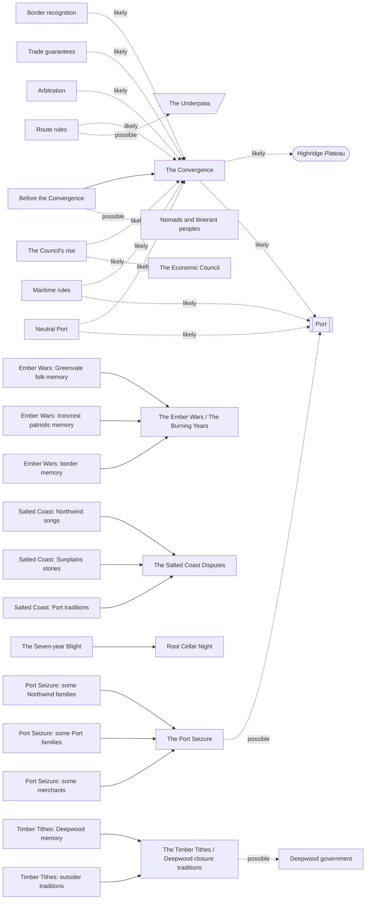

# Atlas Part 5: History

## Status

**Derived view, not canon. Generated; don't edit by hand.** Edit [`history.json`](history.json), then run `python3 atlas/tools/atlas_part.py` from the repository root. That rebuilds this page, the [image](history.png) of this part, and the [combined board](../board/README.md) (interactive: https://claude.ai/artifact/XG2oKvVRes6f7su2dyMaWs). Every thing links to the wiki page it comes from; the wiki wins any disagreement. Part of the [Atlas](../README.md); plan in [PLAN.md](../PLAN.md).

Before the Convergence, the Convergence itself, and contested memory: who remembers what differently.

The Convergence, its provisions, the Council's rise, the nine provisional conflict names and the contested memories sit in a History column, since none belongs to one region. Each region column gets a card for its politics before the Convergence and a Memory heading holding its own version of each remembered conflict, so the Region view shows who remembers what, and the Kind view lines all the versions up side by side.

**Counts:** 2 overviews, 6 before the convergences, 1 origins, 9 conflict traditions, 2 events, 6 convergence provisions, 6 remembered conflicts, 11 possible tellings; 34 connections (29 stated in the wiki, 5 inferred).

## Gaps this part exposes

Things the wiki doesn't settle yet. Listed for the author to decide; nothing here was filled in.

- **There is no timeline.** No page gives a date, a duration or an overall chronology for anything before or at the Convergence (the Council's rise is a six-step sequence and the Port Seizure tradition has an order, but neither is dated), and Contested Memory says exact dates, participants and outcomes are not locked; the source that supplied dates was deliberately kept provisional. How old the Council is relative to the Convergence is an open question.
- **The nine conflict names have no content.** Ore Scar Strife, Lowland Famine Raids, Coldwave Incursions, Ridge Pass Toll Wars, Orchard-Lord Feuds, Deepwood Edge Skirmishes, Iron-Field Conquest, Great Coastal Skirmish and Highridge Consolidation War are names from earlier brainstorming, flagged to be revised into overlapping campaigns. None has participants, place or outcome; five are placed here only by their names (inferred, off by default).
- **The four contested memories aren't tied to those nine names.** The Ember Wars, Salted Coast Disputes, Timber Tithes and Port Seizure may describe some of the same conflicts, but no page says which.
- **The Convergence's details are open.** Where it was negotiated (Highridge is only the strongest candidate), what its provisions actually said (the page says it "likely included" them), which goods gained protected movement, and which Underpass sections, if any, got access rules.
- **Deepwood and Sunplains have no stated legacy** from their pre-Convergence history on their region pages, unlike Ironcrest, Northwind, Greenvale and Highridge.
- **Port's early history is undated and unplaced.** How Port became central is described, but not whether it happened before, during or after the Convergence, and the Port Seizure is explicitly not settled chronology.
- **Name echoes are not links.** The Ages of Silence and the Deep Silence festival, and the Ember Wars and Ember Remembrance, share words, but no page connects them. Ember Remembrance is a solemn memorial with names on memorial walls; it names no conflict.
- **The Seven-year Blight and the Ages of Silence have only one side.** Each is one region's memory, with no neighbor's or border version yet, unlike the four contested memories.
- **The Spine's geologic history** (rifting and mountain-building) is left to Part 1's geography and is itself provisional.

## The Convergence

| From | Connection | To | Basis | Supporting text |
| --- | --- | --- | --- | --- |
| Border recognition | was likely part of | The Convergence | stated, likely | “The settlement likely included: … Border recognition” [source](../../wiki/History/The-Convergence.md#what-it-did) |
| Trade guarantees | was likely part of | The Convergence | stated, likely | “The settlement likely included: … Trade guarantees” [source](../../wiki/History/The-Convergence.md#what-it-did) |
| Route rules | was likely part of | The Convergence | stated, likely | “The settlement likely included: … Route rules” [source](../../wiki/History/The-Convergence.md#what-it-did) |
| Maritime rules | was likely part of | The Convergence | stated, likely | “The settlement likely included: … Maritime rules” [source](../../wiki/History/The-Convergence.md#what-it-did) |
| Arbitration | was likely part of | The Convergence | stated, likely | “The settlement likely included: … Arbitration” [source](../../wiki/History/The-Convergence.md#what-it-did) |
| Neutral Port | was likely part of | The Convergence | stated, likely | “The settlement likely included: … Neutral Port” [source](../../wiki/History/The-Convergence.md#what-it-did) |
| Before the Convergence | ended in | The Convergence | stated | “The Convergence was therefore a bargain among tired, self-interested powers that also happened to create real public benefits.” [source](../../wiki/History/Pre-Convergence.md#why-the-convergence-became-possible) |
| The Convergence | was likely negotiated in | Highridge Plateau | stated, likely | “Highridge is the strongest candidate for the principal congress” [source](../../wiki/History/The-Convergence.md#negotiation) |
| The Convergence | likely drew on | Port | stated, likely | “Port likely played an important role in maritime and commercial provisions even if the principal meetings occurred inland.” [source](../../wiki/History/The-Convergence.md#negotiation) |
| Neutral Port | formalized or strengthened | Port | stated, likely | “Port's special status was formalized or significantly strengthened.” [source](../../wiki/History/The-Convergence.md#neutral-port) |
| Maritime rules | made access harder to monopolize at | Port | stated, likely | “Neutral shipping and Port access became harder for one kingdom to monopolize.” [source](../../wiki/History/The-Convergence.md#maritime-rules) |
| Route rules | may have set access rules for | The Underpass | stated, possible | “Passes, major roads, and perhaps sections of The Underpass received agreed access rules.” [source](../../wiki/History/The-Convergence.md#route-rules) |
| The Council's rise | likely grew out of | The Convergence | stated, likely | “The Council likely emerged **through** the institutions created by the Convergence” [source](../../wiki/History/The-Convergence.md#the-council-and-the-convergence) |
| The Council's rise | is the likely origin of | The Economic Council | stated, likely | “The Council likely emerged **through** the institutions created by the Convergence rather than appearing fully formed beforehand.” [source](../../wiki/History/The-Convergence.md#the-council-and-the-convergence) |
| Before the Convergence | may have displaced some of | Nomads and itinerant peoples | stated, possible | “populations displaced by pre-Convergence border wars who made mobility permanent.” [source](../../wiki/Culture/Nomads.md#why-mobile-peoples-exist-here) Also: “Mobility should have an economic and ecological reason. Possibilities include:” [source](../../wiki/Culture/Nomads.md#why-mobile-peoples-exist-here) |

## Memories and their tellings

| From | Connection | To | Basis | Supporting text |
| --- | --- | --- | --- | --- |
| Ember Wars: Greenvale folk memory | is one telling of | The Ember Wars / The Burning Years | stated | “Greenvale folk memory” [source](../../wiki/History/Contested-Memory.md#the-ember-wars--the-burning-years) |
| Ember Wars: Ironcrest patriotic memory | is one telling of | The Ember Wars / The Burning Years | stated | “Ironcrest patriotic memory” [source](../../wiki/History/Contested-Memory.md#the-ember-wars--the-burning-years) |
| Ember Wars: border memory | is one telling of | The Ember Wars / The Burning Years | stated | “Border memory” [source](../../wiki/History/Contested-Memory.md#the-ember-wars--the-burning-years) |
| Salted Coast: Northwind songs | is one telling of | The Salted Coast Disputes | stated | “Northwind songs about burned boats or coastal settlements” [source](../../wiki/History/Contested-Memory.md#the-salted-coast-disputes) |
| Salted Coast: Sunplains stories | is one telling of | The Salted Coast Disputes | stated | “Sunplains stories about raids” [source](../../wiki/History/Contested-Memory.md#the-salted-coast-disputes) |
| Salted Coast: Port traditions | is one telling of | The Salted Coast Disputes | stated | “Port traditions that present negotiation and neutral anchorage as older than the Convergence” [source](../../wiki/History/Contested-Memory.md#the-salted-coast-disputes) |
| Timber Tithes: Deepwood memory | is one telling of | The Timber Tithes / Deepwood closure traditions | stated | “Deepwood memory contains older stories about outside extraction” [source](../../wiki/History/Contested-Memory.md#the-timber-tithes--deepwood-closure-traditions) |
| Timber Tithes: outsider traditions | is one telling of | The Timber Tithes / Deepwood closure traditions | stated | “Outsider traditions may remember the same period as sudden Deepwood violence” [source](../../wiki/History/Contested-Memory.md#the-timber-tithes--deepwood-closure-traditions) |
| Port Seizure: some Northwind families | is one telling of | The Port Seizure | stated | “some Northwind families claim they built or maintained facilities others later took from them” [source](../../wiki/History/Contested-Memory.md#the-port-seizure) |
| Port Seizure: some Port families | is one telling of | The Port Seizure | stated | “some Port families remember foreign control as occupation” [source](../../wiki/History/Contested-Memory.md#the-port-seizure) |
| Port Seizure: some merchants | is one telling of | The Port Seizure | stated | “some merchants use the story as a warning about allowing any one power to dominate the harbor” [source](../../wiki/History/Contested-Memory.md#the-port-seizure) |
| The Seven-year Blight | is remembered at | Root Cellar Night | stated | “stored food, family stories and remembrance of old scarcity such as the Seven-year Blight.” [source](../../wiki/Culture/Festivals-and-Seasonal-Life.md#greenvale) |
| The Timber Tithes / Deepwood closure traditions | may explain suspicion in | Deepwood government | stated, possible | “This is a strong candidate for explaining later suspicion around logging rights” [source](../../wiki/History/Contested-Memory.md#the-timber-tithes--deepwood-closure-traditions) |
| The Port Seizure | is told about | Port | stated, possible | “One uploaded tradition proposed a period when Northwind interests controlled Port before coalition pressure produced withdrawal and neutral status.” [source](../../wiki/History/Contested-Memory.md#the-port-seizure) Also: “remains the owner for the city's current institutional history.” [source](../../wiki/History/Contested-Memory.md#the-port-seizure) |

## Conflict names placed by name (inferred)

| From | Connection | To | Basis | Supporting text |
| --- | --- | --- | --- | --- |
| Ore Scar Strife | probably concerns | Ironcrest | inferred | “The name points at ore; Ironcrest's ore districts fought wars over ore that "rarely produced permanent frontiers" (Pre-Convergence). The page doesn't place the episode.” [source](../../wiki/History/Pre-Convergence.md#ironcrest-predecessor-politics) |
| Lowland Famine Raids | probably concerns | Greenvale | inferred | “The name points at famine raiding in the lowlands; Greenvale's history includes "famine-era raiding" (Greenvale). The page doesn't place the episode.” [source](../../wiki/Regions/Greenvale.md#historical-identity) |
| Ridge Pass Toll Wars | probably concerns | Highridge Plateau | inferred | “The name points at pass tolls; Highridge's identity rests on the shift "from toll warfare toward negotiated passage" (Highridge). The page doesn't place the episode.” [source](../../wiki/Regions/Highridge-Plateau.md#historical-identity) |
| Deepwood Edge Skirmishes | probably concerns | Deepwood | inferred | “Named for Deepwood's edge; forest edges "expanded and contracted" as outsiders cleared and locals reclaimed land (Pre-Convergence). The page doesn't say who fought.” [source](../../wiki/History/Pre-Convergence.md#deepwood-predecessor-politics) |
| Highridge Consolidation War | probably concerns | Highridge Plateau | inferred | “Named for Highridge; the page doesn't say what was consolidated or by whom.” [source](../../wiki/History/Pre-Convergence.md#working-conflict-traditions) |

## Diagram

Stated connections only; positions are automatic. The [interactive board](../board/README.md) is easier to read.

## Every thing in this part

Grouped by board column.

### Northwind

| Thing | Kind | Status | Summary |
| --- | --- | --- | --- |
| [Northwind before the Convergence](../../wiki/History/Pre-Convergence.md#northwind-predecessor-politics) | Before the Convergence | No status label | Maritime rights overlapped political territory. |
| [Salted Coast: Northwind songs](../../wiki/History/Contested-Memory.md#the-salted-coast-disputes) | Possible telling | Provisional | Songs about burned boats or coastal settlements. |
| [Port Seizure: some Northwind families](../../wiki/History/Contested-Memory.md#the-port-seizure) | Possible telling | Provisional | They claim they built or maintained facilities that others later took from them. |

**Northwind before the Convergence**

- *Powers:* Coastal clans, harbor confederacies, island rulers, fishing-right alliances and raiding fleets. The region page adds fishing confederacies, harbor towns, raiding bands and inland chiefs. ([source](../../wiki/History/Pre-Convergence.md#northwind-predecessor-politics))
- *How power worked:* Maritime rights overlapped political territory. Control of water and seasonal access often mattered more than land: a defeated clan could lose a town yet keep fishing from allied harbors, and a border on shore didn't decide who fished a bank or used a winter anchorage. ([source](../../wiki/History/Pre-Convergence.md#northwind-predecessor-politics))
- *What it left:* It explains why modern Northwind politics stay sensitive to access rights, clan obligation, shared rescue, maritime law, and outsiders buying control of harbors. ([source](../../wiki/Regions/Northwind.md#historical-identity))
- *Also on:* [Northwind](../../wiki/Regions/Northwind.md#historical-identity)

**Salted Coast: Northwind songs**

- *Told as:* Songs about burned boats or coastal settlements.
- *Note:* One of the page's possible perspectives or surviving forms, not a settled account.

**Port Seizure: some Northwind families**

- *Told as:* They claim they built or maintained facilities that others later took from them.
- *Note:* One of the page's possible perspectives or surviving forms, not a settled account.

### Highridge Plateau

| Thing | Kind | Status | Summary |
| --- | --- | --- | --- |
| [Highridge before the Convergence](../../wiki/History/Pre-Convergence.md#highridge-predecessor-politics) | Before the Convergence | No status label | Power followed route control rather than continuous land. |

**Highridge before the Convergence**

- *Powers:* Toll lords, caravan families, herding confederacies, fortified pass towns and merchant coalitions. The region page adds pass lords, toll towns and fortress communities. ([source](../../wiki/History/Pre-Convergence.md#highridge-predecessor-politics))
- *How power worked:* Power followed route control rather than continuous land. A ruler could control a pass but not the valley below it, and a merchant league could effectively govern a route crossing several jurisdictions. ([source](../../wiki/History/Pre-Convergence.md#highridge-predecessor-politics))
- *What it left:* The shift from toll warfare toward negotiated passage is one of the foundations of modern Highridge identity. ([source](../../wiki/Regions/Highridge-Plateau.md#historical-identity))
- *Also on:* [Highridge Plateau](../../wiki/Regions/Highridge-Plateau.md#historical-identity)

### Deepwood

| Thing | Kind | Status | Summary |
| --- | --- | --- | --- |
| [Deepwood before the Convergence](../../wiki/History/Pre-Convergence.md#deepwood-predecessor-politics) | Before the Convergence | No status label | Forest edges expanded and contracted as outsiders cleared land and local groups later reclaimed it. |
| [The Ages of Silence](../../wiki/Regions/Deepwood.md#historical-identity) | Remembered conflict | Working canon | A remembered Deepwood period that should stay partly historical and partly religious: perhaps ecological collapse, depopulation, warfare or disease, later interpreted spiritually. |
| [Timber Tithes: Deepwood memory](../../wiki/History/Contested-Memory.md#the-timber-tithes--deepwood-closure-traditions) | Possible telling | Provisional | Outside extraction pushing too far into forests and sacred or protected areas. |

**Deepwood before the Convergence**

- *Powers:* Village alliances, forest clans, river settlements, warden networks, religious centers and hunting territories. The region page adds trade settlements and forest-edge petty rulers. ([source](../../wiki/History/Pre-Convergence.md#deepwood-predecessor-politics))
- *How power worked:* Forest edges expanded and contracted as outsiders cleared land and local groups later reclaimed it. Outsiders pushed in for farmland, fuel, timber, hunting and roads; Deepwood groups sometimes united against them, sometimes fought each other, and sometimes profited from them. ([source](../../wiki/History/Pre-Convergence.md#deepwood-predecessor-politics))
- *Also on:* [Deepwood](../../wiki/Regions/Deepwood.md#historical-identity)

**The Ages of Silence**

- *What's remembered:* Perhaps a period of ecological collapse, depopulation, warfare or disease later interpreted spiritually.
- *Caution:* Should remain partly historical and partly religious.

**Timber Tithes: Deepwood memory**

- *Told as:* Outside extraction pushing too far into forests and sacred or protected areas.
- *Note:* One of the page's possible perspectives or surviving forms, not a settled account.

### Ironcrest

| Thing | Kind | Status | Summary |
| --- | --- | --- | --- |
| [Ironcrest before the Convergence](../../wiki/History/Pre-Convergence.md#ironcrest-predecessor-politics) | Before the Convergence | No status label | Wars over ore rarely produced permanent frontiers: one ruler might seize a mine while losing the road that made it profitable. |
| [Ember Wars: Ironcrest patriotic memory](../../wiki/History/Contested-Memory.md#the-ember-wars--the-burning-years) | Possible telling | Provisional | A period of expansion and hard-won security, with reversals blamed on logistics or weather. |

**Ironcrest before the Convergence**

- *Powers:* Mine-holding clans, fortified smith towns, valley lordships, merchant-backed warbands and craft alliances. The region page adds smith-chiefs, mine holders, fortified towns, valley rulers, merchant families and warbands. ([source](../../wiki/History/Pre-Convergence.md#ironcrest-predecessor-politics))
- *How power worked:* Wars over ore rarely produced permanent frontiers: one ruler might seize a mine while losing the road that made it profitable. Towns changed allegiance through marriage or debt; Greenvale rulers periodically held western lowlands; Ironcrest powers periodically pushed into food-producing country; forest margins changed hands repeatedly. ([source](../../wiki/History/Pre-Convergence.md#ironcrest-predecessor-politics))
- *What it left:* Remembered as both achievement and warning. Its political culture values reliable agreements partly because its own history shows how ruinous resource warfare can become. ([source](../../wiki/Regions/Ironcrest.md#historical-identity))
- *Also on:* [Ironcrest](../../wiki/Regions/Ironcrest.md#historical-identity)

**Ember Wars: Ironcrest patriotic memory**

- *Told as:* A period of expansion and hard-won security, with reversals blamed on logistics or weather.
- *Note:* One of the page's possible perspectives or surviving forms, not a settled account.

### Greenvale

| Thing | Kind | Status | Summary |
| --- | --- | --- | --- |
| [Greenvale before the Convergence](../../wiki/History/Pre-Convergence.md#greenvale-predecessor-politics) | Before the Convergence | No status label | Crop failures repeatedly destabilized politics. |
| [The Seven-year Blight](../../wiki/Regions/Greenvale.md#historical-identity) | Remembered conflict | Working canon | A prolonged crop crisis, whether exactly seven years or later mythologized, that helped create Greenvale traditions of storage, crop diversity, communal aid, and suspicion of concentrated control over seed and grain. |
| [Ember Wars: Greenvale folk memory](../../wiki/History/Contested-Memory.md#the-ember-wars--the-burning-years) | Possible telling | Provisional | Orchards and villages destroyed; families displaced. |

**Greenvale before the Convergence**

- *Powers:* Estate rulers, village leagues, river towns, grain confederacies and irrigation associations. The region page adds small landholding communities and seed-sharing alliances. ([source](../../wiki/History/Pre-Convergence.md#greenvale-predecessor-politics))
- *How power worked:* Crop failures repeatedly destabilized politics. In scarcity Greenvale was both victim and aggressor: its rulers raided neighbors for food, annexed or tried to expand into healthier land, fought internally, and sometimes invited foreign military support. ([source](../../wiki/History/Pre-Convergence.md#greenvale-predecessor-politics))
- *What it left:* The Seven-year Blight left traditions of storage, crop diversity, communal aid, and suspicion of concentrated control over seed and grain. ([source](../../wiki/Regions/Greenvale.md#historical-identity))
- *Also on:* [Greenvale](../../wiki/Regions/Greenvale.md#historical-identity)

**The Seven-year Blight**

- *What's remembered:* A prolonged crop crisis that helped create traditions of storage, crop diversity, communal aid, and suspicion of concentrated control over seed and grain.
- *Caution:* An important working historical memory: whether it lasted exactly seven years or was later mythologized is open.

**Ember Wars: Greenvale folk memory**

- *Told as:* Orchards and villages destroyed; families displaced.
- *Note:* One of the page's possible perspectives or surviving forms, not a settled account.

### Sunplains

| Thing | Kind | Status | Summary |
| --- | --- | --- | --- |
| [Sunplains before the Convergence](../../wiki/History/Pre-Convergence.md#sunplains-predecessor-politics) | Before the Convergence | No status label | Waterworks created unusual political maps: a city could control a canal crossing another ruler's land. |
| [Salted Coast: Sunplains stories](../../wiki/History/Contested-Memory.md#the-salted-coast-disputes) | Possible telling | Provisional | Stories about raids and "northern pirates". |

**Sunplains before the Convergence**

- *Powers:* City-states, irrigation leagues, merchant ports, noble estates and rural client territories. The region page adds port towns, noble houses and merchant dynasties. ([source](../../wiki/History/Pre-Convergence.md#sunplains-predecessor-politics))
- *How power worked:* Waterworks created unusual political maps: a city could control a canal crossing another ruler's land. Wars could be fought over canal gates, springs, river diversions, orchard land, ports and trade rights; temporary alliances were common and betrayal was normal. ([source](../../wiki/History/Pre-Convergence.md#sunplains-predecessor-politics))
- *Also on:* [Sunplains](../../wiki/Regions/Sunplains.md#historical-identity)

**Salted Coast: Sunplains stories**

- *Told as:* Stories about raids and "northern pirates".
- *Note:* One of the page's possible perspectives or surviving forms, not a settled account.

### Port

| Thing | Kind | Status | Summary |
| --- | --- | --- | --- |
| [How Port became central](../../wiki/Places/Port.md#why-port-became-central) | Origins | Working canon | Port likely began at a sheltered deep-water harbor, estuary or strait where several trade systems met; the key historical change was institutional, as merchants came to trust it. |
| [Salted Coast: Port traditions](../../wiki/History/Contested-Memory.md#the-salted-coast-disputes) | Possible telling | Provisional | Traditions that present negotiation and neutral anchorage as older than the Convergence. |
| [Port Seizure: some Port families](../../wiki/History/Contested-Memory.md#the-port-seizure) | Possible telling | Provisional | Foreign control remembered as occupation. |

**How Port became central**

- *How it happened:* The key historical change was institutional. Merchants began trusting Port because contracts were enforced, foreign merchants could own or lease warehouses, weights and measures were standardized, currencies could be exchanged, disputes could be arbitrated, neutral storage existed, ships could be repaired, creditors and insurers had offices there, and foreign communities were protected. Once those systems existed, trade attracted more trade.
- *Early advantages:* It likely began at a sheltered deep-water harbor, estuary or strait where several trade systems naturally met. Early advantages may have included reliable anchorage, access to inland rivers or roads, nearby fresh water and food, a position on both northern and southern sea routes, and a location hard for any one kingdom to monopolize without alarming the others.

**Salted Coast: Port traditions**

- *Told as:* Traditions that present negotiation and neutral anchorage as older than the Convergence.
- *Note:* One of the page's possible perspectives or surviving forms, not a settled account.

**Port Seizure: some Port families**

- *Told as:* Foreign control remembered as occupation.
- *Note:* One of the page's possible perspectives or surviving forms, not a settled account.

### Border towns

| Thing | Kind | Status | Summary |
| --- | --- | --- | --- |
| [Ember Wars: border memory](../../wiki/History/Contested-Memory.md#the-ember-wars--the-burning-years) | Possible telling | Provisional | Several campaigns, changing alliances and mixed families that make both regional versions too simple. |

**Ember Wars: border memory**

- *Told as:* Several campaigns, changing alliances and mixed families that make both regional versions too simple.
- *Note:* One of the page's possible perspectives or surviving forms, not a settled account.

### History

| Thing | Kind | Status | Summary |
| --- | --- | --- | --- |
| [Before the Convergence](../../wiki/History/Pre-Convergence.md#core-rule) | Overview | No status label | The pre-Convergence world was messy: modern regions shouldn't be projected backward as eternal states with fixed borders. Peace came as a bargain among tired, self-interested powers, not sudden enlightenment. |
| [Ore Scar Strife](../../wiki/History/Pre-Convergence.md#working-conflict-traditions) | Conflict tradition | Provisional | A conflict named in earlier brainstorming; a provisional historical episode, not yet hard canon. |
| [Lowland Famine Raids](../../wiki/History/Pre-Convergence.md#working-conflict-traditions) | Conflict tradition | Provisional | A conflict named in earlier brainstorming; a provisional historical episode, not yet hard canon. |
| [Coldwave Incursions](../../wiki/History/Pre-Convergence.md#working-conflict-traditions) | Conflict tradition | Provisional | A conflict named in earlier brainstorming; a provisional historical episode, not yet hard canon. |
| [Ridge Pass Toll Wars](../../wiki/History/Pre-Convergence.md#working-conflict-traditions) | Conflict tradition | Provisional | A conflict named in earlier brainstorming; a provisional historical episode, not yet hard canon. |
| [Orchard-Lord Feuds](../../wiki/History/Pre-Convergence.md#working-conflict-traditions) | Conflict tradition | Provisional | A conflict named in earlier brainstorming; a provisional historical episode, not yet hard canon. |
| [Deepwood Edge Skirmishes](../../wiki/History/Pre-Convergence.md#working-conflict-traditions) | Conflict tradition | Provisional | A conflict named in earlier brainstorming; a provisional historical episode, not yet hard canon. |
| [Iron-Field Conquest](../../wiki/History/Pre-Convergence.md#working-conflict-traditions) | Conflict tradition | Provisional | A conflict named in earlier brainstorming; a provisional historical episode, not yet hard canon. |
| [Great Coastal Skirmish](../../wiki/History/Pre-Convergence.md#working-conflict-traditions) | Conflict tradition | Provisional | A conflict named in earlier brainstorming; a provisional historical episode, not yet hard canon. |
| [Highridge Consolidation War](../../wiki/History/Pre-Convergence.md#working-conflict-traditions) | Conflict tradition | Provisional | A conflict named in earlier brainstorming; a provisional historical episode, not yet hard canon. |
| [The Convergence](../../wiki/History/The-Convergence.md#the-convergence) | Event | Established concept (details still developing) | The historic settlement that turned fluid pre-modern frontiers into a more predictable political and economic order. It didn't create the regions from nothing; it recognized, regularized and froze many compromises that had already emerged from centuries of conflict. |
| [Border recognition](../../wiki/History/The-Convergence.md#border-recognition) | Convergence provision | Established concept (details still developing) | Likely part of the settlement: not every line was measured precisely. The treaty could define boundaries by rivers, ridges, roads, settlements, watersheds, named stones and old forts, which creates later ambiguity. |
| [Trade guarantees](../../wiki/History/The-Convergence.md#trade-guarantees) | Convergence provision | Established concept (details still developing) | Likely part of the settlement: certain categories of goods gained protected movement. |
| [Route rules](../../wiki/History/The-Convergence.md#route-rules) | Convergence provision | Established concept (details still developing) | Likely part of the settlement: passes, major roads, and perhaps sections of The Underpass received agreed access rules. |
| [Maritime rules](../../wiki/History/The-Convergence.md#maritime-rules) | Convergence provision | Established concept (details still developing) | Likely part of the settlement: neutral shipping and Port access became harder for one kingdom to monopolize. |
| [Arbitration](../../wiki/History/The-Convergence.md#arbitration) | Convergence provision | Established concept (details still developing) | Likely part of the settlement: some disputes could be taken to agreed courts or forums rather than immediately fought. |
| [Neutral Port](../../wiki/History/The-Convergence.md#neutral-port) | Convergence provision | Established concept (details still developing) | Likely part of the settlement: port's special status was formalized or significantly strengthened. |
| [The Council's rise](../../wiki/History/The-Convergence.md#the-council-and-the-convergence) | Event | Established concept (details still developing) | The Council likely emerged through the institutions the Convergence created rather than appearing fully formed beforehand. In "a strong version of the history", families who helped finance stabilization became a secret coordinating body that came to believe it was keeping the Convergence alive. |
| [Contested memory](../../wiki/History/Contested-Memory.md#purpose) | Overview | Provisional | People don't inherit one neutral history. The same old campaign can survive as a patriotic victory in one region, an atrocity story in another, a family migration story at the border, a footnote in a Highridge archive, a legal precedent in a Port court, or a song no historian accepts literally. |
| [The Ember Wars / The Burning Years](../../wiki/History/Contested-Memory.md#the-ember-wars--the-burning-years) | Remembered conflict | Provisional | A recurring Greenvale memory of Ironcrest-linked expansion, logging, burned settlements and disputed border land. |
| [The Salted Coast Disputes](../../wiki/History/Contested-Memory.md#the-salted-coast-disputes) | Remembered conflict | Provisional | Northwind and Sunplains traditions remember old violence over fishing waters, ports and maritime access. |
| [The Timber Tithes / Deepwood closure traditions](../../wiki/History/Contested-Memory.md#the-timber-tithes--deepwood-closure-traditions) | Remembered conflict | Provisional | Deepwood memory holds older stories of outside extraction pushing too far into forests and sacred or protected areas; outsiders may remember the same period as sudden Deepwood violence. |
| [The Port Seizure](../../wiki/History/Contested-Memory.md#the-port-seizure) | Remembered conflict | Provisional | One uploaded tradition proposed a period when Northwind interests controlled Port before coalition pressure produced withdrawal and neutral status. |
| [Timber Tithes: outsider traditions](../../wiki/History/Contested-Memory.md#the-timber-tithes--deepwood-closure-traditions) | Possible telling | Provisional | May remember the same period as sudden Deepwood violence against workers, caravans or settlers. |
| [Port Seizure: some merchants](../../wiki/History/Contested-Memory.md#the-port-seizure) | Possible telling | Provisional | A warning about allowing any one power to dominate the harbor. |

**Before the Convergence**

- *Principle:* The pre-Convergence world was messy. Modern regions should not be projected backward as eternal states with fixed borders; the modern labels describe cultural-geographic zones that emerged from many earlier peoples, towns, kingdoms, confederacies, warbands, guild networks and migrations. ([source](../../wiki/History/Pre-Convergence.md#core-rule))
- *Scope:* Borders were poorly surveyed; control followed roads, rivers, fortresses, mines, fields, harbors and kinship; rulers claimed territory they didn't effectively govern; towns could change allegiance without the countryside; people paid taxes or tribute to several authorities; marriage could shift a valley more permanently than a battle; mercenaries changed sides; famine altered alliances; raids didn't always mean conquest; local elites survived regime changes by changing patrons. ([source](../../wiki/History/Pre-Convergence.md#general-pattern))
- *Rule:* History is messy: temporary victories, reversals, disputed claims, marriages, defections, raids, trade agreements, migrations, local exceptions and contradictory memories. Avoid "Region A defeated Region B and owned this land until the Convergence." ([source](../../wiki/World-Rules.md#4-history-is-messy))
- *Why it ended:* Not because everyone became enlightened. Trade losses accumulated; wars repeatedly failed to secure permanent gains; famine and blight exposed interdependence; guilds wanted predictable markets; merchants wanted safe routes; rulers wanted borders recognized; local populations were exhausted; bandits and independent warlords profited from disorder; no major power could impose a durable settlement alone. The Convergence was a bargain among tired, self-interested powers that also happened to create real public benefits. ([source](../../wiki/History/Pre-Convergence.md#why-the-convergence-became-possible))
- *Traces:* Modern landscapes should preserve it: ruined towers; roads to vanished markets; duplicate fortifications; abandoned terraces; boundary stones in the wrong kingdom; shrines kept by people now living across the border; towns with two legal traditions; noble claims based on ancient marriages; old canals still controlled under obsolete treaties. ([source](../../wiki/History/Pre-Convergence.md#material-traces))

**Ore Scar Strife**

- *Note:* Useful as a provisional historical episode, not yet hard canon. The final history should revise these into overlapping campaigns with multiple participants, reversals and local consequences rather than clean one-on-one wars.

**Lowland Famine Raids**

- *Note:* Useful as a provisional historical episode, not yet hard canon. The final history should revise these into overlapping campaigns with multiple participants, reversals and local consequences rather than clean one-on-one wars.

**Coldwave Incursions**

- *Note:* Useful as a provisional historical episode, not yet hard canon. The final history should revise these into overlapping campaigns with multiple participants, reversals and local consequences rather than clean one-on-one wars.

**Ridge Pass Toll Wars**

- *Note:* Useful as a provisional historical episode, not yet hard canon. The final history should revise these into overlapping campaigns with multiple participants, reversals and local consequences rather than clean one-on-one wars.

**Orchard-Lord Feuds**

- *Note:* Useful as a provisional historical episode, not yet hard canon. The final history should revise these into overlapping campaigns with multiple participants, reversals and local consequences rather than clean one-on-one wars.

**Deepwood Edge Skirmishes**

- *Note:* Useful as a provisional historical episode, not yet hard canon. The final history should revise these into overlapping campaigns with multiple participants, reversals and local consequences rather than clean one-on-one wars.

**Iron-Field Conquest**

- *Note:* Useful as a provisional historical episode, not yet hard canon. The final history should revise these into overlapping campaigns with multiple participants, reversals and local consequences rather than clean one-on-one wars.

**Great Coastal Skirmish**

- *Note:* Useful as a provisional historical episode, not yet hard canon. The final history should revise these into overlapping campaigns with multiple participants, reversals and local consequences rather than clean one-on-one wars.

**Highridge Consolidation War**

- *Note:* Useful as a provisional historical episode, not yet hard canon. The final history should revise these into overlapping campaigns with multiple participants, reversals and local consequences rather than clean one-on-one wars.

**The Convergence**

- *What it was:* The historic settlement that transformed fluid pre-modern frontiers into a more predictable political and economic order. It recognized, regularized and froze many compromises that had already emerged from centuries of conflict. ([source](../../wiki/History/The-Convergence.md#status))
- *Why:* Trade routes were increasingly dangerous; several resource disputes had become economically pointless; food crises showed cross-regional dependence; piracy and banditry flourished; guilds and merchants wanted predictable law; rulers wanted recognition of claims they could actually hold. ([source](../../wiki/History/The-Convergence.md#why-it-happened))
- *Where:* Highridge is the strongest candidate for the principal congress (geographic accessibility, trade culture, existing arbitration traditions, interest in keeping routes open). Port likely played an important role in maritime and commercial provisions even if the principal meetings were inland. ([source](../../wiki/History/The-Convergence.md#negotiation))
- *What it didn't solve:* Class conflict, religious disagreement, guild rivalry, crime, competing interpretations of borders, local land disputes, old dynastic claims, unequal wealth, resentment toward outside influence. ([source](../../wiki/History/The-Convergence.md#what-it-did-not-solve))
- *Cultural effect:* Paradoxically it made regional identities stronger: governments standardized law, schools and religious institutions spread regional norms, guilds organized regionally, elites cultivated shared histories, and old mixed frontier identities were sometimes suppressed. Some traditions now presented as ancient "Ironcrest" or "Greenvale" culture may be post-Convergence standardizations of more diverse older practices. ([source](../../wiki/History/The-Convergence.md#cultural-effect))

**Border recognition**

- *What it did:* Not every line was measured precisely. The treaty could define boundaries by rivers, ridges, roads, settlements, watersheds, named stones and old forts, which creates later ambiguity.
- *Certainty:* The settlement likely included it; details are still developing.

**Trade guarantees**

- *What it did:* Certain categories of goods gained protected movement.
- *Certainty:* The settlement likely included it; details are still developing.

**Route rules**

- *What it did:* Passes, major roads, and perhaps sections of The Underpass received agreed access rules.
- *Certainty:* The settlement likely included it; details are still developing.

**Maritime rules**

- *What it did:* Neutral shipping and Port access became harder for one kingdom to monopolize.
- *Certainty:* The settlement likely included it; details are still developing.

**Arbitration**

- *What it did:* Some disputes could be taken to agreed courts or forums rather than immediately fought.
- *Certainty:* The settlement likely included it; details are still developing.

**Neutral Port**

- *What it did:* Port's special status was formalized or significantly strengthened.
- *Certainty:* The settlement likely included it; details are still developing.

**The Council's rise**

- *What it was:* The Council likely emerged through the institutions created by the Convergence rather than appearing fully formed beforehand. ([source](../../wiki/History/The-Convergence.md#the-council-and-the-convergence))
- *Why:* A strong version of the history (not the only one): wealthy families helped finance stabilization; rulers increasingly depended on their grain stores, credit, ships, roads and information; informal coordination among these families prevented crises; coordination became institutional; secrecy grew because open economic rule would provoke resistance; the Council came to believe it was the hidden mechanism keeping the Convergence alive. ([source](../../wiki/History/The-Convergence.md#the-council-and-the-convergence))
- *Cultural effect:* It gives the Council a plausible historical reason to think its manipulation is necessary. ([source](../../wiki/History/The-Convergence.md#the-council-and-the-convergence))

**Contested memory**

- *Principle:* People do not inherit one neutral history. These disagreements create useful "breath" without requiring a hidden conspiracy. ([source](../../wiki/History/Contested-Memory.md#purpose))
- *Scope:* The same old campaign may survive as a patriotic victory in one region, an atrocity story in another, a family migration story at the border, a footnote in a Highridge archive, a legal precedent in a Port court, or a song whose details no historian accepts literally. ([source](../../wiki/History/Contested-Memory.md#purpose))
- *Rule:* Identify who is telling the story; separate the event from the later label; allow local exceptions and contradictory evidence; prefer "my grandfather called it…" over omniscient exposition; let ruins, treaties, family records and place names disagree with popular stories. A remembered history can be emotionally true to a community without being an objective account. ([source](../../wiki/History/Contested-Memory.md#writing-rule))

**The Ember Wars / The Burning Years**

- *What's remembered:* A recurring Greenvale memory of Ironcrest-linked expansion, logging, burned settlements and disputed border land.
- *Caution:* Treat the label as a later cultural shorthand until the actual campaigns are mapped.

**The Salted Coast Disputes**

- *What's remembered:* Northwind and Sunplains traditions remember old violence over fishing waters, ports and maritime access.
- *Caution:* Don't assume this was one continuous war or that modern regional governments existed in their current form.

**The Timber Tithes / Deepwood closure traditions**

- *What's remembered:* Deepwood memory holds older stories of outside extraction pushing too far into forests and sacred or protected areas; outsiders may remember the same period as sudden Deepwood violence.
- *Caution:* The event should remain entangled with local factions, trade partners and ecological conditions.
- *Story use:* A strong candidate for explaining later suspicion around logging rights.

**The Port Seizure**

- *What's remembered:* One uploaded tradition proposed a period when Northwind interests controlled Port before coalition pressure produced withdrawal and neutral status.
- *Caution:* Not settled chronology.

**Timber Tithes: outsider traditions**

- *Told as:* May remember the same period as sudden Deepwood violence against workers, caravans or settlers.
- *Note:* One of the page's possible perspectives or surviving forms, not a settled account.

**Port Seizure: some merchants**

- *Told as:* A warning about allowing any one power to dominate the harbor.
- *Note:* One of the page's possible perspectives or surviving forms, not a settled account.

