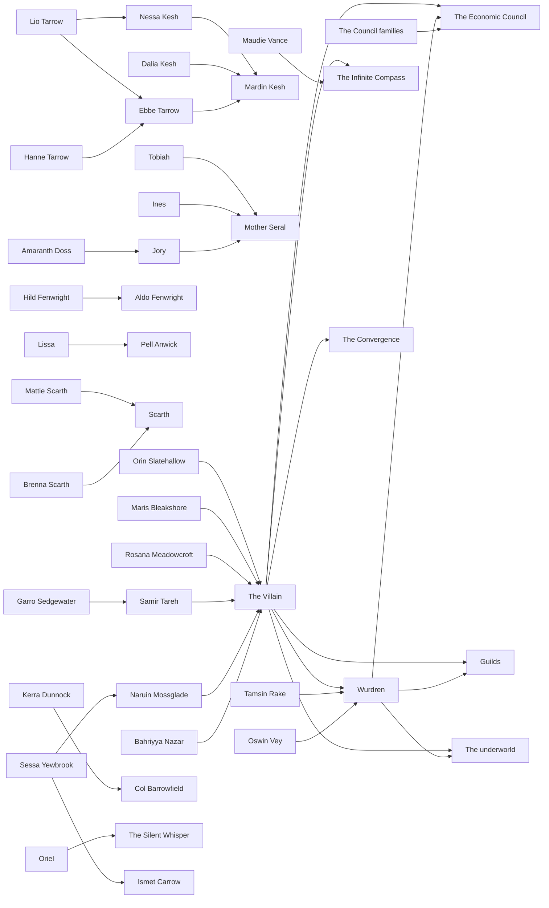

# Atlas Part 6: People

## Status

**Derived view, not canon. Generated; don't edit by hand.** Edit [`people.json`](people.json), then run `python3 atlas/tools/atlas_part.py` from the repository root. That rebuilds this page, the [image](people.png) of this part, and the [combined board](../board/README.md) (interactive: https://claude.ai/artifact/XG2oKvVRes6f7su2dyMaWs). Every thing links to the wiki page it comes from; the wiki wins any disagreement. Part of the [Atlas](../README.md); plan in [PLAN.md](../PLAN.md).

Wurdren, the Villain, the Council families, the domino figures, the Underpass figures and the Sunday Morning cast: who knows whom and who belongs to what.

Wurdren, the Villain and the Council families get a Main cast column; each domino figure sits in its region's column, and the three Underpass figures in the Spine & Underpass column. The Sunday Morning cast gets its own column with a heading per story, since they are writing reference rather than canon. Lines show how the main cast relates to the Council, the guilds, the underworld and the faiths from Part 4, who pushes each domino, and family and other ties within the Sunday Morning cast.

**Counts:** 3 main characters, 6 domino figures, 3 provisional figures, 48 sunday morning characters; 47 connections (38 stated in the wiki, 9 inferred).

## Gaps this part exposes

Things the wiki doesn't settle yet. Listed for James to decide; nothing here was filled in.

- **The Villain has no identity yet.** Open Questions: his name, homeland or people, exact grievance, exact end-state, the point where his methods become unacceptable even to sympathetic readers, and whether he knows the full Council structure at the start.
- **Wurdren has no biography.** His age, history, why his adventuring life fell short, family and relationships, what he first believes about the Council, and where his journey begins are all open. His only concrete scene so far is a Sunday Morning story, which is not canon.
- **No Council family or member is named.** The roster treats them as "a cast of powerful family representatives", but no family, heir or representative has a name, and how seats pass between them is open.
- **The six domino figures are provisional** "pending final naming systems", and none is tied to an office, guild or place beyond their region; their institution links here are inferred and off by default. Orin has a rule instead of a stated domino.
- **The three Underpass figures are not canon** (Mira Stonebridge, Gharic Coalveil, Ilya Dravencrest), from earlier brainstorming, with nothing else tying them to the Underpass's enclaves, guides or mining.
- **The roster's "the world also needs" list is filled only by non-canon people.** Clerks, cooks, builders, caravan hands, priests, teachers, farmers, sailors, shopkeepers, labor organizers, criminals, children, minor officials and refugees exist so far only as the Sunday Morning cast.
- **Canon characters have almost no ties of their own.** No canon character has a stated faith, guild membership or home town, and the only family hint is Maris Bleakshore as a "matriarch". The people tied to faiths are Sunday Morning characters (Oriel, a Silent Whisper observer; Maudie Vance, who keeps an Infinite Compass shrine).
- **Where each person appears waits for Part 7.** Ties between canon figures and the Sunday Morning cast are drawn only where a plan page states one (Tamsin and Oswin with Wurdren, Garro with Samir, Sessa with Naruin); simply appearing in a story comes with Part 7. Which stories the domino figures and the Sunday Morning cast appear in, and the stories' settings, come with the story layer. The Sunday Morning cast column is grouped by story for now.
- **Several Sunday Morning roles stay deliberately unnamed** (the senior arbiter, the tea seller, the land agent, the market master, the Weaver-path elder, the Quench's keeper), so they aren't on the board; the Registry says leaving them unnamed is a device.

## Main cast

| From | Connection | To | Basis | Supporting text |
| --- | --- | --- | --- | --- |
| The Villain | hates and increasingly mirrors | The Economic Council | stated | “He hates both: … their outcomes; … their method. … But he increasingly mirrors their method.” [source](../../wiki/Story/Villain.md#relationship-to-the-council) |
| Wurdren | repairs the losses of | The Economic Council | stated | “Wurdren repeatedly fixes consequences the Council treats as acceptable losses.” [source](../../wiki/Politics/Economic-Council.md#relationship-to-wurdren) |
| The Villain | comes to see as dangerous | Wurdren | stated | “Eventually the Villain realizes one ordinary adventurer has become dangerous because people trust him without being paid or coerced.” [source](../../wiki/Story/Villain.md#relationship-to-wurdren) |
| The Council families | make up | The Economic Council | stated | “Not a single character but a cast of powerful family representatives with conflicting economic domains.” [source](../../wiki/Story/Character-Roster.md#the-economic-council-families) |
| The Villain | exploits | Guilds | stated | “The Villain exploits legitimate guild grievances.” [source](../../wiki/Politics/Guilds.md#guild-interaction-with-the-villain) |
| The Villain | can exploit but not command | The underworld | stated | “The Villain can exploit those same networks but cannot simply command them.” [source](../../wiki/Politics/Crime-and-Underworld.md#underworld-and-the-main-conflict) |
| The Villain | has reason to influence | The Infinite Compass | stated | “The Council, the Villain, spies, and criminals all have reasons to influence these networks.” [source](../../wiki/Politics/Religions.md#9-the-infinite-compass) |
| Wurdren | meets as people | Guilds | stated | “Wurdren encounters guilds as people” [source](../../wiki/Politics/Guilds.md#guild-interaction-with-wurdren) |
| Wurdren | likely meets at the human level | The underworld | stated | “Wurdren is likely to encounter criminals at the human level” [source](../../wiki/Politics/Crime-and-Underworld.md#underworld-and-the-main-conflict) |
| The Villain | rejects the order left by | The Convergence | stated | “He believes the post-Convergence order is structurally incapable of giving his people/cause what they need.” [source](../../wiki/Story/Villain.md#core-idea) |

## Dominoes

| From | Connection | To | Basis | Supporting text |
| --- | --- | --- | --- | --- |
| Orin Slatehallow | is pushed by | The Villain | stated | “anonymous funding, selective obstruction by rivals, and opportunities that make him dependent on a benefactor.” [source](../../wiki/Story/Villains-Dominoes.md#orin-slatehallow--ironcrest) |
| Maris Bleakshore | is pushed by | The Villain | stated | “credible but selectively framed intelligence makes defensive action look necessary.” [source](../../wiki/Story/Villains-Dominoes.md#maris-bleakshore--northwind) |
| Rosana Meadowcroft | is pushed by | The Villain | stated | “fund research, create distribution bottlenecks, allow rivals to overreact.” [source](../../wiki/Story/Villains-Dominoes.md#rosana-meadowcroft--greenvale) |
| Samir Tareh | is pushed by | The Villain | stated | “provide true information about dangers but omit who created them.” [source](../../wiki/Story/Villains-Dominoes.md#samir-tareh--highridge) |
| Naruin Mossglade | is pushed by | The Villain | stated | “leak real Council-backed expansion plans without context; encourage preemptive defense.” [source](../../wiki/Story/Villains-Dominoes.md#naruin-mossglade--deepwood) |
| Bahriyya Nazar | is pushed by | The Villain | stated | “secretly help her coordination, then ensure neighbors interpret it as expansionist consolidation.” [source](../../wiki/Story/Villains-Dominoes.md#bahriyya-nazar--sunplains) |

## Sunday Morning ties

| From | Connection | To | Basis | Supporting text |
| --- | --- | --- | --- | --- |
| Hild Fenwright | is family of | Aldo Fenwright | stated | “Greenvale Man | Hild Fenwright | net-mender, Aldo's wife” [source](../../wiki/Sunday-Morning/Notes/Registry.md#names) |
| Lissa | is family of | Pell Anwick | stated | “One Square | Lissa | Pell's granddaughter” [source](../../wiki/Sunday-Morning/Notes/Registry.md#names) |
| Mattie Scarth | is family of | Scarth | stated | “One Square | Mattie Scarth | old Scarth's son (mentioned)” [source](../../wiki/Sunday-Morning/Notes/Registry.md#names) |
| Brenna Scarth | is family of | Scarth | stated | “Greenvale Man | Brenna Scarth | sailor, builder's daughter” [source](../../wiki/Sunday-Morning/Notes/Registry.md#names) |
| Lio Tarrow | is family of | Ebbe Tarrow | stated | “Goat File | Lio Tarrow | Ebbe's grandson” [source](../../wiki/Sunday-Morning/Notes/Registry.md#names) |
| Nessa Kesh | is family of | Mardin Kesh | stated | “Goat File | Nessa Kesh | Mardin's granddaughter” [source](../../wiki/Sunday-Morning/Notes/Registry.md#names) |
| Hanne Tarrow | is family of | Ebbe Tarrow | stated | “Goat File | Hanne Tarrow | Ebbe's mother (memo)” [source](../../wiki/Sunday-Morning/Notes/Registry.md#names) |
| Dalia Kesh | is family of | Mardin Kesh | stated | “Goat File | Dalia Kesh | Mardin's mother (memo)” [source](../../wiki/Sunday-Morning/Notes/Registry.md#names) |
| Tobiah | is family of | Mother Seral | stated | “Three Pots | Tobiah | eldest grandchild” [source](../../wiki/Sunday-Morning/Notes/Registry.md#names) |
| Ines | is family of | Mother Seral | stated | “Three Pots | Ines | grandchild” [source](../../wiki/Sunday-Morning/Notes/Registry.md#names) |
| Jory | is family of | Mother Seral | stated | “the middle grandchild, a multilingual court clerk.” [source](../../wiki/Sunday-Morning/Stories/Three-Pots-at-Three-Moon.md#protagonist) |
| Lio Tarrow | knows | Nessa Kesh | stated | “a grandchild from each house, quietly courting” [source](../../wiki/Sunday-Morning/Stories/The-Goat-File.md#cast) |
| Ebbe Tarrow | knows | Mardin Kesh | stated | “both houses have filed a claim to "the Ledger Goat" and its offspring” [source](../../wiki/Sunday-Morning/Stories/The-Goat-File.md#problem) |
| Kerra Dunnock | knows | Col Barrowfield | stated | “the other apprentice presenting this year” [source](../../wiki/Sunday-Morning/Stories/Inspected-Not-Guaranteed.md#cast) |
| Sessa Yewbrook | answers to | Naruin Mossglade | stated | “Sessa's senior warden, mostly offstage.” [source](../../wiki/Sunday-Morning/Stories/The-Tree-With-a-Debt.md#cast) |
| Oriel | observes | The Silent Whisper | stated | “The archive custodian … Silent Whisper … observer who releases nothing during silence hours.” [source](../../wiki/Sunday-Morning/Stories/The-Goat-File.md#cast) Also: “Goat File | Oriel | archive custodian” [source](../../wiki/Sunday-Morning/Notes/Registry.md#names) *the archive custodian's name* |
| Maudie Vance | keeps a shrine of | The Infinite Compass | stated | “An Infinite Compass road shrine** — with a pilgrim log going back decades.” [source](../../wiki/Sunday-Morning/Stories/The-Heavy-Scale.md#place) Also: “The shrine keeper** — pilgrim host and quiet historian of who went where.” [source](../../wiki/Sunday-Morning/Stories/The-Heavy-Scale.md#cast) Also: “Heavy Scale | Maudie Vance | shrine keeper” [source](../../wiki/Sunday-Morning/Notes/Registry.md#names) *the shrine keeper's name* |
| Amaranth Doss | knows | Jory | stated | “The permit clerk** — knows Jory professionally” [source](../../wiki/Sunday-Morning/Stories/Three-Pots-at-Three-Moon.md#cast) Also: “Three Pots | Amaranth Doss | permit clerk” [source](../../wiki/Sunday-Morning/Notes/Registry.md#names) *the permit clerk's name* |
| Sessa Yewbrook | is the romance of | Ismet Carrow | stated | “Mode:** romance” [source](../../wiki/Sunday-Morning/Stories/The-Tree-With-a-Debt.md#the-tree-with-a-debt) Also: “Sessa Yewbrook | forest warden | protagonist” [source](../../wiki/Sunday-Morning/Notes/Registry.md#names) Also: “Ismet Carrow | route surveyor | protagonist” [source](../../wiki/Sunday-Morning/Notes/Registry.md#names) |
| Garro Sedgewater | cooked for the caravan of | Samir Tareh | stated | “He crossed Icestep with Samir's caravan” [source](../../wiki/Sunday-Morning/Stories/Three-Pots-at-Three-Moon.md#stage-1c--think-reserve-methods) Also: “Garro Sedgewater | caravan cook (also Three Pots)” [source](../../wiki/Sunday-Morning/Notes/Registry.md#names) |
| Tamsin Rake | inspects the sword of | Wurdren | stated | “Tamsin inspects Wurdren's sword and finds ordinary steel” [source](../../wiki/Sunday-Morning/Stories/Inspected-Not-Guaranteed.md#complications) |
| Oswin Vey | drafts as judge | Wurdren | stated | “so Vey drafts Wurdren” [source](../../wiki/Sunday-Morning/Stories/Inspected-Not-Guaranteed.md#stage-2--plan) |

## People links (inferred)

| From | Connection | To | Basis | Supporting text |
| --- | --- | --- | --- | --- |
| Orin Slatehallow | probably works within | Metalworking guild factions | inferred | “Orin is caught between innovation, guild restriction and patronage (Villain's Dominoes); metalworking guild factions split between traditional apprenticeship and new methods, and Council-linked investors may fund one faction (Guilds). No page puts him in a guild.” [source](../../wiki/Story/Villains-Dominoes.md#orin-slatehallow--ironcrest) |
| Maris Bleakshore | probably works within | Northwind government | inferred | “Maris can influence convoy behavior and harbor cooperation (Villain's Dominoes); Northwind politics turn on convoy protection, harbor control and clan autonomy (Northwind). No page names her office.” [source](../../wiki/Story/Villains-Dominoes.md#maris-bleakshore--northwind) |
| Rosana Meadowcroft | probably works within | Agricultural guilds and cooperatives | inferred | “Rosana is a seed steward whose work changes dependence on seed and storage systems (Villain's Dominoes); agricultural guilds and cooperatives fight over seed control, storage and new crop strains (Guilds). No page links them.” [source](../../wiki/Story/Villains-Dominoes.md#rosana-meadowcroft--greenvale) |
| Samir Tareh | probably works within | Highridge caravan organizations | inferred | “Samir is a caravan negotiator whose route recommendations redirect trade (Villain's Dominoes); Highridge caravan organizations compete over safe-route certification (Guilds). No page puts him in one.” [source](../../wiki/Story/Villains-Dominoes.md#samir-tareh--highridge) |
| Naruin Mossglade | probably works within | Deepwood government | inferred | “Naruin is a forest warden (Villain's Dominoes); forest wardens are one of Deepwood's possible layers of government (Kingdoms and Politics). No page names his rank or district.” [source](../../wiki/Story/Villains-Dominoes.md#naruin-mossglade--deepwood) |
| Bahriyya Nazar | probably works within | Sunplains governments | inferred | “Bahriyya coordinates city-states around water and trade (Villain's Dominoes); Sunplains is city-states and leagues, and a permanent union would worry both neighbors and the Council (Kingdoms and Politics, Sunplains). No page names her city.” [source](../../wiki/Story/Villains-Dominoes.md#bahriyya-nazar--sunplains) |
| Mira Stonebridge | probably belongs among | Underpass authority | inferred | “Mira is an experienced guide (Character Roster); guide families are one of the Underpass's possible governing units (The Underpass). No page links them.” [source](../../wiki/Story/Character-Roster.md#mira-stonebridge--underpass) |
| Ilya Dravencrest | probably belongs among | Underpass authority | inferred | “Ilya is an Underpass enclave leader (Character Roster); enclave councils are one of the Underpass's possible governing units (The Underpass). No page links them.” [source](../../wiki/Story/Character-Roster.md#ilya-dravencrest--underpass-enclave-leader) |
| Gharic Coalveil | could collide with | Ilya Dravencrest | inferred | “Gharic's ambitions "could collide with enclave autonomy" and Ilya is an enclave leader "opposing destabilizing expansion into deep tunnels" (Character Roster). The roster doesn't set them against each other by name.” [source](../../wiki/Story/Character-Roster.md#gharic-coalveil--underpassmining-interests) |

## Diagram

Stated connections only; positions are automatic. The [interactive board](../board/README.md) is easier to read.

## Every thing in this part

Grouped by board column.

### Northwind

| Thing | Kind | Status | Summary |
| --- | --- | --- | --- |
| [Maris Bleakshore](../../wiki/Story/Villains-Dominoes.md#maris-bleakshore--northwind) | Domino figure | Provisional | Respected coastal or clan leader shaped by piracy and loss. |

**Maris Bleakshore**

- *Role:* Respected coastal or clan leader shaped by piracy and loss. ([source](../../wiki/Story/Villains-Dominoes.md#maris-bleakshore--northwind))
- *Strategic value:* Can influence convoy behavior, harbor cooperation, and perceptions of maritime threats. ([source](../../wiki/Story/Villains-Dominoes.md#maris-bleakshore--northwind))
- *Manipulation:* Credible but selectively framed intelligence makes defensive action look necessary. ([source](../../wiki/Story/Villains-Dominoes.md#maris-bleakshore--northwind))
- *Domino:* Northwind patrol changes are interpreted elsewhere as aggression. ([source](../../wiki/Story/Villains-Dominoes.md#maris-bleakshore--northwind))
- *Also on:* [Character Roster](../../wiki/Story/Character-Roster.md#maris-bleakshore--northwind)

### Highridge Plateau

| Thing | Kind | Status | Summary |
| --- | --- | --- | --- |
| [Samir Tareh](../../wiki/Story/Villains-Dominoes.md#samir-tareh--highridge) | Domino figure | Provisional | Caravan negotiator seeking fair and predictable routes. |

**Samir Tareh**

- *Role:* Caravan negotiator seeking fair and predictable routes. ([source](../../wiki/Story/Villains-Dominoes.md#samir-tareh--highridge))
- *Strategic value:* His route recommendations can redirect enormous amounts of trade without appearing political. ([source](../../wiki/Story/Villains-Dominoes.md#samir-tareh--highridge))
- *Manipulation:* Provide true information about dangers but omit who created them. ([source](../../wiki/Story/Villains-Dominoes.md#samir-tareh--highridge))
- *Domino:* "Safe" trade concentration makes one route strategically vulnerable and impoverishes another. ([source](../../wiki/Story/Villains-Dominoes.md#samir-tareh--highridge))
- *Also on:* [Character Roster](../../wiki/Story/Character-Roster.md#samir-tareh--highridge)

### Deepwood

| Thing | Kind | Status | Summary |
| --- | --- | --- | --- |
| [Naruin Mossglade](../../wiki/Story/Villains-Dominoes.md#naruin-mossglade--deepwood) | Domino figure | Provisional | Forest warden or sentinel defending local rights. |

**Naruin Mossglade**

- *Role:* Forest warden or sentinel defending local rights. ([source](../../wiki/Story/Villains-Dominoes.md#naruin-mossglade--deepwood))
- *Strategic value:* Can mobilize resistance to roads, logging, or outside extraction. ([source](../../wiki/Story/Villains-Dominoes.md#naruin-mossglade--deepwood))
- *Manipulation:* Leak real Council-backed expansion plans without context; encourage preemptive defense. ([source](../../wiki/Story/Villains-Dominoes.md#naruin-mossglade--deepwood))
- *Domino:* A local conservation dispute becomes an inter-regional sovereignty crisis. ([source](../../wiki/Story/Villains-Dominoes.md#naruin-mossglade--deepwood))
- *Also on:* [Character Roster](../../wiki/Story/Character-Roster.md#naruin-mossglade--deepwood)

### Ironcrest

| Thing | Kind | Status | Summary |
| --- | --- | --- | --- |
| [Orin Slatehallow](../../wiki/Story/Villains-Dominoes.md#orin-slatehallow--ironcrest) | Domino figure | Provisional | Talented young metalworker caught between innovation, guild restriction and patronage. |

**Orin Slatehallow**

- *Role:* Talented young metalworker caught between innovation, guild restriction and patronage. ([source](../../wiki/Story/Villains-Dominoes.md#orin-slatehallow--ironcrest))
- *Strategic value:* Access to production networks and information about strategic metal supply. ([source](../../wiki/Story/Villains-Dominoes.md#orin-slatehallow--ironcrest))
- *Manipulation:* Anonymous funding, selective obstruction by rivals, and opportunities that make him dependent on a benefactor. ([source](../../wiki/Story/Villains-Dominoes.md#orin-slatehallow--ironcrest))
- *Domino:* *Not in the wiki yet.*
- *Rule:* Orin should not invent fantasy super-steel. His value is organizational and technical: improved quality control, repair methods, production knowledge, or access. ([source](../../wiki/Story/Villains-Dominoes.md#orin-slatehallow--ironcrest))
- *Also on:* [Character Roster](../../wiki/Story/Character-Roster.md#orin-slatehallow--ironcrest)

### Greenvale

| Thing | Kind | Status | Summary |
| --- | --- | --- | --- |
| [Rosana Meadowcroft](../../wiki/Story/Villains-Dominoes.md#rosana-meadowcroft--greenvale) | Domino figure | Provisional | Agricultural researcher or seed steward working on crop resilience. |

**Rosana Meadowcroft**

- *Role:* Agricultural researcher or seed steward working on crop resilience. ([source](../../wiki/Story/Villains-Dominoes.md#rosana-meadowcroft--greenvale))
- *Strategic value:* Her work changes expectations about harvest, land value, and dependence on existing seed and storage systems. ([source](../../wiki/Story/Villains-Dominoes.md#rosana-meadowcroft--greenvale))
- *Manipulation:* Fund research, create distribution bottlenecks, allow rivals to overreact. ([source](../../wiki/Story/Villains-Dominoes.md#rosana-meadowcroft--greenvale))
- *Domino:* An agricultural innovation becomes a political fight over control. ([source](../../wiki/Story/Villains-Dominoes.md#rosana-meadowcroft--greenvale))
- *Also on:* [Character Roster](../../wiki/Story/Character-Roster.md#rosana-meadowcroft--greenvale)

### Sunplains

| Thing | Kind | Status | Summary |
| --- | --- | --- | --- |
| [Bahriyya Nazar](../../wiki/Story/Villains-Dominoes.md#bahriyya-nazar--sunplains) | Domino figure | Provisional | Reformist diplomat trying to coordinate city-states around water and trade. |

**Bahriyya Nazar**

- *Role:* Reformist diplomat trying to coordinate city-states around water and trade. ([source](../../wiki/Story/Villains-Dominoes.md#bahriyya-nazar--sunplains))
- *Strategic value:* Successful cooperation could create a powerful bloc. ([source](../../wiki/Story/Villains-Dominoes.md#bahriyya-nazar--sunplains))
- *Manipulation:* Secretly help her coordination, then ensure neighbors interpret it as expansionist consolidation. ([source](../../wiki/Story/Villains-Dominoes.md#bahriyya-nazar--sunplains))
- *Domino:* A peace or reform coalition becomes the apparent military or economic threat that justifies counter-alliances. ([source](../../wiki/Story/Villains-Dominoes.md#bahriyya-nazar--sunplains))
- *Also on:* [Character Roster](../../wiki/Story/Character-Roster.md#bahriyya-nazar--sunplains)

### Spine & Underpass

| Thing | Kind | Status | Summary |
| --- | --- | --- | --- |
| [Mira Stonebridge](../../wiki/Story/Character-Roster.md#mira-stonebridge--underpass) | Provisional figure | Provisional | Experienced guide with enough route knowledge to influence caravan traffic. |
| [Gharic Coalveil](../../wiki/Story/Character-Roster.md#gharic-coalveil--underpassmining-interests) | Provisional figure | Provisional | Mining magnate whose ambitions could collide with enclave autonomy. |
| [Ilya Dravencrest](../../wiki/Story/Character-Roster.md#ilya-dravencrest--underpass-enclave-leader) | Provisional figure | Provisional | Leader opposing destabilizing expansion into deep tunnels. |

**Mira Stonebridge**

- *Role:* Experienced guide with enough route knowledge to influence caravan traffic.
- *Note:* A provisional figure from earlier brainstorming; the roster says these names should not be treated as canon yet.

**Gharic Coalveil**

- *Role:* Mining magnate whose ambitions could collide with enclave autonomy.
- *Note:* A provisional figure from earlier brainstorming; the roster says these names should not be treated as canon yet.

**Ilya Dravencrest**

- *Role:* Leader opposing destabilizing expansion into deep tunnels.
- *Note:* A provisional figure from earlier brainstorming; the roster says these names should not be treated as canon yet.

### Main cast

| Thing | Kind | Status | Summary |
| --- | --- | --- | --- |
| [Wurdren](../../wiki/Story/Wurdren.md#core-role) | Main character | No status label | An aging adventurer and the story's human-scale perspective. He once imagined heroism as grand deeds and recognition; his later life puts him in smaller situations, and those small acts begin changing a much larger conflict. |
| [The Villain](../../wiki/Story/Villain.md#core-idea) | Main character | Core function established (identity and exact grievance open) | The primary strategic mover of the plot. He believes the post-Convergence order can't give his people or cause what they need, identifies the hidden Council as the reason change keeps being neutralized, and sets out to make the existing equilibrium impossible to maintain. |
| [The Council families](../../wiki/Story/Character-Roster.md#the-economic-council-families) | Main character | No status label | Not a single character but a cast of powerful family representatives with conflicting economic domains. |

**Wurdren**

- *Role:* The story's human-scale perspective: an aging adventurer who once imagined heroism as grand deeds, recognition and legendary importance, now escorting people, solving local conflicts, protecting a town, finding missing goods, helping refugees and investigating violence. ([source](../../wiki/Story/Wurdren.md#core-role))
- *What he sees:* Where the Council sees output, prices, stability and risk, and the Villain sees leverage, pressure, timing and strategic sacrifice, Wurdren sees the widow, the apprentice, the frightened child, the farmer whose storehouse is empty, the guard who doesn't know why war is starting. He converts abstraction back into human reality. ([source](../../wiki/Story/Wurdren.md#why-he-matters))
- *Weaknesses:* Potential weaknesses to preserve: regret over an unremarkable career; desire to be needed; treating immediate problems before understanding systems; reluctance to accept that helping one group can harm another; nostalgia for simpler ideas of heroism. ([source](../../wiki/Story/Wurdren.md#character-weakness))
- *Arc:* Early, he believes local problems are local. Middle, he sees the same patterns recur. Later, he learns that both the Villain and the Council have, at different moments, benefited from his actions: good actions still enter political systems and create consequences. End: "I cannot control the world, but I am responsible for what I do when the world reaches the person standing in front of me." ([source](../../wiki/Story/Wurdren.md#arc))
- *Effect on the dominoes:* He doesn't knock the dominoes over backward; he changes relationships: proves an accusation false, rescues people who become witnesses, brings two groups into direct contact, returns stolen evidence, helps a character survive long enough to reconsider, makes cooperation possible where the plan required isolation. ([source](../../wiki/Story/Villains-Dominoes.md#wurdrens-effect))
- *Don't:* Don't turn him into the smartest strategist, the rightful king, secretly chosen by prophecy, or the only morally decent person. His influence must stay believable because people remember what he did and trust him. ([source](../../wiki/Story/Wurdren.md#narrative-rule))
- *Open questions:* Exact age and biography; why his earlier adventuring life failed to match his ambitions; family and relationships; what he initially believes about politics and the Council; where his journey begins. ([source](../../wiki/Open-Questions.md#wurdren))

**The Villain**

- *Role:* The primary strategic mover of the plot. He believes the post-Convergence order is structurally incapable of giving his people or cause what they need, identifies the hidden Economic Council as the reason meaningful change is repeatedly neutralized, and decides the only path forward is to make the existing equilibrium impossible to maintain. ([source](../../wiki/Story/Villain.md#core-idea))
- *Method:* He manipulates conditions, not personalities: real corruption, selective leaks, staged or redirected attacks, economic shortages, guild factionalism, criminal networks, religious interpretations, old border claims, public fear and Council countermeasures. The best moves have two explanations: what participants believe is happening, and what strategic function the event serves for him. ([source](../../wiki/Story/Villain.md#method))
- *Moral trajectory:* He should begin with a grievance readers can understand. First he redirects events; then he accepts predictable civilian harm; then he causes harm deliberately because it produces leverage; eventually he begins treating people the way he accuses the Council of treating them. Caring about an end becomes permission to instrumentalize everyone between him and it. ([source](../../wiki/Story/Villain.md#moral-trajectory))
- *Ending:* He shouldn't simply be killed and invalidated. A satisfying resolution likely separates the legitimacy of his grievance from the destructiveness of his method. He may force real reform while personally failing, losing his coalition, accepting accountability, going into exile, or being defeated in the final escalation. His impact remains part of the new world. ([source](../../wiki/Story/Villain.md#ending))
- *Open questions:* Name; homeland or people; exact grievance; exact territorial or political end-state; the point at which his methods become clearly unacceptable even to sympathetic readers; whether he knows the full Council structure at the story's beginning. ([source](../../wiki/Open-Questions.md#villain))

**The Council families**

- *Role:* Not a single character but a cast of powerful family representatives with conflicting economic domains. ([source](../../wiki/Story/Character-Roster.md#the-economic-council-families))
- *Factions:* Each family also has heirs, factions, clients and private ambitions. ([source](../../wiki/Politics/Economic-Council.md#internal-conflict))
- *Open questions:* Family names and origins; how seats are inherited, selected, purchased or contested. ([source](../../wiki/Open-Questions.md#economic-council))

### Sunday Morning cast

| Thing | Kind | Status | Summary |
| --- | --- | --- | --- |
| [Pell Anwick](../../wiki/Sunday-Morning/Notes/Registry.md#names) | Sunday Morning character | Writing reference (not setting canon) | Retired water arbiter, in One Square, Two Harvests. |
| [Bettany Corlew](../../wiki/Sunday-Morning/Notes/Registry.md#names) | Sunday Morning character | Writing reference (not setting canon) | Harvest Home chair, in One Square, Two Harvests. |
| [Idris Salve](../../wiki/Sunday-Morning/Notes/Registry.md#names) | Sunday Morning character | Writing reference (not setting canon) | Salve heir, runs the Crush, in One Square, Two Harvests. |
| [Hobb](../../wiki/Sunday-Morning/Notes/Registry.md#names) | Sunday Morning character | Writing reference (not setting canon) | Miller, in One Square, Two Harvests. |
| [Aurel](../../wiki/Sunday-Morning/Notes/Registry.md#names) | Sunday Morning character | Writing reference (not setting canon) | Canal gatekeeper, in One Square, Two Harvests. |
| [Lissa](../../wiki/Sunday-Morning/Notes/Registry.md#names) | Sunday Morning character | Writing reference (not setting canon) | Pell's granddaughter, in One Square, Two Harvests. |
| [Mattie Scarth](../../wiki/Sunday-Morning/Notes/Registry.md#names) | Sunday Morning character | Writing reference (not setting canon) | Old Scarth's son (mentioned), in One Square, Two Harvests. |
| [Thistle](../../wiki/Sunday-Morning/Notes/Registry.md#names) | Sunday Morning character | Writing reference (not setting canon) | Farm family (mentioned), in One Square, Two Harvests. |
| [Upcott](../../wiki/Sunday-Morning/Notes/Registry.md#names) | Sunday Morning character | Writing reference (not setting canon) | Farm family (mentioned), in One Square, Two Harvests. |
| [Bray](../../wiki/Sunday-Morning/Notes/Registry.md#names) | Sunday Morning character | Writing reference (not setting canon) | Farm family (mentioned), in One Square, Two Harvests. |
| [Aldo Fenwright](../../wiki/Sunday-Morning/Notes/Registry.md#names) | Sunday Morning character | Writing reference (not setting canon) | Cooper, in The Greenvale Man. |
| [Hild Fenwright](../../wiki/Sunday-Morning/Notes/Registry.md#names) | Sunday Morning character | Writing reference (not setting canon) | Net-mender, Aldo's wife, in The Greenvale Man. |
| [Brenna Scarth](../../wiki/Sunday-Morning/Notes/Registry.md#names) | Sunday Morning character | Writing reference (not setting canon) | Sailor, builder's daughter, in The Greenvale Man. |
| [Rask](../../wiki/Sunday-Morning/Notes/Registry.md#names) | Sunday Morning character | Writing reference (not setting canon) | Clan elder, in The Greenvale Man. |
| [Sigra Ulfsen](../../wiki/Sunday-Morning/Notes/Registry.md#names) | Sunday Morning character | Writing reference (not setting canon) | Narrow Sound rower, in The Greenvale Man. |
| [Scarth](../../wiki/Sunday-Morning/Notes/Registry.md#names) | Sunday Morning character | Writing reference (not setting canon) | Retired boatbuilder (letters; appears in One Square), in The Greenvale Man. |
| [Wen Ostry](../../wiki/Sunday-Morning/Notes/Registry.md#names) | Sunday Morning character | Writing reference (not setting canon) | Junior arbitration clerk, in The Goat File. |
| [Ebbe Tarrow](../../wiki/Sunday-Morning/Notes/Registry.md#names) | Sunday Morning character | Writing reference (not setting canon) | Caravan house elder, in The Goat File. |
| [Mardin Kesh](../../wiki/Sunday-Morning/Notes/Registry.md#names) | Sunday Morning character | Writing reference (not setting canon) | Cistern house elder, in The Goat File. |
| [Lio Tarrow](../../wiki/Sunday-Morning/Notes/Registry.md#names) | Sunday Morning character | Writing reference (not setting canon) | Ebbe's grandson, in The Goat File. |
| [Nessa Kesh](../../wiki/Sunday-Morning/Notes/Registry.md#names) | Sunday Morning character | Writing reference (not setting canon) | Mardin's granddaughter, in The Goat File. |
| [Oriel](../../wiki/Sunday-Morning/Notes/Registry.md#names) | Sunday Morning character | Writing reference (not setting canon) | Archive custodian, in The Goat File. |
| [Hanne Tarrow](../../wiki/Sunday-Morning/Notes/Registry.md#names) | Sunday Morning character | Writing reference (not setting canon) | Ebbe's mother (memo), in The Goat File. |
| [Dalia Kesh](../../wiki/Sunday-Morning/Notes/Registry.md#names) | Sunday Morning character | Writing reference (not setting canon) | Mardin's mother (memo), in The Goat File. |
| [Tamsin Rake](../../wiki/Sunday-Morning/Notes/Registry.md#names) | Sunday Morning character | Writing reference (not setting canon) | Smith, in Inspected, Not Guaranteed. |
| [Col Barrowfield](../../wiki/Sunday-Morning/Notes/Registry.md#names) | Sunday Morning character | Writing reference (not setting canon) | Apprentice, in Inspected, Not Guaranteed. |
| [Kerra Dunnock](../../wiki/Sunday-Morning/Notes/Registry.md#names) | Sunday Morning character | Writing reference (not setting canon) | Apprentice, in Inspected, Not Guaranteed. |
| [Oswin Vey](../../wiki/Sunday-Morning/Notes/Registry.md#names) | Sunday Morning character | Writing reference (not setting canon) | Guildmaster, in Inspected, Not Guaranteed. |
| [Nell Haskett](../../wiki/Sunday-Morning/Notes/Registry.md#names) | Sunday Morning character | Writing reference (not setting canon) | Farmer, census-taker, in Inspected, Not Guaranteed. |
| [Anselm Quill](../../wiki/Sunday-Morning/Notes/Registry.md#names) | Sunday Morning character | Writing reference (not setting canon) | Weigher, in The Heavy Scale at Icestep Summit. |
| [Brisa Zell](../../wiki/Sunday-Morning/Notes/Registry.md#names) | Sunday Morning character | Writing reference (not setting canon) | Innkeeper, in The Heavy Scale at Icestep Summit. |
| [Tove Askell](../../wiki/Sunday-Morning/Notes/Registry.md#names) | Sunday Morning character | Writing reference (not setting canon) | Salt-fish trader, in The Heavy Scale at Icestep Summit. |
| [Dorran Pike](../../wiki/Sunday-Morning/Notes/Registry.md#names) | Sunday Morning character | Writing reference (not setting canon) | Customs chief, in The Heavy Scale at Icestep Summit. |
| [Grell](../../wiki/Sunday-Morning/Notes/Registry.md#names) | Sunday Morning character | Writing reference (not setting canon) | Repair smith, in The Heavy Scale at Icestep Summit. |
| [Maudie Vance](../../wiki/Sunday-Morning/Notes/Registry.md#names) | Sunday Morning character | Writing reference (not setting canon) | Shrine keeper, in The Heavy Scale at Icestep Summit. |
| [Garro Sedgewater](../../wiki/Sunday-Morning/Notes/Registry.md#names) | Sunday Morning character | Writing reference (not setting canon) | Caravan cook (also Three Pots), in The Heavy Scale at Icestep Summit. |
| [Sessa Yewbrook](../../wiki/Sunday-Morning/Notes/Registry.md#names) | Sunday Morning character | Writing reference (not setting canon) | Forest warden, in The Tree With a Debt. |
| [Ismet Carrow](../../wiki/Sunday-Morning/Notes/Registry.md#names) | Sunday Morning character | Writing reference (not setting canon) | Route surveyor, in The Tree With a Debt. |
| [Hollis Varne](../../wiki/Sunday-Morning/Notes/Registry.md#names) | Sunday Morning character | Writing reference (not setting canon) | Lender's grandson, in The Tree With a Debt. |
| [Pip](../../wiki/Sunday-Morning/Notes/Registry.md#names) | Sunday Morning character | Writing reference (not setting canon) | Child who climbs the tree, in The Tree With a Debt. |
| [Contract](../../wiki/Sunday-Morning/Notes/Registry.md#names) | Sunday Morning character | Writing reference (not setting canon) | Mule, in The Tree With a Debt. |
| [Jory](../../wiki/Sunday-Morning/Notes/Registry.md#names) | Sunday Morning character | Writing reference (not setting canon) | Court interpreter, in Three Pots at Three Moon. |
| [Mother Seral](../../wiki/Sunday-Morning/Notes/Registry.md#names) | Sunday Morning character | Writing reference (not setting canon) | Grandmother, in Three Pots at Three Moon. |
| [Tobiah](../../wiki/Sunday-Morning/Notes/Registry.md#names) | Sunday Morning character | Writing reference (not setting canon) | Eldest grandchild, in Three Pots at Three Moon. |
| [Ines](../../wiki/Sunday-Morning/Notes/Registry.md#names) | Sunday Morning character | Writing reference (not setting canon) | Grandchild, in Three Pots at Three Moon. |
| [Amaranth Doss](../../wiki/Sunday-Morning/Notes/Registry.md#names) | Sunday Morning character | Writing reference (not setting canon) | Permit clerk, in Three Pots at Three Moon. |
| [Halloran](../../wiki/Sunday-Morning/Notes/Registry.md#names) | Sunday Morning character | Writing reference (not setting canon) | Market inspector, in Three Pots at Three Moon. |
| [Mrs. Arden](../../wiki/Sunday-Morning/Notes/Registry.md#names) | Sunday Morning character | Writing reference (not setting canon) | Greenvale newcomer, in Three Pots at Three Moon. |

**Pell Anwick**

- *Role:* Retired water arbiter.
- *Story:* One Square, Two Harvests (protagonist).
- *Note:* A Sunday Morning character: writing reference, not setting canon.
- *Also on:* [One Square Two Harvests](../../wiki/Sunday-Morning/Stories/One-Square-Two-Harvests.md)

**Bettany Corlew**

- *Role:* Harvest Home chair.
- *Story:* One Square, Two Harvests (supporting cast).
- *Note:* A Sunday Morning character: writing reference, not setting canon.
- *Also on:* [One Square Two Harvests](../../wiki/Sunday-Morning/Stories/One-Square-Two-Harvests.md)

**Idris Salve**

- *Role:* Salve heir, runs the Crush.
- *Story:* One Square, Two Harvests (supporting cast).
- *Note:* A Sunday Morning character: writing reference, not setting canon.
- *Also on:* [One Square Two Harvests](../../wiki/Sunday-Morning/Stories/One-Square-Two-Harvests.md)

**Hobb**

- *Role:* Miller.
- *Story:* One Square, Two Harvests (supporting cast).
- *Note:* A Sunday Morning character: writing reference, not setting canon.
- *Also on:* [One Square Two Harvests](../../wiki/Sunday-Morning/Stories/One-Square-Two-Harvests.md)

**Aurel**

- *Role:* Canal gatekeeper.
- *Story:* One Square, Two Harvests (supporting cast).
- *Note:* A Sunday Morning character: writing reference, not setting canon.
- *Also on:* [One Square Two Harvests](../../wiki/Sunday-Morning/Stories/One-Square-Two-Harvests.md)

**Lissa**

- *Role:* Pell's granddaughter.
- *Story:* One Square, Two Harvests (supporting cast).
- *Note:* A Sunday Morning character: writing reference, not setting canon.
- *Also on:* [One Square Two Harvests](../../wiki/Sunday-Morning/Stories/One-Square-Two-Harvests.md)

**Mattie Scarth**

- *Role:* Old Scarth's son (mentioned).
- *Story:* One Square, Two Harvests (mentioned only).
- *Note:* A Sunday Morning character: writing reference, not setting canon.
- *Also on:* [One Square Two Harvests](../../wiki/Sunday-Morning/Stories/One-Square-Two-Harvests.md)

**Thistle**

- *Role:* Farm family (mentioned).
- *Story:* One Square, Two Harvests (mentioned only).
- *Note:* A Sunday Morning character: writing reference, not setting canon.
- *Also on:* [One Square Two Harvests](../../wiki/Sunday-Morning/Stories/One-Square-Two-Harvests.md)

**Upcott**

- *Role:* Farm family (mentioned).
- *Story:* One Square, Two Harvests (mentioned only).
- *Note:* A Sunday Morning character: writing reference, not setting canon.
- *Also on:* [One Square Two Harvests](../../wiki/Sunday-Morning/Stories/One-Square-Two-Harvests.md)

**Bray**

- *Role:* Farm family (mentioned).
- *Story:* One Square, Two Harvests (mentioned only).
- *Note:* A Sunday Morning character: writing reference, not setting canon.
- *Also on:* [One Square Two Harvests](../../wiki/Sunday-Morning/Stories/One-Square-Two-Harvests.md)

**Aldo Fenwright**

- *Role:* Cooper.
- *Story:* The Greenvale Man (protagonist).
- *Note:* A Sunday Morning character: writing reference, not setting canon.
- *Also on:* [The Greenvale Man](../../wiki/Sunday-Morning/Stories/The-Greenvale-Man.md)

**Hild Fenwright**

- *Role:* Net-mender, Aldo's wife.
- *Story:* The Greenvale Man (supporting cast).
- *Note:* A Sunday Morning character: writing reference, not setting canon.
- *Also on:* [The Greenvale Man](../../wiki/Sunday-Morning/Stories/The-Greenvale-Man.md)

**Brenna Scarth**

- *Role:* Sailor, builder's daughter.
- *Story:* The Greenvale Man (supporting cast).
- *Note:* A Sunday Morning character: writing reference, not setting canon.
- *Also on:* [The Greenvale Man](../../wiki/Sunday-Morning/Stories/The-Greenvale-Man.md)

**Rask**

- *Role:* Clan elder.
- *Story:* The Greenvale Man (supporting cast).
- *Note:* A Sunday Morning character: writing reference, not setting canon.
- *Also on:* [The Greenvale Man](../../wiki/Sunday-Morning/Stories/The-Greenvale-Man.md)

**Sigra Ulfsen**

- *Role:* Narrow Sound rower.
- *Story:* The Greenvale Man (supporting cast).
- *Note:* A Sunday Morning character: writing reference, not setting canon.
- *Also on:* [The Greenvale Man](../../wiki/Sunday-Morning/Stories/The-Greenvale-Man.md)

**Scarth**

- *Role:* Retired boatbuilder (letters; appears in One Square).
- *Story:* The Greenvale Man (supporting cast).
- *Note:* A Sunday Morning character: writing reference, not setting canon.
- *Also on:* [The Greenvale Man](../../wiki/Sunday-Morning/Stories/The-Greenvale-Man.md)

**Wen Ostry**

- *Role:* Junior arbitration clerk.
- *Story:* The Goat File (protagonist).
- *Note:* A Sunday Morning character: writing reference, not setting canon.
- *Also on:* [The Goat File](../../wiki/Sunday-Morning/Stories/The-Goat-File.md)

**Ebbe Tarrow**

- *Role:* Caravan house elder.
- *Story:* The Goat File (supporting cast).
- *Note:* A Sunday Morning character: writing reference, not setting canon.
- *Also on:* [The Goat File](../../wiki/Sunday-Morning/Stories/The-Goat-File.md)

**Mardin Kesh**

- *Role:* Cistern house elder.
- *Story:* The Goat File (supporting cast).
- *Note:* A Sunday Morning character: writing reference, not setting canon.
- *Also on:* [The Goat File](../../wiki/Sunday-Morning/Stories/The-Goat-File.md)

**Lio Tarrow**

- *Role:* Ebbe's grandson.
- *Story:* The Goat File (supporting cast).
- *Note:* A Sunday Morning character: writing reference, not setting canon.
- *Also on:* [The Goat File](../../wiki/Sunday-Morning/Stories/The-Goat-File.md)

**Nessa Kesh**

- *Role:* Mardin's granddaughter.
- *Story:* The Goat File (supporting cast).
- *Note:* A Sunday Morning character: writing reference, not setting canon.
- *Also on:* [The Goat File](../../wiki/Sunday-Morning/Stories/The-Goat-File.md)

**Oriel**

- *Role:* Archive custodian.
- *Story:* The Goat File (supporting cast).
- *Note:* A Sunday Morning character: writing reference, not setting canon.
- *Also on:* [The Goat File](../../wiki/Sunday-Morning/Stories/The-Goat-File.md)

**Hanne Tarrow**

- *Role:* Ebbe's mother (memo).
- *Story:* The Goat File (mentioned only).
- *Note:* A Sunday Morning character: writing reference, not setting canon.
- *Also on:* [The Goat File](../../wiki/Sunday-Morning/Stories/The-Goat-File.md)

**Dalia Kesh**

- *Role:* Mardin's mother (memo).
- *Story:* The Goat File (mentioned only).
- *Note:* A Sunday Morning character: writing reference, not setting canon.
- *Also on:* [The Goat File](../../wiki/Sunday-Morning/Stories/The-Goat-File.md)

**Tamsin Rake**

- *Role:* Smith.
- *Story:* Inspected, Not Guaranteed (supporting cast).
- *Note:* A Sunday Morning character: writing reference, not setting canon.
- *Also on:* [Inspected Not Guaranteed](../../wiki/Sunday-Morning/Stories/Inspected-Not-Guaranteed.md)

**Col Barrowfield**

- *Role:* Apprentice.
- *Story:* Inspected, Not Guaranteed (supporting cast).
- *Note:* A Sunday Morning character: writing reference, not setting canon.
- *Also on:* [Inspected Not Guaranteed](../../wiki/Sunday-Morning/Stories/Inspected-Not-Guaranteed.md)

**Kerra Dunnock**

- *Role:* Apprentice.
- *Story:* Inspected, Not Guaranteed (supporting cast).
- *Note:* A Sunday Morning character: writing reference, not setting canon.
- *Also on:* [Inspected Not Guaranteed](../../wiki/Sunday-Morning/Stories/Inspected-Not-Guaranteed.md)

**Oswin Vey**

- *Role:* Guildmaster.
- *Story:* Inspected, Not Guaranteed (supporting cast).
- *Note:* A Sunday Morning character: writing reference, not setting canon.
- *Also on:* [Inspected Not Guaranteed](../../wiki/Sunday-Morning/Stories/Inspected-Not-Guaranteed.md)

**Nell Haskett**

- *Role:* Farmer, census-taker.
- *Story:* Inspected, Not Guaranteed (supporting cast).
- *Note:* A Sunday Morning character: writing reference, not setting canon.
- *Also on:* [Inspected Not Guaranteed](../../wiki/Sunday-Morning/Stories/Inspected-Not-Guaranteed.md)

**Anselm Quill**

- *Role:* Weigher.
- *Story:* The Heavy Scale at Icestep Summit (protagonist).
- *Note:* A Sunday Morning character: writing reference, not setting canon.
- *Also on:* [The Heavy Scale](../../wiki/Sunday-Morning/Stories/The-Heavy-Scale.md)

**Brisa Zell**

- *Role:* Innkeeper.
- *Story:* The Heavy Scale at Icestep Summit (supporting cast).
- *Note:* A Sunday Morning character: writing reference, not setting canon.
- *Also on:* [The Heavy Scale](../../wiki/Sunday-Morning/Stories/The-Heavy-Scale.md)

**Tove Askell**

- *Role:* Salt-fish trader.
- *Story:* The Heavy Scale at Icestep Summit (supporting cast).
- *Note:* A Sunday Morning character: writing reference, not setting canon.
- *Also on:* [The Heavy Scale](../../wiki/Sunday-Morning/Stories/The-Heavy-Scale.md)

**Dorran Pike**

- *Role:* Customs chief.
- *Story:* The Heavy Scale at Icestep Summit (supporting cast).
- *Note:* A Sunday Morning character: writing reference, not setting canon.
- *Also on:* [The Heavy Scale](../../wiki/Sunday-Morning/Stories/The-Heavy-Scale.md)

**Grell**

- *Role:* Repair smith.
- *Story:* The Heavy Scale at Icestep Summit (supporting cast).
- *Note:* A Sunday Morning character: writing reference, not setting canon.
- *Also on:* [The Heavy Scale](../../wiki/Sunday-Morning/Stories/The-Heavy-Scale.md)

**Maudie Vance**

- *Role:* Shrine keeper.
- *Story:* The Heavy Scale at Icestep Summit (supporting cast).
- *Note:* A Sunday Morning character: writing reference, not setting canon.
- *Also on:* [The Heavy Scale](../../wiki/Sunday-Morning/Stories/The-Heavy-Scale.md)

**Garro Sedgewater**

- *Role:* Caravan cook (also Three Pots).
- *Story:* The Heavy Scale at Icestep Summit (supporting cast).
- *Note:* A Sunday Morning character: writing reference, not setting canon.
- *Also on:* [The Heavy Scale](../../wiki/Sunday-Morning/Stories/The-Heavy-Scale.md)

**Sessa Yewbrook**

- *Role:* Forest warden.
- *Story:* The Tree With a Debt (protagonist).
- *Note:* A Sunday Morning character: writing reference, not setting canon.
- *Also on:* [The Tree With a Debt](../../wiki/Sunday-Morning/Stories/The-Tree-With-a-Debt.md)

**Ismet Carrow**

- *Role:* Route surveyor.
- *Story:* The Tree With a Debt (protagonist).
- *Note:* A Sunday Morning character: writing reference, not setting canon.
- *Also on:* [The Tree With a Debt](../../wiki/Sunday-Morning/Stories/The-Tree-With-a-Debt.md)

**Hollis Varne**

- *Role:* Lender's grandson.
- *Story:* The Tree With a Debt (supporting cast).
- *Note:* A Sunday Morning character: writing reference, not setting canon.
- *Also on:* [The Tree With a Debt](../../wiki/Sunday-Morning/Stories/The-Tree-With-a-Debt.md)

**Pip**

- *Role:* Child who climbs the tree.
- *Story:* The Tree With a Debt (supporting cast).
- *Note:* A Sunday Morning character: writing reference, not setting canon.
- *Also on:* [The Tree With a Debt](../../wiki/Sunday-Morning/Stories/The-Tree-With-a-Debt.md)

**Contract**

- *Role:* Mule.
- *Story:* The Tree With a Debt (supporting cast).
- *Note:* A Sunday Morning character: writing reference, not setting canon.
- *Also on:* [The Tree With a Debt](../../wiki/Sunday-Morning/Stories/The-Tree-With-a-Debt.md)

**Jory**

- *Role:* Court interpreter.
- *Story:* Three Pots at Three Moon (protagonist).
- *Note:* A Sunday Morning character: writing reference, not setting canon.
- *Also on:* [Three Pots at Three Moon](../../wiki/Sunday-Morning/Stories/Three-Pots-at-Three-Moon.md)

**Mother Seral**

- *Role:* Grandmother.
- *Story:* Three Pots at Three Moon (supporting cast).
- *Note:* A Sunday Morning character: writing reference, not setting canon.
- *Also on:* [Three Pots at Three Moon](../../wiki/Sunday-Morning/Stories/Three-Pots-at-Three-Moon.md)

**Tobiah**

- *Role:* Eldest grandchild.
- *Story:* Three Pots at Three Moon (supporting cast).
- *Note:* A Sunday Morning character: writing reference, not setting canon.
- *Also on:* [Three Pots at Three Moon](../../wiki/Sunday-Morning/Stories/Three-Pots-at-Three-Moon.md)

**Ines**

- *Role:* Grandchild.
- *Story:* Three Pots at Three Moon (supporting cast).
- *Note:* A Sunday Morning character: writing reference, not setting canon.
- *Also on:* [Three Pots at Three Moon](../../wiki/Sunday-Morning/Stories/Three-Pots-at-Three-Moon.md)

**Amaranth Doss**

- *Role:* Permit clerk.
- *Story:* Three Pots at Three Moon (supporting cast).
- *Note:* A Sunday Morning character: writing reference, not setting canon.
- *Also on:* [Three Pots at Three Moon](../../wiki/Sunday-Morning/Stories/Three-Pots-at-Three-Moon.md)

**Halloran**

- *Role:* Market inspector.
- *Story:* Three Pots at Three Moon (supporting cast).
- *Note:* A Sunday Morning character: writing reference, not setting canon.
- *Also on:* [Three Pots at Three Moon](../../wiki/Sunday-Morning/Stories/Three-Pots-at-Three-Moon.md)

**Mrs. Arden**

- *Role:* Greenvale newcomer.
- *Story:* Three Pots at Three Moon (supporting cast).
- *Note:* A Sunday Morning character: writing reference, not setting canon.
- *Also on:* [Three Pots at Three Moon](../../wiki/Sunday-Morning/Stories/Three-Pots-at-Three-Moon.md)

