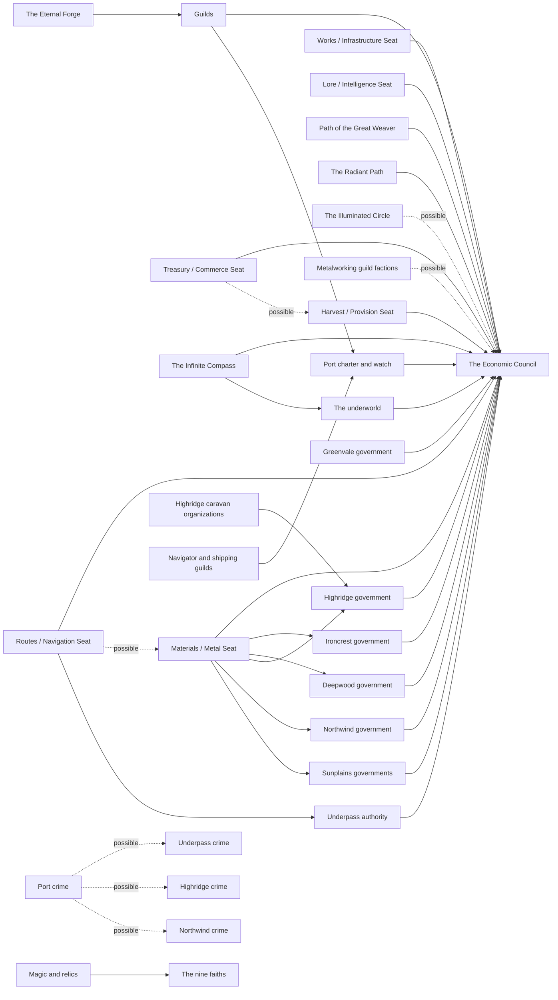

# Atlas Part 4: Power

## Status

**Derived view, not canon. Generated; don't edit by hand.** Edit [`power.json`](power.json), then run `python3 atlas/tools/atlas_part.py` from the repository root. That rebuilds this page, the [image](power.png) of this part, and the [combined board](../board/README.md) (interactive: https://claude.ai/artifact/XG2oKvVRes6f7su2dyMaWs). Every thing links to the wiki page it comes from; the wiki wins any disagreement. Part of the [Atlas](../README.md); plan in [PLAN.md](../PLAN.md).

Who controls what: the Economic Council and its six seats, each region's government and the Council's pressure on it, the nine faiths, the guilds, crime, and arms and elite troops.

The Economic Council and its seats, the faiths and the guilds get columns of their own, because none of them belongs to one region; the underworld and arms overviews sit in World & unplaced. Each region column (plus Port and the Underpass) gets a government, crime and arms card. Lines show the Council's reach into each government, where faiths and guilds touch the Council, and one example criminal alliance. None of the Power pages carries a status label, so their cards say so; Port and the Underpass cards come from Working canon pages.

**Counts:** 1 council, 6 council seats, 6 overviews, 8 governments, 9 faiths, 8 guilds, 8 crimes, 8 arms and elite troopses; 51 connections (38 stated in the wiki, 13 inferred).

## Gaps this part exposes

Things the wiki doesn't settle yet. Listed for James to decide; nothing here was filled in.

- **The Council's houses are named, but not how seats pass.** Six seats and six houses were settled on 2026-09-29 (Marielle, Drathain, Veynor, Torradon, Luthain, Rhaelen); their named members are Provisional. Still open: how seats are inherited, selected, bought or contested, how old the Council is relative to the Convergence, what rulers know versus rumor, and the domains' final titles.
- **Only two seats name the places they reach.** The Materials seat names five regions and the Routes seat names the Underpass. Every other region page names only "the Council"; the seat links drawn for them ("food/finance networks", "shipping and finance", "Council-linked credit", "route costs", "infrastructure/resource interests", "credit panic") match a domain word and are marked inferred, off by default. Sunplains names Council involvement but no domain.
- **Every government is still a sketch.** No ruler, capital, dynasty, council or court is named anywhere, and most shapes are hedged ("likely", "could", "possible"). The wiki's open questions ask whether the six regions are kingdoms in the same constitutional sense, how many Sunplains city-states remain, how centralized Deepwood is, what formally governs Highridge, and whether Port has its own citizenship.
- **Three governments have no list of political fights.** Highridge's Politics section lists who holds power but not what they fight over; Port and the Underpass have pressures but no fights section.
- **No faith is placed anywhere.** The nine traditions span borders by design, but none has a named institution, leader, school or holy site, and none is tied to a region, border town or Port (Port has "blended religious practices"; Highridge has "religious institutions"; Deepwood has "sacred jurisdictions", all unnamed).
- **Four faiths have no stated stance on the Council.** The Cyclic Order, the Eternal Forge, the Harmonious Path and the Dual Flame have schemes but no Council link; the Silent Whisper's "elite secrecy" link is inferred. The Harmonious Path's parallel arbitration and the Dual Flame's counselors spotting a shared source point at current events, which belong to Part 7.
- **Only three guilds have names, and they're flagged.** The Warrior's, Assassin's and Spy Guilds come from earlier notes and "should be developed carefully". No guild has the leadership, branches, reformers or funding model the guild rule asks for, the metalworking factions are unnamed, and only the Highridge caravan organizations are placed in a region (the other placements shown are inferred).
- **No criminal organization is named.** The Crime page gives regional opportunities and five scales, but no gang, syndicate or family; the cross-regional alliance (Port finances, Underpass moves goods, Highridge supplies documents, Northwind moves cargo) is an example. The Underpass has no section on the Crime page.
- **No elite unit is named.** Each region has an elite direction, but no formation has the recruitment tradition, reputation, speech, initiation, uniform, conduct rules or patrons the cultural-behavior rule asks for. Port and the Underpass have no everyday-arms list.
- **The Villain and Wurdren appear as facts, not links.** The Council, guild, underworld and politics pages all describe how each deals with them; those links wait for Part 6 (People), and the pressures and schemes that are really events wait for Part 7.

## Council and its seats

| From | Connection | To | Basis | Supporting text |
| --- | --- | --- | --- | --- |
| Harvest / Provision Seat | is a seat of | The Economic Council | stated | “Working title: Harvest / Provision Seat” [source](../../wiki/Politics/Economic-Council.md#1-food-and-biological-supply) |
| Materials / Metal Seat | is a seat of | The Economic Council | stated | “Working title: Materials / Metal Seat” [source](../../wiki/Politics/Economic-Council.md#2-materials-and-production) |
| Routes / Navigation Seat | is a seat of | The Economic Council | stated | “Working title: Routes / Navigation Seat” [source](../../wiki/Politics/Economic-Council.md#3-routes-and-transport) |
| Works / Infrastructure Seat | is a seat of | The Economic Council | stated | “Working title: Works / Infrastructure Seat” [source](../../wiki/Politics/Economic-Council.md#4-infrastructure) |
| Treasury / Commerce Seat | is a seat of | The Economic Council | stated | “Working title: Treasury / Commerce Seat” [source](../../wiki/Politics/Economic-Council.md#5-finance-and-exchange) |
| Lore / Intelligence Seat | is a seat of | The Economic Council | stated | “Working title: Lore / Intelligence Seat” [source](../../wiki/Politics/Economic-Council.md#6-knowledge-and-information) |
| Treasury / Commerce Seat | may be at odds with | Harvest / Provision Seat | stated, possible | “finance wants repayment while food wants famine relief” [source](../../wiki/Politics/Economic-Council.md#internal-conflict) |
| Routes / Navigation Seat | may be at odds with | Materials / Metal Seat | stated, possible | “routes wants open trade while materials wants strategic embargo” [source](../../wiki/Politics/Economic-Council.md#internal-conflict) |

## Council reach

| From | Connection | To | Basis | Supporting text |
| --- | --- | --- | --- | --- |
| Guilds | is influenced by | The Economic Council | stated | “The Council does not … own the guilds … It influences them through” [source](../../wiki/Politics/Guilds.md#guild-interaction-with-the-council) Also: “Guilds sometimes knowingly manipulate Council families in return.” [source](../../wiki/Politics/Guilds.md#guild-interaction-with-the-council) |
| The underworld | is sometimes tolerated by | The Economic Council | stated | “The Council sometimes tolerates criminal networks because they provide deniable services or keep unofficial markets functioning.” [source](../../wiki/Politics/Crime-and-Underworld.md#underworld-and-the-main-conflict) |
| Ironcrest government | has Council involvement from | The Economic Council | stated | “Council efforts to prevent Ironcrest from converting economic strength into unchecked military power” [source](../../wiki/Regions/Ironcrest.md#current-pressures) |
| Northwind government | has Council involvement from | The Economic Council | stated | “Council attempts to stabilize shipping without allowing a single maritime bloc to dominate” [source](../../wiki/Regions/Northwind.md#current-pressures) |
| Greenvale government | has Council involvement from | The Economic Council | stated | “The Council's food/finance networks can exert enormous influence here without ruling Greenvale directly.” [source](../../wiki/Regions/Greenvale.md#politics) |
| Highridge government | has Council involvement from | The Economic Council | stated | “Council interference with route costs” [source](../../wiki/Regions/Highridge-Plateau.md#current-pressures) |
| Deepwood government | has Council involvement from | The Economic Council | stated | “Council infrastructure/resource interests” [source](../../wiki/Regions/Deepwood.md#current-pressures) |
| Sunplains governments | has Council involvement from | The Economic Council | stated | “Council efforts to prevent dangerous consolidation” [source](../../wiki/Regions/Sunplains.md#current-pressures) Also: “A permanent Sunplains union would be powerful enough to worry both neighbors and the Council.” [source](../../wiki/Regions/Sunplains.md#politics) |
| Port charter and watch | has Council involvement from | The Economic Council | stated | “Council-linked finance attempts to prevent a credit panic” [source](../../wiki/Places/Port.md#current-events) |
| Underpass authority | has Council involvement from | The Economic Council | stated | “Council agents seek reliable route influence” [source](../../wiki/Places/The-Underpass.md#current-events) |
| Materials / Metal Seat | reaches | Ironcrest government | stated | “Its power spans Ironcrest mines, Deepwood timber/fuel disputes, Highridge demand, Northwind ship fittings, and Sunplains construction.” [source](../../wiki/Politics/Economic-Council.md#2-materials-and-production) |
| Materials / Metal Seat | reaches | Deepwood government | stated | “Its power spans Ironcrest mines, Deepwood timber/fuel disputes, Highridge demand, Northwind ship fittings, and Sunplains construction.” [source](../../wiki/Politics/Economic-Council.md#2-materials-and-production) |
| Materials / Metal Seat | reaches | Highridge government | stated | “Its power spans Ironcrest mines, Deepwood timber/fuel disputes, Highridge demand, Northwind ship fittings, and Sunplains construction.” [source](../../wiki/Politics/Economic-Council.md#2-materials-and-production) |
| Materials / Metal Seat | reaches | Northwind government | stated | “Its power spans Ironcrest mines, Deepwood timber/fuel disputes, Highridge demand, Northwind ship fittings, and Sunplains construction.” [source](../../wiki/Politics/Economic-Council.md#2-materials-and-production) |
| Materials / Metal Seat | reaches | Sunplains governments | stated | “Its power spans Ironcrest mines, Deepwood timber/fuel disputes, Highridge demand, Northwind ship fittings, and Sunplains construction.” [source](../../wiki/Politics/Economic-Council.md#2-materials-and-production) |
| Routes / Navigation Seat | reaches | Underpass authority | stated | “Underpass connections” [source](../../wiki/Politics/Economic-Council.md#3-routes-and-transport) |

## Faiths

| From | Connection | To | Basis | Supporting text |
| --- | --- | --- | --- | --- |
| Path of the Great Weaver | is seen as a threat by | The Economic Council | stated | “Some Council families see this as a threat to economic planning.” [source](../../wiki/Politics/Religions.md#2-path-of-the-great-weaver) |
| The Radiant Path | is divided over | The Economic Council | stated | “Different branches disagree over whether hidden Council rule is a necessary compromise or fundamentally a form of darkness through deception.” [source](../../wiki/Politics/Religions.md#3-the-radiant-path) |
| The Illuminated Circle | may be close to proving manipulation behind | The Economic Council | stated, possible | “Some may be close to proving systematic manipulation without yet understanding the Council.” [source](../../wiki/Politics/Religions.md#5-the-illuminated-circle) |
| The Infinite Compass | is a network wanted by | The Economic Council | stated | “The Council, the Villain, spies, and criminals all have reasons to influence these networks.” [source](../../wiki/Politics/Religions.md#9-the-infinite-compass) |
| The Infinite Compass | is a network wanted by | The underworld | stated | “The Council, the Villain, spies, and criminals all have reasons to influence these networks.” [source](../../wiki/Politics/Religions.md#9-the-infinite-compass) |
| The Eternal Forge | has guild-adjacent institutions in disputes touching | Guilds | stated | “Its guild-adjacent institutions are becoming active in labor and quality disputes” [source](../../wiki/Politics/Religions.md#4-the-eternal-forge) |
| Magic and relics | is kept within | The nine faiths | stated | “They belong to the … faith traditions … and regions that made them” [source](../../wiki/Magic.md#relics) |

## Guilds

| From | Connection | To | Basis | Supporting text |
| --- | --- | --- | --- | --- |
| Metalworking guild factions | may be funded by | The Economic Council | stated, possible | “Council-linked investors may fund one faction to restrain another.” [source](../../wiki/Politics/Guilds.md#metalworking-guild-factions) |
| Highridge caravan organizations | holds power in | Highridge government | stated | “caravan guilds” [source](../../wiki/Regions/Highridge-Plateau.md#politics) |
| Navigator and shipping guilds | is debating | Port charter and watch | stated | “Port influence” [source](../../wiki/Politics/Guilds.md#navigator-and-shipping-guilds) |
| Guilds | has influence in | Port charter and watch | stated | “guild influence” [source](../../wiki/Places/Port.md#neutrality) Also: “guilds maintain headquarters” [source](../../wiki/Places/Port.md#why-other-ports-do-not-replace-it) |

## Criminal alliance

| From | Connection | To | Basis | Supporting text |
| --- | --- | --- | --- | --- |
| Port crime | could ally with | Underpass crime | stated, possible | “a Port syndicate finances; an Underpass group moves goods; a Highridge gang supplies documents; a Northwind crew moves cargo by sea.” [source](../../wiki/Politics/Crime-and-Underworld.md#cross-regional-criminal-alliances) |
| Port crime | could ally with | Highridge crime | stated, possible | “a Port syndicate finances; an Underpass group moves goods; a Highridge gang supplies documents; a Northwind crew moves cargo by sea.” [source](../../wiki/Politics/Crime-and-Underworld.md#cross-regional-criminal-alliances) |
| Port crime | could ally with | Northwind crime | stated, possible | “a Port syndicate finances; an Underpass group moves goods; a Highridge gang supplies documents; a Northwind crew moves cargo by sea.” [source](../../wiki/Politics/Crime-and-Underworld.md#cross-regional-criminal-alliances) |

## Seat links by domain (inferred)

| From | Connection | To | Basis | Supporting text |
| --- | --- | --- | --- | --- |
| Routes / Navigation Seat | probably reaches | Highridge government | inferred | “The region page names Council involvement ("Council interference with route costs") but no seat; this seat's domain on the Council page matches the words used. The seat model itself is still open.” [source](../../wiki/Regions/Highridge-Plateau.md#current-pressures) Also: “Council interference with route costs” [source](../../wiki/Regions/Highridge-Plateau.md#current-pressures) *the region page names only the Council* Also: “It can change an economy by making a route expensive rather than formally banning trade.” [source](../../wiki/Politics/Economic-Council.md#3-routes-and-transport) *the seat whose domain matches* |
| Routes / Navigation Seat | probably reaches | Northwind government | inferred | “The region page names Council involvement ("Council influence over shipping and finance") but no seat; this seat's domain on the Council page matches the words used. The seat model itself is still open.” [source](../../wiki/Regions/Northwind.md#politics) Also: “Council influence over shipping and finance” [source](../../wiki/Regions/Northwind.md#politics) *the region page names only the Council* Also: “maritime shipping” [source](../../wiki/Politics/Economic-Council.md#3-routes-and-transport) *the seat whose domain matches* |
| Treasury / Commerce Seat | probably reaches | Northwind government | inferred | “The region page names Council involvement ("Council influence over shipping and finance") but no seat; this seat's domain on the Council page matches the words used. The seat model itself is still open.” [source](../../wiki/Regions/Northwind.md#politics) Also: “Council influence over shipping and finance” [source](../../wiki/Regions/Northwind.md#politics) *the region page names only the Council* Also: “banking houses” [source](../../wiki/Politics/Economic-Council.md#5-finance-and-exchange) *the seat whose domain matches* |
| Harvest / Provision Seat | probably reaches | Greenvale government | inferred | “The region page names Council involvement ("The Council's food/finance networks can exert enormous influence here") but no seat; this seat's domain on the Council page matches the words used. The seat model itself is still open.” [source](../../wiki/Regions/Greenvale.md#politics) Also: “The Council's food/finance networks can exert enormous influence here” [source](../../wiki/Regions/Greenvale.md#politics) *the region page names only the Council* Also: “grain storage” [source](../../wiki/Politics/Economic-Council.md#1-food-and-biological-supply) *the seat whose domain matches* |
| Treasury / Commerce Seat | probably reaches | Greenvale government | inferred | “The region page names Council involvement ("The Council's food/finance networks can exert enormous influence here") but no seat; this seat's domain on the Council page matches the words used. The seat model itself is still open.” [source](../../wiki/Regions/Greenvale.md#politics) Also: “The Council's food/finance networks can exert enormous influence here” [source](../../wiki/Regions/Greenvale.md#politics) *the region page names only the Council* Also: “credit” [source](../../wiki/Politics/Economic-Council.md#5-finance-and-exchange) *the seat whose domain matches* |
| Treasury / Commerce Seat | probably reaches | Ironcrest government | inferred | “The region page names Council involvement ("Council-linked credit") but no seat; this seat's domain on the Council page matches the words used. The seat model itself is still open.” [source](../../wiki/Regions/Ironcrest.md#politics) Also: “Council-linked credit” [source](../../wiki/Regions/Ironcrest.md#politics) *the region page names only the Council* Also: “credit” [source](../../wiki/Politics/Economic-Council.md#5-finance-and-exchange) *the seat whose domain matches* |
| Treasury / Commerce Seat | probably reaches | Port charter and watch | inferred | “The region page names Council involvement ("Council-linked finance attempts to prevent a credit panic") but no seat; this seat's domain on the Council page matches the words used. The seat model itself is still open.” [source](../../wiki/Places/Port.md#current-events) Also: “Council-linked finance attempts to prevent a credit panic” [source](../../wiki/Places/Port.md#current-events) *the region page names only the Council* Also: “emergency financing” [source](../../wiki/Politics/Economic-Council.md#5-finance-and-exchange) *the seat whose domain matches* |
| Works / Infrastructure Seat | probably reaches | Deepwood government | inferred | “The region page names Council involvement ("Council infrastructure/resource interests") but no seat; this seat's domain on the Council page matches the words used. The seat model itself is still open.” [source](../../wiki/Regions/Deepwood.md#current-pressures) Also: “Council infrastructure/resource interests” [source](../../wiki/Regions/Deepwood.md#current-pressures) *the region page names only the Council* Also: “large public works” [source](../../wiki/Politics/Economic-Council.md#4-infrastructure) *the seat whose domain matches* |

## Other power links (inferred)

| From | Connection | To | Basis | Supporting text |
| --- | --- | --- | --- | --- |
| The Silent Whisper | may shield | The Economic Council | inferred | “Some custodians withhold dangerous truths, and others call this "complicity with elite secrecy" (Religions). The page doesn't name the Council; the link rests on the Council being the setting's chief keeper of elite secrecy.” [source](../../wiki/Politics/Religions.md#6-the-silent-whisper) |
| Metalworking guild factions | probably sits in | Ironcrest government | inferred | “Metalworking guild factions fight over production and apprenticeship (Guilds); Ironcrest's rulers manage guild privileges amid labor unrest in mining and metalworking (Ironcrest). The Guilds page doesn't name a region.” [source](../../wiki/Politics/Guilds.md#metalworking-guild-factions) Also: “labor unrest in mining and metalworking” [source](../../wiki/Regions/Ironcrest.md#current-pressures) |
| Agricultural guilds and cooperatives | probably sits in | Greenvale government | inferred | “Agricultural guilds and cooperatives fight over seed control, storage and land consolidation (Guilds); Greenvale's politics center on storage, seed ownership and estate versus cooperative power (Greenvale). The Guilds page doesn't name a region.” [source](../../wiki/Politics/Guilds.md#agricultural-guildscooperatives) Also: “estate versus cooperative power” [source](../../wiki/Regions/Greenvale.md#politics) |
| Navigator and shipping guilds | probably shares a debate with | Northwind government | inferred | “Navigator and shipping guilds are debating convoy systems (Guilds); Northwind is debating convoy agreements with Port (Northwind). Neither page names the other.” [source](../../wiki/Politics/Guilds.md#navigator-and-shipping-guilds) Also: “debate over convoy agreements with Port” [source](../../wiki/Regions/Northwind.md#current-pressures) |
| Builders and infrastructure guilds | probably bids for | Works / Infrastructure Seat | inferred | “Builders and infrastructure guilds seek long contracts (Guilds); the Works seat influences large public works and repair contracts (Economic Council). Neither page links them.” [source](../../wiki/Politics/Guilds.md#builders-and-infrastructure-guilds) Also: “repair contracts” [source](../../wiki/Politics/Economic-Council.md#4-infrastructure) |

## Diagram

Stated connections only; positions are automatic. The [interactive board](../board/README.md) is easier to read.

## Every thing in this part

Grouped by board column.

### Northwind

| Thing | Kind | Status | Summary |
| --- | --- | --- | --- |
| [Northwind government](../../wiki/Politics/Kingdoms-and-Politics.md#northwind) | Government | No status label | Likely keeps strong clan, harbor and local rights even under larger regional leadership; maritime law may be partly separate from inland law. |
| [Northwind crime](../../wiki/Politics/Crime-and-Underworld.md#northwind) | Crime | No status label | Common criminal opportunities: piracy, smuggling, stolen cargo, illegal fishing, harbor protection. |
| [Northwind arms](../../wiki/Culture/Weapons-and-Elite-Troops.md#northwind) | Arms and elite troops | No status label | Elite direction: marines and coastal fighters skilled in shipboard combat, rough weather, landing operations and cold endurance. |

**Northwind government**

- *Shape:* Likely preserves strong clan, harbor and local rights even under larger regional leadership. ([source](../../wiki/Politics/Kingdoms-and-Politics.md#northwind))
- *Political fights:* Fishing rights, harbor control, convoy protection, privateering and piracy, clan autonomy, merchant investment, food dependence, and Council influence over shipping and finance. ([source](../../wiki/Regions/Northwind.md#politics))
- *Current pressures:* Declining or shifting fish stocks; rising piracy; debate over convoy agreements with Port; accusations that some clans cooperate with raiders; Council attempts to stabilize shipping without letting one maritime bloc dominate; Villain efforts to make defensive actions look like aggression. ([source](../../wiki/Regions/Northwind.md#current-pressures))
- *Note:* Maritime law may be partially separate from inland law. ([source](../../wiki/Politics/Kingdoms-and-Politics.md#northwind))

**Northwind crime**

- *Opportunities:* Piracy, smuggling, stolen cargo, illegal fishing, harbor protection. ([source](../../wiki/Politics/Crime-and-Underworld.md#northwind))
- *On the ground now:* Rising piracy; accusations that some clans cooperate with raiders. ([source](../../wiki/Regions/Northwind.md#current-pressures))

**Northwind arms**

- *Everyday arms:* Utility knives, boat hooks, axes, short spears, bows, boarding weapons.
- *Elite direction:* Marines and coastal fighters skilled in shipboard combat, rough weather, landing operations and cold endurance.
- *Stands out by:* Waterproofed gear, layered clothing, rope skills, compact shields, superior boots.

### Highridge Plateau

| Thing | Kind | Status | Summary |
| --- | --- | --- | --- |
| [Highridge government](../../wiki/Politics/Kingdoms-and-Politics.md#highridge) | Government | No status label | Could be a federation or confederation of cities, route districts, caravan houses, herding territories and old pass communities, whose legitimacy may come from negotiated compacts rather than a single dynasty. |
| [Highridge caravan organizations](../../wiki/Politics/Guilds.md#highridge-caravan-organizations) | Guild | No status label | Competing over safe-route certification, tolls, militia protection and maps. |
| [Highridge crime](../../wiki/Politics/Crime-and-Underworld.md#highridge) | Crime | No status label | Common criminal opportunities: caravan robbery, route extortion, document fraud, information brokerage. |
| [Highridge arms](../../wiki/Culture/Weapons-and-Elite-Troops.md#highridge) | Arms and elite troops | No status label | Elite direction: route guards and high-altitude scouts trained for ambush prevention, escort, signal systems and fighting around narrow passes. |

**Highridge government**

- *Shape:* Could be a federation or confederation of cities, route districts, caravan houses, herding territories and old pass communities. Its legitimacy may come from negotiated compacts rather than a single dynasty. ([source](../../wiki/Politics/Kingdoms-and-Politics.md#highridge))
- *Power held by:* Route authorities, old families, merchant houses, caravan guilds, urban councils, religious institutions and herding communities. ([source](../../wiki/Regions/Highridge-Plateau.md#politics))
- *Political fights:* *Not in the wiki yet.*
- *Current pressures:* Caravan attacks; manipulated route closures; accusations of corrupt militia or toll officials; intellectual disputes tied to actual commercial patrons; contested infrastructure projects; Council interference with route costs; Villain efforts to redirect flows without appearing to control them. ([source](../../wiki/Regions/Highridge-Plateau.md#current-pressures))
- *Note:* The region's reputation for reasoned debate is partly ideal and partly institutional necessity. ([source](../../wiki/Regions/Highridge-Plateau.md#politics))

**Highridge caravan organizations**

- *Type:* Trade and transport (caravan masters are listed there).
- *At issue:* Competing over safe-route certification, tolls, militia protection and maps.

**Highridge crime**

- *Opportunities:* Caravan robbery, route extortion, document fraud, information brokerage. ([source](../../wiki/Politics/Crime-and-Underworld.md#highridge))
- *On the ground now:* Caravan attacks; accusations of corrupt militia or toll officials. ([source](../../wiki/Regions/Highridge-Plateau.md#current-pressures))

**Highridge arms**

- *Everyday arms:* Staff, short spear, bow, sling, caravan knife.
- *Elite direction:* Route guards and high-altitude scouts trained for ambush prevention, escort, signal systems and fighting around narrow passes.

### Deepwood

| Thing | Kind | Status | Summary |
| --- | --- | --- | --- |
| [Deepwood government](../../wiki/Politics/Kingdoms-and-Politics.md#deepwood) | Government | No status label | Likely the least centralized region, with possible layers of local councils, forest wardens, regional assemblies, sacred jurisdictions, market towns and hereditary authorities in some districts. |
| [Deepwood crime](../../wiki/Politics/Crime-and-Underworld.md#deepwood) | Crime | No status label | Common criminal opportunities: illegal timber, rare plant trade, poaching, hidden-route smuggling. |
| [Deepwood arms](../../wiki/Culture/Weapons-and-Elite-Troops.md#deepwood) | Arms and elite troops | No status label | Elite direction: rangers and wardens who know terrain, tracking, concealment, river crossings and coordinated small-unit fighting. |

**Deepwood government**

- *Shape:* Likely the least centralized. Possible layers: local councils, forest wardens, regional assemblies, sacred jurisdictions, market towns, and hereditary authorities in some districts. ([source](../../wiki/Politics/Kingdoms-and-Politics.md#deepwood))
- *Political fights:* Cutting rights, water, road access, hunting, sacred or restricted areas, border settlement, trade in high-value plants, local autonomy. ([source](../../wiki/Regions/Deepwood.md#politics))
- *Current pressures:* Illegal or politically authorized logging beyond accepted limits; fungal disease affecting food or trade species; conflict between isolationists and outward-looking reformers; criminal exploitation of hidden routes; Council infrastructure and resource interests; Villain attempts to turn legitimate conservation disputes into regional crisis. ([source](../../wiki/Regions/Deepwood.md#current-pressures))

**Deepwood crime**

- *Opportunities:* Illegal timber, rare plant trade, poaching, hidden-route smuggling. ([source](../../wiki/Politics/Crime-and-Underworld.md#deepwood))
- *On the ground now:* Illegal or politically authorized logging beyond accepted limits; criminal exploitation of hidden routes. ([source](../../wiki/Regions/Deepwood.md#current-pressures))

**Deepwood arms**

- *Everyday arms:* Bows, spears, machete- or billhook-like cutting tools, knives, slings.
- *Elite direction:* Rangers and wardens who know terrain, tracking, concealment, river crossings and coordinated small-unit fighting.
- *Note:* No magical "silent bows" are required.

### Ironcrest

| Thing | Kind | Status | Summary |
| --- | --- | --- | --- |
| [Ironcrest government](../../wiki/Politics/Kingdoms-and-Politics.md#ironcrest) | Government | No status label | Likely more consolidated than before the Convergence, but power is divided among crown and state institutions, mine owners, guilds, town governments, labor organizations and old landed families. |
| [Ironcrest crime](../../wiki/Politics/Crime-and-Underworld.md#ironcrest) | Crime | No status label | Common criminal opportunities: ore theft, illegal claims, tool and weapon diversion, labor intimidation, debt. |
| [Ironcrest arms](../../wiki/Culture/Weapons-and-Elite-Troops.md#ironcrest) | Arms and elite troops | No status label | Elite direction: disciplined heavy infantry or engineering troops accustomed to fortifications, mines and confined terrain. |

**Ironcrest government**

- *Shape:* Likely relatively consolidated compared with its pre-Convergence past. ([source](../../wiki/Politics/Kingdoms-and-Politics.md#ironcrest))
- *Power held by:* Crown and state institutions, mine owners, guilds, town governments, labor organizations and old landed families. ([source](../../wiki/Politics/Kingdoms-and-Politics.md#ironcrest))
- *Political fights:* Rulers must manage mine ownership, labor, guild privileges, food imports, forest and fuel rights, border roads, old land claims and Council-linked credit. A ruler can command soldiers but cannot simply order the economy to function. ([source](../../wiki/Regions/Ironcrest.md#politics))
- *Current pressures:* Labor unrest in mining and metalworking; covert high-quality metal shipments; pressure to expand access to Underpass routes; fears of weapon stockpiling; Council efforts to prevent Ironcrest converting economic strength into unchecked military power; Villain efforts to turn guild grievances and elite rivalries into strategic disruption. ([source](../../wiki/Regions/Ironcrest.md#current-pressures))

**Ironcrest crime**

- *Opportunities:* Ore theft, illegal claims, tool and weapon diversion, labor intimidation, debt. ([source](../../wiki/Politics/Crime-and-Underworld.md#ironcrest))

**Ironcrest arms**

- *Everyday arms:* Stout knives, hammers, short spears, axes, clubs; crossbows in some districts.
- *Elite direction:* Disciplined heavy infantry or engineering troops accustomed to fortifications, mines and confined terrain.
- *Stands out by:* Better helmets, standardized armor pieces, reliable tools, insignia tied to unit rather than flamboyant fantasy armor.
- *Why:* Metal access makes durable fittings common, but good steel remains expensive.

### Greenvale

| Thing | Kind | Status | Summary |
| --- | --- | --- | --- |
| [Greenvale government](../../wiki/Politics/Kingdoms-and-Politics.md#greenvale) | Government | No status label | Could combine a regional monarchy or central authority with estate power, village councils, irrigation associations, cooperatives and market towns. |
| [Greenvale crime](../../wiki/Politics/Crime-and-Underworld.md#greenvale) | Crime | No status label | Common criminal opportunities: grain theft, land fraud, illegal seed markets, livestock theft, debt enforcement. |
| [Greenvale arms](../../wiki/Culture/Weapons-and-Elite-Troops.md#greenvale) | Arms and elite troops | No status label | Elite direction: mobile local defense, scouts, or disciplined levy cadres whose strength is logistics and local terrain rather than exotic weaponry. |

**Greenvale government**

- *Shape:* Could combine a regional monarchy or central authority, estate power, village councils, irrigation associations, cooperatives and market towns. ([source](../../wiki/Politics/Kingdoms-and-Politics.md#greenvale))
- *Political fights:* Land tenure, water rights, tenant obligations, storage, seed ownership, grain price, export rules, estate versus cooperative power. The Council's food and finance networks can exert enormous influence here without ruling Greenvale directly. ([source](../../wiki/Regions/Greenvale.md#politics))
- *Current pressures:* An unusually abundant harvest or new high-yield seed strain; suspicion about where innovations came from; collapsing farm prices despite high output; land consolidation; sabotage of irrigation or crops; conflict between co-ops and large estates; Villain attempts to turn abundance into distrust and scarcity elsewhere. ([source](../../wiki/Regions/Greenvale.md#current-pressures))

**Greenvale crime**

- *Opportunities:* Grain theft, land fraud, illegal seed markets, livestock theft, debt enforcement. ([source](../../wiki/Politics/Crime-and-Underworld.md#greenvale))
- *On the ground now:* Sabotage of irrigation or crops. ([source](../../wiki/Regions/Greenvale.md#current-pressures))

**Greenvale arms**

- *Everyday arms:* Staff, billhook, sickle, knife, hunting bow, spear.
- *Elite direction:* Mobile local defense, scouts, or disciplined levy cadres whose strength is logistics and local terrain rather than exotic weaponry.

### Sunplains

| Thing | Kind | Status | Summary |
| --- | --- | --- | --- |
| [Sunplains governments](../../wiki/Politics/Kingdoms-and-Politics.md#sunplains) | Government | No status label | The most explicitly plural region: city-states, leagues, estates, ports and rural territories. The Convergence may recognize it externally though it contains several sovereign or semi-sovereign governments. |
| [Sunplains crime](../../wiki/Politics/Crime-and-Underworld.md#sunplains) | Crime | No status label | Common criminal opportunities: canal corruption, smuggling, merchant fraud, political bribery, protection around ports and markets. |
| [Sunplains arms](../../wiki/Culture/Weapons-and-Elite-Troops.md#sunplains) | Arms and elite troops | No status label | Elite direction: city-state guards, cavalry where terrain and horse culture support it, professional household troops, or disciplined spear formations. |

**Sunplains governments**

- *Shape:* Most explicitly plural: city-states, leagues, estates, ports and rural territories. The Convergence may recognize the region externally even though it contains several sovereign or semi-sovereign governments. ([source](../../wiki/Politics/Kingdoms-and-Politics.md#sunplains))
- *Political fights:* City-states compete for water, port access, prestige, trade, labor, alliances and cultural influence. A permanent Sunplains union would be powerful enough to worry both neighbors and the Council. ([source](../../wiki/Regions/Sunplains.md#politics))
- *Current pressures:* Drought fears; private control of canals; city-state blocs forming and breaking; merchant-family espionage; artistic and civic rivalry masking real political competition; Council efforts to prevent dangerous consolidation; Villain attempts to make defensive alliances appear expansionist. ([source](../../wiki/Regions/Sunplains.md#current-pressures))

**Sunplains crime**

- *Opportunities:* Canal corruption, smuggling, merchant fraud, political bribery, protection around ports and markets. ([source](../../wiki/Politics/Crime-and-Underworld.md#sunplains))

**Sunplains arms**

- *Everyday arms:* Knives, staffs, short spears, slings, bows, city watch weapons.
- *Elite direction:* City-state guards, cavalry where terrain and horse culture support it, professional household troops, or disciplined spear formations.

### Port

| Thing | Kind | Status | Summary |
| --- | --- | --- | --- |
| [Port charter and watch](../../wiki/Places/Port.md#neutrality) | Government | Working canon | Port's neutrality is neither sentimental nor perfect: it survives because every major power fears what would happen if a rival controlled it. |
| [Port crime](../../wiki/Places/Port.md#crime) | Crime | Working canon | Port's scale and legal complexity make it ideal for smuggling, fencing, forgery, rackets, corruption, intelligence brokerage, contraband finance and pirate laundering. It isn't lawless: its underworld exists because its legal economy is enormous. |
| [Port arms](../../wiki/Culture/Weapons-and-Elite-Troops.md#port) | Arms and elite troops | No status label | Port's best forces are likely specialized: harbor watch, customs officers, fire brigades, marine patrols and riot or public-order units, trained for dense urban environments. |

**Port charter and watch**

- *Shape:* Neutrality that is neither sentimental nor perfect. It survives because every major power fears what would happen if a rival controlled it. ([source](../../wiki/Places/Port.md#neutrality))
- *Power held by:* Its governing charter should involve local citizens, merchant interests, guild influence, treaty guarantees, foreign enclaves, limits on kingdom troops inside the city, and a locally accountable watch or guard. ([source](../../wiki/Places/Port.md#neutrality))
- *Political fights:* *Not in the wiki yet.*
- *Current pressures:* Competing smuggling networks are expanding; merchant families are sabotaging one another's routes; refugees and displaced workers are increasing pressure on poorer districts; suspicious ship losses feed accusations among kingdoms; Council-linked finance attempts to prevent a credit panic; the Villain can exploit Port because a rumor or shipping delay here propagates everywhere. ([source](../../wiki/Places/Port.md#current-events))
- *Note:* The city needs harbor patrols, fire response, warehouse inspection, market regulation, neutral courts, multilingual clerks, quarantine rules, night watches and dock labor systems. Foreign militaries may protect outer sea lanes while being restricted inside Port itself. ([source](../../wiki/Places/Port.md#governance-and-protection))

**Port crime**

- *Opportunities:* Smuggling, fencing stolen goods, forged documents, protection rackets, corruption, intelligence brokerage, contraband finance, pirate laundering. The Crime page adds that all the regional forms can converge here. ([source](../../wiki/Places/Port.md#crime))
- *On the ground now:* Competing smuggling networks are expanding. ([source](../../wiki/Places/Port.md#current-events))
- *Note:* This doesn't mean the city is lawless. Its underworld exists because its legal economy is enormous. ([source](../../wiki/Places/Port.md#crime))
- *Also on:* [Crime and Underworld](../../wiki/Politics/Crime-and-Underworld.md#port)

**Port arms**

- *Everyday arms:* *Not in the wiki yet.*
- *Elite direction:* Likely specialized: harbor watch, customs officers, fire brigades, marine patrols, riot and public-order units.
- *Why:* Their advantage is training for dense urban environments rather than superior weapon technology.

### Spine & Underpass

| Thing | Kind | Status | Summary |
| --- | --- | --- | --- |
| [Underpass authority](../../wiki/Places/The-Underpass.md#politics) | Government | Working canon | Authority is fragmented among possible enclave councils, guide families, mining fraternities, local militias, trade coalitions and criminal organizations. Surface kingdoms claim some entrances and sections but rarely control the whole network. |
| [Underpass crime](../../wiki/Places/The-Underpass.md#politics) | Crime | Working canon | Criminal organizations are among the Underpass's possible governing units, and smugglers are exploiting official route closures. |
| [Underpass arms](../../wiki/Culture/Weapons-and-Elite-Troops.md#underpass) | Arms and elite troops | No status label | Specialized troops use short spears, axes or picks, compact shields, crossbows, helmets, ropes and lamps; long weapons are often impractical. |

**Underpass authority**

- *Shape:* Fragmented. Surface kingdoms claim some entrances and sections but rarely control the entire network. ([source](../../wiki/Places/The-Underpass.md#politics))
- *Power held by:* Possible governing units: enclave councils, guide families, mining fraternities, local militias, trade coalitions, criminal organizations. ([source](../../wiki/Places/The-Underpass.md#politics))
- *Political fights:* *Not in the wiki yet.*
- *Current pressures:* Rival enclaves are fighting over profitable corridors; new mineral finds have intensified claims; collapses have redirected trade; smugglers are exploiting official route closures; Council agents seek reliable route influence; the Villain can use the network to move people and goods where surface observers don't expect them. ([source](../../wiki/Places/The-Underpass.md#current-events))

**Underpass crime**

- *Opportunities:* *Not in the wiki yet.*
- *On the ground now:* Smugglers are exploiting official route closures. ([source](../../wiki/Places/The-Underpass.md#current-events))
- *Note:* Criminal organizations are among the possible governing units. ([source](../../wiki/Places/The-Underpass.md#politics))

**Underpass arms**

- *Everyday arms:* *Not in the wiki yet.*
- *Elite direction:* Specialized troops using short spears, axes or picks, compact shields, crossbows, helmets, ropes and lamps.
- *Why:* Long weapons are often impractical.

### Council & politics

| Thing | Kind | Status | Summary |
| --- | --- | --- | --- |
| [The Economic Council](../../wiki/Politics/Economic-Council.md#core-concept) | Council | No status label | A secret or semi-secret association of wealthy families whose power crosses regional borders. They represent no kingdom; they control economic systems on which all kingdoms depend, and govern through choice architecture rather than command. |
| [Harvest / Provision Seat](../../wiki/Politics/Economic-Council.md#1-food-and-biological-supply) | Council seat | No status label | The Council's Food and Biological Supply domain (working title: Harvest / Provision Seat). Power doesn't mean owning every farm. The family gains leverage by controlling bottlenecks: storage warehouses, seed credit, bulk contracts, mills, emergency reserves, and financing for large estates and co-ops. |
| [Materials / Metal Seat](../../wiki/Politics/Economic-Council.md#2-materials-and-production) | Council seat | No status label | The Council's Materials and Production domain (working title: Materials / Metal Seat). Its power spans Ironcrest mines, Deepwood timber and fuel disputes, Highridge demand, Northwind ship fittings, and Sunplains construction. |
| [Routes / Navigation Seat](../../wiki/Politics/Economic-Council.md#3-routes-and-transport) | Council seat | No status label | The Council's Routes and Transport domain (working title: Routes / Navigation Seat). It can change an economy by making a route expensive rather than formally banning trade. |
| [Works / Infrastructure Seat](../../wiki/Politics/Economic-Council.md#4-infrastructure) | Council seat | No status label | The Council's Infrastructure domain (working title: Works / Infrastructure Seat). Infrastructure decisions have long tails: a bridge not repaired can redirect trade for decades. |
| [Treasury / Commerce Seat](../../wiki/Politics/Economic-Council.md#5-finance-and-exchange) | Council seat | No status label | The Council's Finance and Exchange domain (working title: Treasury / Commerce Seat). This may be the Council's most quietly powerful seat, because every other domain sometimes needs capital. |
| [Lore / Intelligence Seat](../../wiki/Politics/Economic-Council.md#6-knowledge-and-information) | Council seat | No status label | The Council's Knowledge and Information domain (working title: Lore / Intelligence Seat). It should not literally control all knowledge. Its strength is knowing who knows what, buying access, delaying information, and deciding which innovations receive funding or distribution. |
| [How governments behave](../../wiki/Politics/Kingdoms-and-Politics.md#political-behavior) | Overview | No status label | No two regions need share a political system, and every government answers to the same pressures. That is how the Villain can push states toward war even when the Council wants peace. |

**The Economic Council**

- *Seats:* Six seats (Working canon, James 2026-09-29), each held by one house: Marielle (Harvest), Drathain (Materials), Veynor (Routes), Torradon (Works), Luthain (Treasury), Rhaelen (Lore). Each house comes from a region but represents none. The domain titles are still working titles. ([source](../../wiki/Politics/Economic-Council.md#the-six-houses))
- *How it governs:* Choice architecture rather than command. A kingdom may technically be free to refuse a treaty, but then credit becomes scarce, grain contracts disappear, insurers raise rates, caravans choose another route, bridge repairs are delayed, or a rival gains better terms. No single action proves conspiracy. ([source](../../wiki/Politics/Economic-Council.md#how-the-council-governs-without-governing))
- *Why rulers tolerate it:* Many rulers don't know the whole structure. Those who do may still tolerate it because it resolves shortages, provides emergency loans, coordinates trade, prevents financial panics, quietly restrains rivals, and helped preserve the post-Convergence order. ([source](../../wiki/Politics/Economic-Council.md#why-rulers-tolerate-it))
- *Internal conflict:* Not unified. Potential fault lines: finance wants repayment while food wants famine relief; routes wants open trade while materials wants strategic embargo; infrastructure wants long investment while short-term political pressure demands cuts; knowledge may know a scheme is failing before others admit it. Each family also has heirs, factions, clients and private ambitions. ([source](../../wiki/Politics/Economic-Council.md#internal-conflict))
- *Moral problem:* The Council may be correct that its coordination has prevented wars. The story's question is whether preventing catastrophe grants a private group the right to decide everyone else's future. ([source](../../wiki/Politics/Economic-Council.md#the-councils-moral-problem))
- *Against the Villain:* He attacks dependencies and perceptions, wanting kingdoms to make moves the Council can't openly stop without exposing how much power it holds. His goal is not merely to defeat six families but to make their system unable to maintain equilibrium. ([source](../../wiki/Politics/Economic-Council.md#relationship-to-the-villain))
- *With Wurdren:* Wurdren repeatedly fixes consequences the Council treats as acceptable losses. This can accidentally help the Council in the short term while morally undermining its worldview in the long term. ([source](../../wiki/Politics/Economic-Council.md#relationship-to-wurdren))
- *Open questions:* How seats are inherited, selected, purchased or contested; how old the Council is relative to the Convergence; which parts of its existence are rumor and which are known to elite rulers; the domains' final titles. ([source](../../wiki/Open-Questions.md#economic-council))

**Harvest / Provision Seat**

- *Domain:* Food and Biological Supply (working title)
- *Controls:* Grain storage; seed networks; orchard stock; livestock movement; emergency reserves; large agricultural contracts; food transport coordination.
- *Leverage:* Power doesn't mean owning every farm. The family gains leverage by controlling bottlenecks: storage warehouses, seed credit, bulk contracts, mills, emergency reserves, and financing for large estates and co-ops.
- *House:* House Marielle (Working canon). ([source](../../wiki/Politics/Economic-Council.md#the-six-houses))
- *Home region:* Greenvale: origin only; the house doesn't represent it. ([source](../../wiki/Politics/Economic-Council.md#the-six-houses))
- *Members:* Halric Marielle, a charismatic head of house; Ellana Marielle, botanist and diplomat. (Provisional.) ([source](../../wiki/Politics/Economic-Council.md#the-six-houses))

**Materials / Metal Seat**

- *Domain:* Materials and Production (working title)
- *Controls:* Mines; ore contracts; timber and fuel supply; large foundries; strategic materials; weapon-grade metal; construction metal.
- *Leverage:* Its power spans Ironcrest mines, Deepwood timber and fuel disputes, Highridge demand, Northwind ship fittings, and Sunplains construction.
- *House:* House Drathain (Working canon). ([source](../../wiki/Politics/Economic-Council.md#the-six-houses))
- *Home region:* Sunplains: origin only; the house doesn't represent it. ([source](../../wiki/Politics/Economic-Council.md#the-six-houses))
- *Members:* Evelyne Drathain, diplomat and master of guild alliances; Dorian Drathain, organizer of large labor forces. In the earlier notes the house held Labor; its leverage over crews and building became leverage over what they build with. (Provisional.) ([source](../../wiki/Politics/Economic-Council.md#the-six-houses))

**Routes / Navigation Seat**

- *Domain:* Routes and Transport (working title)
- *Controls:* Maritime shipping; caravan networks; pass access; major roads; warehouses; Underpass connections; shipping schedules; convoy contracts.
- *Leverage:* It can change an economy by making a route expensive rather than formally banning trade.
- *House:* House Veynor (Working canon). ([source](../../wiki/Politics/Economic-Council.md#the-six-houses))
- *Home region:* Port: origin only; the house doesn't represent it. ([source](../../wiki/Politics/Economic-Council.md#the-six-houses))
- *Members:* Ilthea Veynor, matriarch of maritime and overland trade; Appan Veynor, the house's pragmatic, ambitious heir. (Provisional.) ([source](../../wiki/Politics/Economic-Council.md#the-six-houses))

**Works / Infrastructure Seat**

- *Domain:* Infrastructure (working title)
- *Controls:* Roads; bridges; canals; irrigation; ports; fortifications; large public works; repair contracts.
- *Leverage:* Infrastructure decisions have long tails: a bridge not repaired can redirect trade for decades.
- *House:* House Torradon (Working canon). ([source](../../wiki/Politics/Economic-Council.md#the-six-houses))
- *Home region:* Highridge Plateau: origin only; the house doesn't represent it. ([source](../../wiki/Politics/Economic-Council.md#the-six-houses))
- *Members:* Vysera Torradon, visionary architect and leader; Sorvik Torradon, meticulous planner. (Provisional.) ([source](../../wiki/Politics/Economic-Council.md#the-six-houses))

**Treasury / Commerce Seat**

- *Domain:* Finance and Exchange (working title)
- *Controls:* Credit; debt; banking houses; currency exchange; large loans; merchant insurance-like arrangements; investment syndicates; emergency financing.
- *Leverage:* This may be the Council's most quietly powerful seat, because every other domain sometimes needs capital.
- *House:* House Luthain (Working canon). ([source](../../wiki/Politics/Economic-Council.md#the-six-houses))
- *Home region:* Ironcrest: origin only; the house doesn't represent it. ([source](../../wiki/Politics/Economic-Council.md#the-six-houses))
- *Members:* Carric Luthain, a shrewd banker; Margil Luthain, a cold, precise adviser. (Provisional.) ([source](../../wiki/Politics/Economic-Council.md#the-six-houses))

**Lore / Intelligence Seat**

- *Domain:* Knowledge and Information (working title)
- *Controls:* Commercial records; maps; guild secrets; technical knowledge; scholars and scribes; market reports; intelligence networks; blackmail; communication.
- *Leverage:* It should not literally control all knowledge. Its strength is knowing who knows what, buying access, delaying information, and deciding which innovations receive funding or distribution.
- *House:* House Rhaelen (Working canon). ([source](../../wiki/Politics/Economic-Council.md#the-six-houses))
- *Home region:* Deepwood: origin only; the house doesn't represent it. ([source](../../wiki/Politics/Economic-Council.md#the-six-houses))
- *Members:* Sorin Rhaelen, a reserved archivist; Lyra Rhaelen, who recovers lost knowledge. (Provisional.) ([source](../../wiki/Politics/Economic-Council.md#the-six-houses))

**How governments behave**

- *Principle:* The six regions should not necessarily share identical political systems. "Region" is a cultural-geographic term: a region can contain a kingdom, confederation, city-states, autonomous districts, chartered towns, religious lands and old privileges. ([source](../../wiki/Politics/Kingdoms-and-Politics.md#principle))
- *Scope:* Every government responds to domestic legitimacy, old borders, guild pressure, food, credit, military readiness, religion, public rumor and elite family interests. ([source](../../wiki/Politics/Kingdoms-and-Politics.md#political-behavior))
- *Council:* Rulers can't always follow Council preferences without appearing weak, corrupt or disloyal to their own populations. ([source](../../wiki/Politics/Kingdoms-and-Politics.md#political-behavior))
- *Villain:* A plausible escalation chain: a real grievance; evidence that seems to confirm a rival caused it; local politics punishing passive leaders; mobilization as deterrence, read as preparation for attack; border forces acting without full central control; deaths creating demand for retaliation; Council de-escalation looking suspicious; leaders fearing lost legitimacy if they compromise; limited conflict becoming self-sustaining. The Villain's genius is making each step locally rational. ([source](../../wiki/Politics/Kingdoms-and-Politics.md#how-war-can-begin-against-council-wishes))
- *Open questions:* Are all six named regions kingdoms in the same constitutional sense? How many independent Sunplains city-states remain? How centralized is Deepwood? What formal institutions govern Highridge? Does Port have citizenship independent of kingdom citizenship? ([source](../../wiki/Open-Questions.md#political-structure))

### Faiths

| Thing | Kind | Status | Summary |
| --- | --- | --- | --- |
| [The nine faiths](../../wiki/Politics/Religions.md#religions) | Overview | No status label | Nine major trans-regional traditions that don't map neatly onto kingdoms. Each should have local schools, reform movements, institutions, charities, political interests and internal disputes. |
| [The Cyclic Order](../../wiki/Politics/Religions.md#1-the-cyclic-order) | Faith | No status label | Core: Existence moves through cycles of birth, death, renewal, time, balance and moral consequence. |
| [Path of the Great Weaver](../../wiki/Politics/Religions.md#2-path-of-the-great-weaver) | Faith | No status label | Core: Beings, places, ancestors, animals and actions are threads in a living weave. |
| [The Radiant Path](../../wiki/Politics/Religions.md#3-the-radiant-path) | Faith | No status label | Core: Moral life is struggle toward courage, justice, truth and wisdom against cruelty, lies and discord. |
| [The Eternal Forge](../../wiki/Politics/Religions.md#4-the-eternal-forge) | Faith | No status label | Core: Creation and destruction are linked; character and society are shaped through disciplined transformation. |
| [The Illuminated Circle](../../wiki/Politics/Religions.md#5-the-illuminated-circle) | Faith | No status label | Core: Knowledge, reason, inquiry and intellectual freedom are sacred values. |
| [The Silent Whisper](../../wiki/Politics/Religions.md#6-the-silent-whisper) | Faith | No status label | Core: Silence, uncertainty, hidden truths, patience and introspection. |
| [The Harmonious Path](../../wiki/Politics/Religions.md#7-the-harmonious-path) | Faith | No status label | Core: Social responsibility, service, restraint, conflict resolution and balance. |
| [The Dual Flame](../../wiki/Politics/Religions.md#8-the-dual-flame) | Faith | No status label | Core: Moral integrity comes from understanding and balancing constructive and destructive impulses. |
| [The Infinite Compass](../../wiki/Politics/Religions.md#9-the-infinite-compass) | Faith | No status label | Core: Life is journey, direction, exploration and self-discovery. |
| [Magic and relics](../../wiki/Magic.md#the-decision) | Overview | Working canon | Real but deniable: a handful of old community relics seem to do small, moral things, but every effect has an ordinary explanation within reach and the story never confirms it. No spellcasting. |

**The nine faiths**

- *Principle:* The world currently contains nine major trans-regional traditions. They do not map neatly onto kingdoms, and each should have local schools, reform movements, institutions, charities, political interests and internal disputes. ([source](../../wiki/Politics/Religions.md#religions))
- *Scope:* Faiths shouldn't behave like nine political parties. A member's faith may influence moral language, community obligation, charitable networks and interpretation of events, but class, region, family, guild and personal experience also matter. ([source](../../wiki/Politics/Religions.md#religion-and-politics))
- *Main conflict:* Because the traditions span borders, they can show a crisis in one region understood completely differently elsewhere. Religious networks may also provide the first genuinely trans-regional response to the unfolding political crisis. ([source](../../wiki/Politics/Religions.md#religion-and-current-events))

**The Cyclic Order**

- *Core:* Existence moves through cycles of birth, death, renewal, time, balance and moral consequence.
- *Interests:* Calendars; rites of passage; mediation; burial; seasonal observance.
- *Current scheme:* A reform movement argues that post-Convergence stability has become stagnation. Some members want deliberate social disruption to "complete" overdue cycles; traditional elders oppose them.

**Path of the Great Weaver**

- *Core:* Beings, places, ancestors, animals and actions are threads in a living weave.
- *Interests:* Stewardship; oral history; ancestry; ecological obligations; community memory.
- *Current scheme:* Networks across several regions are documenting land and water damage, building a trans-regional moral case against large extraction and infrastructure projects. Some Council families see this as a threat to economic planning.

**The Radiant Path**

- *Core:* Moral life is struggle toward courage, justice, truth and wisdom against cruelty, lies and discord.
- *Interests:* Charity; public ethics; justice; moral testimony.
- *Current scheme:* Different branches disagree over whether hidden Council rule is a necessary compromise or fundamentally a form of darkness through deception.

**The Eternal Forge**

- *Core:* Creation and destruction are linked; character and society are shaped through disciplined transformation.
- *Interests:* Craft; apprenticeship; ethical labor; rebuilding.
- *Current scheme:* Its guild-adjacent institutions are becoming active in labor and quality disputes, potentially turning a spiritual tradition into a cross-regional political force.

**The Illuminated Circle**

- *Core:* Knowledge, reason, inquiry and intellectual freedom are sacred values.
- *Interests:* Libraries; schools; debate; archives; public reasoning.
- *Current scheme:* Scholars are collecting contradictory trade and government records. Some may be close to proving systematic manipulation without yet understanding the Council.

**The Silent Whisper**

- *Core:* Silence, uncertainty, hidden truths, patience and introspection.
- *Interests:* Preservation; contemplation; secret archives; lost knowledge.
- *Current scheme:* Some custodians believe dangerous truths should be withheld until society can survive them. Others argue that this has become complicity with elite secrecy.

**The Harmonious Path**

- *Core:* Social responsibility, service, restraint, conflict resolution and balance.
- *Interests:* Mediation; community welfare; nonviolent conflict settlement.
- *Current scheme:* Local Harmonious communities are building parallel mutual-aid and arbitration systems where official institutions have failed, unintentionally creating political power.

**The Dual Flame**

- *Core:* Moral integrity comes from understanding and balancing constructive and destructive impulses.
- *Interests:* Counseling; confession; mentorship; personal discipline.
- *Current scheme:* Its counselors are seeing similar fear, anger and radicalization patterns across regions and may recognize that separate crises share a source before political leaders do.

**The Infinite Compass**

- *Core:* Life is journey, direction, exploration and self-discovery.
- *Interests:* Pilgrimage; maps; hospitality; travelers; road shrines.
- *Current scheme:* Its pilgrim networks move information across borders faster than many governments expect. The Council, the Villain, spies and criminals all have reasons to influence these networks.

**Magic and relics**

- *Principle:* Magic is real but deniable (James, 2026-09-29). A handful of old relics really do something small and moral, like a lantern that dims when its holder lies, but every effect could have an ordinary explanation, and the story never confirms it. ([source](../../wiki/Magic.md#the-decision))
- *Scope:* Relics are kept by communities (temples, shrines, guild halls, villages) and belong to the faith traditions and regions that made them. Earlier notes' examples, Provisional: the Quill of Saint Othriel, whose ink smudges on deceit; the Chalice of Mother Amalthea, whose water turns bitter for anyone withholding care. ([source](../../wiki/Magic.md#relics))
- *Rule:* No spellcasting; small and moral effects only; always deniable; never confirmed by the narration; never load-bearing for the plot; never industrial. Illusions are legend, creatures are animals, spirits are belief; the earlier notes' mystical armies and forest mages are removed. ([source](../../wiki/Magic.md#hard-limits))

### Guilds

| Thing | Kind | Status | Summary |
| --- | --- | --- | --- |
| [Guilds](../../wiki/Politics/Guilds.md#core-role) | Overview | No status label | Part economic institution, part professional community, part political lobby, part welfare system, and sometimes part coercive cartel. They matter because pre-modern governments can't directly administer every profession and service. |
| [Metalworking guild factions](../../wiki/Politics/Guilds.md#metalworking-guild-factions) | Guild | No status label | Some want controlled production and traditional apprenticeship; others want broader output and new methods. Council-linked investors may fund one faction to restrain another. |
| [Agricultural guilds and cooperatives](../../wiki/Politics/Guilds.md#agricultural-guildscooperatives) | Guild | No status label | Fighting over seed control, storage, land consolidation, pricing and new crop strains. |
| [Navigator and shipping guilds](../../wiki/Politics/Guilds.md#navigator-and-shipping-guilds) | Guild | No status label | Debating convoy systems, piracy response, Port influence and route exclusivity. |
| [Builders and infrastructure guilds](../../wiki/Politics/Guilds.md#builders-and-infrastructure-guilds) | Guild | No status label | Seeking long contracts and legal control over standards. Their delays can become political weapons even when caused by ordinary disputes. |
| [Warrior's Guild](../../wiki/Politics/Guilds.md#armed-and-clandestine-organizations) | Guild | No status label | Named in earlier notes as an armed or clandestine organization. |
| [Assassin's Guild](../../wiki/Politics/Guilds.md#armed-and-clandestine-organizations) | Guild | No status label | Named in earlier notes as an armed or clandestine organization. |
| [Spy Guild](../../wiki/Politics/Guilds.md#armed-and-clandestine-organizations) | Guild | No status label | Named in earlier notes as an armed or clandestine organization. |

**Guilds**

- *Principle:* Guilds are part economic institution, part professional community, part political lobby, part welfare system, and sometimes part coercive cartel. They matter because pre-modern governments cannot directly administer every profession and service. ([source](../../wiki/Politics/Guilds.md#core-role))
- *Scope:* Four types: production and craft (smiths, builders, millers, shipwrights, weavers, potters, masons); trade and transport (merchants, caravan masters, navigators, warehouse operators, river pilots); service and learned professions (healers, scribes, teachers, surveyors, interpreters); armed and clandestine organizations. No guild wants only "more power": typical goals include monopoly or standards, stable member income, control of apprenticeship, legal privileges, trade secrets, taxation, routes, contracts, member welfare and stopping rival guilds. ([source](../../wiki/Politics/Guilds.md#types))
- *Council:* The Council does not "own the guilds." It influences them through loans, contracts, access, leadership patronage, legal favors, information, insurance and selective enforcement. Guilds sometimes knowingly manipulate Council families in return. ([source](../../wiki/Politics/Guilds.md#guild-interaction-with-the-council))
- *Villain:* He exploits legitimate guild grievances. He may fund reformers, expose corruption, arrange shortages that make one faction look incompetent, create demand for guild security, encourage strikes at strategically chosen moments, and leak real documents mixed with misleading conclusions. ([source](../../wiki/Politics/Guilds.md#guild-interaction-with-the-villain))
- *Wurdren:* He encounters guilds as people: an apprentice denied work, a caravan team abandoned after a contract dispute, a healer unable to get supplies, workers threatened by owners, owners threatened by a strike. He sees why the institution exists and why it can become harmful. ([source](../../wiki/Politics/Guilds.md#guild-interaction-with-wurdren))
- *Rule:* Every major guild should have leadership, ordinary members, regional branches, internal reformers, a funding model, benefits members would lose if it disappeared, and abuses outsiders resent. ([source](../../wiki/Politics/Guilds.md#rule))

**Metalworking guild factions**

- *Type:* Not stated; the page lists smiths under production and craft.
- *At issue:* Some want controlled production and traditional apprenticeship; others want broader output and new methods. Council-linked investors may fund one faction to restrain another.

**Agricultural guilds and cooperatives**

- *Type:* Not stated.
- *At issue:* Fighting over seed control, storage, land consolidation, pricing and new crop strains.

**Navigator and shipping guilds**

- *Type:* Trade and transport (navigators are listed there).
- *At issue:* Debating convoy systems, piracy response, Port influence and route exclusivity.

**Builders and infrastructure guilds**

- *Type:* Production and craft (builders are listed there).
- *At issue:* Seeking long contracts and legal control over standards. Their delays can become political weapons even when caused by ordinary disputes.

**Warrior's Guild**

- *Type:* Armed and clandestine organizations.
- *At issue:* *Not in the wiki yet.*
- *Note:* Earlier notes include it. These should be developed carefully so they function as plausible institutions rather than game classes.

**Assassin's Guild**

- *Type:* Armed and clandestine organizations.
- *At issue:* *Not in the wiki yet.*
- *Note:* Earlier notes include it. These should be developed carefully so they function as plausible institutions rather than game classes.

**Spy Guild**

- *Type:* Armed and clandestine organizations.
- *At issue:* *Not in the wiki yet.*
- *Note:* Earlier notes include it. These should be developed carefully so they function as plausible institutions rather than game classes.

### World & unplaced

| Thing | Kind | Status | Summary |
| --- | --- | --- | --- |
| [The underworld](../../wiki/Politics/Crime-and-Underworld.md#principle) | Overview | No status label | Crime exists because law, markets, borders, poverty, opportunity, corruption and demand exist. Criminal groups give some members real benefits while imposing serious costs on victims and communities. |
| [Weapons and elite troops](../../wiki/Culture/Weapons-and-Elite-Troops.md#principle) | Overview | No status label | Weapons should be reusable, maintainable, culturally plausible and suited to the environment. Elite troops stand out by training and discipline, not enormous weapons or supernatural competence. |

**The underworld**

- *Principle:* Crime exists because law, markets, borders, poverty, opportunity, corruption and demand exist. Criminal organizations should provide real benefits to some members (protection, work, credit, belonging, dispute resolution) while imposing serious costs on victims and communities. ([source](../../wiki/Politics/Crime-and-Underworld.md#principle))
- *Scope:* Five scales: street and neighborhood groups (a few blocks, a dock, a market, a mining camp); regional gangs working roads, river systems, forest routes, mining districts and coasts; trade-based syndicates (smuggling, forged documents, contraband, stolen goods, illegal labor recruitment, bribery); long-lived family-style networks offering loans, protection, arbitration, jobs and political access in exchange for loyalty, money, silence and sometimes violence; and cross-regional alliances of independent groups that cooperate without becoming one super-organization. ([source](../../wiki/Politics/Crime-and-Underworld.md#scale))
- *Council:* The Council sometimes tolerates criminal networks because they provide deniable services or keep unofficial markets functioning. ([source](../../wiki/Politics/Crime-and-Underworld.md#underworld-and-the-main-conflict))
- *Villain:* He can exploit the same networks but cannot simply command them. Criminal leaders require profit, protection, revenge or leverage. ([source](../../wiki/Politics/Crime-and-Underworld.md#underworld-and-the-main-conflict))
- *Wurdren:* He is likely to meet crime at the human level, where a gang may at once be extorting shopkeepers, feeding members' families, protecting a neighborhood from worse outsiders, trafficking stolen goods and punishing people who refuse them. ([source](../../wiki/Politics/Crime-and-Underworld.md#underworld-and-the-main-conflict))
- *Rule:* That ambiguity should never erase victims. ([source](../../wiki/Politics/Crime-and-Underworld.md#underworld-and-the-main-conflict))

**Weapons and elite troops**

- *Principle:* Weapons should be reusable, maintainable, culturally plausible, and suitable for the environment. ([source](../../wiki/Culture/Weapons-and-Elite-Troops.md#principle))
- *Scope:* Most people do not carry battlefield weapons all day. Self-defense often uses tools already present in daily life. ([source](../../wiki/Culture/Weapons-and-Elite-Troops.md#principle))
- *Rule:* Elite troops should stand out by training, discipline, logistics, equipment quality, unit culture, communication and ability to operate in difficult terrain, not by enormous weapons, implausible armor or supernatural competence. Each elite formation should have a recruitment tradition, social reputation, distinctive speech or register, initiation, practical uniform differences, rules of conduct, a relationship with ordinary troops, and political patrons. A feared elite unit can be excellent at its specialty and still fail badly outside it. ([source](../../wiki/Culture/Weapons-and-Elite-Troops.md#elite-troop-rule))
- *Also on:* [Weapons and Elite Troops](../../wiki/Culture/Weapons-and-Elite-Troops.md#cultural-behavior)

