# Atlas Part 8: Open questions

## Status

**Derived view, not canon. Generated; don't edit by hand.** Edit [`questions.json`](questions.json), then run `python3 atlas/tools/atlas_part.py` from the repository root. That rebuilds this page, the [image](questions.png) of this part, and the [combined board](../board/README.md) (interactive: https://claude.ai/artifact/XG2oKvVRes6f7su2dyMaWs). Every thing links to the wiki page it comes from; the wiki wins any disagreement. Part of the [Atlas](../README.md); plan in [PLAN.md](../PLAN.md).

Every open question in the wiki, placed next to the thing it asks about.

Each question is a small card under an Open questions heading in the column of what it asks about, with a line to that card. Questions about things with no card yet (magic, rivers, language families, borders in general) sit in World & unplaced.

**Counts:** 39 open questions; 34 connections (34 stated in the wiki, 0 inferred).

## Gaps this part exposes

Things the wiki doesn't settle yet. Listed for James to decide; nothing here was filled in.

- **38 open questions, plus an audit note.** Open Questions lists them under eight headings (Map, Political structure, Economic Council, Villain, Wurdren, Magic, Language and naming, Nomadic peoples) and asks for the current events to be audited once the map and the Villain's plan are settled.
- **9 questions have nothing on the board to attach to:** borders in general (long boundaries or corridors), rivers and watersheds, all three Magic questions, and all four Language and naming questions. Magic, rivers and language families have no cards of their own yet, which is itself a sign of where the setting is thinnest.

## What each question asks about

| From | Connection | To | Basis | Supporting text |
| --- | --- | --- | --- | --- |
| Map: exact outlines of the three continents | asks about | Western Continent | stated | “Exact outlines of the three continents.” [source](../../wiki/Open-Questions.md#map) |
| Map: exact outlines of the three continents | asks about | Northern Continent | stated | “Exact outlines of the three continents.” [source](../../wiki/Open-Questions.md#map) |
| Map: exact outlines of the three continents | asks about | Eastern Continent | stated | “Exact outlines of the three continents.” [source](../../wiki/Open-Questions.md#map) |
| Map: exact location of Port | asks about | Port | stated | “Exact location of Port.” [source](../../wiki/Open-Questions.md#map) |
| Map: whether Highridge directly borders Sunplains | asks about | Highridge Plateau | stated | “Whether Highridge directly borders Sunplains.” [source](../../wiki/Open-Questions.md#map) |
| Map: whether Highridge directly borders Sunplains | asks about | Sunplains | stated | “Whether Highridge directly borders Sunplains.” [source](../../wiki/Open-Questions.md#map) |
| Map: exact relationship of The Spine to continental separation | asks about | The Spine | stated | “Exact relationship of The Spine to continental separation.” [source](../../wiki/Open-Questions.md#map) |
| Political structure: are all six named regions kingdoms in the same constitutional sense? | asks about | How governments behave | stated | “Are all six named regions kingdoms in the same constitutional sense?” [source](../../wiki/Open-Questions.md#political-structure) |
| Political structure: how many independent Sunplains city-states remain? | asks about | Sunplains governments | stated | “How many independent Sunplains city-states remain?” [source](../../wiki/Open-Questions.md#political-structure) |
| Political structure: how centralized is Deepwood? | asks about | Deepwood government | stated | “How centralized is Deepwood?” [source](../../wiki/Open-Questions.md#political-structure) |
| Political structure: what formal institutions govern Highridge? | asks about | Highridge government | stated | “What formal institutions govern Highridge?” [source](../../wiki/Open-Questions.md#political-structure) |
| Political structure: does Port have citizenship independent of kingdom citizenship? | asks about | Port charter and watch | stated | “Does Port have citizenship independent of kingdom citizenship?” [source](../../wiki/Open-Questions.md#political-structure) |
| Economic Council: final number of seats | asks about | The Economic Council | stated | “Final number of seats.” [source](../../wiki/Open-Questions.md#economic-council) |
| Economic Council: final names/titles of domains | asks about | The Economic Council | stated | “Final names/titles of domains.” [source](../../wiki/Open-Questions.md#economic-council) |
| Economic Council: family names and origins | asks about | The Council families | stated | “Family names and origins.” [source](../../wiki/Open-Questions.md#economic-council) |
| Economic Council: how seats are inherited, selected, purchased, or contested | asks about | The Council families | stated | “How seats are inherited, selected, purchased, or contested.” [source](../../wiki/Open-Questions.md#economic-council) |
| Economic Council: how old the Council is relative to The Convergence | asks about | The Economic Council | stated | “How old the Council is relative to The Convergence.” [source](../../wiki/Open-Questions.md#economic-council) |
| Economic Council: how old the Council is relative to The Convergence | asks about | The Council's rise | stated | “How old the Council is relative to The Convergence.” [source](../../wiki/Open-Questions.md#economic-council) |
| Economic Council: which parts of its existence are rumor versus known to elite rulers | asks about | The Economic Council | stated | “Which parts of its existence are rumor versus known to elite rulers.” [source](../../wiki/Open-Questions.md#economic-council) |
| Villain: name | asks about | The Villain | stated | “Name.” [source](../../wiki/Open-Questions.md#villain) |
| Villain: homeland/people | asks about | The Villain | stated | “Homeland/people.” [source](../../wiki/Open-Questions.md#villain) |
| Villain: exact grievance | asks about | The Villain | stated | “Exact grievance.” [source](../../wiki/Open-Questions.md#villain) |
| Villain: exact territorial or political end-state he wants | asks about | The Villain | stated | “Exact territorial or political end-state he wants.” [source](../../wiki/Open-Questions.md#villain) |
| Villain: the point at which his methods become clearly unacceptable even to sympathetic readers | asks about | The Villain | stated | “The point at which his methods become clearly unacceptable even to sympathetic readers.” [source](../../wiki/Open-Questions.md#villain) |
| Villain: whether he knows the full Council structure at the story's beginning | asks about | The Villain | stated | “Whether he knows the full Council structure at the story's beginning.” [source](../../wiki/Open-Questions.md#villain) |
| Wurdren: exact age and biography | asks about | Wurdren | stated | “Exact age and biography.” [source](../../wiki/Open-Questions.md#wurdren) |
| Wurdren: why his earlier adventuring life failed to match his ambitions | asks about | Wurdren | stated | “Why his earlier adventuring life failed to match his ambitions.” [source](../../wiki/Open-Questions.md#wurdren) |
| Wurdren: family and relationships | asks about | Wurdren | stated | “Family and relationships.” [source](../../wiki/Open-Questions.md#wurdren) |
| Wurdren: what he initially believes about politics and the Council | asks about | Wurdren | stated | “What he initially believes about politics and the Council.” [source](../../wiki/Open-Questions.md#wurdren) |
| Wurdren: where his journey begins | asks about | Wurdren | stated | “Where his journey begins.” [source](../../wiki/Open-Questions.md#wurdren) |
| Nomadic peoples: name and self-name of the Appalachian-influenced mobile network | asks about | Nomads and itinerant peoples | stated | “Name and self-name of the Appalachian-influenced mobile network.” [source](../../wiki/Open-Questions.md#nomadic-peoples) |
| Nomadic peoples: whether it is one people or a cultural/economic network containing multiple peoples | asks about | Nomads and itinerant peoples | stated | “Whether it is one people or a cultural/economic network containing multiple peoples.” [source](../../wiki/Open-Questions.md#nomadic-peoples) |
| Nomadic peoples: seasonal circuits and legal status | asks about | Nomads and itinerant peoples | stated | “Seasonal circuits and legal status.” [source](../../wiki/Open-Questions.md#nomadic-peoples) |
| Current events: audit them | asks about | Current events | stated | “They should be audited once the map and villain plan are finalized.” [source](../../wiki/Open-Questions.md#current-events) |

## Diagram

Stated connections only; positions are automatic. The [interactive board](../board/README.md) is easier to read.

```mermaid
flowchart LR
  oq_exact_outlines_of_the_three_continents["Map: exact outlines of the three continents"]
  western["Western Continent"]
  northern["Northern Continent"]
  eastern["Eastern Continent"]
  oq_exact_location_of_port["Map: exact location of Port"]
  port[["Port"]]
  oq_whether_highridge_directly_borders_sunplains["Map: whether Highridge directly borders Sunplains"]
  highridge(["Highridge Plateau"])
  sunplains(["Sunplains"])
  oq_exact_relationship_of_the_spine_to_continental_s["Map: exact relationship of The Spine to continental separation"]
  spine[/"The Spine"\]
  oq_are_all_six_named_regions_kingdoms_in_the_same_c["Political structure: are all six named regions kingdoms in the same constitutional sense?"]
  pw_politics["How governments behave"]
  oq_how_many_independent_sunplains_city_states_remai["Political structure: how many independent Sunplains city-states remain?"]
  pw_gov_sunplains["Sunplains governments"]
  oq_how_centralized_is_deepwood["Political structure: how centralized is Deepwood?"]
  pw_gov_deepwood["Deepwood government"]
  oq_what_formal_institutions_govern_highridge["Political structure: what formal institutions govern Highridge?"]
  pw_gov_highridge["Highridge government"]
  oq_does_port_have_citizenship_independent_of_kingdo["Political structure: does Port have citizenship independent of kingdom citizenship?"]
  pw_gov_port["Port charter and watch"]
  oq_final_number_of_seats["Economic Council: final number of seats"]
  pw_council["The Economic Council"]
  oq_final_names_titles_of_domains["Economic Council: final names/titles of domains"]
  oq_family_names_and_origins["Economic Council: family names and origins"]
  pp_families["The Council families"]
  oq_how_seats_are_inherited_selected_purchased_or_co["Economic Council: how seats are inherited, selected, purchased, or contested"]
  oq_how_old_the_council_is_relative_to_the_convergen["Economic Council: how old the Council is relative to The Convergence"]
  hi_council_rise["The Council's rise"]
  oq_which_parts_of_its_existence_are_rumor_versus_kn["Economic Council: which parts of its existence are rumor versus known to elite rulers"]
  oq_name["Villain: name"]
  pp_villain["The Villain"]
  oq_homeland_people["Villain: homeland/people"]
  oq_exact_grievance["Villain: exact grievance"]
  oq_exact_territorial_or_political_end_state_he_want["Villain: exact territorial or political end-state he wants"]
  oq_the_point_at_which_his_methods_become_clearly_un["Villain: the point at which his methods become clearly unacceptable even to sympathetic readers"]
  oq_whether_he_knows_the_full_council_structure_at_t["Villain: whether he knows the full Council structure at the story's beginning"]
  oq_exact_age_and_biography["Wurdren: exact age and biography"]
  pp_wurdren["Wurdren"]
  oq_why_his_earlier_adventuring_life_failed_to_match["Wurdren: why his earlier adventuring life failed to match his ambitions"]
  oq_family_and_relationships["Wurdren: family and relationships"]
  oq_what_he_initially_believes_about_politics_and_th["Wurdren: what he initially believes about politics and the Council"]
  oq_where_his_journey_begins["Wurdren: where his journey begins"]
  oq_name_and_self_name_of_the_appalachian_influenced["Nomadic peoples: name and self-name of the Appalachian-influenced mobile network"]
  nomads["Nomads and itinerant peoples"]
  oq_whether_it_is_one_people_or_a_cultural_economic["Nomadic peoples: whether it is one people or a cultural/economic network containing multiple peoples"]
  oq_seasonal_circuits_and_legal_status["Nomadic peoples: seasonal circuits and legal status"]
  oq_current_events_audit["Current events: audit them"]
  st_events["Current events"]
  oq_exact_outlines_of_the_three_continents --> western
  oq_exact_outlines_of_the_three_continents --> northern
  oq_exact_outlines_of_the_three_continents --> eastern
  oq_exact_location_of_port --> port
  oq_whether_highridge_directly_borders_sunplains --> highridge
  oq_whether_highridge_directly_borders_sunplains --> sunplains
  oq_exact_relationship_of_the_spine_to_continental_s --> spine
  oq_are_all_six_named_regions_kingdoms_in_the_same_c --> pw_politics
  oq_how_many_independent_sunplains_city_states_remai --> pw_gov_sunplains
  oq_how_centralized_is_deepwood --> pw_gov_deepwood
  oq_what_formal_institutions_govern_highridge --> pw_gov_highridge
  oq_does_port_have_citizenship_independent_of_kingdo --> pw_gov_port
  oq_final_number_of_seats --> pw_council
  oq_final_names_titles_of_domains --> pw_council
  oq_family_names_and_origins --> pp_families
  oq_how_seats_are_inherited_selected_purchased_or_co --> pp_families
  oq_how_old_the_council_is_relative_to_the_convergen --> pw_council
  oq_how_old_the_council_is_relative_to_the_convergen --> hi_council_rise
  oq_which_parts_of_its_existence_are_rumor_versus_kn --> pw_council
  oq_name --> pp_villain
  oq_homeland_people --> pp_villain
  oq_exact_grievance --> pp_villain
  oq_exact_territorial_or_political_end_state_he_want --> pp_villain
  oq_the_point_at_which_his_methods_become_clearly_un --> pp_villain
  oq_whether_he_knows_the_full_council_structure_at_t --> pp_villain
  oq_exact_age_and_biography --> pp_wurdren
  oq_why_his_earlier_adventuring_life_failed_to_match --> pp_wurdren
  oq_family_and_relationships --> pp_wurdren
  oq_what_he_initially_believes_about_politics_and_th --> pp_wurdren
  oq_where_his_journey_begins --> pp_wurdren
  oq_name_and_self_name_of_the_appalachian_influenced --> nomads
  oq_whether_it_is_one_people_or_a_cultural_economic --> nomads
  oq_seasonal_circuits_and_legal_status --> nomads
  oq_current_events_audit --> st_events
```

## Every thing in this part

Grouped by board column.

### Highridge Plateau

| Thing | Kind | Status | Summary |
| --- | --- | --- | --- |
| [Map: whether Highridge directly borders Sunplains](../../wiki/Open-Questions.md#map) | Open question | No status label | Open question under Map: Whether Highridge directly borders Sunplains. |
| [Political structure: what formal institutions govern Highridge?](../../wiki/Open-Questions.md#political-structure) | Open question | No status label | Open question under Political structure: What formal institutions govern Highridge? |

**Map: whether Highridge directly borders Sunplains**

- *Question:* Whether Highridge directly borders Sunplains.
- *Section:* Map

**Political structure: what formal institutions govern Highridge?**

- *Question:* What formal institutions govern Highridge?
- *Section:* Political structure

### Deepwood

| Thing | Kind | Status | Summary |
| --- | --- | --- | --- |
| [Political structure: how centralized is Deepwood?](../../wiki/Open-Questions.md#political-structure) | Open question | No status label | Open question under Political structure: How centralized is Deepwood? |

**Political structure: how centralized is Deepwood?**

- *Question:* How centralized is Deepwood?
- *Section:* Political structure

### Sunplains

| Thing | Kind | Status | Summary |
| --- | --- | --- | --- |
| [Political structure: how many independent Sunplains city-states remain?](../../wiki/Open-Questions.md#political-structure) | Open question | No status label | Open question under Political structure: How many independent Sunplains city-states remain? |

**Political structure: how many independent Sunplains city-states remain?**

- *Question:* How many independent Sunplains city-states remain?
- *Section:* Political structure

### Port

| Thing | Kind | Status | Summary |
| --- | --- | --- | --- |
| [Map: exact location of Port](../../wiki/Open-Questions.md#map) | Open question | No status label | Open question under Map: Exact location of Port. |
| [Political structure: does Port have citizenship independent of kingdom citizenship?](../../wiki/Open-Questions.md#political-structure) | Open question | No status label | Open question under Political structure: Does Port have citizenship independent of kingdom citizenship? |

**Map: exact location of Port**

- *Question:* Exact location of Port.
- *Section:* Map

**Political structure: does Port have citizenship independent of kingdom citizenship?**

- *Question:* Does Port have citizenship independent of kingdom citizenship?
- *Section:* Political structure

### Spine & Underpass

| Thing | Kind | Status | Summary |
| --- | --- | --- | --- |
| [Map: exact relationship of The Spine to continental separation](../../wiki/Open-Questions.md#map) | Open question | No status label | Open question under Map: Exact relationship of The Spine to continental separation. |

**Map: exact relationship of The Spine to continental separation**

- *Question:* Exact relationship of The Spine to continental separation.
- *Section:* Map

### Council & politics

| Thing | Kind | Status | Summary |
| --- | --- | --- | --- |
| [Political structure: are all six named regions kingdoms in the same constitutional sense?](../../wiki/Open-Questions.md#political-structure) | Open question | No status label | Open question under Political structure: Are all six named regions kingdoms in the same constitutional sense? |
| [Economic Council: final number of seats](../../wiki/Open-Questions.md#economic-council) | Open question | No status label | Open question under Economic Council: Final number of seats. |
| [Economic Council: final names/titles of domains](../../wiki/Open-Questions.md#economic-council) | Open question | No status label | Open question under Economic Council: Final names/titles of domains. |
| [Economic Council: how old the Council is relative to The Convergence](../../wiki/Open-Questions.md#economic-council) | Open question | No status label | Open question under Economic Council: How old the Council is relative to The Convergence. |
| [Economic Council: which parts of its existence are rumor versus known to elite rulers](../../wiki/Open-Questions.md#economic-council) | Open question | No status label | Open question under Economic Council: Which parts of its existence are rumor versus known to elite rulers. |

**Political structure: are all six named regions kingdoms in the same constitutional sense?**

- *Question:* Are all six named regions kingdoms in the same constitutional sense?
- *Section:* Political structure

**Economic Council: final number of seats**

- *Question:* Final number of seats.
- *Section:* Economic Council

**Economic Council: final names/titles of domains**

- *Question:* Final names/titles of domains.
- *Section:* Economic Council

**Economic Council: how old the Council is relative to The Convergence**

- *Question:* How old the Council is relative to The Convergence.
- *Section:* Economic Council

**Economic Council: which parts of its existence are rumor versus known to elite rulers**

- *Question:* Which parts of its existence are rumor versus known to elite rulers.
- *Section:* Economic Council

### Main cast

| Thing | Kind | Status | Summary |
| --- | --- | --- | --- |
| [Economic Council: family names and origins](../../wiki/Open-Questions.md#economic-council) | Open question | No status label | Open question under Economic Council: Family names and origins. |
| [Economic Council: how seats are inherited, selected, purchased, or contested](../../wiki/Open-Questions.md#economic-council) | Open question | No status label | Open question under Economic Council: How seats are inherited, selected, purchased, or contested. |
| [Villain: name](../../wiki/Open-Questions.md#villain) | Open question | No status label | Open question under Villain: Name. |
| [Villain: homeland/people](../../wiki/Open-Questions.md#villain) | Open question | No status label | Open question under Villain: Homeland/people. |
| [Villain: exact grievance](../../wiki/Open-Questions.md#villain) | Open question | No status label | Open question under Villain: Exact grievance. |
| [Villain: exact territorial or political end-state he wants](../../wiki/Open-Questions.md#villain) | Open question | No status label | Open question under Villain: Exact territorial or political end-state he wants. |
| [Villain: the point at which his methods become clearly unacceptable even to sympathetic readers](../../wiki/Open-Questions.md#villain) | Open question | No status label | Open question under Villain: The point at which his methods become clearly unacceptable even to sympathetic readers. |
| [Villain: whether he knows the full Council structure at the story's beginning](../../wiki/Open-Questions.md#villain) | Open question | No status label | Open question under Villain: Whether he knows the full Council structure at the story's beginning. |
| [Wurdren: exact age and biography](../../wiki/Open-Questions.md#wurdren) | Open question | No status label | Open question under Wurdren: Exact age and biography. |
| [Wurdren: why his earlier adventuring life failed to match his ambitions](../../wiki/Open-Questions.md#wurdren) | Open question | No status label | Open question under Wurdren: Why his earlier adventuring life failed to match his ambitions. |
| [Wurdren: family and relationships](../../wiki/Open-Questions.md#wurdren) | Open question | No status label | Open question under Wurdren: Family and relationships. |
| [Wurdren: what he initially believes about politics and the Council](../../wiki/Open-Questions.md#wurdren) | Open question | No status label | Open question under Wurdren: What he initially believes about politics and the Council. |
| [Wurdren: where his journey begins](../../wiki/Open-Questions.md#wurdren) | Open question | No status label | Open question under Wurdren: Where his journey begins. |

**Economic Council: family names and origins**

- *Question:* Family names and origins.
- *Section:* Economic Council

**Economic Council: how seats are inherited, selected, purchased, or contested**

- *Question:* How seats are inherited, selected, purchased, or contested.
- *Section:* Economic Council

**Villain: name**

- *Question:* Name.
- *Section:* Villain

**Villain: homeland/people**

- *Question:* Homeland/people.
- *Section:* Villain

**Villain: exact grievance**

- *Question:* Exact grievance.
- *Section:* Villain

**Villain: exact territorial or political end-state he wants**

- *Question:* Exact territorial or political end-state he wants.
- *Section:* Villain

**Villain: the point at which his methods become clearly unacceptable even to sympathetic readers**

- *Question:* The point at which his methods become clearly unacceptable even to sympathetic readers.
- *Section:* Villain

**Villain: whether he knows the full Council structure at the story's beginning**

- *Question:* Whether he knows the full Council structure at the story's beginning.
- *Section:* Villain

**Wurdren: exact age and biography**

- *Question:* Exact age and biography.
- *Section:* Wurdren

**Wurdren: why his earlier adventuring life failed to match his ambitions**

- *Question:* Why his earlier adventuring life failed to match his ambitions.
- *Section:* Wurdren

**Wurdren: family and relationships**

- *Question:* Family and relationships.
- *Section:* Wurdren

**Wurdren: what he initially believes about politics and the Council**

- *Question:* What he initially believes about politics and the Council.
- *Section:* Wurdren

**Wurdren: where his journey begins**

- *Question:* Where his journey begins.
- *Section:* Wurdren

### Main conflict

| Thing | Kind | Status | Summary |
| --- | --- | --- | --- |
| [Current events: audit them](../../wiki/Open-Questions.md#current-events) | Open question | No status label | The events pages preserve the current web of crises, but many were brainstormed rather than formally selected. They should be audited once the map and villain plan are finalized. |

**Current events: audit them**

- *Question:* Which of the brainstormed crises are formally selected? The events pages should be audited once the map and villain plan are finalized.
- *Section:* Current events

### World & unplaced

| Thing | Kind | Status | Summary |
| --- | --- | --- | --- |
| [Map: exact outlines of the three continents](../../wiki/Open-Questions.md#map) | Open question | No status label | Open question under Map: Exact outlines of the three continents. |
| [Map: which regional borders are long boundaries versus narrow corridors](../../wiki/Open-Questions.md#map) | Open question | No status label | Open question under Map: Which regional borders are long boundaries versus narrow corridors. |
| [Map: navigable rivers and major watersheds](../../wiki/Open-Questions.md#map) | Open question | No status label | Open question under Map: Navigable rivers and major watersheds. |
| [Magic: exact prevalence](../../wiki/Open-Questions.md#magic) | Open question | No status label | Open question under Magic: Exact prevalence. |
| [Magic: whether some previously discussed "illusions," magical artifacts, special creatures, or supernatural claims are real, misunderstood, religious interpretations, or should be removed](../../wiki/Open-Questions.md#magic) | Open question | No status label | Open question under Magic: Whether some previously discussed "illusions," magical artifacts, special creatures, or supernatural claims are real, misunderstood, religious interpretations, or should be removed. |
| [Magic: clear hard limits](../../wiki/Open-Questions.md#magic) | Open question | No status label | Open question under Magic: Clear hard limits. |
| [Language and naming: actual language families](../../wiki/Open-Questions.md#language-and-naming) | Open question | No status label | Open question under Language and naming: Actual language families. |
| [Language and naming: personal-name systems](../../wiki/Open-Questions.md#language-and-naming) | Open question | No status label | Open question under Language and naming: Personal-name systems. |
| [Language and naming: which older languages survive in place names](../../wiki/Open-Questions.md#language-and-naming) | Open question | No status label | Open question under Language and naming: Which older languages survive in place names. |
| [Language and naming: how mutually intelligible the regions are](../../wiki/Open-Questions.md#language-and-naming) | Open question | No status label | Open question under Language and naming: How mutually intelligible the regions are. |
| [Nomadic peoples: name and self-name of the Appalachian-influenced mobile network](../../wiki/Open-Questions.md#nomadic-peoples) | Open question | No status label | Open question under Nomadic peoples: Name and self-name of the Appalachian-influenced mobile network. |
| [Nomadic peoples: whether it is one people or a cultural/economic network containing multiple peoples](../../wiki/Open-Questions.md#nomadic-peoples) | Open question | No status label | Open question under Nomadic peoples: Whether it is one people or a cultural/economic network containing multiple peoples. |
| [Nomadic peoples: seasonal circuits and legal status](../../wiki/Open-Questions.md#nomadic-peoples) | Open question | No status label | Open question under Nomadic peoples: Seasonal circuits and legal status. |

**Map: exact outlines of the three continents**

- *Question:* Exact outlines of the three continents.
- *Section:* Map

**Map: which regional borders are long boundaries versus narrow corridors**

- *Question:* Which regional borders are long boundaries versus narrow corridors.
- *Section:* Map

**Map: navigable rivers and major watersheds**

- *Question:* Navigable rivers and major watersheds.
- *Section:* Map

**Magic: exact prevalence**

- *Question:* Exact prevalence.
- *Section:* Magic

**Magic: whether some previously discussed "illusions," magical artifacts, special creatures, or supernatural claims are real, misunderstood, religious interpretations, or should be removed**

- *Question:* Whether some previously discussed "illusions," magical artifacts, special creatures, or supernatural claims are real, misunderstood, religious interpretations, or should be removed.
- *Section:* Magic

**Magic: clear hard limits**

- *Question:* Clear hard limits.
- *Section:* Magic

**Language and naming: actual language families**

- *Question:* Actual language families.
- *Section:* Language and naming

**Language and naming: personal-name systems**

- *Question:* Personal-name systems.
- *Section:* Language and naming

**Language and naming: which older languages survive in place names**

- *Question:* Which older languages survive in place names.
- *Section:* Language and naming

**Language and naming: how mutually intelligible the regions are**

- *Question:* How mutually intelligible the regions are.
- *Section:* Language and naming

**Nomadic peoples: name and self-name of the Appalachian-influenced mobile network**

- *Question:* Name and self-name of the Appalachian-influenced mobile network.
- *Section:* Nomadic peoples

**Nomadic peoples: whether it is one people or a cultural/economic network containing multiple peoples**

- *Question:* Whether it is one people or a cultural/economic network containing multiple peoples.
- *Section:* Nomadic peoples

**Nomadic peoples: seasonal circuits and legal status**

- *Question:* Seasonal circuits and legal status.
- *Section:* Nomadic peoples

