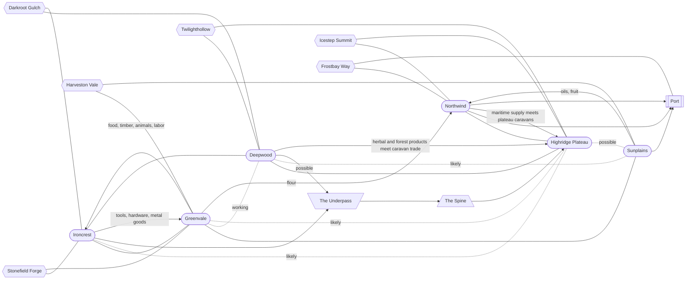

# Atlas Part 1: Regions and Geography

## Status

**Derived view, not canon. Generated; don't edit by hand.** Edit [`regions.json`](regions.json), then run `python3 atlas/tools/atlas_part.py atlas/regions/regions.json` from the repository root. That rebuilds this page, the [interactive view](regions.html) (published copy: https://claude.ai/artifact/XG2oKvVRes6f7su2dyMaWs) and the [image](regions.png). Every thing links to the wiki page it comes from; the wiki wins any disagreement. Part of the [Atlas](../README.md); plan in [PLAN.md](../PLAN.md).

**A board, not a map.** The wiki says the exact map isn't locked ([Geography and Connections](../../wiki/Geography-and-Connections.md)), so the interactive view sorts things into one column per region instead of placing them. Columns are ordered so regions with a settled border sit next to each other (Northwind, Highridge, Deepwood, Ironcrest, Greenvale, Sunplains); nothing else about position means anything. A real map can be drawn from the same data once the geography is locked.

**Counts:** 3 continents, 6 regions, 1 neutral city, 1 mountain system, 1 underground network, 6 border towns, 7 unplaced names; 47 connections (36 stated in the wiki, 11 inferred).

## Gaps this part exposes

Things the wiki doesn't settle yet. Listed for James to decide; nothing here was filled in.

- No named cities inside any of the six regions. Port and the border towns are the only named settlements; every region page describes 'cities' only in general.
- Only one region is placed on a continent (Northwind, Northern Continent). Which regions sit on the Western and Eastern Continents is not stated.
- Port's site and territory are not fixed. The wiki lists conditions its site should meet (convenient to northern and southern sea routes, access to inland rivers or roads) and describes Frostbay Way 'if Port is territorially separate'.
- Five region borders aren't established: Ironcrest–Highridge (likely), Greenvale–Highridge (likely), Deepwood–Sunplains (likely), Highridge–Sunplains (possible), and Greenvale–Deepwood (treated as a direct border unless the map contradicts it). Deepwood–Ironcrest is established as a relationship but only as a 'direct or near-direct' frontier.
- The region pages and Geography and Connections disagree on certainty: the Greenvale and Ironcrest pages state their Highridge borders plainly, while Geography and Connections calls them likely.
- Five region pairs have no border town: Ironcrest–Highridge, Greenvale–Deepwood, Deepwood–Sunplains, Greenvale–Highridge and Highridge–Sunplains.
- The wiki doesn't say which regions the Spine touches (only Highridge is tied to it) or which kingdoms hold Underpass entrances.
- No rivers, passes or Underpass entrances are named (history mentions provisional 'Ridge Pass Toll Wars'). Geography and Connections lists what the finished map should show: rivers, passes, Underpass entrances, caravan roads, seasonal closures, sea routes, old roads, pilgrimage paths, smuggling corridors.
- Directions are thin: Ironcrest west, Northwind north, Sunplains south and east, and Greenvale as 'the eastern agricultural interior' (from Highridge's point of view).
- Border Towns and World Overview carry no status label; the Border Towns page calls its six towns 'established working examples'.
- Seven names sit in the border-town name bank, unplaced.

## Borders

| From | Connection | To | Basis | Supporting text |
| --- | --- | --- | --- | --- |
| Ironcrest | borders | Greenvale | stated, established | “Repeatedly used in border-town discussions. Upland/mineral country grades into productive foothill and lowland agriculture.” [source](../../wiki/Geography-and-Connections.md#ironcrest--greenvale) |
| Greenvale | borders | Sunplains | stated, established | “Repeatedly used. Temperate mixed farmland transitions toward warmer, drier agriculture with orchards, vineyards, irrigation systems, and southern trade.” [source](../../wiki/Geography-and-Connections.md#greenvale--sunplains) |
| Deepwood | borders | Highridge Plateau | stated, established | “Repeatedly used. Forested uplands thin toward exposed plateau routes.” [source](../../wiki/Geography-and-Connections.md#deepwood--highridge) |
| Deepwood | borders (direct or near-direct) | Ironcrest | stated, established | “This implies at least one direct or near-direct frontier, probably where Ironcrest's eastern or southeastern uplands meet a western arm of the forest.” [source](../../wiki/Geography-and-Connections.md#deepwood--ironcrest) |
| Northwind | borders | Highridge Plateau | stated, established | “The cold northern interior/coast transitions toward elevated routes leading into Highridge.” [source](../../wiki/Geography-and-Connections.md#northwind--highridge) Also: “Used repeatedly through Icestep Summit and trade-pass discussions.” [source](../../wiki/Geography-and-Connections.md#northwind--highridge) Also: “inland routes toward Highridge.” [source](../../wiki/Regions/Northwind.md#geography) |
| Ironcrest | borders or corridor | Highridge Plateau | stated, likely | “Likely a meaningful direct border or a very short mountain corridor.” [source](../../wiki/Geography-and-Connections.md#ironcrest--highridge) Also: “The eastern and southeastern edges grade toward Greenvale, Highridge, and parts of Deepwood through foothills, old roads, and forest margins.” [source](../../wiki/Regions/Ironcrest.md#geography) *The Ironcrest page states this plainly; Geography and Connections calls it likely.* |
| Greenvale | borders | Deepwood | stated, working | “Strong ecological logic and repeatedly discussed as field-to-forest transition, including historical encroachment. Treat as a direct border unless the final map contradicts it.” [source](../../wiki/Geography-and-Connections.md#greenvale--deepwood) Also: “Deepwood forest margins” [source](../../wiki/Regions/Greenvale.md#geography) |
| Deepwood | borders | Sunplains | stated, likely | “Likely a southern forest transition into drier woodland and cultivated Sunplains.” [source](../../wiki/Geography-and-Connections.md#deepwood--sunplains) |
| Greenvale | borders | Highridge Plateau | stated, likely | “Likely. Highridge trade must reach the eastern agricultural interior somewhere. The exact length of border is not settled.” [source](../../wiki/Geography-and-Connections.md#greenvale--highridge) Also: “Its boundaries grade into: Ironcrest foothills; Highridge routes; Deepwood forest margins; warmer Sunplains country.” [source](../../wiki/Regions/Greenvale.md#geography) *The Greenvale page states this plainly; Geography and Connections calls it only likely.* |
| Highridge Plateau | borders or corridor | Sunplains | stated, possible | “Possible through southern caravan routes. Could be a direct boundary, a narrow corridor, or mediated through Greenvale/Deepwood. Do not assume until the map is locked.” [source](../../wiki/Geography-and-Connections.md#highridge--sunplains) |

## Border towns

| From | Connection | To | Basis | Supporting text |
| --- | --- | --- | --- | --- |
| Stonefield Forge | border town of | Ironcrest | stated | “Stonefield Forge — Ironcrest / Greenvale” [source](../../wiki/Places/Border-Towns.md#stonefield-forge--ironcrest--greenvale) |
| Stonefield Forge | border town of | Greenvale | stated | “Stonefield Forge — Ironcrest / Greenvale” [source](../../wiki/Places/Border-Towns.md#stonefield-forge--ironcrest--greenvale) |
| Harveston Vale | border town of | Greenvale | stated | “Harveston Vale — Greenvale / Sunplains” [source](../../wiki/Places/Border-Towns.md#harveston-vale--greenvale--sunplains) |
| Harveston Vale | border town of | Sunplains | stated | “Harveston Vale — Greenvale / Sunplains” [source](../../wiki/Places/Border-Towns.md#harveston-vale--greenvale--sunplains) |
| Twilighthollow | border town of | Deepwood | stated | “Twilighthollow — Deepwood / Highridge” [source](../../wiki/Places/Border-Towns.md#twilighthollow--deepwood--highridge) |
| Twilighthollow | border town of | Highridge Plateau | stated | “Twilighthollow — Deepwood / Highridge” [source](../../wiki/Places/Border-Towns.md#twilighthollow--deepwood--highridge) |
| Icestep Summit | border town of | Northwind | stated | “Icestep Summit — Northwind / Highridge” [source](../../wiki/Places/Border-Towns.md#icestep-summit--northwind--highridge) |
| Icestep Summit | border town of | Highridge Plateau | stated | “Icestep Summit — Northwind / Highridge” [source](../../wiki/Places/Border-Towns.md#icestep-summit--northwind--highridge) |
| Darkroot Gulch | border town of | Deepwood | stated | “Darkroot Gulch — Deepwood / Ironcrest” [source](../../wiki/Places/Border-Towns.md#darkroot-gulch--deepwood--ironcrest) |
| Darkroot Gulch | border town of | Ironcrest | stated | “Darkroot Gulch — Deepwood / Ironcrest” [source](../../wiki/Places/Border-Towns.md#darkroot-gulch--deepwood--ironcrest) |
| Frostbay Way | corridor town of | Northwind | stated | “Best treated as a coastal corridor or secondary port rather than a literal kingdom border if Port is territorially separate.” [source](../../wiki/Places/Border-Towns.md#frostbay-way--northwind--port-influence-zone) |
| Frostbay Way | in the influence zone of | Port | stated | “Frostbay Way — Northwind / Port influence zone” [source](../../wiki/Places/Border-Towns.md#frostbay-way--northwind--port-influence-zone) |

## Sea and Port

| From | Connection | To | Basis | Supporting text |
| --- | --- | --- | --- | --- |
| Northwind | major maritime partner of | Port | stated | “Northwind and Sunplains are major maritime partners, but Port belongs to neither.” [source](../../wiki/Geography-and-Connections.md#port) |
| Sunplains | major maritime partner of | Port | stated | “Northwind and Sunplains are major maritime partners, but Port belongs to neither.” [source](../../wiki/Geography-and-Connections.md#port) |
| Northwind | debates convoy agreements with | Port | stated | “debate over convoy agreements with Port.” [source](../../wiki/Regions/Northwind.md#current-pressures) |

## Spine and Underpass

| From | Connection | To | Basis | Supporting text |
| --- | --- | --- | --- | --- |
| The Underpass | runs beneath | The Spine | stated | “Beneath parts of The Spine runs The Underpass.” [source](../../wiki/World-Overview.md#the-world) |
| The Spine | funnels routes into | Highridge Plateau | stated | “Its importance comes from geography: routes that avoid or cross parts of The Spine naturally converge here.” [source](../../wiki/Regions/Highridge-Plateau.md) |
| Ironcrest | presses for access to | The Underpass | stated | “Current pressures: … pressure to expand access to Underpass routes.” [source](../../wiki/Regions/Ironcrest.md#current-pressures) |
| Deepwood | may have entrances to | The Underpass | stated, possible | “routes into foothills and possibly Underpass entrances.” [source](../../wiki/Regions/Deepwood.md#geography) |

## Trade (stated)

| From | Connection | To | Basis | Supporting text |
| --- | --- | --- | --- | --- |
| Greenvale | supplies (food, timber, animals, labor) | Ironcrest | stated | “Industrial settlements in Ironcrest buy food, timber, animals and labor.” [source](../../wiki/Economy/Trade-and-Dependencies.md#ironcrest--greenvale) Also: “Their economic relationship is old: metal, tools, timber, food, animals, fuel, labor, and investment move both ways.” [source](../../wiki/Geography-and-Connections.md#ironcrest--greenvale) |
| Ironcrest | supplies (tools, hardware, metal goods) | Greenvale | stated | “Greenvale farms and workshops buy Ironcrest tools, hardware and metal goods.” [source](../../wiki/Economy/Trade-and-Dependencies.md#ironcrest--greenvale) Also: “Their economic relationship is old: metal, tools, timber, food, animals, fuel, labor, and investment move both ways.” [source](../../wiki/Geography-and-Connections.md#ironcrest--greenvale) |
| Greenvale | supplies (flour) | Northwind | stated | “imported Greenvale flour and Sunplains oils or fruit in wealthier ports.” [source](../../wiki/Regions/Northwind.md#food) |
| Sunplains | supplies (oils, fruit) | Northwind | stated | “imported Greenvale flour and Sunplains oils or fruit in wealthier ports.” [source](../../wiki/Regions/Northwind.md#food) |
| Deepwood | trades with (herbal and forest products meet caravan trade) | Highridge Plateau | stated | “herbal/forest products meeting caravan trade” [source](../../wiki/Places/Border-Towns.md#twilighthollow--deepwood--highridge) |
| Northwind | trades with (maritime supply meets plateau caravans) | Highridge Plateau | stated | “A cold pass town where maritime supply routes meet plateau caravans.” [source](../../wiki/Places/Border-Towns.md#icestep-summit--northwind--highridge) |

## Trade (inferred)

| From | Connection | To | Basis | Supporting text |
| --- | --- | --- | --- | --- |
| Deepwood | likely supplies (timber, fuel) | Ironcrest | inferred | “Ironcrest imports 'timber/fuel'; logging and charcoal are discussed at the Deepwood–Ironcrest frontier. The wiki doesn't name the pair.” [source](../../wiki/Economy/Trade-and-Dependencies.md#core-model) |
| Northwind | likely supplies (preservation salt) | Greenvale | inferred | “Northwind exports 'salt and preserved foods'; Greenvale imports 'preservation salt'. The wiki doesn't name the pair.” [source](../../wiki/Economy/Trade-and-Dependencies.md#core-model) |
| Ironcrest | likely supplies (metal goods) | Northwind | inferred | “Ironcrest exports metalwork and tools; Northwind imports 'metal goods'. The wiki doesn't name the pair.” [source](../../wiki/Economy/Trade-and-Dependencies.md#core-model) |
| Deepwood | likely supplies (medicines) | Northwind | inferred | “Deepwood exports 'herbs/medicinals'; Northwind imports 'medicines'. The wiki doesn't name the pair.” [source](../../wiki/Economy/Trade-and-Dependencies.md#core-model) |
| Ironcrest | likely supplies (metal tools) | Deepwood | inferred | “Deepwood imports 'selected metal tools'; tools are discussed at the Deepwood–Ironcrest frontier.” [source](../../wiki/Economy/Trade-and-Dependencies.md#core-model) |
| Greenvale | likely supplies (grain) | Deepwood | inferred | “Deepwood imports grain; Greenvale exports it. The wiki doesn't name the pair.” [source](../../wiki/Economy/Trade-and-Dependencies.md#core-model) |
| Ironcrest | likely supplies (metal) | Sunplains | inferred | “Sunplains imports 'selected timber, metal, furs and northern goods'. The wiki doesn't name the suppliers.” [source](../../wiki/Economy/Trade-and-Dependencies.md#core-model) |
| Northwind | likely supplies (furs, northern goods) | Sunplains | inferred | “Sunplains imports furs and 'northern goods'; Northwind exports furs. The wiki doesn't name the pair.” [source](../../wiki/Economy/Trade-and-Dependencies.md#core-model) |
| Deepwood | likely supplies (timber) | Sunplains | inferred | “Sunplains imports 'selected timber'; Deepwood exports timber and borders it (likely).” [source](../../wiki/Economy/Trade-and-Dependencies.md#core-model) |
| Northwind | likely supplies (salt) | Deepwood | inferred | “Deepwood imports salt; Northwind exports 'salt and preserved foods'. The wiki doesn't name the pair.” [source](../../wiki/Economy/Trade-and-Dependencies.md#core-model) |
| Highridge Plateau | likely provides (caravan access) | Greenvale | inferred | “Greenvale imports 'shipping and caravan access'; 'Highridge trade must reach the eastern agricultural interior somewhere.'” [source](../../wiki/Geography-and-Connections.md#greenvale--highridge) |

## Continents

| From | Connection | To | Basis | Supporting text |
| --- | --- | --- | --- | --- |
| Northwind | lies on | Northern Continent | stated | “Northwind occupies much of the Northern Continent and associated coasts and islands.” [source](../../wiki/Regions/Northwind.md#geography) |

## Diagram

Positions here are automatic; the [interactive view](regions.html) is easier to read. Solid lines are established borders, dotted are likely or possible; arrows are trade.

## Every thing in this part

| Thing | Kind | Status | Summary |
| --- | --- | --- | --- |
| [Western Continent](../../wiki/Geography-and-Connections.md#macro-geography) | Continent | Working canon | One of three broad landmasses. The wiki does not say which regions sit on it; Ironcrest is described as 'western upland country'. |
| [Northern Continent](../../wiki/Geography-and-Connections.md#macro-geography) | Continent | Working canon | One of three broad landmasses. Northwind 'occupies much of the Northern Continent and associated coasts and islands'. |
| [Eastern Continent](../../wiki/Geography-and-Connections.md#macro-geography) | Continent | Working canon | One of three broad landmasses. The wiki does not say which regions sit on it; Sunplains is 'southern/eastern country'. |
| [Northwind](../../wiki/Regions/Northwind.md) | Region | Working canon | Cold northern coasts, islands, sheltered inland valleys and old clan territories. Settlements cluster at harbors, bays, rivers, fisheries and routes south. |
| [Ironcrest](../../wiki/Regions/Ironcrest.md) | Region | Working canon | Much of the western upland country: mineral-rich hills, stream valleys, wooded slopes, pasture and farmland around old mining and metalworking centers. |
| [Greenvale](../../wiki/Regions/Greenvale.md) | Region | Working canon | The largest major agricultural heartland: broad temperate lowlands with comparatively reliable rainfall and productive soils, market towns, rivers, orchards, wetlands, mills and estates. |
| [Highridge Plateau](../../wiki/Regions/Highridge-Plateau.md) | Region | Working canon | A highland crossroads: routes that avoid or cross parts of the Spine converge here. Exposed uplands, sheltered valleys, steep passes and towns at water and route junctions. |
| [Deepwood](../../wiki/Regions/Deepwood.md) | Region | Working canon | A major forest region: old-growth and managed woodland, river valleys, wetlands, clearings, forest-edge towns, timber districts and restricted areas. |
| [Sunplains](../../wiki/Regions/Sunplains.md) | Region | Working canon | Warmer, drier southern and eastern country of city-states, irrigated basins, orchard belts, grazing country and coast. Water law is politically important. |
| [Port](../../wiki/Places/Port.md) | Neutral city | Working canon | The major neutral commercial city. It matters for its network position and institutions, not as the only harbor. Its exact site isn't fixed; it belongs to no kingdom. |
| [The Spine](../../wiki/Places/The-Spine.md) | Mountain system | Working canon | The central mountain system the world's geography and transport are organized around. Passes, saddles, inhabited valleys, mining districts, old fortifications and hidden routes. Geologically active. |
| [The Underpass](../../wiki/Places/The-Underpass.md) | Underground network | Working canon | Caves, fault passages, tunnels, settlements and trade routes beneath parts of the Spine. Not one road, not wholly mapped; authority is fragmented. |
| [Stonefield Forge](../../wiki/Places/Border-Towns.md#stonefield-forge--ironcrest--greenvale) | Border town | Established working example | Where mineral foothills grade into farmland: mixed farming and craft households, metal repair for farms, labor migration both ways, disputes over water, smoke, timber and land. |
| [Harveston Vale](../../wiki/Places/Border-Towns.md#harveston-vale--greenvale--sunplains) | Border town | Established working example | Where mixed farmland meets orchard and irrigation country: grain plus fruit, mixed water law, festivals built around several harvest calendars. |
| [Twilighthollow](../../wiki/Places/Border-Towns.md#twilighthollow--deepwood--highridge) | Border town | Established working example | Where forest uplands meet plateau routes: herbs meet caravan trade; rangers, traders, herders and guides; disputes over timber, roads and conservation. |
| [Icestep Summit](../../wiki/Places/Border-Towns.md#icestep-summit--northwind--highridge) | Border town | Established working example | A cold pass town where maritime supply routes meet plateau caravans. |
| [Darkroot Gulch](../../wiki/Places/Border-Towns.md#darkroot-gulch--deepwood--ironcrest) | Border town | Established working example | A forested mineral frontier shaped by logging, charcoal, ore, repair and conflict over extraction. |
| [Frostbay Way](../../wiki/Places/Border-Towns.md#frostbay-way--northwind--port-influence-zone) | Border town | Established working example | Best treated as a coastal corridor or secondary port in Port's sphere: Northwind seafaring, Port credit and trade law, ship repair, immigrant merchants, seasonal labor. |
| [Coalglen Meadows](../../wiki/Places/Border-Towns.md#other-provisional-names) | Unplaced name | Provisional name | A name from earlier brainstorming, kept in a name bank until the map and naming systems are finalized. Not placed. |
| [Helios Orchard](../../wiki/Places/Border-Towns.md#other-provisional-names) | Unplaced name | Provisional name | Name bank; not placed. |
| [Snowbreaker Quay](../../wiki/Places/Border-Towns.md#other-provisional-names) | Unplaced name | Provisional name | Name bank; not placed. |
| [Mosspeak Rise](../../wiki/Places/Border-Towns.md#other-provisional-names) | Unplaced name | Provisional name | Name bank; not placed. |
| [Emberhaven Cross](../../wiki/Places/Border-Towns.md#other-provisional-names) | Unplaced name | Provisional name | Name bank; not placed. |
| [Golden Dunes Shore](../../wiki/Places/Border-Towns.md#other-provisional-names) | Unplaced name | Provisional name | Name bank; not placed. |
| [Reedveil Bend](../../wiki/Places/Border-Towns.md#other-provisional-names) | Unplaced name | Provisional name | Name bank; not placed. |

