# Atlas Part 7: The story layer

## Status

**Derived view, not canon. Generated; don't edit by hand.** Edit [`story.json`](story.json), then run `python3 atlas/tools/atlas_part.py` from the repository root. That rebuilds this page, the [image](story.png) of this part, and the [combined board](../board/README.md) (interactive: https://claude.ai/artifact/XG2oKvVRes6f7su2dyMaWs). Every thing links to the wiki page it comes from; the wiki wins any disagreement. Part of the [Atlas](../README.md); plan in [PLAN.md](../PLAN.md).

The main conflict, the current events and how they can ripple into each other, the dominoes, and the Sunday Morning stories on top: what each story sits on, where and when it happens, who is in it, and which stories share a thread.

Current events sit in their region's column (the cross-region ripple steps, the faiths' reading of the crises and the main-conflict cards in a Main conflict column). Each Sunday Morning story and seed sits in the column of its setting, with lines to its town or region, its festival, the events it sits on, its domino figure, its cast from Part 6, and the stories it shares a thread with. The ripple chain from Current Events is drawn step by step and marked possible.

**Counts:** 2 overviews, 21 current events, 13 ripple-chain steps, 7 sunday morning storys, 4 story seeds; 172 connections (162 stated in the wiki, 10 inferred).

## Gaps this part exposes

Things the wiki doesn't settle yet. Listed for James to decide; nothing here was filled in.

- **The ripple chain is one possible chain, not the plot.** Current Events offers thirteen steps as "the kind of causal chain the story should prefer"; every chain link here is marked possible. Where other events feed the final step (Northwind convoys, Naruin's leak, the Sunplains coalition), the link is the Atlas's reading, inferred and off by default. So are links that join two separate entries without a page saying so (Highridge rerouting to Port smuggling, Deepwood's road plans to Naruin's leak, drought to coalition, the faiths to step 8, and Underpass route wars to Port smuggling, which the earlier Domino Map had marked canon). The chain steps have their own cards, so each event card keeps only the causes Current Events gives it.
- **Six current events touch no story yet:** Northwind's fish stocks, Highridge's patron-tied debates, the Spine earthquake, the faiths' reading of the crises, the Underpass route wars (only a seed) and Sunplains drought (only a seed). Of the cross-region chain steps, only Council finance steadying lenders sits behind a story (The Goat File, as ordinary pressure, provisional).
- **Nothing is dated.** The Sunday Morning calendar (Year 1 autumn to Year 2 autumn) is a provisional collection design, and Current Events is a snapshot "shortly before or during the opening movement", not a timeline.
- **Who is behind each nail is provisional.** The Collection's "Behind it" column is an out-of-story attribution that nobody in the stories knows; one land agent is marked unknown, and the Villain's identity and plan remain open questions.
- **Orin has no stated domino,** and **Rosana's strain isn't tied to the abundance crisis on any canon page.** Orin's link to the metal movements is inferred from his strategic value. Current Events says "a new strain, unusually good weather, or both"; only the Sunday Morning collection makes it her seed. That link is inferred here.
- **Two Sunday Morning settings aren't in the wiki.** Kettle Cove and Seven Wells are provisional names used only by their stories, so those stories point at Northwind and Highridge instead of a town.
- **The main saga has no events of its own yet.** Main Conflict gives the three forces, a chapter-chain pattern, an escalation ladder and a possible ending, but no named chapter, battle or turning point; everything on this layer is the world before the saga starts.
- **The Domino Map stays as its own page for now.** Its data is carried into this part; retiring it or regenerating it from the Atlas is James's call.

## Main conflict

| From | Connection | To | Basis | Supporting text |
| --- | --- | --- | --- | --- |
| The main conflict | is driven by | The Villain | stated | “Villain — change through leverage” [source](../../wiki/Story/Main-Conflict.md#villain--change-through-leverage) |
| The main conflict | is countered by | The Economic Council | stated | “Council — stability through control” [source](../../wiki/Story/Main-Conflict.md#council--stability-through-control) |
| The main conflict | is seen through | Wurdren | stated | “Wurdren — humanity through intervention” [source](../../wiki/Story/Main-Conflict.md#wurdren--humanity-through-intervention) |

## Events and the ripple chain

| From | Connection | To | Basis | Supporting text |
| --- | --- | --- | --- | --- |
| 1. Shipping risk rises | is a step within | Piracy rises | stated | “Northwind piracy raises shipping risk.” [source](../../wiki/Story/Current-Events.md#example-ripple-chain) |
| 2. Port credit tightens | is a step within | Merchant conflict | stated | “Port insurance/credit tightens.” [source](../../wiki/Story/Current-Events.md#example-ripple-chain) |
| 4. Grain prices collapse | is a step within | Abundance crisis | stated | “Greenvale grain prices collapse locally.” [source](../../wiki/Story/Current-Events.md#example-ripple-chain) |
| 5. Farmers default | is a step within | Abundance crisis | stated | “farmers default.” [source](../../wiki/Story/Current-Events.md#example-ripple-chain) |
| 7. Consolidators buy farms | is a step within | Land and seed politics | stated | “land consolidators buy distressed farms.” [source](../../wiki/Story/Current-Events.md#example-ripple-chain) |
| 8. Reformers cry theft | is a step within | Land and seed politics | stated | “religious and guild reformers call it coordinated theft.” [source](../../wiki/Story/Current-Events.md#example-ripple-chain) |
| 11. Strike leaders blame owners | is a step within | Labor unrest | stated | “strike leaders blame owners.” [source](../../wiki/Story/Current-Events.md#example-ripple-chain) |
| 1. Shipping risk rises | can lead to | 2. Port credit tightens | stated, possible | “Northwind piracy raises shipping risk. … Port insurance/credit tightens.” [source](../../wiki/Story/Current-Events.md#example-ripple-chain) |
| 2. Port credit tightens | can lead to | 3. Grain purchases cancelled | stated, possible | “Port insurance/credit tightens. … Greenvale merchants cancel distant grain purchases.” [source](../../wiki/Story/Current-Events.md#example-ripple-chain) |
| 3. Grain purchases cancelled | can lead to | 4. Grain prices collapse | stated, possible | “Greenvale merchants cancel distant grain purchases. … Greenvale grain prices collapse locally.” [source](../../wiki/Story/Current-Events.md#example-ripple-chain) |
| 4. Grain prices collapse | can lead to | 5. Farmers default | stated, possible | “Greenvale grain prices collapse locally. … farmers default.” [source](../../wiki/Story/Current-Events.md#example-ripple-chain) |
| 5. Farmers default | can lead to | 6. Council steadies lenders | stated, possible | “farmers default. … Council finance tries to stabilize lenders.” [source](../../wiki/Story/Current-Events.md#example-ripple-chain) |
| 6. Council steadies lenders | can lead to | 7. Consolidators buy farms | stated, possible | “Council finance tries to stabilize lenders. … land consolidators buy distressed farms.” [source](../../wiki/Story/Current-Events.md#example-ripple-chain) |
| 7. Consolidators buy farms | can lead to | 8. Reformers cry theft | stated, possible | “land consolidators buy distressed farms. … religious and guild reformers call it coordinated theft.” [source](../../wiki/Story/Current-Events.md#example-ripple-chain) |
| 8. Reformers cry theft | can lead to | 9. Protests hit tool orders | stated, possible | “religious and guild reformers call it coordinated theft. … protests affect tool orders from Ironcrest.” [source](../../wiki/Story/Current-Events.md#example-ripple-chain) |
| 9. Protests hit tool orders | can lead to | 10. Workshops cut hours | stated, possible | “protests affect tool orders from Ironcrest. … Ironcrest workshops reduce hours.” [source](../../wiki/Story/Current-Events.md#example-ripple-chain) |
| 10. Workshops cut hours | can lead to | 11. Strike leaders blame owners | stated, possible | “Ironcrest workshops reduce hours. … strike leaders blame owners.” [source](../../wiki/Story/Current-Events.md#example-ripple-chain) |
| 11. Strike leaders blame owners | can lead to | 12. Villain amplifies Council involvement | stated, possible | “strike leaders blame owners. … Villain agents amplify evidence of Council involvement.” [source](../../wiki/Story/Current-Events.md#example-ripple-chain) |
| 12. Villain amplifies Council involvement | can lead to | 13. Shocks read as proof of enemies | stated, possible | “Villain agents amplify evidence of Council involvement. … a local economic shock becomes proof, in several regions, that another group is acting against them.” [source](../../wiki/Story/Current-Events.md#example-ripple-chain) |
| Piracy rises | can lead to | Convoy politics | stated | “Raids are increasing. … A response that looks purely defensive to Northwind” [source](../../wiki/Story/Current-Events.md#piracy-and-convoy-politics) |
| Caravan attacks | can lead to | Trade redirected | stated | “Attacks and disappearances make some routes seem unreliable. … Trade is redirected.” [source](../../wiki/Story/Current-Events.md#caravan-attacks) |
| Earthquake or land movement | can lead to | Underpass route wars | stated | “Underpass instability … Collapse and discovery have changed which enclaves control profitable corridors.” [source](../../wiki/Story/Current-Events.md#earthquakeland-movement) |
| Abundance crisis | can lead to | Land and seed politics | stated, possible | “poorer farmers cannot cover debts … Large interests attempt to acquire distressed farms.” [source](../../wiki/Story/Current-Events.md#greenvale) |
| 6. Council steadies lenders | is an action of | The Economic Council | stated | “Council finance tries to stabilize lenders.” [source](../../wiki/Story/Current-Events.md#example-ripple-chain) |
| 12. Villain amplifies Council involvement | is an action of | The Villain | stated | “Villain agents amplify evidence of Council involvement.” [source](../../wiki/Story/Current-Events.md#example-ripple-chain) |
| Faiths read the crises | includes | The Illuminated Circle | stated | “Illuminated scholars compare records” [source](../../wiki/Story/Current-Events.md#religious-networks) |
| Faiths read the crises | includes | Path of the Great Weaver | stated | “Weaver communities document ecological damage” [source](../../wiki/Story/Current-Events.md#religious-networks) |
| Faiths read the crises | includes | The Infinite Compass | stated | “Compass pilgrims carry rumors” [source](../../wiki/Story/Current-Events.md#religious-networks) |
| Faiths read the crises | includes | The Harmonious Path | stated | “Harmonious mediators build alternative dispute systems” [source](../../wiki/Story/Current-Events.md#religious-networks) |
| Faiths read the crises | includes | The Dual Flame | stated | “Dual Flame counselors notice patterns of radicalization” [source](../../wiki/Story/Current-Events.md#religious-networks) |

## Dominoes tipping events

| From | Connection | To | Basis | Supporting text |
| --- | --- | --- | --- | --- |
| Maris Bleakshore | tips | Convoy politics | stated | “Northwind patrol changes are interpreted elsewhere as aggression.” [source](../../wiki/Story/Villains-Dominoes.md#maris-bleakshore--northwind) |
| Rosana Meadowcroft | tips | Land and seed politics | stated | “an agricultural innovation becomes a political fight over control.” [source](../../wiki/Story/Villains-Dominoes.md#rosana-meadowcroft--greenvale) |
| Samir Tareh | tips | Trade redirected | stated | “"safe" trade concentration makes one route strategically vulnerable and impoverishes another.” [source](../../wiki/Story/Villains-Dominoes.md#samir-tareh--highridge) |
| Naruin Mossglade | tips | Plans leak; wardens prepare | stated | “a local conservation dispute becomes an inter-regional sovereignty crisis.” [source](../../wiki/Story/Villains-Dominoes.md#naruin-mossglade--deepwood) |
| Bahriyya Nazar | tips | City-state coordination | stated | “a peace/reform coalition becomes the apparent military/economic threat that justifies counter-alliances.” [source](../../wiki/Story/Villains-Dominoes.md#bahriyya-nazar--sunplains) |

## Stories on the web

| From | Connection | To | Basis | Supporting text |
| --- | --- | --- | --- | --- |
| One Square, Two Harvests | is set in | Harveston Vale | stated | “Setting: … Harveston Vale” [source](../../wiki/Sunday-Morning/Stories/One-Square-Two-Harvests.md#premise) |
| One Square, Two Harvests | runs up to | Harvest Home | stated | “Harvest Home and Wine Crush” [source](../../wiki/Sunday-Morning/Stories/One-Square-Two-Harvests.md#premise) |
| One Square, Two Harvests | runs up to | Wine Crush | stated | “Harvest Home and Wine Crush” [source](../../wiki/Sunday-Morning/Stories/One-Square-Two-Harvests.md#premise) |
| One Square, Two Harvests | sits on | Abundance crisis | stated | “Greenvale abundance crisis; unsafe-grain rumors; land consolidation” [source](../../wiki/Sunday-Morning/Notes/Collection.md#the-threads) |
| One Square, Two Harvests | sits on | Land and seed politics | stated | “Greenvale abundance crisis; unsafe-grain rumors; land consolidation” [source](../../wiki/Sunday-Morning/Notes/Collection.md#the-threads) |
| One Square, Two Harvests | touches the domino of | Rosana Meadowcroft | stated | “(her seed strain)” [source](../../wiki/Sunday-Morning/Notes/Collection.md#the-threads) |
| The Greenvale Man | is set in | Northwind | stated | “Kettle Cove, a small … fishing town (provisional name)” [source](../../wiki/Sunday-Morning/Stories/The-Greenvale-Man.md#premise) |
| The Greenvale Man | runs up to | Last Sail | stated | “Last Sail” [source](../../wiki/Sunday-Morning/Stories/The-Greenvale-Man.md#premise) |
| The Greenvale Man | sits on | Piracy rises | stated | “Northwind piracy; accusations that clans shelter raiders; convoy politics” [source](../../wiki/Sunday-Morning/Notes/Collection.md#the-threads) |
| The Greenvale Man | sits on | Convoy politics | stated | “Northwind piracy; accusations that clans shelter raiders; convoy politics” [source](../../wiki/Sunday-Morning/Notes/Collection.md#the-threads) |
| The Greenvale Man | touches the domino of | Maris Bleakshore | stated | “(her call for convoy patrols)” [source](../../wiki/Sunday-Morning/Notes/Collection.md#the-threads) |
| The Goat File | is set in | Highridge Plateau | stated | “Seven Wells, a … pass town (provisional name)” [source](../../wiki/Sunday-Morning/Stories/The-Goat-File.md#premise) |
| The Goat File | runs up to | Ledger Closing | stated | “Ledger Closing” [source](../../wiki/Sunday-Morning/Stories/The-Goat-File.md#premise) |
| The Goat File | sits on | 2. Port credit tightens | stated | “Port credit tightening; Highridge caravan attacks cutting trade” [source](../../wiki/Sunday-Morning/Notes/Collection.md#the-threads) |
| The Goat File | sits on | Caravan attacks | stated | “Port credit tightening; Highridge caravan attacks cutting trade” [source](../../wiki/Sunday-Morning/Notes/Collection.md#the-threads) |
| Inspected, Not Guaranteed | is set in | Stonefield Forge | stated | “Setting: … Stonefield Forge” [source](../../wiki/Sunday-Morning/Stories/Inspected-Not-Guaranteed.md#premise) |
| Inspected, Not Guaranteed | runs up to | Forge Reawakening | stated | “Forge Reawakening” [source](../../wiki/Sunday-Morning/Stories/Inspected-Not-Guaranteed.md#premise) |
| Inspected, Not Guaranteed | sits on | 9. Protests hit tool orders | stated | “Tool orders fall; forges on short hours; strike talk; good steel vanishing into private contracts” [source](../../wiki/Sunday-Morning/Notes/Collection.md#the-threads) |
| Inspected, Not Guaranteed | sits on | 10. Workshops cut hours | stated | “Tool orders fall; forges on short hours; strike talk; good steel vanishing into private contracts” [source](../../wiki/Sunday-Morning/Notes/Collection.md#the-threads) |
| Inspected, Not Guaranteed | sits on | Labor unrest | stated | “Tool orders fall; forges on short hours; strike talk; good steel vanishing into private contracts” [source](../../wiki/Sunday-Morning/Notes/Collection.md#the-threads) |
| Inspected, Not Guaranteed | sits on | Unusual metal movements | stated | “Tool orders fall; forges on short hours; strike talk; good steel vanishing into private contracts” [source](../../wiki/Sunday-Morning/Notes/Collection.md#the-threads) |
| Inspected, Not Guaranteed | touches the domino of | Orin Slatehallow | stated | “(the pattern Col nearly follows)” [source](../../wiki/Sunday-Morning/Notes/Collection.md#the-threads) |
| The Heavy Scale at Icestep Summit | is set in | Icestep Summit | stated | “Setting: … Icestep Summit” [source](../../wiki/Sunday-Morning/Stories/The-Heavy-Scale.md#premise) |
| The Heavy Scale at Icestep Summit | runs up to | Pass Opening | stated | “Pass Opening and Ice Breaking” [source](../../wiki/Sunday-Morning/Stories/The-Heavy-Scale.md#premise) |
| The Heavy Scale at Icestep Summit | runs up to | Ice Breaking | stated | “Pass Opening and Ice Breaking” [source](../../wiki/Sunday-Morning/Stories/The-Heavy-Scale.md#premise) |
| The Heavy Scale at Icestep Summit | sits on | Caravan attacks | stated | “Caravan attacks; route redirection” [source](../../wiki/Sunday-Morning/Notes/Collection.md#the-threads) |
| The Heavy Scale at Icestep Summit | sits on | Trade redirected | stated | “Caravan attacks; route redirection” [source](../../wiki/Sunday-Morning/Notes/Collection.md#the-threads) |
| The Heavy Scale at Icestep Summit | touches the domino of | Samir Tareh | stated | “(travels with the first caravan)” [source](../../wiki/Sunday-Morning/Notes/Collection.md#the-threads) |
| The Tree With a Debt | is set in | Twilighthollow | stated | “Setting: … Twilighthollow” [source](../../wiki/Sunday-Morning/Stories/The-Tree-With-a-Debt.md#premise) |
| The Tree With a Debt | runs up to | Canopy Vigil | stated | “Canopy Vigil and Midsummer Debates” [source](../../wiki/Sunday-Morning/Stories/The-Tree-With-a-Debt.md#premise) |
| The Tree With a Debt | runs up to | Midsummer Debates | stated | “Canopy Vigil and Midsummer Debates” [source](../../wiki/Sunday-Morning/Stories/The-Tree-With-a-Debt.md#premise) |
| The Tree With a Debt | sits on | Logging and road conflict | stated | “Deepwood road and logging conflict; Council infrastructure interest” [source](../../wiki/Sunday-Morning/Notes/Collection.md#the-threads) |
| The Tree With a Debt | touches the domino of | Naruin Mossglade | stated | “(Sessa's senior warden)” [source](../../wiki/Sunday-Morning/Notes/Collection.md#the-threads) |
| Three Pots at Three Moon | is set in | Port | stated | “one Port neighborhood” [source](../../wiki/Sunday-Morning/Stories/Three-Pots-at-Three-Moon.md#premise) |
| Three Pots at Three Moon | runs up to | Three Moon Festival | stated | “Three Moon Festival” [source](../../wiki/Sunday-Morning/Stories/Three-Pots-at-Three-Moon.md#premise) |
| Three Pots at Three Moon | sits on | Refugee and worker pressure | stated | “Refugee and worker pressure; smuggling surge; Deepwood fungal disruption” [source](../../wiki/Sunday-Morning/Notes/Collection.md#the-threads) |
| Three Pots at Three Moon | sits on | Smuggling surge | stated | “Refugee and worker pressure; smuggling surge; Deepwood fungal disruption” [source](../../wiki/Sunday-Morning/Notes/Collection.md#the-threads) |
| Three Pots at Three Moon | sits on | Fungal or ecological disruption | stated | “Refugee and worker pressure; smuggling surge; Deepwood fungal disruption” [source](../../wiki/Sunday-Morning/Notes/Collection.md#the-threads) |
| One Square, Two Harvests | may later feed | City-state coordination | stated, possible | “a precedent rivals could later read as a bloc forming” [source](../../wiki/Sunday-Morning/Notes/Collection.md#the-threads) |
| One Square, Two Harvests | shares a thread with | The Greenvale Man | stated | “grain sacks stamped” [source](../../wiki/Sunday-Morning/Notes/Collection.md#cross-story-promise-ledger) |
| One Square, Two Harvests | shares a thread with | The Greenvale Man | stated | “the old builder's letter” [source](../../wiki/Sunday-Morning/Notes/Collection.md#cross-story-promise-ledger) |
| One Square, Two Harvests | shares a thread with | Three Pots at Three Moon | stated | “the polite land agent” [source](../../wiki/Sunday-Morning/Notes/Collection.md#cross-story-promise-ledger) |
| The Goat File | shares a thread with | The Heavy Scale at Icestep Summit | stated | “Samir Tareh | The Goat File, s8” [source](../../wiki/Sunday-Morning/Notes/Collection.md#cross-story-promise-ledger) |
| The Heavy Scale at Icestep Summit | shares a thread with | Three Pots at Three Moon | stated | “the Deepwood caravan cook, Garro Sedgewater” [source](../../wiki/Sunday-Morning/Notes/Collection.md#cross-story-promise-ledger) |
| Inspected, Not Guaranteed | shares a thread with | The Tree With a Debt | stated | “the connected offers” [source](../../wiki/Sunday-Morning/Notes/Collection.md#cross-story-promise-ledger) |
| The Mushrooms From Nowhere | is set in | The Underpass | stated | “The Underpass” [source](../../wiki/Sunday-Morning/Stories/Story-Seeds.md#the-mushrooms-from-nowhere) |
| The Mushrooms From Nowhere | is set in | Highridge Plateau | stated | “a Highridge caravan fair” [source](../../wiki/Sunday-Morning/Stories/Story-Seeds.md#the-mushrooms-from-nowhere) |
| The Mushrooms From Nowhere | would sit on | Underpass route wars | stated, possible | “collapses have redirected” [source](../../wiki/Sunday-Morning/Stories/Story-Seeds.md#the-mushrooms-from-nowhere) |
| The Bathhouse Compact | is set in | Darkroot Gulch | stated | “Darkroot Gulch” [source](../../wiki/Sunday-Morning/Stories/Story-Seeds.md#the-bathhouse-compact) |
| The Bathhouse Compact | would sit on | Unusual metal movements | stated, possible | “good metal is vanishing into private contracts” [source](../../wiki/Sunday-Morning/Stories/Story-Seeds.md#the-bathhouse-compact) |
| The Ladder Rules | is set in | Sunplains | stated | “Sunplains” [source](../../wiki/Sunday-Morning/Stories/Story-Seeds.md#the-ladder-rules) |
| The Ladder Rules | runs up to | Solstice Lanterns | stated | “Solstice Lanterns, midwinter” [source](../../wiki/Sunday-Morning/Stories/Story-Seeds.md#the-ladder-rules) |
| The Ladder Rules | would sit on | Drought anxiety | stated, possible | “drought anxiety and city-state coordination” [source](../../wiki/Sunday-Morning/Stories/Story-Seeds.md#the-ladder-rules) |
| The Ladder Rules | would sit on | City-state coordination | stated, possible | “drought anxiety and city-state coordination” [source](../../wiki/Sunday-Morning/Stories/Story-Seeds.md#the-ladder-rules) |
| The Talker | is set in | Deepwood | stated | “Deepwood” [source](../../wiki/Sunday-Morning/Stories/Story-Seeds.md#the-talker) |
| The Talker | runs up to | Deep Silence | stated | “Deep Silence, midwinter” [source](../../wiki/Sunday-Morning/Stories/Story-Seeds.md#the-talker) |
| The Talker | would sit on | Fungal or ecological disruption | stated, possible | “fungal disruption” [source](../../wiki/Sunday-Morning/Stories/Story-Seeds.md#the-talker) |
| The Ladder Rules | would touch | Bahriyya Nazar | stated, possible | “a rival city reads the lamplighters' deal as a sign of Bahriyya Nazar's coalition” [source](../../wiki/Sunday-Morning/Stories/Story-Seeds.md#the-ladder-rules) |

## Who appears where

| From | Connection | To | Basis | Supporting text |
| --- | --- | --- | --- | --- |
| Pell Anwick | appears in | One Square, Two Harvests | stated | “One Square | Pell Anwick | retired water arbiter” [source](../../wiki/Sunday-Morning/Notes/Registry.md#names) |
| Bettany Corlew | appears in | One Square, Two Harvests | stated | “One Square | Bettany Corlew | Harvest Home chair” [source](../../wiki/Sunday-Morning/Notes/Registry.md#names) |
| Idris Salve | appears in | One Square, Two Harvests | stated | “One Square | Idris Salve | Salve heir, runs the Crush” [source](../../wiki/Sunday-Morning/Notes/Registry.md#names) |
| Hobb | appears in | One Square, Two Harvests | stated | “One Square | Hobb | miller” [source](../../wiki/Sunday-Morning/Notes/Registry.md#names) |
| Aurel | appears in | One Square, Two Harvests | stated | “One Square | Aurel | canal gatekeeper” [source](../../wiki/Sunday-Morning/Notes/Registry.md#names) |
| Lissa | appears in | One Square, Two Harvests | stated | “One Square | Lissa | Pell's granddaughter” [source](../../wiki/Sunday-Morning/Notes/Registry.md#names) |
| Mattie Scarth | appears in | One Square, Two Harvests | stated | “One Square | Mattie Scarth | old Scarth's son (mentioned)” [source](../../wiki/Sunday-Morning/Notes/Registry.md#names) |
| Thistle | appears in | One Square, Two Harvests | stated | “One Square | Thistle | farm family (mentioned)” [source](../../wiki/Sunday-Morning/Notes/Registry.md#names) |
| Upcott | appears in | One Square, Two Harvests | stated | “One Square | Upcott | farm family (mentioned)” [source](../../wiki/Sunday-Morning/Notes/Registry.md#names) |
| Bray | appears in | One Square, Two Harvests | stated | “One Square | Bray | farm family (mentioned)” [source](../../wiki/Sunday-Morning/Notes/Registry.md#names) |
| Aldo Fenwright | appears in | The Greenvale Man | stated | “Greenvale Man | Aldo Fenwright | cooper” [source](../../wiki/Sunday-Morning/Notes/Registry.md#names) |
| Hild Fenwright | appears in | The Greenvale Man | stated | “Greenvale Man | Hild Fenwright | net-mender, Aldo's wife” [source](../../wiki/Sunday-Morning/Notes/Registry.md#names) |
| Brenna Scarth | appears in | The Greenvale Man | stated | “Greenvale Man | Brenna Scarth | sailor, builder's daughter” [source](../../wiki/Sunday-Morning/Notes/Registry.md#names) |
| Rask | appears in | The Greenvale Man | stated | “Greenvale Man | Rask | clan elder” [source](../../wiki/Sunday-Morning/Notes/Registry.md#names) |
| Sigra Ulfsen | appears in | The Greenvale Man | stated | “Greenvale Man | Sigra Ulfsen | Narrow Sound rower” [source](../../wiki/Sunday-Morning/Notes/Registry.md#names) |
| Scarth | appears in | The Greenvale Man | stated | “Greenvale Man | Scarth | retired boatbuilder (letters; appears in One Square)” [source](../../wiki/Sunday-Morning/Notes/Registry.md#names) |
| Maris Bleakshore | appears in | The Greenvale Man | stated | “Greenvale Man | Maris Bleakshore | Northwind domino figure” [source](../../wiki/Sunday-Morning/Notes/Registry.md#names) |
| Wen Ostry | appears in | The Goat File | stated | “Goat File | Wen Ostry | junior arbitration clerk” [source](../../wiki/Sunday-Morning/Notes/Registry.md#names) |
| Ebbe Tarrow | appears in | The Goat File | stated | “Goat File | Ebbe Tarrow | caravan house elder” [source](../../wiki/Sunday-Morning/Notes/Registry.md#names) |
| Mardin Kesh | appears in | The Goat File | stated | “Goat File | Mardin Kesh | cistern house elder” [source](../../wiki/Sunday-Morning/Notes/Registry.md#names) |
| Lio Tarrow | appears in | The Goat File | stated | “Goat File | Lio Tarrow | Ebbe's grandson” [source](../../wiki/Sunday-Morning/Notes/Registry.md#names) |
| Nessa Kesh | appears in | The Goat File | stated | “Goat File | Nessa Kesh | Mardin's granddaughter” [source](../../wiki/Sunday-Morning/Notes/Registry.md#names) |
| Oriel | appears in | The Goat File | stated | “Goat File | Oriel | archive custodian” [source](../../wiki/Sunday-Morning/Notes/Registry.md#names) |
| Hanne Tarrow | appears in | The Goat File | stated | “Goat File | Hanne Tarrow | Ebbe's mother (memo)” [source](../../wiki/Sunday-Morning/Notes/Registry.md#names) |
| Dalia Kesh | appears in | The Goat File | stated | “Goat File | Dalia Kesh | Mardin's mother (memo)” [source](../../wiki/Sunday-Morning/Notes/Registry.md#names) |
| Samir Tareh | appears in | The Goat File | stated | “Goat File | Samir Tareh | caravan negotiator” [source](../../wiki/Sunday-Morning/Notes/Registry.md#names) |
| Wurdren | appears in | Inspected, Not Guaranteed | stated | “Inspected | Wurdren | protagonist of the saga” [source](../../wiki/Sunday-Morning/Notes/Registry.md#names) |
| Tamsin Rake | appears in | Inspected, Not Guaranteed | stated | “Inspected | Tamsin Rake | smith” [source](../../wiki/Sunday-Morning/Notes/Registry.md#names) |
| Col Barrowfield | appears in | Inspected, Not Guaranteed | stated | “Inspected | Col Barrowfield | apprentice” [source](../../wiki/Sunday-Morning/Notes/Registry.md#names) |
| Kerra Dunnock | appears in | Inspected, Not Guaranteed | stated | “Inspected | Kerra Dunnock | apprentice” [source](../../wiki/Sunday-Morning/Notes/Registry.md#names) |
| Oswin Vey | appears in | Inspected, Not Guaranteed | stated | “Inspected | Oswin Vey | guildmaster” [source](../../wiki/Sunday-Morning/Notes/Registry.md#names) |
| Nell Haskett | appears in | Inspected, Not Guaranteed | stated | “Inspected | Nell Haskett | farmer, census-taker” [source](../../wiki/Sunday-Morning/Notes/Registry.md#names) |
| Orin Slatehallow | appears in | Inspected, Not Guaranteed | stated | “Inspected | Orin Slatehallow | Ironcrest domino figure (gossip)” [source](../../wiki/Sunday-Morning/Notes/Registry.md#names) |
| Anselm Quill | appears in | The Heavy Scale at Icestep Summit | stated | “Heavy Scale | Anselm Quill | weigher” [source](../../wiki/Sunday-Morning/Notes/Registry.md#names) |
| Brisa Zell | appears in | The Heavy Scale at Icestep Summit | stated | “Heavy Scale | Brisa Zell | innkeeper” [source](../../wiki/Sunday-Morning/Notes/Registry.md#names) |
| Tove Askell | appears in | The Heavy Scale at Icestep Summit | stated | “Heavy Scale | Tove Askell | salt-fish trader” [source](../../wiki/Sunday-Morning/Notes/Registry.md#names) |
| Dorran Pike | appears in | The Heavy Scale at Icestep Summit | stated | “Heavy Scale | Dorran Pike | customs chief” [source](../../wiki/Sunday-Morning/Notes/Registry.md#names) |
| Grell | appears in | The Heavy Scale at Icestep Summit | stated | “Heavy Scale | Grell | repair smith” [source](../../wiki/Sunday-Morning/Notes/Registry.md#names) |
| Maudie Vance | appears in | The Heavy Scale at Icestep Summit | stated | “Heavy Scale | Maudie Vance | shrine keeper” [source](../../wiki/Sunday-Morning/Notes/Registry.md#names) |
| Garro Sedgewater | appears in | The Heavy Scale at Icestep Summit | stated | “Heavy Scale | Garro Sedgewater | caravan cook (also Three Pots)” [source](../../wiki/Sunday-Morning/Notes/Registry.md#names) |
| Sessa Yewbrook | appears in | The Tree With a Debt | stated | “Tree | Sessa Yewbrook | forest warden” [source](../../wiki/Sunday-Morning/Notes/Registry.md#names) |
| Ismet Carrow | appears in | The Tree With a Debt | stated | “Tree | Ismet Carrow | route surveyor” [source](../../wiki/Sunday-Morning/Notes/Registry.md#names) |
| Hollis Varne | appears in | The Tree With a Debt | stated | “Tree | Hollis Varne | lender's grandson” [source](../../wiki/Sunday-Morning/Notes/Registry.md#names) |
| Pip | appears in | The Tree With a Debt | stated | “Tree | Pip | child who climbs the tree” [source](../../wiki/Sunday-Morning/Notes/Registry.md#names) |
| Contract | appears in | The Tree With a Debt | stated | “Tree | Contract | mule” [source](../../wiki/Sunday-Morning/Notes/Registry.md#names) |
| Naruin Mossglade | appears in | The Tree With a Debt | stated | “Tree | Naruin Mossglade | Deepwood domino figure (offstage)” [source](../../wiki/Sunday-Morning/Notes/Registry.md#names) |
| Jory | appears in | Three Pots at Three Moon | stated | “Three Pots | Jory | court interpreter” [source](../../wiki/Sunday-Morning/Notes/Registry.md#names) |
| Mother Seral | appears in | Three Pots at Three Moon | stated | “Three Pots | Mother Seral | grandmother” [source](../../wiki/Sunday-Morning/Notes/Registry.md#names) |
| Tobiah | appears in | Three Pots at Three Moon | stated | “Three Pots | Tobiah | eldest grandchild” [source](../../wiki/Sunday-Morning/Notes/Registry.md#names) |
| Ines | appears in | Three Pots at Three Moon | stated | “Three Pots | Ines | grandchild” [source](../../wiki/Sunday-Morning/Notes/Registry.md#names) |
| Amaranth Doss | appears in | Three Pots at Three Moon | stated | “Three Pots | Amaranth Doss | permit clerk” [source](../../wiki/Sunday-Morning/Notes/Registry.md#names) |
| Halloran | appears in | Three Pots at Three Moon | stated | “Three Pots | Halloran | market inspector” [source](../../wiki/Sunday-Morning/Notes/Registry.md#names) |
| Mrs. Arden | appears in | Three Pots at Three Moon | stated | “Three Pots | Mrs. Arden | Greenvale newcomer” [source](../../wiki/Sunday-Morning/Notes/Registry.md#names) |
| Samir Tareh | appears in | The Heavy Scale at Icestep Summit | stated | “Samir Tareh** — a Highridge caravan negotiator who rides with the first caravan of the year.” [source](../../wiki/Sunday-Morning/Stories/The-Heavy-Scale.md#cast) |
| Garro Sedgewater | appears in | Three Pots at Three Moon | stated | “Garro Sedgewater | caravan cook (also Three Pots)” [source](../../wiki/Sunday-Morning/Notes/Registry.md#names) |
| Scarth | appears in | One Square, Two Harvests | stated | “retired boatbuilder (letters; appears in One Square)” [source](../../wiki/Sunday-Morning/Notes/Registry.md#names) |

## Who's behind each nail (provisional)

| From | Connection | To | Basis | Supporting text |
| --- | --- | --- | --- | --- |
| One Square, Two Harvests | may have behind it | The Villain | stated, possible | “Rumor: Villain-amplified.” [source](../../wiki/Sunday-Morning/Notes/Collection.md#the-threads) |
| The Greenvale Man | may have behind it | The Villain | stated, possible | “Villain-amplified rumor” [source](../../wiki/Sunday-Morning/Notes/Collection.md#the-threads) |
| Inspected, Not Guaranteed | may have behind it | The Villain | stated, possible | “Villain (provisional): the same approach that took Orin” [source](../../wiki/Sunday-Morning/Notes/Collection.md#the-threads) |
| The Heavy Scale at Icestep Summit | may have behind it | The Villain | stated, possible | “the concentration pressure is the Villain's pattern” [source](../../wiki/Sunday-Morning/Notes/Collection.md#the-threads) |
| The Tree With a Debt | may have behind it | The Villain | stated, possible | “The Villain, through a Port intermediary” [source](../../wiki/Sunday-Morning/Notes/Collection.md#the-threads) |
| The Tree With a Debt | may have behind it | Plans leak; wardens prepare | stated, possible | “The pledges are meant to become leaked evidence for Naruin” [source](../../wiki/Sunday-Morning/Notes/Collection.md#the-threads) |
| The Goat File | may have behind it | 6. Council steadies lenders | stated, possible | “Council finance stabilizing lenders (ordinary pressure, not a scheme)” [source](../../wiki/Sunday-Morning/Notes/Collection.md#the-threads) |

## Sunday Morning shortcuts (not canon)

| From | Connection | To | Basis | Supporting text |
| --- | --- | --- | --- | --- |
| 5. Farmers default | leads to (in the Sunday Morning stories) | 9. Protests hit tool orders | stated | “Greenvale farms hit by last autumn's grain collapse stopped ordering new tools” [source](../../wiki/Sunday-Morning/Stories/Inspected-Not-Guaranteed.md#place) |
| Fungal or ecological disruption | leads to (in the Sunday Morning stories) | Refugee and worker pressure | stated | “on the caravans since a fungal blight took his village's mushroom harvest” [source](../../wiki/Sunday-Morning/Stories/Three-Pots-at-Three-Moon.md#cast) |
| Land and seed politics | leads to (in the Sunday Morning stories) | Refugee and worker pressure | stated | “newly arrived from a Greenvale farm they had to sell to a land agent last year” [source](../../wiki/Sunday-Morning/Stories/Three-Pots-at-Three-Moon.md#cast) |

## Story links (inferred)

| From | Connection | To | Basis | Supporting text |
| --- | --- | --- | --- | --- |
| Trade redirected | probably feeds | Smuggling surge | inferred | “Highridge trade "is redirected" (Current Events, Caravan attacks); Port's smuggling surge comes from "higher prices and route disruption" (Smuggling surge). The page doesn't say which routes.” [source](../../wiki/Story/Current-Events.md#smuggling-surge) |
| Logging and road conflict | probably feeds | Plans leak; wardens prepare | inferred | “Deepwood's road and extraction proposals (Current Events) and the leak of "real Council-backed expansion plans" in Naruin's domino (Villain's Dominoes) look like the same plans, but neither page says so.” [source](../../wiki/Story/Villains-Dominoes.md#naruin-mossglade--deepwood) |
| Drought anxiety | probably feeds | City-state coordination | inferred | “Drought fear drives "secret agreements" and some leaders "are trying to cooperate" (Current Events); Bahriyya coordinates city-states "around water/trade" (Villain's Dominoes). The page doesn't join the two entries.” [source](../../wiki/Story/Current-Events.md#sunplains) |
| Faiths read the crises | probably feeds | 8. Reformers cry theft | inferred | “Step 8's "religious and guild reformers" and the faiths reading the crises trans-regionally are on the same page, but the page doesn't say which faiths the reformers belong to.” [source](../../wiki/Story/Current-Events.md#example-ripple-chain) |
| Convoy politics | probably feeds | 13. Shocks read as proof of enemies | inferred | “Northwind's defensive response "can look like maritime militarization to Sunplains or Port merchants" (Current Events); the Atlas reads that as one of the shocks taken as proof of enemies (chain step 13). No page joins them.” [source](../../wiki/Story/Current-Events.md#piracy-and-convoy-politics) |
| Plans leak; wardens prepare | probably feeds | 13. Shocks read as proof of enemies | inferred | “Naruin's domino turns "a local conservation dispute" into "an inter-regional sovereignty crisis" (Villain's Dominoes); the Atlas reads that as feeding chain step 13. No page joins them.” [source](../../wiki/Story/Villains-Dominoes.md#naruin-mossglade--deepwood) |
| City-state coordination | probably feeds | 13. Shocks read as proof of enemies | inferred | “Rivals read the coalition as "the beginning of a dominant bloc" (Current Events), which "justifies counter-alliances" (Villain's Dominoes); the Atlas reads that as feeding chain step 13. No page joins them.” [source](../../wiki/Story/Current-Events.md#city-state-coordination) |
| Underpass route wars | probably feeds | Smuggling surge | inferred | “Underpass smuggling competes with legitimate trade for corridors (Current Events); the Atlas links it to Port's smuggling surge. No page joins them.” [source](../../wiki/Story/Current-Events.md#route-wars) |
| Orin Slatehallow | probably touches | Unusual metal movements | inferred | “Orin has no stated domino; his strategic value is "access to production networks and information about strategic metal supply" (Villain's Dominoes), and good metal is vanishing into private contracts (Current Events). Neither page joins them.” [source](../../wiki/Story/Villains-Dominoes.md#orin-slatehallow--ironcrest) |
| Rosana Meadowcroft | probably drives | Abundance crisis | inferred | “Rosana works on crop resilience and her work changes expectations about harvest (Villain's Dominoes); the abundance crisis comes from "a new strain, unusually good weather, or both" (Current Events). Neither page says the strain is hers; the Sunday Morning collection does.” [source](../../wiki/Story/Villains-Dominoes.md#rosana-meadowcroft--greenvale) |

## Diagram

Stated connections only; positions are automatic. The [interactive board](../board/README.md) is easier to read.

```mermaid
flowchart LR
  st_main["The main conflict"]
  pp_villain["The Villain"]
  pw_council["The Economic Council"]
  pp_wurdren["Wurdren"]
  st_c1["1. Shipping risk rises"]
  st_nw_piracy["Piracy rises"]
  st_c2["2. Port credit tightens"]
  st_pt_merchant["Merchant conflict"]
  st_c4["4. Grain prices collapse"]
  st_gv_abundance["Abundance crisis"]
  st_c5["5. Farmers default"]
  st_c7["7. Consolidators buy farms"]
  st_gv_land["Land and seed politics"]
  st_c8["8. Reformers cry theft"]
  st_c11["11. Strike leaders blame owners"]
  st_ic_labor["Labor unrest"]
  st_c3["3. Grain purchases cancelled"]
  st_c6["6. Council steadies lenders"]
  st_c9["9. Protests hit tool orders"]
  st_c10["10. Workshops cut hours"]
  st_c12["12. Villain amplifies Council involvement"]
  st_c13["13. Shocks read as proof of enemies"]
  st_nw_convoy["Convoy politics"]
  st_hr_attacks["Caravan attacks"]
  st_hr_routes["Trade redirected"]
  st_sx_quake["Earthquake or land movement"]
  st_sx_routewars["Underpass route wars"]
  st_x_faiths["Faiths read the crises"]
  pw_faith_illuminated["The Illuminated Circle"]
  pw_faith_weaver["Path of the Great Weaver"]
  pw_faith_compass["The Infinite Compass"]
  pw_faith_harmonious["The Harmonious Path"]
  pw_faith_dualflame["The Dual Flame"]
  pp_maris["Maris Bleakshore"]
  pp_rosana["Rosana Meadowcroft"]
  pp_samir["Samir Tareh"]
  pp_naruin["Naruin Mossglade"]
  st_dw_leak["Plans leak; wardens prepare"]
  pp_bahriyya["Bahriyya Nazar"]
  st_sp_coalition["City-state coordination"]
  story_one_square["One Square, Two Harvests"]
  harveston{{"Harveston Vale"}}
  f_harvest_home["Harvest Home"]
  f_wine_crush["Wine Crush"]
  story_greenvale_man["The Greenvale Man"]
  northwind(["Northwind"])
  f_last_sail["Last Sail"]
  story_goat_file["The Goat File"]
  highridge(["Highridge Plateau"])
  f_ledger_closing["Ledger Closing"]
  story_inspected["Inspected, Not Guaranteed"]
  stonefield{{"Stonefield Forge"}}
  f_forge_reawakening["Forge Reawakening"]
  st_ic_metal["Unusual metal movements"]
  pp_orin["Orin Slatehallow"]
  story_heavy_scale["The Heavy Scale at Icestep Summit"]
  icestep{{"Icestep Summit"}}
  f_pass_opening["Pass Opening"]
  f_ice_breaking["Ice Breaking"]
  story_tree["The Tree With a Debt"]
  twilighthollow{{"Twilighthollow"}}
  f_canopy_vigil["Canopy Vigil"]
  f_midsummer_debates["Midsummer Debates"]
  st_dw_road["Logging and road conflict"]
  story_three_pots["Three Pots at Three Moon"]
  port[["Port"]]
  f_three_moon_festival["Three Moon Festival"]
  st_pt_refugees["Refugee and worker pressure"]
  st_pt_smuggling["Smuggling surge"]
  st_dw_fungal["Fungal or ecological disruption"]
  seed_mushrooms["The Mushrooms From Nowhere"]
  underpass[\"The Underpass"/]
  seed_bathhouse["The Bathhouse Compact"]
  darkroot{{"Darkroot Gulch"}}
  seed_ladder["The Ladder Rules"]
  sunplains(["Sunplains"])
  f_solstice_lanterns["Solstice Lanterns"]
  st_sp_drought["Drought anxiety"]
  seed_talker["The Talker"]
  deepwood(["Deepwood"])
  f_deep_silence["Deep Silence"]
  sm_pell_anwick["Pell Anwick"]
  sm_bettany_corlew["Bettany Corlew"]
  sm_idris_salve["Idris Salve"]
  sm_hobb["Hobb"]
  sm_aurel["Aurel"]
  sm_lissa["Lissa"]
  sm_mattie_scarth["Mattie Scarth"]
  sm_thistle["Thistle"]
  sm_upcott["Upcott"]
  sm_bray["Bray"]
  sm_aldo_fenwright["Aldo Fenwright"]
  sm_hild_fenwright["Hild Fenwright"]
  sm_brenna_scarth["Brenna Scarth"]
  sm_rask["Rask"]
  sm_sigra_ulfsen["Sigra Ulfsen"]
  sm_scarth["Scarth"]
  sm_wen_ostry["Wen Ostry"]
  sm_ebbe_tarrow["Ebbe Tarrow"]
  sm_mardin_kesh["Mardin Kesh"]
  sm_lio_tarrow["Lio Tarrow"]
  sm_nessa_kesh["Nessa Kesh"]
  sm_oriel["Oriel"]
  sm_hanne_tarrow["Hanne Tarrow"]
  sm_dalia_kesh["Dalia Kesh"]
  sm_tamsin_rake["Tamsin Rake"]
  sm_col_barrowfield["Col Barrowfield"]
  sm_kerra_dunnock["Kerra Dunnock"]
  sm_oswin_vey["Oswin Vey"]
  sm_nell_haskett["Nell Haskett"]
  sm_anselm_quill["Anselm Quill"]
  sm_brisa_zell["Brisa Zell"]
  sm_tove_askell["Tove Askell"]
  sm_dorran_pike["Dorran Pike"]
  sm_grell["Grell"]
  sm_maudie_vance["Maudie Vance"]
  sm_garro_sedgewater["Garro Sedgewater"]
  sm_sessa_yewbrook["Sessa Yewbrook"]
  sm_ismet_carrow["Ismet Carrow"]
  sm_hollis_varne["Hollis Varne"]
  sm_pip["Pip"]
  sm_contract["Contract"]
  sm_jory["Jory"]
  sm_mother_seral["Mother Seral"]
  sm_tobiah["Tobiah"]
  sm_ines["Ines"]
  sm_amaranth_doss["Amaranth Doss"]
  sm_halloran["Halloran"]
  sm_mrs_arden["Mrs. Arden"]
  st_main --> pp_villain
  st_main --> pw_council
  st_main --> pp_wurdren
  st_c1 --> st_nw_piracy
  st_c2 --> st_pt_merchant
  st_c4 --> st_gv_abundance
  st_c5 --> st_gv_abundance
  st_c7 --> st_gv_land
  st_c8 --> st_gv_land
  st_c11 --> st_ic_labor
  st_c1 -.->|possible| st_c2
  st_c2 -.->|possible| st_c3
  st_c3 -.->|possible| st_c4
  st_c4 -.->|possible| st_c5
  st_c5 -.->|possible| st_c6
  st_c6 -.->|possible| st_c7
  st_c7 -.->|possible| st_c8
  st_c8 -.->|possible| st_c9
  st_c9 -.->|possible| st_c10
  st_c10 -.->|possible| st_c11
  st_c11 -.->|possible| st_c12
  st_c12 -.->|possible| st_c13
  st_nw_piracy --> st_nw_convoy
  st_hr_attacks --> st_hr_routes
  st_sx_quake --> st_sx_routewars
  st_gv_abundance -.->|possible| st_gv_land
  st_c6 --> pw_council
  st_c12 --> pp_villain
  st_x_faiths --> pw_faith_illuminated
  st_x_faiths --> pw_faith_weaver
  st_x_faiths --> pw_faith_compass
  st_x_faiths --> pw_faith_harmonious
  st_x_faiths --> pw_faith_dualflame
  pp_maris --> st_nw_convoy
  pp_rosana --> st_gv_land
  pp_samir --> st_hr_routes
  pp_naruin --> st_dw_leak
  pp_bahriyya --> st_sp_coalition
  story_one_square --> harveston
  story_one_square --> f_harvest_home
  story_one_square --> f_wine_crush
  story_one_square --> st_gv_abundance
  story_one_square --> st_gv_land
  story_one_square --> pp_rosana
  story_greenvale_man --> northwind
  story_greenvale_man --> f_last_sail
  story_greenvale_man --> st_nw_piracy
  story_greenvale_man --> st_nw_convoy
  story_greenvale_man --> pp_maris
  story_goat_file --> highridge
  story_goat_file --> f_ledger_closing
  story_goat_file --> st_c2
  story_goat_file --> st_hr_attacks
  story_inspected --> stonefield
  story_inspected --> f_forge_reawakening
  story_inspected --> st_c9
  story_inspected --> st_c10
  story_inspected --> st_ic_labor
  story_inspected --> st_ic_metal
  story_inspected --> pp_orin
  story_heavy_scale --> icestep
  story_heavy_scale --> f_pass_opening
  story_heavy_scale --> f_ice_breaking
  story_heavy_scale --> st_hr_attacks
  story_heavy_scale --> st_hr_routes
  story_heavy_scale --> pp_samir
  story_tree --> twilighthollow
  story_tree --> f_canopy_vigil
  story_tree --> f_midsummer_debates
  story_tree --> st_dw_road
  story_tree --> pp_naruin
  story_three_pots --> port
  story_three_pots --> f_three_moon_festival
  story_three_pots --> st_pt_refugees
  story_three_pots --> st_pt_smuggling
  story_three_pots --> st_dw_fungal
  story_one_square -.->|possible| st_sp_coalition
  story_one_square -.->|possible| pp_villain
  story_greenvale_man -.->|possible| pp_villain
  story_inspected -.->|possible| pp_villain
  story_heavy_scale -.->|possible| pp_villain
  story_tree -.->|possible| pp_villain
  story_tree -.->|possible| st_dw_leak
  story_goat_file -.->|possible| st_c6
  story_one_square --> story_greenvale_man
  story_one_square --> story_greenvale_man
  story_one_square --> story_three_pots
  story_goat_file --> story_heavy_scale
  story_heavy_scale --> story_three_pots
  story_inspected --> story_tree
  st_c5 --> st_c9
  st_dw_fungal --> st_pt_refugees
  st_gv_land --> st_pt_refugees
  seed_mushrooms --> underpass
  seed_mushrooms --> highridge
  seed_mushrooms -.->|possible| st_sx_routewars
  seed_bathhouse --> darkroot
  seed_bathhouse -.->|possible| st_ic_metal
  seed_ladder --> sunplains
  seed_ladder --> f_solstice_lanterns
  seed_ladder -.->|possible| st_sp_drought
  seed_ladder -.->|possible| st_sp_coalition
  seed_talker --> deepwood
  seed_talker --> f_deep_silence
  seed_talker -.->|possible| st_dw_fungal
  seed_ladder -.->|possible| pp_bahriyya
  sm_pell_anwick --> story_one_square
  sm_bettany_corlew --> story_one_square
  sm_idris_salve --> story_one_square
  sm_hobb --> story_one_square
  sm_aurel --> story_one_square
  sm_lissa --> story_one_square
  sm_mattie_scarth --> story_one_square
  sm_thistle --> story_one_square
  sm_upcott --> story_one_square
  sm_bray --> story_one_square
  sm_aldo_fenwright --> story_greenvale_man
  sm_hild_fenwright --> story_greenvale_man
  sm_brenna_scarth --> story_greenvale_man
  sm_rask --> story_greenvale_man
  sm_sigra_ulfsen --> story_greenvale_man
  sm_scarth --> story_greenvale_man
  pp_maris --> story_greenvale_man
  sm_wen_ostry --> story_goat_file
  sm_ebbe_tarrow --> story_goat_file
  sm_mardin_kesh --> story_goat_file
  sm_lio_tarrow --> story_goat_file
  sm_nessa_kesh --> story_goat_file
  sm_oriel --> story_goat_file
  sm_hanne_tarrow --> story_goat_file
  sm_dalia_kesh --> story_goat_file
  pp_samir --> story_goat_file
  pp_wurdren --> story_inspected
  sm_tamsin_rake --> story_inspected
  sm_col_barrowfield --> story_inspected
  sm_kerra_dunnock --> story_inspected
  sm_oswin_vey --> story_inspected
  sm_nell_haskett --> story_inspected
  pp_orin --> story_inspected
  sm_anselm_quill --> story_heavy_scale
  sm_brisa_zell --> story_heavy_scale
  sm_tove_askell --> story_heavy_scale
  sm_dorran_pike --> story_heavy_scale
  sm_grell --> story_heavy_scale
  sm_maudie_vance --> story_heavy_scale
  sm_garro_sedgewater --> story_heavy_scale
  sm_sessa_yewbrook --> story_tree
  sm_ismet_carrow --> story_tree
  sm_hollis_varne --> story_tree
  sm_pip --> story_tree
  sm_contract --> story_tree
  pp_naruin --> story_tree
  sm_jory --> story_three_pots
  sm_mother_seral --> story_three_pots
  sm_tobiah --> story_three_pots
  sm_ines --> story_three_pots
  sm_amaranth_doss --> story_three_pots
  sm_halloran --> story_three_pots
  sm_mrs_arden --> story_three_pots
  pp_samir --> story_heavy_scale
  sm_garro_sedgewater --> story_three_pots
  sm_scarth --> story_one_square
```

## Every thing in this part

Grouped by board column.

### Northwind

| Thing | Kind | Status | Summary |
| --- | --- | --- | --- |
| [Piracy rises](../../wiki/Story/Current-Events.md#piracy-and-convoy-politics) | Current event | No status label | Raids are increasing. |
| [Convoy politics](../../wiki/Story/Current-Events.md#piracy-and-convoy-politics) | Current event | No status label | A response that looks purely defensive to Northwind can look like maritime militarization to Sunplains or Port merchants. |
| [Fish stocks shift](../../wiki/Story/Current-Events.md#fish-stocks-and-access) | Current event | No status label | Some fisheries are declining or shifting, creating price increases, clan disputes, illegal fishing and pressure for new agreements. |
| [1. Shipping risk rises](../../wiki/Story/Current-Events.md#example-ripple-chain) | Ripple-chain step | No status label | Step 1 of one possible ripple chain: Northwind piracy raises shipping risk. |
| [The Greenvale Man](../../wiki/Sunday-Morning/Stories/The-Greenvale-Man.md#status) | Sunday Morning story, Year 1, late autumn | Provisional | A provisional Sunday Morning story: writing reference, not setting canon. Its links show where the domino web touches one community, unseen by the people there. |

**Piracy rises**

- *What's happening:* Raids are increasing.

**Convoy politics**

- *What's happening:* A response that looks purely defensive to Northwind can look like maritime militarization to Sunplains or Port merchants.

**Fish stocks shift**

- *What's happening:* Some fisheries are declining or shifting, creating price increases, clan disputes, illegal fishing and pressure for new agreements.

**1. Shipping risk rises**

- *What's happening:* Northwind piracy raises shipping risk.
- *Note:* One possible chain, which Current Events calls "the kind of causal chain the story should prefer"; not a fixed sequence of events.

**The Greenvale Man**

- *Premise:* Kettle Cove's racing boat cracks a hull plank weeks before the Last Sail regatta against the rival cove. The boatbuilder has retired inland to live with his son in Greenvale. The only woodworker left is a Greenvale-born cooper who has lived in the cove for twenty years and is still called "the Greenvale man." ([source](../../wiki/Sunday-Morning/Stories/The-Greenvale-Man.md#premise))
- *When:* Year 1, late autumn (provisional calendar) ([source](../../wiki/Sunday-Morning/Notes/Collection.md#reading-order))
- *The nail:* "It is said" Narrow Sound shelters raiders; some want the regatta cancelled. ([source](../../wiki/Sunday-Morning/Notes/Collection.md#the-threads))
- *Behind it:* Villain-amplified rumor (a provisional attribution nobody inside the story knows). ([source](../../wiki/Sunday-Morning/Notes/Collection.md#the-threads))
- *Holds here:* Kettle Cove races Narrow Sound. ([source](../../wiki/Sunday-Morning/Notes/Collection.md#where-the-nail-still-fell))
- *Still falls elsewhere:* Other coves take the rumor and leave Narrow Sound out of their convoy. ([source](../../wiki/Sunday-Morning/Notes/Collection.md#where-the-nail-still-fell))
- *Outward effect:* Two coves still sailing together is one less "credible" report feeding the patrol push. ([source](../../wiki/Sunday-Morning/Notes/Collection.md#the-threads))
- *Also on:* [The Greenvale Man](../../wiki/Sunday-Morning/Drafts/The-Greenvale-Man.md), [Collection](../../wiki/Sunday-Morning/Notes/Collection.md#the-threads)

### Highridge Plateau

| Thing | Kind | Status | Summary |
| --- | --- | --- | --- |
| [Caravan attacks](../../wiki/Story/Current-Events.md#caravan-attacks) | Current event | No status label | Attacks and disappearances make some routes seem unreliable. |
| [Trade redirected](../../wiki/Story/Current-Events.md#caravan-attacks) | Current event | No status label | Trade is redirected. Towns bypassed by new routes suffer immediately. |
| [Debates tied to patrons](../../wiki/Story/Current-Events.md#political-debate) | Current event | No status label | Highridge intellectual disputes are increasingly tied to real patrons and commercial interests. |
| [The Goat File](../../wiki/Sunday-Morning/Stories/The-Goat-File.md#status) | Sunday Morning story, Year 1, late autumn | Provisional | A provisional Sunday Morning story: writing reference, not setting canon. Its links show where the domino web touches one community, unseen by the people there. |

**Caravan attacks**

- *What's happening:* Attacks and disappearances make some routes seem unreliable.

**Trade redirected**

- *What's happening:* Trade is redirected. Towns bypassed by new routes suffer immediately.

**Debates tied to patrons**

- *What's happening:* Highridge intellectual disputes are increasingly tied to real patrons and commercial interests.

**The Goat File**

- *Premise:* Lenders in Port will renew Seven Wells' credit this year only if its books are clean, so a reforming administrator rules that every deferred dispute must be closed at this year's Ledger Closing. The junior arbitration clerk is handed the oldest one as hazing: a forty-three-year feud between two respected houses over a goat. ([source](../../wiki/Sunday-Morning/Stories/The-Goat-File.md#premise))
- *When:* Year 1, late autumn (provisional calendar) ([source](../../wiki/Sunday-Morning/Notes/Collection.md#reading-order))
- *The nail:* Lenders will renew Seven Wells' credit only if deferred claims are cleared. ([source](../../wiki/Sunday-Morning/Notes/Collection.md#the-threads))
- *Behind it:* Council finance stabilizing lenders (ordinary pressure, not a scheme) (a provisional attribution nobody inside the story knows). ([source](../../wiki/Sunday-Morning/Notes/Collection.md#the-threads))
- *Holds here:* Seven Wells closes its file without ruin. ([source](../../wiki/Sunday-Morning/Notes/Collection.md#where-the-nail-still-fell))
- *Still falls elsewhere:* In other towns, forced closures ruin families; the tea seller has heard of two. ([source](../../wiki/Sunday-Morning/Notes/Collection.md#where-the-nail-still-fell))
- *Outward effect:* A joined house can offer caravans water and guides together, just as routes are being redrawn. ([source](../../wiki/Sunday-Morning/Notes/Collection.md#the-threads))
- *Also on:* [The Goat File](../../wiki/Sunday-Morning/Drafts/The-Goat-File.md), [Collection](../../wiki/Sunday-Morning/Notes/Collection.md#the-threads)

### Deepwood

| Thing | Kind | Status | Summary |
| --- | --- | --- | --- |
| [Logging and road conflict](../../wiki/Story/Current-Events.md#logging-and-road-conflict) | Current event | No status label | New extraction or infrastructure proposals cross disputed local boundaries. Some work is legal under old treaties; locals dispute those interpretations. |
| [Fungal or ecological disruption](../../wiki/Story/Current-Events.md#fungalecological-disruption) | Current event | No status label | A disease or ecological change affects important forest foods or commodities. This may be natural, accidentally human-caused, or exploited by manipulators. |
| [Plans leak; wardens prepare](../../wiki/Story/Villains-Dominoes.md#naruin-mossglade--deepwood) | Current event | Provisional | Real Council-backed expansion plans leak without context and preemptive defense is encouraged: Naruin Mossglade's domino, in which a local conservation dispute becomes an inter-regional sovereignty crisis. |
| [The Talker](../../wiki/Sunday-Morning/Stories/Story-Seeds.md#the-talker) | Story seed | Provisional | A parked Sunday Morning premise, not yet developed; names and details are non-canon. |

**Logging and road conflict**

- *What's happening:* New extraction or infrastructure proposals cross disputed local boundaries. Some work is legal under old treaties; locals dispute those interpretations.

**Fungal or ecological disruption**

- *What's happening:* A disease or ecological change affects important forest foods or commodities. This may be natural, accidentally human-caused, or exploited by manipulators.

**Plans leak; wardens prepare**

- *What's happening:* Leak real Council-backed expansion plans without context; encourage preemptive defense. Domino: a local conservation dispute becomes an inter-regional sovereignty crisis.
- *Note:* A domino from Villain's Dominoes rather than a Current Events entry; its names and biographies remain provisional.

**The Talker**

- *Premise:* A Port-born trader who cannot stop talking gets snowed into a village during Deep Silence.
- *Possible heart:* Listening as a skill someone can learn late.
- *Possible thread:* The trader is buying forest goods made scarce by the fungal disruption, in a village split between isolationists and reformers.

### Ironcrest

| Thing | Kind | Status | Summary |
| --- | --- | --- | --- |
| [Unusual metal movements](../../wiki/Story/Current-Events.md#unusual-metal-movements) | Current event | No status label | High-quality metal is disappearing into private contracts or being redirected. |
| [Labor unrest](../../wiki/Story/Current-Events.md#labor-unrest) | Current event | No status label | Mine and metalworking workers are organizing around wages, safety, debt and control of guild leadership. |
| [9. Protests hit tool orders](../../wiki/Story/Current-Events.md#example-ripple-chain) | Ripple-chain step | No status label | Step 9 of one possible ripple chain: protests affect tool orders from Ironcrest. |
| [10. Workshops cut hours](../../wiki/Story/Current-Events.md#example-ripple-chain) | Ripple-chain step | No status label | Step 10 of one possible ripple chain: Ironcrest workshops reduce hours. |
| [11. Strike leaders blame owners](../../wiki/Story/Current-Events.md#example-ripple-chain) | Ripple-chain step | No status label | Step 11 of one possible ripple chain: strike leaders blame owners. |

**Unusual metal movements**

- *What's happening:* High-quality metal is disappearing into private contracts or being redirected.
- *Blamed on:* Different observers blame smuggling, war preparation, corrupt guild masters or foreign buyers.

**Labor unrest**

- *What's happening:* Mine and metalworking workers are organizing around wages, safety, debt and control of guild leadership.
- *Hidden layers:* Possible hidden layers: some grievances are entirely real; Council-linked owners are trying to prevent a production shock; Villain agents encourage timing that makes the strike strategically damaging.

**9. Protests hit tool orders**

- *What's happening:* Protests affect tool orders from Ironcrest.
- *Note:* One possible chain, which Current Events calls "the kind of causal chain the story should prefer"; not a fixed sequence of events.

**10. Workshops cut hours**

- *What's happening:* Ironcrest workshops reduce hours.
- *Note:* One possible chain, which Current Events calls "the kind of causal chain the story should prefer"; not a fixed sequence of events.

**11. Strike leaders blame owners**

- *What's happening:* Strike leaders blame owners.
- *Note:* One possible chain, which Current Events calls "the kind of causal chain the story should prefer"; not a fixed sequence of events.

### Greenvale

| Thing | Kind | Status | Summary |
| --- | --- | --- | --- |
| [Abundance crisis](../../wiki/Story/Current-Events.md#abundance-crisis) | Current event | No status label | A new strain, unusually good weather, or both have produced unexpectedly high yields in some districts. Instead of prosperity: prices fall, storage fills, poorer farmers can't cover debts, rumors spread that grain is unsafe, merchants delay purchases. |
| [Land and seed politics](../../wiki/Story/Current-Events.md#land-and-seed-politics) | Current event | No status label | Large interests attempt to acquire distressed farms. Reformers accuse them of engineering the crisis. |
| [3. Grain purchases cancelled](../../wiki/Story/Current-Events.md#example-ripple-chain) | Ripple-chain step | No status label | Step 3 of one possible ripple chain: Greenvale merchants cancel distant grain purchases. |
| [4. Grain prices collapse](../../wiki/Story/Current-Events.md#example-ripple-chain) | Ripple-chain step | No status label | Step 4 of one possible ripple chain: Greenvale grain prices collapse locally. |
| [5. Farmers default](../../wiki/Story/Current-Events.md#example-ripple-chain) | Ripple-chain step | No status label | Step 5 of one possible ripple chain: farmers default. |
| [7. Consolidators buy farms](../../wiki/Story/Current-Events.md#example-ripple-chain) | Ripple-chain step | No status label | Step 7 of one possible ripple chain: land consolidators buy distressed farms. |
| [8. Reformers cry theft](../../wiki/Story/Current-Events.md#example-ripple-chain) | Ripple-chain step | No status label | Step 8 of one possible ripple chain: religious and guild reformers call it coordinated theft. |

**Abundance crisis**

- *What's happening:* A new strain, unusually good weather, or both have produced unexpectedly high yields in some districts. Instead of prosperity: prices fall, storage fills, poorer farmers can't cover debts, rumors spread that grain is unsafe, merchants delay purchases.

**Land and seed politics**

- *What's happening:* Large interests attempt to acquire distressed farms. Reformers accuse them of engineering the crisis.

**3. Grain purchases cancelled**

- *What's happening:* Greenvale merchants cancel distant grain purchases.
- *Note:* One possible chain, which Current Events calls "the kind of causal chain the story should prefer"; not a fixed sequence of events.

**4. Grain prices collapse**

- *What's happening:* Greenvale grain prices collapse locally.
- *Note:* One possible chain, which Current Events calls "the kind of causal chain the story should prefer"; not a fixed sequence of events.

**5. Farmers default**

- *What's happening:* Farmers default.
- *Note:* One possible chain, which Current Events calls "the kind of causal chain the story should prefer"; not a fixed sequence of events.

**7. Consolidators buy farms**

- *What's happening:* Land consolidators buy distressed farms.
- *Note:* One possible chain, which Current Events calls "the kind of causal chain the story should prefer"; not a fixed sequence of events.

**8. Reformers cry theft**

- *What's happening:* Religious and guild reformers call it coordinated theft.
- *Note:* One possible chain, which Current Events calls "the kind of causal chain the story should prefer"; not a fixed sequence of events.

### Sunplains

| Thing | Kind | Status | Summary |
| --- | --- | --- | --- |
| [Drought anxiety](../../wiki/Story/Current-Events.md#drought-anxiety) | Current event | No status label | Water isn't yet universally scarce, but fear changes behavior: hoarding, canal guards, secret agreements, speculative prices. |
| [City-state coordination](../../wiki/Story/Current-Events.md#city-state-coordination) | Current event | No status label | Some leaders are trying to cooperate. Rivals interpret the effort as the beginning of a dominant bloc. |
| [The Ladder Rules](../../wiki/Sunday-Morning/Stories/Story-Seeds.md#the-ladder-rules) | Story seed | Provisional | A parked Sunday Morning premise, not yet developed; names and details are non-canon. |

**Drought anxiety**

- *What's happening:* Water isn't yet universally scarce, but fear changes behavior: hoarding, canal guards, secret agreements, speculative prices.

**City-state coordination**

- *What's happening:* Some leaders are trying to cooperate. Rivals interpret the effort as the beginning of a dominant bloc.

**The Ladder Rules**

- *Premise:* The lamplighters of one city stage a one-night strike over ladder rules on the eve of Solstice Lanterns.
- *Possible heart:* Civic pride belongs to the people who actually light the city.
- *Possible thread:* Drought anxiety and city-state coordination; a rival city reads the lamplighters' deal as a sign of Bahriyya Nazar's coalition.

### Port

| Thing | Kind | Status | Summary |
| --- | --- | --- | --- |
| [Merchant conflict](../../wiki/Story/Current-Events.md#merchant-conflict) | Current event | No status label | Shipping losses, insurance disputes, warehouse fires or thefts, and political accusations are making neutral commerce harder. |
| [Smuggling surge](../../wiki/Story/Current-Events.md#smuggling-surge) | Current event | No status label | Higher prices and route disruption increase demand for illegal transport. |
| [Refugee and worker pressure](../../wiki/Story/Current-Events.md#refugeeworker-pressure) | Current event | No status label | Displaced people from border and economic crises arrive faster than housing and charity systems can absorb them. |
| [2. Port credit tightens](../../wiki/Story/Current-Events.md#example-ripple-chain) | Ripple-chain step | No status label | Step 2 of one possible ripple chain: Port insurance/credit tightens. |
| [Three Pots at Three Moon](../../wiki/Sunday-Morning/Stories/Three-Pots-at-Three-Moon.md#status) | Sunday Morning story, Year 2, early autumn | Provisional | A provisional Sunday Morning story: writing reference, not setting canon. Its links show where the domino web touches one community, unseen by the people there. |

**Merchant conflict**

- *What's happening:* Shipping losses, insurance disputes, warehouse fires or thefts, and political accusations are making neutral commerce harder.

**Smuggling surge**

- *What's happening:* Higher prices and route disruption increase demand for illegal transport.

**Refugee and worker pressure**

- *What's happening:* Displaced people from border and economic crises arrive faster than housing and charity systems can absorb them.

**2. Port credit tightens**

- *What's happening:* Port insurance/credit tightens.
- *Note:* One possible chain, which Current Events calls "the kind of causal chain the story should prefer"; not a fixed sequence of events.

**Three Pots at Three Moon**

- *Premise:* A retiring dockside cook will sign her Three Moon Festival stall permit over to whichever of her three grandchildren makes "the right stew." She isn't testing them. She has cooked it for fifty years and genuinely cannot say what "right" means. ([source](../../wiki/Sunday-Morning/Stories/Three-Pots-at-Three-Moon.md#premise))
- *When:* Year 2, early autumn (provisional calendar) ([source](../../wiki/Sunday-Morning/Notes/Collection.md#reading-order))
- *The nail:* A street rumor that the newcomers next door are smugglers, while inspectors are fining unpermitted stalls. ([source](../../wiki/Sunday-Morning/Notes/Collection.md#the-threads))
- *Behind it:* Ordinary prejudice (a provisional attribution nobody inside the story knows). ([source](../../wiki/Sunday-Morning/Notes/Collection.md#the-threads))
- *Holds here:* One street shares its space. ([source](../../wiki/Sunday-Morning/Notes/Collection.md#where-the-nail-still-fell))
- *Still falls elsewhere:* The smuggling rumors keep running on the next street over. ([source](../../wiki/Sunday-Morning/Notes/Collection.md#where-the-nail-still-fell))
- *Outward effect:* Three Moon does its civic job on one street: incompatible people share one space. ([source](../../wiki/Sunday-Morning/Notes/Collection.md#the-threads))
- *Also on:* [Three Pots at Three Moon](../../wiki/Sunday-Morning/Drafts/Three-Pots-at-Three-Moon.md), [Collection](../../wiki/Sunday-Morning/Notes/Collection.md#the-threads)

### Spine & Underpass

| Thing | Kind | Status | Summary |
| --- | --- | --- | --- |
| [Earthquake or land movement](../../wiki/Story/Current-Events.md#earthquakeland-movement) | Current event | No status label | A recent event damages roads and exposes older ruins, caves or sealed routes, producing treasure and resource rushes, religious claims, territorial disputes, archaeological interest and Underpass instability. |
| [Underpass route wars](../../wiki/Story/Current-Events.md#route-wars) | Current event | No status label | Collapse and discovery have changed which enclaves control profitable corridors. Smuggling and legitimate trade compete for the same space. |
| [The Mushrooms From Nowhere](../../wiki/Sunday-Morning/Stories/Story-Seeds.md#the-mushrooms-from-nowhere) | Story seed | Provisional | A parked Sunday Morning premise, not yet developed; names and details are non-canon. |

**Earthquake or land movement**

- *What's happening:* A recent event damages roads and exposes older ruins, caves or sealed routes, producing treasure and resource rushes, religious claims, territorial disputes, archaeological interest and Underpass instability.

**Underpass route wars**

- *What's happening:* Collapse and discovery have changed which enclaves control profitable corridors. Smuggling and legitimate trade compete for the same space.

**The Mushrooms From Nowhere**

- *Premise:* A mushroom grower from an underground enclave climbs to the surface for the first time in thirty years to sell at a caravan fair. Nobody has heard of her mushrooms, and everyone assumes they're from Deepwood.
- *Possible heart:* Recognition for people whose work travels through networks nobody sees.
- *Possible thread:* Collapses have redirected Underpass trade and smugglers are exploiting official closures, which is why a surface fair suddenly has room for her.

### Border towns

| Thing | Kind | Status | Summary |
| --- | --- | --- | --- |
| [One Square, Two Harvests](../../wiki/Sunday-Morning/Stories/One-Square-Two-Harvests.md#status) | Sunday Morning story, Year 1, early autumn | Provisional | A provisional Sunday Morning story: writing reference, not setting canon. Its links show where the domino web touches one community, unseen by the people there. |
| [Inspected, Not Guaranteed](../../wiki/Sunday-Morning/Stories/Inspected-Not-Guaranteed.md#status) | Sunday Morning story, Year 2, early spring | Provisional | A provisional Sunday Morning story: writing reference, not setting canon. Its links show where the domino web touches one community, unseen by the people there. |
| [The Heavy Scale at Icestep Summit](../../wiki/Sunday-Morning/Stories/The-Heavy-Scale.md#status) | Sunday Morning story, Year 2, early spring | Provisional | A provisional Sunday Morning story: writing reference, not setting canon. Its links show where the domino web touches one community, unseen by the people there. |
| [The Tree With a Debt](../../wiki/Sunday-Morning/Stories/The-Tree-With-a-Debt.md#status) | Sunday Morning story, Year 2, midsummer | Provisional | A provisional Sunday Morning story: writing reference, not setting canon. Its links show where the domino web touches one community, unseen by the people there. |
| [The Bathhouse Compact](../../wiki/Sunday-Morning/Stories/Story-Seeds.md#the-bathhouse-compact) | Story seed | Provisional | A parked Sunday Morning premise, not yet developed; names and details are non-canon. |

**One Square, Two Harvests**

- *Premise:* The grain harvest is so large this year that it takes an extra week to bring in, and Harvest Home lands on the Wine Crush's weekend. The town square holds one festival. Everyone asks the retired water-arbiter to decide, and he insists, loudly and repeatedly, that he is retired. ([source](../../wiki/Sunday-Morning/Stories/One-Square-Two-Harvests.md#premise))
- *When:* Year 1, early autumn (provisional calendar) ([source](../../wiki/Sunday-Morning/Notes/Collection.md#reading-order))
- *The nail:* A rumor that Meadowcroft-seed grain is unsafe, and a land agent circling the Vale's indebted farms. ([source](../../wiki/Sunday-Morning/Notes/Collection.md#the-threads))
- *Behind it:* Rumor: Villain-amplified. Land agent: unknown (Council-linked finance or ordinary speculators) (a provisional attribution nobody inside the story knows). ([source](../../wiki/Sunday-Morning/Notes/Collection.md#the-threads))
- *Holds here:* No Vale farm sells to the land agent. ([source](../../wiki/Sunday-Morning/Notes/Collection.md#where-the-nail-still-fell))
- *Still falls elsewhere:* Farms elsewhere in Greenvale do; the Ardens in Three Pots are one of them. ([source](../../wiki/Sunday-Morning/Notes/Collection.md#where-the-nail-still-fell))
- *Outward effect:* A Greenvale co-op and a Sunplains patron house now trade grain together, a precedent rivals could later read as a bloc forming. ([source](../../wiki/Sunday-Morning/Notes/Collection.md#the-threads))
- *Also on:* [One Square Two Harvests](../../wiki/Sunday-Morning/Drafts/One-Square-Two-Harvests.md), [Collection](../../wiki/Sunday-Morning/Notes/Collection.md#the-threads)

**Inspected, Not Guaranteed**

- *Premise:* Wurdren brings the sword he has carried for decades to Stonefield Forge because its tang has cracked. The forges are cold for winter maintenance, so nobody can weld it until the fires are relit. While he waits, the guild drafts him as the one judge the apprenticeship rules require who has no family, guild or debt tie to any apprentice. In a border town where everyone is related to someone, the stranger is the only one who qualifies. ([source](../../wiki/Sunday-Morning/Stories/Inspected-Not-Guaranteed.md#premise))
- *When:* Year 2, early spring (provisional calendar) ([source](../../wiki/Sunday-Morning/Notes/Collection.md#reading-order))
- *The nail:* An anonymous patron offers Col funding "should the guild fail to recognize" his work. ([source](../../wiki/Sunday-Morning/Notes/Collection.md#the-threads))
- *Behind it:* Villain (provisional): the same approach that took Orin (a provisional attribution nobody inside the story knows). ([source](../../wiki/Sunday-Morning/Notes/Collection.md#the-threads))
- *Holds here:* Col never answers the letter. ([source](../../wiki/Sunday-Morning/Notes/Collection.md#where-the-nail-still-fell))
- *Still falls elsewhere:* Orin Slatehallow already answered his. ([source](../../wiki/Sunday-Morning/Notes/Collection.md#where-the-nail-still-fell))
- *Outward effect:* One skilled repairer stays independent; Wurdren has seen his first "convenient offer". ([source](../../wiki/Sunday-Morning/Notes/Collection.md#the-threads))
- *Also on:* [Inspected Not Guaranteed](../../wiki/Sunday-Morning/Drafts/Inspected-Not-Guaranteed.md), [Collection](../../wiki/Sunday-Morning/Notes/Collection.md#the-threads)

**The Heavy Scale at Icestep Summit**

- *Premise:* On his first posting, a painfully precise weights inspector runs the pre-season check on Icestep Summit's public scale and finds it reading heavy. He has three days before the first caravan of the year weighs in publicly to find out since when and why, and to work out who is owed what. ([source](../../wiki/Sunday-Morning/Stories/The-Heavy-Scale.md#premise))
- *When:* Year 2, early spring (provisional calendar) ([source](../../wiki/Sunday-Morning/Notes/Collection.md#reading-order))
- *The nail:* Samir is judging which passes are reliable this season; a crooked scale would strike Icestep from his list. ([source](../../wiki/Sunday-Morning/Notes/Collection.md#the-threads))
- *Behind it:* The scale fault is weather; the concentration pressure is the Villain's pattern (a provisional attribution nobody inside the story knows). ([source](../../wiki/Sunday-Morning/Notes/Collection.md#the-threads))
- *Holds here:* Icestep stays on Samir's list. ([source](../../wiki/Sunday-Morning/Notes/Collection.md#where-the-nail-still-fell))
- *Still falls elsewhere:* Another pass town, with a genuinely bad scale, comes off it. ([source](../../wiki/Sunday-Morning/Notes/Collection.md#where-the-nail-still-fell))
- *Outward effect:* Traffic stays spread across more than one pass, blunting the concentration the domino needs. ([source](../../wiki/Sunday-Morning/Notes/Collection.md#the-threads))
- *Also on:* [The Heavy Scale](../../wiki/Sunday-Morning/Drafts/The-Heavy-Scale.md), [Collection](../../wiki/Sunday-Morning/Notes/Collection.md#the-threads)

**The Tree With a Debt**

- *Premise:* A Deepwood forest warden and a Highridge route surveyor are ordered to route the new mule path to Twilighthollow's herb market around an ancient tree. Then they discover the town pledged the tree as collateral on a Highridge loan sixty years ago and never paid it back. ([source](../../wiki/Sunday-Morning/Stories/The-Tree-With-a-Debt.md#premise))
- *When:* Year 2, midsummer (provisional calendar) ([source](../../wiki/Sunday-Morning/Notes/Collection.md#reading-order))
- *The nail:* An unnamed buyer offers to purchase old pledges along a proposed road; whoever holds a "for as long as it stands" pledge profits if the tree falls. ([source](../../wiki/Sunday-Morning/Notes/Collection.md#the-threads))
- *Behind it:* The Villain, through a Port intermediary: the same hand as Col's patron. The pledges are meant to become leaked evidence for Naruin (a provisional attribution nobody inside the story knows). ([source](../../wiki/Sunday-Morning/Notes/Collection.md#the-threads))
- *Holds here:* Hollis won't sell. ([source](../../wiki/Sunday-Morning/Notes/Collection.md#where-the-nail-still-fell))
- *Still falls elsewhere:* The buyer has already bought other pledges along the planned road. ([source](../../wiki/Sunday-Morning/Notes/Collection.md#where-the-nail-still-fell))
- *Outward effect:* Sessa brings Naruin a working counterexample: a negotiated path and a Highridge family sworn to a tree. ([source](../../wiki/Sunday-Morning/Notes/Collection.md#the-threads))
- *Also on:* [The Tree With a Debt](../../wiki/Sunday-Morning/Drafts/The-Tree-With-a-Debt.md), [Collection](../../wiki/Sunday-Morning/Notes/Collection.md#the-threads)

**The Bathhouse Compact**

- *Premise:* Charcoal burners and forest wardens have to jointly run the town's only bathhouse, and they disagree about the fuel.
- *Possible heart:* Neighbors who argue about extraction still need to be warm and clean in the same room.
- *Possible thread:* Good metal is vanishing into private contracts, and charcoal demand rises with it.

### Main conflict

| Thing | Kind | Status | Summary |
| --- | --- | --- | --- |
| [The main conflict](../../wiki/Story/Main-Conflict.md#narrative-premise) | Overview | No status label | The strongest current version treats the Villain's campaign as the principal plot engine, the Council as the antagonist to that campaign, and Wurdren as the human-scale perspective. That doesn't make the Villain secretly the hero; it means the plot moves on his decisions. |
| [Current events](../../wiki/Story/Current-Events.md#purpose) | Overview | No status label | A snapshot of the world shortly before or during the story's opening movement. Many events are linked, but most participants don't know that: some are caused by the Villain, some are Council responses, and some are ordinary events used by both. |
| [Faiths read the crises](../../wiki/Story/Current-Events.md#religious-networks) | Current event | No status label | Faiths are beginning to interpret the crises trans-regionally. |
| [6. Council steadies lenders](../../wiki/Story/Current-Events.md#example-ripple-chain) | Ripple-chain step | No status label | Step 6 of one possible ripple chain: Council finance tries to stabilize lenders. |
| [12. Villain amplifies Council involvement](../../wiki/Story/Current-Events.md#example-ripple-chain) | Ripple-chain step | No status label | Step 12 of one possible ripple chain: Villain agents amplify evidence of Council involvement. |
| [13. Shocks read as proof of enemies](../../wiki/Story/Current-Events.md#example-ripple-chain) | Ripple-chain step | No status label | Step 13 of one possible ripple chain: a local economic shock becomes proof, in several regions, that another group is acting against them. |

**The main conflict**

- *Principle:* The strongest current version of the story treats the Villain's campaign as the principal plot engine. The Council functions as the antagonist to that campaign; Wurdren is the everyman through whom the audience sees what both sides' decisions do to people. This does not mean the Villain is secretly the hero. ([source](../../wiki/Story/Main-Conflict.md#narrative-premise))
- *Scope:* A good chapter chain: the Villain needs a kingdom to distrust a neighbor; he manipulates a shipping or guild dispute; the Council notices instability and quietly intervenes; the intervention harms a border town; Wurdren helps that town; his solution restores a connection the Villain expected to stay broken; the Villain adapts; the Council misreads the adaptation; another region reacts; the viewpoint moves to someone living with the new consequence. The plot moves through causal handoffs rather than arbitrary quests. ([source](../../wiki/Story/Main-Conflict.md#plot-movement))
- *Council:* Stability through control: it detects instability and counters it with credit, food, routes, guild politics, infrastructure and information. Its countermeasures often solve one problem while creating another. ([source](../../wiki/Story/Main-Conflict.md#council--stability-through-control))
- *Villain:* Change through leverage: a goal the existing system won't permit, pursued through a chain of interlocking political and economic moves, each creating the conditions for the next. ([source](../../wiki/Story/Main-Conflict.md#villain--change-through-leverage))
- *Wurdren:* Humanity through intervention: he sees missing goods, frightened families, displaced communities, local violence and broken agreements, and acts because the immediate suffering is real. His solutions change variables neither side expected. ([source](../../wiki/Story/Main-Conflict.md#wurdren--humanity-through-intervention))
- *Escalation:* From apparently independent local problems, to recognizable patterns, regional political crises, cross-regional suspicion, mobilization, near-war or actual limited war, revelation of hidden economic control, and the convergence of the three perspectives. ([source](../../wiki/Story/Main-Conflict.md#escalation))
- *Ending:* Two destructive systems, Council paternalism and Villain coercion, should both fail in their original form. A possible model: the Villain forces the Council into the open, but his final escalation fractures his coalition; Wurdren's relationships help produce public negotiations, exposure of some Council mechanisms, concessions addressing the legitimate grievance, reform, and no total victory for either side. Wurdren does not become ruler. ([source](../../wiki/Story/Main-Conflict.md#the-ending-problem))
- *Question:* Can a society preserve coordination without secret domination, and can oppressed people pursue change without reproducing domination themselves? ([source](../../wiki/Story/Main-Conflict.md#thematic-resolution))

**Current events**

- *Principle:* A snapshot of the world shortly before or during the opening movement of the story. Many events are linked, but most participants do not know that. ([source](../../wiki/Story/Current-Events.md#purpose))
- *Scope:* Some are caused by the Villain. Some are Council responses. Some are ordinary events opportunistically used by both. That distinction is essential. ([source](../../wiki/Story/Current-Events.md#purpose))
- *Rule:* The example ripple chain (thirteen steps from Northwind piracy to local shocks read as proof of enemies) is "the kind of causal chain the story should prefer". It is one possible chain, not the plot. ([source](../../wiki/Story/Current-Events.md#example-ripple-chain))

**Faiths read the crises**

- *What's happening:* Faiths are beginning to interpret the crises trans-regionally.
- *Who does what:* Illuminated scholars compare records; Weaver communities document ecological damage; Compass pilgrims carry rumors; Harmonious mediators build alternative dispute systems; Dual Flame counselors notice patterns of radicalization.

**6. Council steadies lenders**

- *What's happening:* Council finance tries to stabilize lenders.
- *Note:* One possible chain, which Current Events calls "the kind of causal chain the story should prefer"; not a fixed sequence of events.

**12. Villain amplifies Council involvement**

- *What's happening:* Villain agents amplify evidence of Council involvement.
- *Note:* One possible chain, which Current Events calls "the kind of causal chain the story should prefer"; not a fixed sequence of events.

**13. Shocks read as proof of enemies**

- *What's happening:* A local economic shock becomes proof, in several regions, that another group is acting against them.
- *Note:* One possible chain, which Current Events calls "the kind of causal chain the story should prefer"; not a fixed sequence of events.

