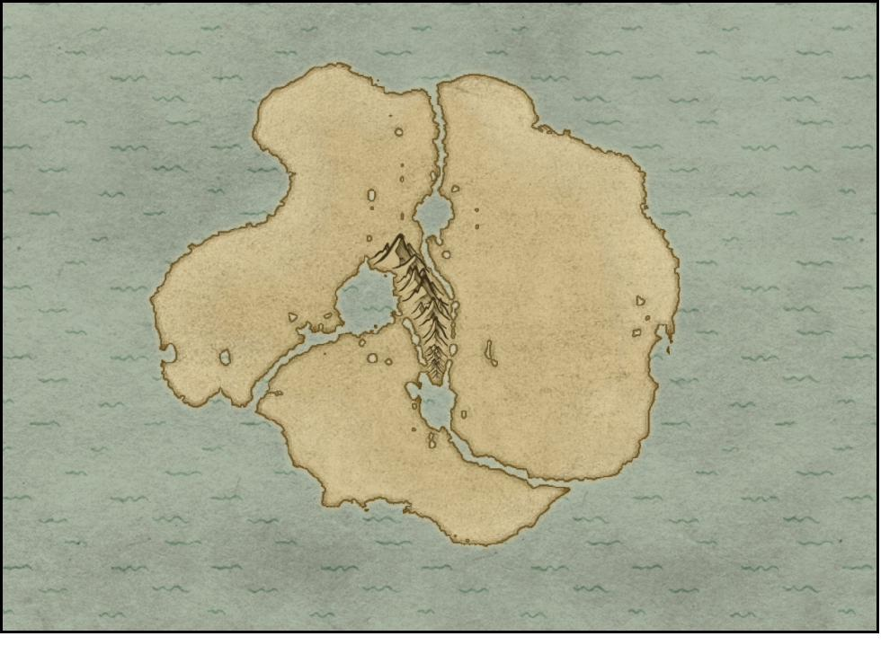

# Volume 01: Foundations — World, Myth & History

*The Two Sons — Source Compendium. 14 source files, reproduced in full and verbatim. Headings inside each source have been shifted down two levels to nest under this volume; nothing else is altered.*

## Contents

- **1. Setting Root Notes**
  - [10 Kings](#src-10-kings)
  - [Three Sons](#src-three-sons) *(empty file)*
  - [Three Sons - Map](#src-three-sons-map)
  - [The Concepts](#src-the-concepts) *(empty file)*
  - [Concepts & World](#src-concepts-world) *(empty file)*
- **2. The World & Its Rules**
  - [The World](#src-the-world)
  - [World - Rules](#src-world-rules)
  - [Lore](#src-lore)
- **3. The Three Continents**
  - [Region - Northern Continent](#src-region-northern-continent)
  - [Region - Eastern Continent](#src-region-eastern-continent)
  - [Region - Western Continent](#src-region-western-continent)
- **4. The Convergence (History)**
  - [Convergence - Overview](#src-convergence-overview)
  - [Convergence - Pre-Convergence](#src-convergence-pre-convergence)
  - [Convergence - The History](#src-convergence-the-history)

---

## Part 1: Setting Root Notes

### 10 Kings

> Source file: `10_Kings.md`

[[Three Sons]]

*— end of `10_Kings.md` —*

### Three Sons

> Source file: `Three_Sons.md`

*This source file is empty in the project (0 bytes of content). Listed here so the compendium accounts for every file.*

### Three Sons - Map

> Source file: `Three_Sons_-_Map.md`

![[Pasted image 20250302183001.png]]

*Map image referenced above (the embed uses Obsidian syntax; standard link below):*

*— end of `Three_Sons_-_Map.md` —*

### The Concepts

> Source file: `The_Concepts.md`

*This source file is empty in the project (0 bytes of content). Listed here so the compendium accounts for every file.*

### Concepts & World

> Source file: `Concepts___World.md`

*This source file is empty in the project (0 bytes of content). Listed here so the compendium accounts for every file.*

---

## Part 2: The World & Its Rules

### The World

> Source file: `The_World.md`

[[Three Sons]]

Below is a **concise yet cohesive** layout of how the **major regions (Ironcrest, Northwind, Greenvale, Highridge, Deepwood, and Sunplains)** logically fit into the **Three-Continent** structure, connected by **The Spine** and **The Underpass**, with **Port** serving as a major maritime crossroads. Each piece is drawn from **previous discussions**, aiming to give you a straightforward mental map of the world and how its domains interact.

---

#### 1. The Three Continents & The Spine

##### A. Western Continent
- **Overall Form**: A gently rounded landmass, separated by a thin channel from the central mountain range.  
- **Primary Domain**: **Ironcrest** generally occupies much of this western territory, famous for its rolling hills with mineral seams (iron, coal) that fuel the region’s metalwork.  
- **Geographical Traits**:  
  - **Hilly/Mid-Range** terrain near The Spine, gradually flattening out toward the western coast.  
  - Rivers or streams run from the mountainous center, used for forging workshops and small-scale hydropower (in a low-fantasy sense).

##### B. Northern Continent
- **Overall Form**: A broad “clover-like” outline at the top of the map, with a distinct gap near The Spine that slices away from the central mountains.  
- **Primary Domain**: **Northwind** claims much of the northern coastline, defined by cold, rocky shores and robust fishing communities.  
- **Geographical Traits**:  
  - **Coastal & Tundra** near the far north, with transitional plateau-like edges near The Spine.  
  - Seas around it can be partially iced or prone to storms, driving the region’s stoic maritime culture.

##### C. Eastern Continent
- **Overall Form**: The largest elongated portion on the right side, stretching southward in a peninsular shape.  
- **Primary Domains**:  
  - **Sunplains** typically in the southeastern or southern coast, mild climate, known for orchard city-states.  
  - **Deepwood** may occupy portions of the inland forested zones, possibly drifting into mountainous edges near The Spine or sprawling across more temperate middle ground.  
  - **Greenvale** often sits in the moderate farmland corridors, bridging slightly from the mountain foothills outward into fertile plains. (It could be more central if you prefer a big farmland belt in the eastern interior.)

##### D. The Spine (Central Mountain Range)  
- **Function**: A tall, jagged line of peaks, essentially the meeting (or dividing) point of all three continents.  
- **Topography**:  
  - Towering ridges, precipitous valleys, minor passes or “teeth” that define the harsh environment.  
  - Earthquakes or sheer cliffs hamper large-scale crossing except at known passes or The Underpass.  
- **Symbolic Tie**: The Spine physically and metaphorically links the continents; trade or conflict often funnels through here.

---

#### 2. The Underpass

- **Subterranean Network**: A labyrinth of tunnels and cavern cities carved or expanded over centuries, running beneath The Spine (and sometimes branching below adjacent foothills).  
- **Purpose & Use**:  
  - **Alternative to High Passes**: Merchants and smugglers bypass harsh mountain climbs by paying local enclaves for safe passage.  
  - **Cultural Blend**: Enclaves below ground host a mix of Ironcrest outposts (seeking ore veins), Deepwood smugglers (harvesting rare fungi), or Highridge caravans wanting stable year-round routes.  
- **Conflicts**:  
  - Territorial feuds for controlling prime tunnel routes.  
  - Occasional collapses, hidden monstrous threats, or hush-hush Council manipulations to keep certain tunnels open/closed.

---

#### 3. Port: Shared Maritime Crossroads

- **Location**: A large coastal city typically sits along a major bay or strait connecting to the northern seas or southern waters. It draws merchant ships from all continents.  
- **Purpose & Governance**:  
  - **Neutral Ground**: Claimed by no single kingdom, each domain invests in it for open trade.  
  - **Maritime Hub**: Links Northwind shipping lanes, Sunplains maritime exports, and possibly southwestern coastal routes from Ironcrest.  
- **Features**:  
  - Cosmopolitan demographics, hosting enclaves from every region.  
  - Docks that incorporate small, practical technologies from multiple kingdoms (Northwind rope rigging, Ironcrest crane couplings, etc.).

---

#### 4. Where Each Domain Sits & Overlaps

1. **Ironcrest** in the West  
   - Bordered by The Spine to the east. Some southwestern coastlines belong to them or remain partially unclaimed if you prefer.  
   - Possible adjacency with **Greenvale** if the farmland extends into southwestern foothills or if there's a southwestern farmland pocket.  
   - A likely border pass: **Stonefield Forge** (or a similarly named settlement) bridging forging culture with farmland.

2. **Northwind** in the North  
   - Edges up close to The Spine along the southern border of the northern continent.  
   - Potential adjacency with **Highridge** or even a direct route from Northwind to Port across certain maritime straits.  
   - If there's a northern pass in The Spine, Highridge caravans might connect to Northwind's fishing hubs.

3. **Greenvale** in the East’s Interior Lowlands  
   - Typically sits near or among the more temperate farmland, possibly bridging mountainous edges near The Spine.  
   - Might share border zones with Ironcrest (west) or with **Deepwood** or **Sunplains** (depending on how farmland transitions into forest or orchard plains).  
   - Common border towns see orchard expansions from Sunplains meeting Greenvale’s broad farmland or forging tools from Ironcrest used for heavier plowing.

4. **Highridge Plateau** near The Spine’s Southeastern or Central Foothills  
   - The plateau is the “crossroad” for land caravans that converge from multiple sides (Ironcrest, Greenvale, or bridging around to Northwind).  
   - Often a domain known more for trade routes and reasoned debate than large farmland or maritime coasts.  
   - Caravans from all directions might meet in the **plateau city** for mutual commerce.

5. **Deepwood** in the Eastern or Southeastern Forest Belt  
   - Possibly spans a large swath of ancient woodland, hugging The Spine’s lower slopes or occupying inland areas not prime for farmland.  
   - Borders with **Greenvale** (leading to forest-meets-field transitions) or **Sunplains** (where orchard edges could fade into wooded edges).  
   - If The Underpass has entrances within the forest, Deepwood enclaves might guard hidden tunnel mouth sites.

6. **Sunplains** in the Southeastern or Eastern Coastlines  
   - Typically aligns with a Mediterranean-like climate, known for orchard city-states.  
   - Overland routes might connect them to Greenvale’s farmland or, if the plateau extends south, some Highridge pass might feed into their markets.  
   - Coastal shipping can link them to Port or to Northwind’s maritime routes if they sail around the eastern coastline.

---

#### 5. Logical Connectivity for Trade and Travel

1. **Land Routes**  
   - **Highridge** often key for caravans crossing The Spine’s plateau or lower passes.  
   - **Greenvale** farmland roads ease movement of harvest goods. Ironcrest uses such routes to procure food, sending metal tools in return.  
   - **Deepwood** remains partially aloof, but small footpaths might connect to local towns that want rare herbs or potions.

2. **Underpass** Alternatives  
   - Some routes bypass The Spine’s high passes by going underground. Smugglers prefer it to avoid border taxes, guild caravans may use it in winter.  
   - Each region might control a local entrance, imposing fees or controlling contraband flow.

3. **Maritime and Port**  
   - **Northwind** sends fish, whale oil, or hardy goods by sea to **Port**.  
   - **Sunplains** also ships orchard produce or fine wines around the coast to **Port**.  
   - **Port** acts as a neutral node, distributing these goods far and wide, sometimes shipping them to Ironcrest or beyond.  
   - Cross-sea routes can link northern coasts with southwestern shores if the user’s map allows circumnavigation.

---

#### 6. Summarizing the Overarching Logic

1. **The Spine** forms the **central barrier** uniting all three continents only at specific passes or via The Underpass.  
2. **Ironcrest** anchors the **Western** domain with metal resources, forging connections with farmland or maritime lines.  
3. **Northwind** occupies the **Northern** domain’s cold coasts, shipping fish or sealed goods to Port or exchanging with inland caravans.  
4. **Greenvale** and **Deepwood** primarily fill **Eastern** territory, where farmland merges into ancient forest.  
5. **Sunplains** extends along the sunny southeastern coasts, bridging orchard-based city-states with the maritime routes leading to Port.  
6. **Port** stands on a prime coastline or strait so that all major trade lines—land caravans from Highridge, ships from Northwind, orchard goods from Sunplains—naturally converge in this neutral city.

Everything remains consistent with previous references:

- **Ironcrest** benefits from The Spine’s resources and direct land route to farmland.  
- **Northwind** harnesses northern seas, forced to use partial sea routes or a pass through Highridge to reach the rest of the continent.  
- **Greenvale** gets farmland synergy with Ironcrest and possibly trade with Sunplains or Highridge.  
- **Deepwood** stays more isolated, guarding forest passes or caves to The Underpass.  
- **Sunplains** thrives on orchard trade, coastal shipping, and cultural city-states.  
- **Port** remains a prime maritime hub open to all.

Thus, you have a **logical geography**: three big landmasses parted by waterways but pinned together by The Spine. Each kingdom or domain occupies terrain that resonates with its described climate and economy, while crucial **border zones** or **maritime lines** provide natural channels for trade, conflict, and cultural exchange.

Below is a **geological backstory** for how the **Two Sons** developed its three “continents” and the central mountain chain known as **The Spine**, drawing on real-world tectonic principles but adapting them to a fantasy setting. The aim is to give a **plausible pseudo-scientific explanation**—in the spirit of Earth’s drifting continents and mountain building—showing how the landmasses gradually assumed their current shapes.

---

#### 1. The Primordial Super-Continent

1. **Initial Formation**  
   - Millions of years ago, there was a single large landmass—call it **Aria Magna**. Tectonic forces had not yet split it.  
   - Early orogenies (mountain-building events) would have been subdued, forming only gentle hills or ridges across the super-continent.

2. **Stability and First Rifts**  
   - Over eons, **mantle plumes** or **upwelling hot spots** began weakening sections under Aria Magna’s central zone, causing minor rift valleys.  
   - These proto-rifts set the stage for the **massive splits** to come, paving the way for the “Three Sons” to eventually break away from each other.

---

#### 2. Tectonic Uplift and the Birth of The Spine

1. **Convergent Boundaries Collide**  
   - A slow but immense **convergent boundary** formed near the center of Aria Magna. Two or three major tectonic plates pushed inward, forcing rock layers upward to create the towering mountain range now called **The Spine**.  
   - Intense folding, faulting, and metamorphism shaped steep peaks, high ridges, and deep valleys, forging that “tall, jagged line” that splits each domain.

2. **Uplift and Erosion**  
   - As these mountains rose, rapid erosion carved valleys, canyons, and watercourses flowing outward, giving each side a separate slope. This created a **natural east/west/north trifurcation**, making it easier for distinct ecosystems to develop.

3. **Deep Subterranean Channels**  
   - Tectonic stresses also created **fault lines** and **caverns** beneath The Spine. Over time, water erosion + geothermal activity expanded some caves into large tunnels. This geologic process formed a labyrinth—**The Underpass**—used later by subterranean enclaves and smugglers.

---

#### 3. Rifting and Continental Drift of the Outer Landmasses

1. **Seafloor Spreading**  
   - Away from The Spine’s collision zone, portions of Aria Magna began **rifting**. These rifts opened narrow seas or channels, isolating the **Western Continent**, **Northern Continent**, and **Eastern Continent** from each other.  
   - Over millions of years, these channels widened enough to be navigable, creating the peninsulas and “clover-like” forms described.

2. **Shaping Each Continent**  
   - **Western Continent**: As it drifted slightly away, its geologic base stabilized, forming resource-rich hills (iron, coal).  
   - **Northern Continent**: Eddies of glacial or latitudinal cooling shaped its rocky coastline. Tectonic tilt raised some areas into high-latitude, subarctic territory.  
   - **Eastern Continent**: Underwent moderate rifting plus micro-plate collisions, leading to forest belts (Deepwood), fertile lowlands (Greenvale), or Mediterranean-like coasts (Sunplains).

3. **Resulting Coastal Shapes**  
   - The slow drift gave each landmass a distinct coastline. The “smooth” outer edges, plus the dramatic breaks near The Spine, reflect **tectonic separation** combined with **erosion** at rift margins.

---

#### 4. Volcanic and Seismic Legacies

1. **Dormant or Active Volcanism**  
   - The Spine’s collision zone, combined with subduction or partial hotspots, could spawn periodic volcanic activity.  
   - **Ironcrest** might link to an older volcanic arc system that left behind large iron deposits. Over time, these deposits cooled and were exhumed by erosion.

2. **Seismic Zones**  
   - Earthquakes remain possible along The Spine’s fault lines, occasionally reshaping Underpass tunnels or reactivating minor rifts.  
   - Border regions sometimes endure mild tremors, influencing how settlements (like Highridge’s plateau towns) build quake-friendly structures or rely on flexible caravan routes.

---

#### 5. Climate Differentiation

1. **Northwind’s Subarctic Chill**  
   - The northern landmass drifting slightly higher in latitude or receiving polar currents. The Spine’s northern extension might block warmer southern winds, reinforcing a colder climate.  
2. **Sunplains’ Warmer Coast**  
   - The eastern landmass’s southern extension basks in maritime breezes from tropical or subtropical latitudes, creating orchard-friendly weather.  
3. **Greenvale’s Rain-Shadows or Plains**  
   - Nestled or partly open farmland receives moderate rainfall. The Spine’s mid-latitude position shapes rainfall distribution, enabling broad fertile zones.  
4. **Deepwood’s Dense Forest**  
   - Possibly thrives in the eastern interior where rainfall meets relatively stable land, forming ancient woodlands relatively untouched by glacial or desert extremes.

---

#### 6. Logic of Human Settlement

1. **Ironcrest**:  
   - People settled around accessible ore veins on the west, used **The Spine**’s foothills for forging outposts, and harnessed rivers for waterpower.  
2. **Northwind**:  
   - Northern coastline shaped fishing cultures, taking advantage of sea channels formed by partial rift separation.  
3. **Greenvale**:  
   - Farmers found **deep topsoil** or alluvial plains shaped by long-term erosion from The Spine’s rivers.  
4. **Highridge**:  
   - Early caravans discovered or hammered out safe passes, building plateau towns at safe vantage points. The stable plateau edges and lesser ridges became trade corridors.  
5. **Deepwood**:  
   - Forest dwellers used the older, relatively undisturbed forest belt. Tectonic history left thick soils and minimal farmland, but lush, biologically rich woodlands.  
6. **Sunplains**:  
   - The calm southwestern or southeastern coasts near the southern extent allowed orchard expansions. Warm gulf-like currents enriched the soil and stabilized climate.  
7. **Port**:  
   - Emerged on a well-placed bay or strait bridging these continental splits—**key to all seaborne trade** once the landmass separated into partial seas or wide channels.

---

#### 7. Continual Shifts (Tectonic Evolution)

- **Long-Range Drift**: Over centuries or millennia, the Western, Northern, and Eastern continents might continue inching away or adjusting. People might see slight expansions of the channels or minor changes in coastal outlines.  
- **Rare Major Quakes**: Could sometimes reshape Underpass routes, prompting new tunnels or collapses, changing trade patterns.  
- **Volcanic Re-awakenings**: In the far future, a volcanic event near The Spine might re-enrich certain ore seams, fueling new conflicts or forging booms.

---

##### **Conclusion**

In summary, the **Two Sons** landmasses formed as an **ancient super-continent** fractured under tectonic pressures—**The Spine** emerging from convergent collisions, while **outer rifts** parted the terrain into **Western (Ironcrest), Northern (Northwind), and Eastern (Greenvale, Deepwood, Sunplains)** continents. **Port** grew at a strategic maritime junction, The Underpass evolved from fault and cave expansions, and each region’s distinct climate, resources, and topography reflect those **millions of years** of slow geological change. 

Thus, the **geographical arrangement** of the Two Sons world stands on **grounded tectonic logic** reminiscent of Earth’s plate movements, providing a **reasonably coherent** explanation of how the land ended up fractured yet linked by that imposing central mountain range.

==================

! ''Geographic Overview: The World of the Two Sons''

The world of the Two Sons is a land of complex geography shaped by its dramatic natural features, diverse climates, and distinct regional characteristics. Its continents, landmasses, and unique formations set the stage for its cultures, economies, and conflicts. This overview will guide you through the essential elements of the world's geography, ensuring a comprehensive understanding.

!! ''The Continents''

//The land is divided into three primary continents—Western, Northern, and Eastern—interconnected by a towering central mountain range known as The Spine. These continents are distinct in their terrain, climate, and cultural influences, yet they are deeply interlinked by geography and trade.//

!!! ''Western Continent''

''Shape and Coastline:''

The Western Continent occupies the leftmost portion of the map, its coastline curving gently with minimal deep inlets or protrusions. A narrow water channel separates it from the other landmasses, giving it a sense of geographic isolation despite its connectivity via The Spine.

''Terrain and Features:''

This continent is characterized by rolling hills and fertile plains along its coastlines, which gradually rise toward the central regions near The Spine. Its open landscape allows for expansive farmland and scattered woodlands.

''Climate:''

The Western Continent experiences temperate seasons, with warm summers and mild winters. Its coastal regions are moderated by sea breezes, while the inland areas experience greater seasonal variation.

''Key Features:''

The Ironcrest Region, with its abundant mineral resources and industrial hubs, dominates this continent.
Numerous rivers and streams flow from the central mountains, creating fertile valleys and sustaining agricultural life.

!!! ''Northern Continent''

Shape and Position:

//The Northern Continent occupies the top of the map and has a clover-like outline, with a notable gap separating it from The Spine’s central peaks. This gap is a defining feature, as it allows trade and cultural exchange between the Northern and Eastern continents.//

''Coast and Inlets:''
While the coastline is irregular, it lacks deep fjords or dramatic cliffs. Subtle bays and minor inlets provide natural harbors, making it a hub for maritime trade and fishing communities.

''Landscape:''
Much of the Northern Continent consists of high plateaus and rocky terrains. As it approaches The Spine, the land becomes increasingly rugged, with steep cliffs and hidden valleys shaped by ancient tectonic activity.

''Climate:''
The Northern Continent endures harsh winters and cool summers, with a predominantly cold, maritime climate. Snowfall is common, especially near the mountains.

''Key Features:''
The Northwind Coastal Lands, known for their resilient fishing communities and maritime traditions, dominate the northern regions.
The central plateaus are sparsely populated, with settlements clustering along the coasts and near rivers.

Eastern Continent
Overall Configuration:
The Eastern Continent is the largest and most elongated of the three, extending southward in a tapering shape. This landmass forms a peninsula-like southern region, adding diversity to its climate and geography.
Coastline:
Its eastern coastline is smoother, with fewer dramatic features than the jagged boundary it shares with The Spine. The smoother coast facilitates trade and agriculture, while the rugged western edge transitions into the mountainous terrain of The Spine.
Interior Terrain:
The interior consists of vast flatlands and rolling hills, with fertile regions near the southern tip. Rugged highlands rise toward the central mountains, while the southern reaches host warmer climates and more lush vegetation.
Climate:
The northern part of the continent has a temperate climate, while the southern tip experiences warmer, Mediterranean-like conditions with dry summers and mild winters.
Key Features:
The Sunplain Confederation, a collective of city-states thriving on trade and agriculture, dominates the southern regions.
The Greenvale Heartlands, known for their fertile lands and communal agricultural practices, occupy the central portion of the continent.

The Central Mountain Range: The Spine
Location and Extent:
The Spine runs north to south, bisecting the world into its three major continents. Its peaks are visible from vast distances, forming an imposing natural barrier.
Appearance and Geology:
The Spine is a jagged, steep range with varied climates. Its northern stretches are snow-covered year-round, while the southern reaches feature high-altitude grasslands and temperate valleys.
The range includes deep rifts, hidden caves, and underground rivers, hinting at both ancient tectonic forces and potential magical origins.
Key Features:
The Underpass: A network of underground cities, tunnels, and paths buried deep within The Spine. It facilitates trade and travel between continents while serving as a haven for smugglers and refugees.
The Overpass: A treacherous and winding trail that weaves through the mountains, used by those who cannot—or choose not to—navigate The Underpass.
Cultural and Economic Significance:
The Spine connects all three continents, acting as a spine for trade, migration, and cultural exchange. However, its rugged terrain also isolates communities and creates natural chokepoints for controlling commerce and movement.

Natural Features of the World
Waterways and Rivers:
Rivers flow outward from The Spine, carving fertile valleys and sustaining agriculture and industry. Key rivers form natural trade routes, linking inland settlements to coastal ports.
Forests and Plains:
Dense woodlands, such as those in the Deepwood Region, provide resources and spiritual inspiration. Fertile plains like those in the Greenvale Heartlands sustain food production and rural life.
Climate Diversity:
The world features a range of climates, from the icy winds of Northwind to the warm, sunlit fields of Sunplain. This diversity shapes the economies and cultures of each region.

Geographic Interconnectivity
Trade and Travel:
The City of Port, located near the water channel separating the Western Continent, serves as the main hub for all trade and communication. Every region relies on Port for the exchange of goods, ideas, and political negotiations.
The Spine’s dual pathways (Underpass and Overpass) allow movement between the continents, though each presents unique challenges.
Cultural Gradients:
The regions near The Spine exhibit a blending of cultural traits, as communities adapt to the shared terrain while retaining elements of their distinct heritages. This creates cultural gradients rather than hard boundaries.

This geographic framework creates a world that feels expansive, interconnected, and full of opportunities for conflict and cooperation. Each landmass and feature shapes the lives of its inhabitants, providing the foundation for their unique cultures, economies, and histories.

========================

From a broad, high-level perspective, **yes**—the screenshot you’ve shared can absolutely represent the world we’ve been describing. Here’s why it lines up with our discussions and how you might position each region on the map:

---

#### 1. Distinct Continental Landmasses

- **Multiple Large “Blobs”:** We’ve talked about four main continental areas—Western (Ironcrest), Eastern (Greenvale/Highridge), Northern (Northwind), and a possible Southern or “under” continent/landmass. This map shows **three major chunks** plus a smaller southern extension. That already fits the idea of multiple continents that were once a single land (the “parted Mother”).

- **Central Mountain Range (The Spine):** The imposing chain in the middle neatly matches our concept of a massive mountain barrier cutting across the world, with The Underpass or Deepwell Sanctum likely running through or beneath it.

- **Large Fissure:** The “split” between landmasses suggests the world was once unified but “sundered,” consistent with the lore of a fractured land and the parted continents.

---

#### 2. Regional Placement Ideas

- **Eastern Continent (Greenvale & Highridge):** The broadest, more continuous landmass on the **right** side could be Greenvale Heartlands (the northern/central fertile part) and Highridge Plateau (the more mountainous or elevated zone).  
- **Western Continent (Ironcrest):** The **left-hand** mass, slightly rounder, would house Ironcrest’s rolling hills and industrial centers. This portion might have gentle coastlines and be separated from the Eastern Continent by a navigable channel (aligning with references to maritime trade routes via the City of Port).  
- **Northern Continent (Northwind):** The **upper** chunk—or the top half of that main shape—could serve as the colder, rugged territory home to the Northwind coastal/fjord regions.  
- **Southern “Tail” or Underside:** The bottom extension could be where various smaller realms or uncharted lands lie (sometimes used for expansions like desert regions or additional trade hubs).

---

#### 3. Coastlines & Trade Hubs

- **Smooth/Eroded Coasts:** We’ve mentioned several harbors (e.g., Port Lumière, maritime areas around Northwind, and smaller port towns). The map’s relatively **smooth edges** and scattered bays suggest locations for these trade centers.  
- **Narrow Channels:** Where the landmasses nearly touch (or where those notches appear), you can imagine key maritime choke points, strategic city-states, or guild-run ports. These narrow waters and straits reinforce the big themes of controlling trade routes.

---

#### 4. Supports the Lore of “Blended Borders”

- If you zoom in on transitional areas (like the neck between the western and southern landmasses, or the gap near the mountain range), you can drop in **frontier towns** and **hybrid cultures** we’ve talked about—places where caravans or maritime traffic converge, giving rise to linguistic borrowing and cross-lore shrines.

- The **central mountainous spine** is the perfect stage for enclaves like the **Underpass Collective** or your highland/plateau societies (Summithold, Cliffhaven, etc.), complete with winding passes and hidden grottoes.

---

#### 5. Room for Variation

- This map easily accommodates **smaller kingdoms** and **warlord territories**: that big southwestern chunk, for instance, could be broken into multiple feudal domains or city-states. The same goes for the blank spaces along coastlines or around the mountain base—ideal spots for smaller enclaves, confederations, or tribal lands.

- You’re not constrained to single “borders” around each blob; you could subdivide each landmass as much as you like, giving the world a realistic patchwork of powers.

---

##### Conclusion

In short, the screenshot’s layout **does fit** the worldbuilding we’ve done:

- A **parted** land with a dramatic **central mountain spine**  
- Multiple **large landmasses** that can be distinct continents/regions  
- Plenty of **room** for major cities, smaller baronies, and those border-blended cultures  

It’s a strong visual anchor for all the kingdoms, trade routes, and cultural overlaps we’ve discussed.

A good rule of thumb for placing **the City of Port** is to look for **the narrowest or most strategically positioned gap** between two (or more) large landmasses on your map. In the lore we’ve developed, Port is **the major maritime hub** connecting the Western and Eastern Continents (and sometimes the Northern one, via sea routes). Here’s how you might situate it:

1. **Pick a Natural “Bottleneck” of Sea Travel**  
   - On your map, identify the channel or strait that separates the **Western** and **Eastern** portions of the land (the “parted Mother”).  
   - The City of Port should sit at or near that **choke point**, where shipping lanes must converge to cross between continents.

2. **Position It on a Bay or Harbor**  
   - If you see any **indentation** or **rounded bay** along the coastline in that gap, that’s a prime spot to anchor a major trade city.  
   - In many real-world analogs (e.g., Constantinople on the Bosphorus), the greatest trade hubs grew up where straits were narrow, giving them control over passing ships.

3. **Ensure Accessibility From Multiple Directions**  
   - The City of Port wants quick access to **Ironcrest** (Western Continent’s industrial power) and **Greenvale/Highridge** (Eastern Continent’s breadbasket and plateau).  
   - If possible, place it so that ships from **Northwind** (the north side) or other southern routes can also come in with minimal detour.

4. **Lore Justification**  
   - Because Port is such a key commercial crossroads, it would have grown in exactly the spot that lets it tax, service, and protect shipping traffic between the continents.  
   - Over time, its neutrality and location would have attracted **diplomatic missions**, **mercantile guilds**, and even pirate threats—adding to its cosmopolitan, heavily fortified character.

##### A Quick Example Placement

- If the **left-hand (Western) landmass** and the **right-hand (Eastern) landmass** are separated by a **relatively narrow channel** somewhere in the south or southwest, **drop Port there** on a natural harbor.  
- You might see a **slight indentation** in that coastline—perfect for a bustling harbor city, ringed by piers and city walls.  
- From there, land routes could continue inland toward Ironcrest’s forges, while sea routes could swing around to Greenvale, Northwind, or even the southern expansions of the map.

This approach ensures that **the City of Port** makes geographic sense as the gateway between continents, reflecting both its enormous trade influence and the lore of a neutral, cosmopolitan port city essential to everyone’s commerce.

Below is a **suggested placement** for each major capital—**Verdanthearth, Summithold, Cindermarch, Aurorashore, Evergloam, Solanterra, Deepwell Sanctum,** and (optionally) **Port Lumière**—on the map you provided, taking care to maintain **regional coherence** and preserve **Port** as a neutral hub (i.e., none of the capitals should sit right on top of it). Of course, you can adjust these details to taste, but this layout honors each kingdom’s terrain and lore while leaving **Port** at a strategic but neutral distance.

---

#### 1. **Verdanthearth** (Greenvale Heartlands)
- **Region:** The **Eastern Continent**, known for its vast fertile plains and gentle rivers.  
- **Placement on the Map:**  
  - Look to the **right-hand landmass** (the largest chunk).  
  - Place Verdanthearth **inland**, somewhat **north or central** where rolling farmland would logically expand.  
  - Keep it away from major straits leading to Port to reflect the idea that the Heartlands rely on overland routes—and occasionally Highridge passes—to reach maritime ports.  
- **Rationale:** Verdanthearth is the breadbasket capital, so it should be surrounded by ample farmland, well-positioned for trade with Summithold and eventually Ironcrest (via caravans).

---

#### 2. **Summithold** (Highridge Plateau)
- **Region:** Also on the **Eastern Continent**, but at higher altitude near The Spine.  
- **Placement on the Map:**  
  - Still on the **right-hand landmass**, but **close to or on the foothills** of the large **mountain range** in the center (The Spine).  
  - A plateau-like zone, possibly at the edge of a steep slope or near a canyon that leads up into the mountains.  
- **Rationale:** Summithold should command the major passes crossing The Spine, controlling tolls on caravans traveling between Ironcrest/Greenvale or heading north to Northwind. It should be set well away from the southern straits so it doesn’t overshadow Port’s neutrality.

---

#### 3. **Cindermarch** (Ironcrest Region)
- **Region:** The **Western Continent**, known for industrial might, forges, and rolling hills.  
- **Placement on the Map:**  
  - On the **large left-hand landmass**, somewhat **inland** (not hugging the coast) to allow for those deep ore deposits and forge towns.  
  - Closer to The Spine or those interior hills, where mines and coal veins are more plausible.  
- **Rationale:** Cindermarch is the beating heart of Ironcrest’s industry. Placing it inland helps keep it distinct from Port’s coastal location, emphasizing that to reach the sea, merchants must first travel through Ironcrest domain—thus making sense of Ironcrest’s overland trade route reliance.

---

#### 4. **Aurorashore** (Northwind Coastal Lands)
- **Region:** The **Northern Continent**, characterized by rugged, colder climates and a maritime lifestyle.  
- **Placement on the Map:**  
  - In the **upper portion** of the map, likely on or near a **deep bay or fjord** that provides natural shelter for ships.  
  - This chunk might be physically connected to the eastern or western mass, but it’s distinctly “northern,” so pick a pronounced coastal indentation.  
- **Rationale:** Aurorashore should be a major port city for the Northwind clans—far from the southwestern channel (where Port might be). This ensures it’s the capital of a separate, subarctic region, known for fishing and whaling industries.

---

#### 5. **Evergloam** (Deepwood)
- **Region:** Deepwood is your **ancient forest/spiritual enclave**, not necessarily a separate continent.  
- **Placement on the Map:**  
  - Anywhere there is a **significant forested belt**, likely on **one of the larger landmasses** but away from heavily farmed or mined areas.  
  - This could be along a **lowland** near The Spine or a more **humid corner** of the eastern or western mass.  
- **Rationale:** Keep Evergloam off typical trade highways, so it feels more secluded—maybe in a sheltered gulf or valley that’s heavily wooded. This distance from Port underscores Deepwood’s reclusive nature and their druidic guardianship.

---

#### 6. **Solanterra** (Sunplain)
- **Region:** A more **arid or semi-desert** region.  
- **Placement on the Map:**  
  - Potentially the **southern extension** (the “tail”) if that area’s climate is drier, or along a coastline that’s described as warmer.  
  - Place Solanterra inland enough to ensure it’s not overshadowing Port and to maintain the sense of desert caravans traveling to the coast.  
- **Rationale:** By situating Solanterra in a hotter, drier zone, you’re solidifying the desert or Mediterranean vibe. It also fits lore that caravans from Solanterra might sail out of Port or cross the central mountain passes to reach Greenvale or Ironcrest.

---

#### 7. **Deepwell Sanctum** (The Underpass Collective)
- **Region:** The subterranean network under The Spine (or major canyons).  
- **Placement on the Map:**  
  - Not a typical “surface city,” so its “location” is effectively **within** or **beneath** that central mountain range.  
  - You may choose a single surface entrance or cluster of entrances on either side of The Spine, well away from Port’s direct coastline.  
- **Rationale:** Deepwell Sanctum’s entire point is controlling hidden or vertical routes through the mountains—no need to place it near maritime hubs. Keep it tucked inside The Spine’s labyrinth of caves.

---

#### 8. **Port Lumière** (Neutral Maritime Hub)  
- **Region:** A standalone city-state bridging Western/Eastern Continents.  
- **Placement on the Map:**  
  - Likely in the **southwest or central strait** where the main landmasses nearly meet, forming a major choke point for sea travel.  
  - On a comfortable bay or inlet that naturally funnels ships from Ironcrest, Greenvale, or even Northwind.  
- **Rationale:** By being physically separate from each capital, Port remains **autonomous** and neutral. Having the big kingdoms each “one step removed” from the city ensures no single monarchy overshadow it—everyone has an equal stake in its safe neutrality.

---

### Putting It All Together

1. **Distance from Port:**  
   - Every kingdom’s capital is far enough inland or across the map that **Port** retains its status as a free trade city. No capital “dominates” Port’s territory, reinforcing its neutral identity.

2. **Adhering to Regional Features:**  
   - **Verdanthearth** in wide farmland.  
   - **Summithold** perched high near The Spine.  
   - **Cindermarch** in industrial hills.  
   - **Aurorashore** on a northern fjord or bay.  
   - **Evergloam** in thick forest.  
   - **Solanterra** in an arid southern reach.  
   - **Deepwell Sanctum** beneath the mountains.  
   - **Port Lumière** at a maritime choke point.

3. **Logical Trade & Cultural Gradients:**  
   - Overland caravans from **Cindermarch** to **Summithold** or **Verdanthearth** must cross The Spine.  
   - **Aurorashore** ships sail around the northern or western coasts.  
   - **Solanterra** caravans trek north to trade with Ironcrest or Greenvale, or sail out from Port’s shipping lanes.  
   - **Evergloam** remains aloof, but still accessible to those brave enough to navigate the forest roads.  
   - **Deepwell Sanctum** quietly manages subterranean shortcuts (for a fee).

By spacing capitals to reflect their **environment,** strategic advantages, and political boundaries—while leaving **Port** at a maritime crossroads unattached to any one kingdom—you’ll ensure the map layout matches the rich, regional tapestry of your world.

====================

Below is a **concise verification** of each region’s **approximate placement** and **borders**—re-checking for consistency with the previous conversations. The goal is to confirm that no contradictions arise in how the **Three Continents**, **The Spine**, **The Underpass**, and **Port** fit together or how the regions adjoin one another.

---

#### 1. **Ironcrest**

1. **General Location**  
   - Sits primarily on the **Western Continent**, close to the rugged foothills of **The Spine** on its eastern side.  
   - Characterized by ore seams, forging centers, and fortresslike industrial towns.

2. **Border Relationships**  
   - **Highridge**: Adjoins Ironcrest across the mountainous passes or lower plateau edges near The Spine, facilitating trade routes.  
   - **Greenvale**: In certain southwestern or western farmland expansions, some farmland enclaves or pockets of orchard lands transition into Ironcrest’s hillside forging zones. (This can vary, depending on exactly how farmland extends, but there’s at least some overlap or adjacency in the southwestern portion if you want farmland reaching that far.)

3. **Check**  
   - Matches our earlier notes that **Ironcrest** primarily abuts **Highridge** on the spine side, with a **possible partial boundary** with Greenvale farmland.  
   - No direct mention of border with **Deepwood** or **Sunplains** in prior references, so presumably no direct adjacency to those unless desired in your map layout.

---

#### 2. **Northwind**

1. **General Location**  
   - Occupies the **Northern Continent**, known for cold, rocky coastal terrain and subarctic or near-arctic conditions.  
   - Boasts fishing communities, maritime trade, stoic clan culture.

2. **Border Relationships**  
   - **Highridge**: The southern extent of Northwind meets **Highridge Plateau** at mountainous or hilly transitions, or at passes that lead travelers southward.  
   - **Maritime / Coastal**: May also connect to the city of **Port** by sea routes, though not necessarily a direct land border. This extends around coasts or straits.

3. **Check**  
   - Consistent with prior references: **Northwind** and **Highridge** share boundary near The Spine. **Port** is a shipping nexus that draws Northwind vessels, but not a land border.  
   - No direct mention of adjacency with Ironcrest, Greenvale, Deepwood, or Sunplains (though it’s possible caravans pass from Northwind’s southwestern corner to Ironcrest through Highridge).

---

#### 3. **Highridge Plateau**

1. **General Location**  
   - Central position at or near The Spine, bridging the Western, Northern, and Eastern continents.  
   - Characterized by tiered stone towns, caravan routes, windy passes, and a tradition of hosting debates or negotiations.

2. **Border Relationships**  
   - **Ironcrest**: Connected via eastern foothills or plateau edges.  
   - **Northwind**: Touches its southern frontier or southwestern corner.  
   - **Greenvale** / **Deepwood** / **Sunplains**: On the eastern side. Highridge might have direct passes into at least one or two of these eastern domains, as caravans typically come through the plateau.  
     - Typically, **Greenvale** is the likeliest direct adjacency because farmland can push up near plateau slopes.  
     - **Deepwood** or **Sunplains** adjacency depends on your layout—some passes may lead to orchard city-states or forest edges if you choose.

3. **Check**  
   - Matches our previous logic that Highridge is a multi-directional crossroad.  
   - Potentially touches all domains except where maritime routes bypass it (like some sections of Northwind or Sunplains coastal lines).

---

#### 4. **Greenvale**

1. **General Location**  
   - On the Eastern Continent’s fertile heartland, known for farmland, cyclical harvests, orchard expansions (shared in some capacity with Sunplains?), and a communal ethos.  
   - Key farmland belt bridging partial mountain foothills from The Spine to open plains.

2. **Border Relationships**  
   - **Highridge**: Likely meets southwestern or northwestern farmland edges near the plateau’s base.  
   - **Deepwood**: Where farmland meets dense forest, they share a transitional boundary—some farmland enclaves pushed deeper, some forest occasionally reclaims fields.  
   - **Sunplains**: Potential orchard borders can blur if orchard-lords from Sunplains or farmland expansions from Greenvale intersect. Typically southwestern “orchard belt” merges at some boundary.  
   - **Ironcrest**: Possibly a southwestern or western adjacency if farmland expansions creep up the slopes, though not necessarily large or uniform.

3. **Check**  
   - Consistent with prior references: **Greenvale** on fertile eastern tracts, abutting **Deepwood** forest, some orchard synergy with **Sunplains**, possible partial contact with **Ironcrest** or **Highridge**.

---

#### 5. **Deepwood**

1. **General Location**  
   - Dense, ancient forest region occupying large sections of the Eastern Continent that are not farmland or orchard.  
   - Culturally reclusive, protective of woodlands, with minimal deforestation.

2. **Border Relationships**  
   - **Greenvale**: Key farmland-forest boundary. Tension or careful respect exists.  
   - **Sunplains**: At southern or southeastern edges where orchard expansions attempt forest clearance or seek new land.  
   - **Highridge**: Possibly at the plateau’s eastern base if certain passes open into wooded foothills.  
   - **No direct** adjacency with Ironcrest or Northwind unless your map places forest belts reaching that far west or north. Usually not the case.

3. **Check**  
   - Matches earlier logic: **Deepwood** is set in the eastern forest zone, bridging farmland expansions (Greenvale) and orchard expansions (Sunplains). Possibly touches Highridge at some forest foothills.

---

#### 6. **Sunplains**

1. **General Location**  
   - Southeastern or southern portion of the Eastern Continent, with orchard-based city-states, a mild or Mediterranean-like climate, coastal or near-coastal orientation.  
   - Known for maritime trade, orchard produce, and a more refined city-state culture.

2. **Border Relationships**  
   - **Deepwood**: Overlaps or abuts forest edges where orchard expansions sometimes conflict with forest tribes.  
   - **Greenvale**: Possibly merges orchard farmland with more staple cereal farmland in transitional zones—some orchard-lords might cross into farmland enclaves and vice versa.  
   - **Coastal** adjacency to **Port** by sea or to Northwind’s shipping lanes, but not necessarily a land boundary to Northwind.  
   - **Highridge**: Could have a pass connecting orchard city-states to plateau caravans, though not always a large direct border—depends on how your layout is.

3. **Check**  
   - Consistent with prior mentions: **Sunplains** is on the Southeastern edge, orchard expansions near farmland (Greenvale) or forest (Deepwood).

---

#### 7. **Port**

1. **Placement**  
   - Typically a neutral maritime hub set on a major bay or strait, possibly bridging shipping routes from **Northwind** or **Sunplains** to the rest of the Eastern or Western continents.  
   - Not a separate domain but shared or recognized neutrality.

2. **Check**  
   - Doesn’t directly border the land-based kingdoms in a feudal sense, but it’s a crucial pivot linking sea routes from Northwind or from Southeastern coasts near Sunplains, distributing goods across The Spine or through The Underpass if needed.

---

##### **Conclusion: Rechecked Adjacencies**

- **Ironcrest**: West continent, edges meet **Highridge** directly; possibly partial contact with **Greenvale** farmland.  
- **Northwind**: North continent, edges meet **Highridge** in the south. Sea routes connect it to **Port** and (indirectly) other coasts.  
- **Highridge**: Center, bridging to all other domains except where direct maritime or forest paths might skip it.  
- **Greenvale**: Eastern farmland heartland, borders **Deepwood**, possibly **Sunplains**, potential southwestern contact with **Ironcrest** or **Highridge**.  
- **Deepwood**: Eastern forest, overlapping with farmland expansions of **Greenvale** and orchard expansions of **Sunplains**, possibly some foothill contact with **Highridge**.  
- **Sunplains**: Southeastern orchard region, adjacent to **Deepwood** (forest lines) and **Greenvale** (farmland lines). Possibly a pass to **Highridge**.  
- **Port**: Coastal trade city, not a separate domain but a neutral hub linking maritime routes from **Northwind** or **Sunplains** to the rest of the landmass.

This recheck upholds previous discussions on how the domains connect along edges or transitional zones, reflecting a **gradual shift** rather than hard borders—**consistent** with the earlier logic.

*— end of `The_World.md` —*

### World - Rules

> Source file: `World_-_Rules.md`

Below is a set of **specific rules** for building and maintaining consistency in the world of The Two Sons. These rules address the environment, cultural influences, political structures, magic and artifacts, character motivations, and even the “look and feel” of each region. They serve as a detailed “world integrity manual” to ensure that every element is coherent and resonates with the intended tone of the setting.

---

##### **Environmental & Geographic Consistency**

1. **Resource-Driven Regions**
    
    Instead of viewing each region as a singular “character” defined solely by one dominant resource, imagine them as overlapping, interdependent parts of a larger ecosystem. Each region retains its unique climatic and cultural flavor, yet shares common environmental threads that bind the world together. Here’s how you can think about it:

	1. **Interconnected Ecosystem**
    
	    - **Shared Foundations:** All regions lie within one vast, interconnected landmass. While some areas like Ironcrest might have visible mining operations and industrial forges, those resources are part of a broader landscape that includes Greenvale’s farmlands and even parts of Northwind’s coastal zones.
	    
	    - **Resource Emphasis vs. Exclusivity:** Instead of “Ironcrest is only about mining,” think of it as a region where mining is especially prominent due to its rich ore deposits, yet its mineral wealth also contributes to other regions—providing raw materials that support agriculture in Greenvale or building projects in Highridge.

	2. **Regional Variations on a Shared Theme**
    
	    - **Climate and Geography:** Each area emphasizes certain environmental characteristics that suit its local climate. For instance:
	        - **Northwind** remains distinct by having colder weather and harsher coastal conditions, impacting everything from its architectural insulation to its seafood-based cuisine.
	        - **Sunplains** is marked by an arid, sun-drenched climate that drives the cultivation of drought-resistant orchards and Mediterranean-style water management systems.
	        - **Deepwood** has dense forests that contribute to both its spiritual traditions and its resource challenges, but these forests also interact with adjacent agricultural zones in Greenvale, influencing soil fertility and water cycles.
	        
	    - **Economic and Cultural Integration:** Although Ironcrest is renowned for mining and metalworking, its products flow into Greenvale for the creation of agricultural tools and into Highridge for constructing trade routes, emphasizing a symbiotic relationship rather than isolated excellence.
    - 
	3. **Unified Yet Distinct**
    
	    - **Cross-Regional Relationships:** Recognize that while each region might have a “specialty” (mining in Ironcrest, fishing in Northwind, farming in Greenvale), they all depend on each other. Trade, shared water sources, and climatic transitions ensure that no region is an island. For example, fertile soils in Greenvale might require mineral fertilizers sourced from Ironcrest, and Northwind’s cold waters might influence aquaculture practices that supply food to all regions.
	    
	    - **Cultural Overlap:** Traditions and culinary practices can have shared origins even if they manifest differently. A harvest festival in Greenvale might be celebrated with similar communal values as a maritime festival in Northwind, both stemming from a mutual respect for the natural cycles that affect everyone.
    
	4. **Guiding Principle for the World**
    
	    - Think of the regions as pieces of a mosaic. Each piece has its own detailed texture and color, but together, they create one complete picture. This approach allows for both the recognition of regional uniqueness and the acknowledgment of their interdependence.
	    
	    - When developing lore, emphasize how changes in one region (like a mining strike in Ironcrest) can ripple through the entire ecosystem—affecting trade, agriculture, and even political stability across Northwind, Greenvale, and beyond.

By integrating these ideas, you ensure that the regions are not isolated entities but part of a **dynamic, interconnected ecosystem**. Their differences become a point of diversity and richness rather than a source of separation, providing a coherent and realistic backdrop for your story.

1. **Transitional Borders**
    
    - The boundaries between regions should be gradual rather than sharp. When designing borders, use “transition zones” (e.g., the foothills where Ironcrest meets Highridge or the forest edges between Greenvale and Deepwood) to reflect natural cultural and ecological gradients.
3. **Climate-Adaptive Design**
    
    - Architectural styles and cultural practices must reflect local climates. In Northwind, structures should be insulated against cold and built to withstand storms, whereas in Sunplains, buildings must incorporate elements that keep interiors cool and protect against harsh sunlight.

---

##### **Cultural & Societal Authenticity**

1. **Mixed Cultural Influences**
    
    - Each region’s culture must draw from multiple real-world inspirations. For instance, Greenvale might combine Southeast Asian communal living with West African courtyard traditions. Use a mix of naming conventions, dress, culinary practices, and social rituals that reflect these blended influences.
5. **Cultural Continuity & Change**
    
    - While traditions (festivals, rituals, culinary practices) must honor historical roots, they should also evolve with interactions from neighboring regions. For example, Highridge should display a fusion of Tibetan and Andean influences that evolve as caravans bring new ideas.
6. **Language and Dialect Impact**
    
    - Reflect the regional mindset in how characters speak. Regions with multiple influences (like Northwind or Port) should have a blend of linguistic patterns. Ensure that these speech patterns influence local idioms, proverbs, and even metaphors in storytelling.

---

##### **Political & Economic Structures**

1. **Economic Council’s Domain-Based Authority**
    
    - The Council must consist of distinct, trans-regional families or leaders, each controlling a specific economic sector (e.g., Harvests, Metal, Trade Routes, Infrastructure, Commerce, Lore). Their influence should be visible in trade flows, secret alliances with guilds, and even in local governance decisions.
8. **Guild Integration with Regional Politics**
    
    - Every guild must have clear ties to both its region and the larger economy. Their internal structure, hierarchy, and rivalry should mirror real-world trade unions or medieval craft guilds, but with a fantasy twist (e.g., a Thieves’ Guild with its own code of honor that transcends borders).
9. **Dynamic, Non-Absolute Borders**
    
    - Historical conflicts should show that borders were never fixed before The Convergence. All major political events (e.g., the Ore Scar Strife, the Lowland Famine Raids) must have led to shifting alliances and temporary dominions, which in turn shaped the eventual unified structure.

---

##### **Magic, Artifacts, and Technological Realism**

1. **Subtle, Practical Magic**
    
    - Artifacts and magic must be low-key and serve a clear, practical function—enhancing specific trades, aiding in survival, or providing modest advantages in warfare. They should have balanced benefits and drawbacks that force characters to make trade-offs.
11. **Artifact Creation as Ritual & Innovation**
    
    - Every magical artifact must have a clear method of creation (rare materials, specific rituals, personal sacrifice, etc.) that reflects local traditions and resource availability. Artifacts should tell a story about their creator’s culture and the region’s needs.
12. **Technological Limitations**
    
    - The overall technology must remain pre-industrial: no overwhelming power sources or modern conveniences. Innovations should evolve naturally from local craft, resource availability, and accumulated tradition.

---

##### **Character & Narrative Integration**

1. **Layered Motivations for Key Players**
    
    - Main characters (Council members, the Villain, Wurdren) must have deep, multi-faceted motivations tied to their regional origins and personal histories. Their actions must reflect both individual ambitions and broader economic or cultural pressures.
14. **Interconnected Cause and Effect**
    
    - Every major action—whether a decision by the Council, a move by the Villain, or a grassroots act by Wurdren—should have cascading effects. Design narrative arcs so that a decision in one region creates ripple effects in others, emphasizing the interconnectedness of the world.
15. **Moral Ambiguity and Shifting Alliances**
    
    - Avoid binary “good vs. evil” portrayals. Every faction and character should operate in a morally gray area, making alliances, betrayals, and personal sacrifices part of the narrative’s rich tapestry. Reflect this in dialogue, decision-making, and the evolution of relationships between guilds, regions, and governing bodies.

---

##### **Visual, Sensory & Symbolic Cohesion**

1. **Consistent Aesthetic Elements**
    
    - Each region must have distinctive architectural styles, color palettes, and textures that reflect its culture and environment. For instance, Northwind might feature icy blues and rugged, tarred wood, while Sunplains displays bright, sunlit hues with mosaic tiles and open courtyards.
17. **Symbolic Imagery & Icons**
    
    - Develop specific symbols for each region (e.g., an anvil for Ironcrest, a fish or iceberg for Northwind) and ensure these symbols appear consistently in art, clothing, and public spaces. This reinforces regional identity and shared heritage.
18. **Integration of Natural Elements**
    
    - Sensory details (sounds, smells, textures) should be tied to the environment. Describe the clang of Ironcrest forges, the salty tang of Northwind seas, the earthy aromas of Greenvale harvests, and the crisp mountain air of Highridge to immerse the reader fully.

---

##### **Final Notes**

These specific rules are designed to ensure that every detail—from the way regions are named, to the style of their architecture, the nature of their politics, and even the motivations of their inhabitants—remains consistent with the overall vision of The Two Sons. Adhering to these guidelines will help create a world that is both richly detailed and thematically cohesive, inviting readers into a believable, interconnected realm where every element reinforces the story’s core ideas.

*— end of `World_-_Rules.md` —*

### Lore

> Source file: `Lore.md`

Below is a mythic and historical expansion of your world’s origin story—one that ties together the imagery of the Three Sons (the three major “stars”) and the Mother (the once-whole land). By layering mythical accounts, cultural traditions, and evolving historical perspectives, you can give your setting a rich sense of depth and continuity. Think of this as a multi-tiered lore: part creation myth, part recorded history, all woven into the tapestry of your kingdoms and dominions.

1. Creation Myth: The Mother and Her Three Sons
The Mother’s Womb (Mythic Pre-Era)
	• Eternal Landmass: Long before mortal records, legends speak of a vast, singular land—“the Mother.” She sheltered all living things, knitting them into a single great domain.
	• The Three Sons (Celestial Siblings): High above, the night skies shone with three bright stars, known as the “Sons.” Ancient peoples believed these stars were once bound close to the Mother’s bosom.
	• Harmony of Four: In some early tribal rituals, people worshiped the “Fourfold Unity”—the Mother as the physical land and the Three Sons as her guiding lights, each star representing a different virtue (e.g., Valor, Wisdom, Compassion).
The Tragedy & The Mother’s Sacrifice
	• Cataclysmic Sunder: Myths say a cataclysmic event—perhaps an unstoppable plague, monstrous invasions, or a cosmic collision—threatened the land’s very soul. In her final act of protection, the Mother “split herself” so that her Three Sons would not perish in the ensuing destruction.
	• Three Fragments: Thus were born the three major landmasses (often referred to as “continents” or “sons” in poetic speech). The Mother’s body was sundered into separate planes, but she used her last vestige of life to form a great mountain range—the Spine—connecting them at their cores, so they would never drift truly apart.
	• Star-Blessed Covenant: According to myth, the Three Sons in the sky wept tears of starlight upon the newly formed Spine, imbuing it with protective energies. These energies still permeate hidden valleys and rifts, giving the Spine a spiritual or mystical significance in many cultures.
Final Gift to the Sons
	• The Spine: This range is said to be the Mother’s “spinal column,” bridging each continental chunk. Folk belief holds that traversing the Spine is walking across the Mother’s last living nerve. Pilgrimages, shrines, or holy sites dot the major passes, where travelers leave prayers or tokens for safe journeys.
	• Mother’s Memory: Legends claim the Mother’s essence lingers in the soils and waters. Some forest groves or cliff outcrops are rumored to “whisper” the Mother’s lullaby at dawn, especially to those who approach with reverence.

1. Layers of History and Interpretation
Era of the First Settlers (Myth Meets Early Record)
	• Wanderers and Old Tribes: After the sunder, scattered survivors sought to rebuild societies on each new continent. Oral tales say they followed the “stars in the sky” that guided them to safe havens along the Spine’s foothills.
	• Initial Unions and Conflicts: Some tribes believed the sunder was the Mother’s dying curse, others saw it as her redemption. This difference spawned early friction—clan wars, ephemeral alliances. Over centuries, these clans gave rise to the first kingdoms.
Warring Kingdoms (Mid-Legendary Period)
	• Fragmented Realms: Each landmass developed distinct cultures. Rival monarchies disputed borders, resource rights, or (in more superstitious cases) claimed a direct “bloodline from the Sons” to justify expansions.
	• Forgotten Alliances: Here, you might place an epoch of ephemeral alliances—some sought unity reminiscent of the old Mother’s wholeness. A few heroic kings or queens tried bridging realms across the Spine, establishing fortress-bridges or symbolic shrines.
	• Mages or Inventors (If included): Pioneered attempts to harness the spiritual energies in the Spine, leading to legendary feats or disastrous magical blowouts that further shaped the land.
Pre-Convergence (Transition to Modern)
	• Guild and Dominion Rise: As trades expanded, guilds formed (like your Ironheart Founders or Warrior’s Guild), starting to overshadow old feudal systems. Meanwhile, the dominions’ precursor “economic alliances” quietly stabilized commerce.
	• Treaties Over the Spine: Hostile realms discovered that controlling the Spine’s passes or tunnels was vital for trade. Over time, grudging pacts were signed, enabling caravans or shared fortress maintenance—small seeds of the collaborative spirit that underpins modern dominion-led infrastructure.
	• Tales of Mother’s Lament: By now, the creation myth was widely accepted, retold in local festivals, with variations. Some devout groups revered the Spine as “the living link” (embedding it into religious or philosophical frameworks).
Modern Age (Council Era)
	• Sophisticated Kingdoms: The realms are well-established, each with unique cultural identities referencing the old Mother myth to unify or highlight differences.
	• Council Ascendancy: The Economic Council, with its dominions, thrives on controlling resource flows across the Spine. Officially, they talk about “protecting stability in the name of the Mother’s final wish.” Secretly, they manipulate states to maintain balanced power that lines Council pockets.
	• Guild-Driven Dynamism: Classic-class guilds or professional guilds each has its own retelling of the Mother’s story, sometimes allegorized for their domain: Warriors see it as a sacrifice for peace, Masons see it as a grand architectural marvel, Harvest folk say the Mother’s parted tears nurture farmland.

1. Cultural & Religious Themes Expanding the Myth
	1. Seasonal Festivals & Rites
		○ The Mother’s Mourning: A solemn festival in late autumn, symbolizing the land’s “sundering.” People wear black or grey, recite laments, light torches along mountain foothills to “guide the Mother’s soul.”
		○ Sons’ Reunion Day: A spring festival celebrating the sense of unity across the three landmasses. People gather near passes or major ports, releasing doves or lanterns to symbolize the potential re-union of the parted continents.
		○ Starfall Celebration: Rare cosmic phenomena (e.g. meteor showers) are interpreted as the Three Sons sending blessings or warnings. Possibly spurring pilgrimages to certain vantage points.
	2. Temple or Shrine Sites
		○ Spine Sanctuaries: High-altitude shrines dedicated to “Mother’s Spine,” each with caretakers who maintain ancient traditions, provide blessings to travelers, or store genealogical records of local tribes.
		○ Star Bastions: On each continent, certain towers or bastion-lights are dedicated to one of the Sons (the stars). Each bastion might hold relics “fallen from the sky”—rare minerals or star-metal used in forging legendary artifacts.
	3. Philosophical / Religious Schisms
		○ Unionists: A movement believing the “Mother’s parted body” can be spiritually “healed” if realms unify in peace. They support large-scale alliances or even the Council if it fosters stability.
		○ Sunder Purists: Others interpret the sunder as final and necessary—attempts to unify or harness the Spine’s power are seen as hubristic, courting doom. They champion independence of each landmass.
		○ Star Deification: In some corners, the three bright stars are worshipped individually, each representing a moral virtue or cosmic force. Conflicts arise when star-worshippers claim dominion over certain mountain passes or sacred summits.

4. Legendary Figures & Stories
	1. Elysia the Last Prophet
		○ A roving priestess said to have roamed the newly sundered continents centuries ago, urging peace. She mapped the Spine thoroughly, establishing the first safe passes.
		○ Stories say she died at the highest peak, “ascending to rejoin the Mother,” leaving behind journals now scattered across major libraries. Many guild leaders or dominion researchers secretly covet these journals for hidden routes or illusions.
	2. The Three Starblessed Champions
		○ Each realm has a legend of a champion allegedly “blessed” by one of the Sons. They united briefly in an epic quest to save the entire land from a monstrous incursion.
		○ Their relics or personal swords are rumored to be hidden in submountain crypts, rumored to resonate with cosmic star-power.
	3. The Spine’s Dream
		○ Some mystics claim to receive visions from the “Mother’s Dream,” a collective memory stored in the mountain range. Occasional madness or prophecy emerges from those who sleep at certain cave altars.
		○ The Council’s Dominion of Insight & Innovation or Shadows & Secrets might quietly send agents to verify or harness these illusions for political or technological edge.

5. Tying Lore into Present Dynamics
	1. Monarchy & Council Propaganda
		○ Monarchs often evoke the Mother’s or the Sons’ imagery in official speeches to rally patriotism. The Council, for its part, manipulates these myths to maintain a sense of cosmic fate—“We simply carry on the Mother’s wish of preserving stability.”
	2. Guild Integration
		○ Masons might cite the parted mother myth to justify certain mountain roads or expansions. Warriors might craft swords named after the Sons, forging an aura of celestial might.
		○ Bardic or Artisan guilds preserve the mother–son legend in grand epics, operas, tapestries depicting the cataclysm and the forging of the Spine.
	3. Epic Scale Story Hooks
		○ A Terrible Omen: If the Sons in the sky grow dim, do realms fear a second sunder? Could the Council or certain guild alliances quell panic?
		○ Reunification Cult: A radical movement seeks to physically reconnect the continents or harness advanced arcane tech to re-fuse the land, ignoring warnings of potential disaster.
		○ Hidden Ruins: Explorers discover an ancient city predating the sunder, half-buried in a spine valley, rumored to hold records of the Mother’s original energies or a method to channel star-lights.

6. Final Observations
	• Multi-Layered Lore: At the mythic layer, the Mother parted to save the three Sons (landmasses/stars). At the historical layer, tribal expansions and old conflicts shaped the realms. In the modern layer, dominions and guilds harness that lore for political and economic means.
	• Emotional Resonance: The parted land is an ongoing symbol of both tragic loss (the mother’s sacrifice) and hope for unity (the Spine). This fuels cultural art, festivals, pilgrimages, and alliances.
	• Continual Evolution: Myths can keep evolving—some might predict that if the continents unify in spirit, the Mother can be metaphorically “healed.” Others warn that forcibly bridging them is an affront to her will. Each domain (kingdom, guild, or dominion) interprets the lore for self-serving ends or devout reverence.
By layering these mythic, historical, and cultural elements, your world’s creation story becomes more than a dusty legend. It influences daily life, fosters festivals and pilgrimages, explains cosmic phenomena, and resonates through political conflicts—giving your entire setting a rich sense of history that readers or players can explore at multiple levels.

*— end of `Lore.md` —*

---

## Part 3: The Three Continents

### Region - Northern Continent

> Source file: `Region_-_Northern_Continent.md`

The Northern Continent: The Domain of the Northwind Coastal Lands

The Northern Continent is a rugged, windswept land shaped by its proximity to icy seas and enduring winters. It serves as home to the Northwind Coastal Lands, a region defined by its maritime traditions, stoic communities, and resourceful cultures. The Northern Continent’s geography and climate have profoundly influenced its people, their lifestyles, and their connections to the rest of the world.
Geography of the Northern Continent
Shape and Position

    The Northern Continent occupies the top of the map, featuring a clover-like shape that juts into the icy waters of the northern seas.
    A dramatic fissure separates it from the central mountain range, creating a distinct northern identity.

Coastline

    The continent is encircled by a craggy, irregular coastline marked by narrow inlets, fjords, and sheltered bays.
    These coastal features create natural harbors and fishing villages while reflecting the continent’s reliance on the sea.

Terrain and Features

    Coastal Terrain: Rocky cliffs and pebble-strewn beaches dominate the coastline.
    Interior Plateaus: Gently sloping plateaus rise inland, leading to occasional forested areas and grassy tundras.
    Frozen Waterways: In the colder months, rivers and smaller inlets freeze, creating seasonal travel routes.

Climate

    Winters are long and harsh, with heavy snowfall and icy winds. Summers are short, marked by cool temperatures and midnight sun in the northernmost areas.
    Coastal areas benefit from moderating ocean currents, while inland regions experience colder extremes.

Natural Resources

    Marine Life: Rich fisheries provide sustenance and economic stability.
    Timber: Dense forests in the southern reaches supply wood for shipbuilding and fuel.
    Salt Deposits: Extracted from the coastal flats and used for preserving fish and meats.
    Hardy Crops: Root vegetables and cold-resistant grains thrive in the limited growing season.

Culture and Society
Core Identity

The people of the Northern Continent are defined by their endurance and connection to the sea. They are practical, stoic, and deeply respectful of the forces of nature that shape their lives.
Social Hierarchy

    Clans and Chiefs: Society is organized into clans led by chieftains who oversee local governance and maritime ventures.
    Guild Leaders: Influential figures in the Shipping and Fisheries Guilds hold significant sway over trade and economic decisions.
    Seafarers and Fisherfolk: The majority of the population comprises sailors, fishers, and craftspeople who sustain the region’s economy.

Languages and Dialects

    Northic: A melodic yet utilitarian language shaped by maritime traditions, with terms for navigating, weather, and sea life.
    Dialects vary by clan and village, creating subtle regional distinctions.

Cultural Values

    Resilience: Survival through long winters fosters a culture of perseverance and adaptability.
    Cooperation: Clan bonds and shared struggles encourage tight-knit communities and mutual aid.
    Reverence for Nature: Traditions honor the sea and the cycles of the natural world, reflecting a deep respect for the environment.

Economy and Industries
Main Industries

    Fishing and Whaling: The seas are the continent’s lifeblood, supplying fish, seals, and whales for food, oil, and trade.
    Maritime Trade: Merchant ships navigate icy waters to trade goods like salted fish, whale oil, and timber.
    Craftsmanship: Shipbuilding and the creation of maritime tools are highly valued skills.

Trade and Commerce

    The Northern Continent’s goods are essential for other regions, particularly Ironcrest (which relies on maritime transport) and Greenvale (which trades food for fish and oil).
    Seasonal freezes can disrupt trade routes, adding urgency to commerce during the warmer months.

Economic Challenges

    Overfishing: Depletion of fish stocks poses a growing concern for long-term sustainability.
    Harsh Winters: Prolonged cold seasons strain resources and limit agricultural output.
    Dependence on Trade: Reliance on maritime routes makes the region vulnerable to piracy and trade disruptions.

Traditions and Celebrations
Major Festivals

    Aurora Lights Festival: Celebrates the celestial beauty of the northern lights with feasting, dancing, and storytelling.
    Sea’s Bounty Feast: A harvest-like celebration giving thanks for the ocean’s provisions.

Unique Traditions

    Lantern Launches: Villages release lanterns into the sea as offerings to the spirits of sailors lost at sea.
    Clan Oath Gatherings: Seasonal assemblies where clans renew their alliances and settle disputes.

Important Locations
Capital City - Aurorashore

    Description: Nestled along a sheltered bay, Aurorashore is a bustling port city illuminated by lanterns and the aurora borealis during winter months.
    Key Districts:
        Fjordside Docks: The heart of trade and fishing activity.
        Inland Market Plaza: A lively center for trading goods brought in from the seas and nearby villages.
        Clan Hall Row: Where chieftains gather to deliberate and make decisions.
    Landmarks:
        Seafarer’s Beacon: A towering lighthouse guiding ships safely to port.
        The Salt Flats: Fields used for harvesting salt, critical for preservation and trade.

Other Key Locations

    Driftwood Village: Known for its shipbuilding expertise.
    Icefang Fjord: A perilous but lucrative fishing ground.
    Winterhaven: A refuge for travelers braving the Overpass during harsh winters.

Interactions with Other Regions

    Ironcrest Region: Supplies Ironcrest with fish and receives metal tools and machinery in return.
    Greenvale Heartlands: Trades maritime goods for agricultural surplus, creating a mutual dependency.
    The Spine: The Underpass offers a vital connection to other continents, ensuring year-round trade despite seasonal freezes.

Conflicts and Challenges

    Clan Rivalries: Disputes over fishing territories and trade routes occasionally flare into open conflict.
    Environmental Concerns: Climate shifts and overexploitation of resources threaten traditional ways of life.
    Piracy: Increasing piracy along the icy waters poses risks to trade and travel.

Notable Figures

    Chieftain Elskar Frostbane: The charismatic leader of Aurorashore, known for her cunning diplomacy and unyielding resolve.
    Captain Varik Icebreaker: A legendary seafarer and explorer who mapped many of the continent’s treacherous waterways.

Conclusion

The Northern Continent is a testament to human resilience and ingenuity in the face of nature’s challenges. From the icy seas that sustain its people to the lantern-lit cities that stand as beacons of community, this land thrives through cooperation, tradition, and an unyielding spirit. Its culture, shaped by the harshness of its environment, resonates with the timeless themes of survival and harmony with nature.

*— end of `Region_-_Northern_Continent.md` —*

### Region - Eastern Continent

> Source file: `Region_-_Eastern_Continent.md`

The Eastern Continent: Land of the Greenvale Heartlands and Highridge Plateau

The Eastern Continent is a vast, diverse expanse of fertile plains and high-altitude trade hubs, home to the Greenvale Heartlands and the Highridge Plateau. It is defined by its Qbalance of agricultural abundance, cultural richness, and the bustling crossroads of commerce and ideas. The continent reflects the interplay between pastoral simplicity and the intellectual vibrancy of interconnected civilizations.
Geography of the Eastern Continent
Shape and Position

    The Eastern Continent stretches southward in a smooth, tapering shape. Its eastern edge forms a natural coastline, while its western boundary is defined by the dramatic peaks of The Spine mountain range.
    The continent’s shape lends itself to a varied geography, from fertile lowlands to rugged highlands.

Coastline

    The eastern coastline is mostly smooth, with gentle bays and minor inlets. It hosts several natural harbors that facilitate maritime trade.
    Southern regions feature warmer climates with sandy shores and fertile deltas.

Terrain and Features

    Greenvale Heartlands: Rolling plains, gentle rivers, and abundant farmland dominate the northern and central parts of the continent.
    Highridge Plateau: Elevated terrain with expansive plateaus, dotted with trade routes and caravan stops. Peaks rise higher toward The Spine, making travel arduous but rewarding for those seeking connection to other continents.

Climate

    Greenvale: Mild and temperate, with distinct seasons that support year-round agriculture.
    Highridge: Cooler and windier due to its altitude, with shorter growing seasons and occasional snow in winter.

Natural Resources

    Greenvale Heartlands:
        Fertile soil ideal for growing grains, fruits, and vegetables.
        Abundant water sources from rivers and natural springs.
    Highridge Plateau:
        Mineral deposits, including gemstones and metals, mined along The Spine.
        Rare herbs and medicinal plants found in high-altitude ecosystems.

Culture and Society
Core Identity

The Eastern Continent embodies a duality: the agricultural simplicity of the Greenvale Heartlands contrasts with the intellectual and commercial vibrancy of the Highridge Plateau. Its people are both rooted in tradition and open to innovation.
Social Hierarchy

    Greenvale Heartlands:
        Farmers and landowners form the backbone of society, with cooperative village councils overseeing local governance.
        A strong sense of community fosters equality, though wealth disparities exist between landowners and laborers.
    Highridge Plateau:
        Merchants and scholars hold significant influence, with guild leaders and caravan masters often wielding political and economic power.

Languages and Dialects

    Heartland Tongue: A lyrical, straightforward language used for trade and farming matters.
    Highridge Dialect: A mix of Heartland Tongue and borrowed terms from neighboring regions, reflecting the area’s cultural melting pot.

Cultural Values

    Greenvale:
        Community and cooperation are central, with strong traditions of mutual aid and shared celebrations.
        Deep respect for the land, with rituals marking planting and harvest seasons.
    Highridge:
        Emphasis on trade, intellectual exchange, and hospitality. The culture celebrates the convergence of ideas and goods.

Economy and Industries
Main Industries

    Greenvale Heartlands:
        Farming and agriculture form the primary economic activity.
        Livestock rearing and dairy production complement crop cultivation.
    Highridge Plateau:
        Trade and commerce dominate, with caravans transporting goods between regions.
        Artisanal crafts and mining contribute to the economy, producing sought-after goods like jewelry and fine textiles.

Trade and Commerce

    Greenvale Heartlands: Exports surplus crops and dairy products to other regions, particularly Ironcrest and Northwind.
    Highridge Plateau: Serves as a trade hub connecting all regions, including The Underpass and the ports of Sunplain.

Economic Challenges

    Overdependence on trade routes vulnerable to disruptions.
    Occasional tensions between Greenvale’s rural simplicity and Highridge’s commercial ambitions.

Traditions and Celebrations
Major Festivals

    Harvest Home: A celebration of the autumn harvest, with feasts, dances, and offerings to deities associated with fertility and abundance.
    Highridge Convergence: An annual gathering of traders, scholars, and artisans to exchange ideas, goods, and stories.

Unique Traditions

    Greenvale: Communal bread-baking days where villages prepare loaves for feasts and distribute them to the less fortunate.
    Highridge: Philosophical debates held in taverns and inns, fostering a culture of inquiry and learning.

Important Locations
Greenvale Heartlands

    Capital City - Verdanthearth:
        A picturesque city surrounded by lush farmland and orchards.
        Key Districts:
            Market Green: A bustling area for trading agricultural goods and handmade wares.
            Council Hall: A simple but dignified building where village leaders convene.
            Harvest Shrine: A sacred site where rituals to honor the land are performed.
        Landmarks: The Grand Orchard, a massive grove symbolizing abundance and unity.

Highridge Plateau

    Capital City - Summithold:
        Perched on a plateau overlooking trade routes, Summithold is a thriving hub of commerce and culture.
        Key Districts:
            Trade Quarter: Home to sprawling bazaars and caravanserais.
            Scholars’ Row: A district of libraries and academies where intellectuals gather.
            Guild Circle: Headquarters for merchant and artisan guilds.
        Landmarks: The Golden Caravanserai, a legendary inn that has hosted travelers from across the world.

Interactions with Other Regions

    Greenvale Heartlands: Relies on Ironcrest for tools and Northwind for fish and salt. Its agricultural exports feed much of the continent.
    Highridge Plateau: Acts as a bridge between regions, both geographically and economically, ensuring a steady flow of goods and ideas.

Conflicts and Challenges

    Greenvale Heartlands:
        Land disputes between farmers and larger landowners.
        Pressure to modernize agricultural practices, causing tension between traditionalists and reformers.
    Highridge Plateau:
        Competition among merchant guilds for control over trade routes.
        Vulnerability to banditry and piracy, particularly along key caravan paths.

Notable Figures

    Greenvale Heartlands:
        Eldress Maren Wheatstalk: A wise and compassionate leader who mediates disputes and champions agricultural innovation.
    Highridge Plateau:
        Master Trader Halik Vandrune: A charismatic merchant known for forging alliances and navigating delicate negotiations.

Conclusion

The Eastern Continent is a land of contrasts, where the pastoral harmony of the Greenvale Heartlands meets the intellectual vibrancy of the Highridge Plateau. Its people, shaped by the land’s abundance and the crossroads of cultures, embody a balance of tradition and progress. As the breadbasket and intellectual hub of the world, this continent plays a vital role in sustaining and connecting the kingdoms.

*— end of `Region_-_Eastern_Continent.md` —*

### Region - Western Continent

> Source file: `Region_-_Western_Continent.md`

! ''The Western Continent: Ironcrest’s Domain''

//The Western Continent, located on the left side of the map, is a land defined by rolling hills, fertile plains, and a deeply ingrained industrial heritage. It is home to the Ironcrest Region, a powerhouse of industry, craftsmanship, and resilience. The continent’s geography, culture, and economy are deeply intertwined, creating a dynamic and interdependent society.//

!! ''Geography of the Western Continent''

''Shape and Coastline''

The Western Continent is rounded, with gently curving coastlines that create natural harbors and smooth beaches.

A narrow water channel separates it from the other continents, forming a natural trade route that connects it to the bustling City of Port.

''Terrain and Features''

The land slopes upward toward the central mountain range, The Spine, which forms a jagged barrier to the east.

Rolling hills dominate the interior, punctuated by small clusters of dense forests and fertile river valleys.

The coastline is marked by river deltas and flat plains, ideal for farming and settlement.

''Climate''

The Western Continent has a temperate climate, with mild winters and warm summers.

Coastal regions benefit from a maritime climate, while inland areas experience greater seasonal variation.

''Key Natural Features''

* ''Iron Rivers:'' Named for their proximity to the ore-rich hills of Ironcrest, these rivers provide vital water for forging industries and agriculture.
* ''Glimmerwood Forest:'' A small but ancient woodland known for its rare luminescent plants, often used in Ironcrest’s guild rituals.
* ''Coal Cliffs:'' A rugged stretch of coast where coal veins are exposed in dramatic cliffs, fueling the continent’s industrial heart.

!! ''Culture and Society''

''Core Identity''
The Western Continent is defined by its industrious spirit. It is a land of innovation, hard work, and practical wisdom. The people are proud of their heritage, which is deeply tied to the metals and minerals beneath their feet.

''Social Hierarchy''
''Nobles and Industrial Magnates:'' Wealthy families who own large portions of land or oversee massive forges dominate the upper echelons of society.

''Skilled Guildsmen:'' Members of prestigious guilds such as the Forge Guild and Masoncraft Builders Guild hold significant sway, acting as both artisans and community leaders.

''Working Class:'' Miners, blacksmiths, and farmers form the backbone of the continent, their labor sustaining the industries and economies of the region.

Languages and Dialects

The primary language is Ironet, a rough but expressive tongue shaped by the region’s industrial background.

Dialects vary between coastal and inland communities, reflecting their differing trades and lifestyles.

''Cultural Values''

''Resilience:'' The people of the Western Continent take pride in overcoming hardships, whether in the mines, the forge, or the fields.

''Craftsmanship:'' Artisanship is revered, with master crafters often celebrated as community heroes.

''Pragmatism:'' Decisions are made with practicality in mind, reflecting the region’s no-nonsense approach to life.

!! ''Economy and Industries''

''Main Industries''

''Metalworking:'' The continent’s vast iron and coal deposits fuel its legendary forges, which produce weapons, tools, and architectural elements used across the Two Sons.

''Engineering:'' Innovations in mechanics and industrial processes position Ironcrest as a hub of technological advancement.

''Agriculture:'' Fertile plains along the rivers support crops such as grains and root vegetables, feeding the industrial workforce.

''Trade and Commerce''

The Western Continent’s goods are in high demand, making it a vital player in intercontinental trade.

Raw materials and finished goods flow through the City of Port, where Ironcrest merchants broker deals with other regions.

''Economic Challenges''
''Resource Depletion:'' Overextraction of minerals threatens the region’s long-term economic stability.

''Worker Unrest:'' Harsh working conditions in mines and forges lead to periodic strikes and tensions.

!! ''Traditions and Celebrations''

''Major Festivals''

''Day of Iron Flames:'' A celebration of the forge’s central role in society, marked by grand displays of craftsmanship and fireworks.

''Harvest Feasts:'' A communal festival in the plains, celebrating the end of the growing season with music, dancing, and shared meals.

''Unique Traditions''

''Guild Trials:'' Aspiring artisans must prove their worth through rigorous trials, often becoming community spectacles.

''River Cleansing Rituals:'' Ceremonies to purify the Iron Rivers, blending practicality with spiritual significance.

''Important Locations''

''Capital City'' - Cindermarch

Description: Cindermarch is the industrial heart of the Western Continent, its skyline dominated by towering smokestacks and sprawling forges.

''Districts:''

* ''Old Forge Quarter:'' Home to the oldest and most prestigious forges.
* ''Iron Market:'' A bustling trade hub where artisans sell their wares.
* ''Workers’ Row:'' Residential areas for the working class, with tight-knit communities.

''Other Key Locations''

''Ashgrove Mine:'' A vast mining complex that supplies much of the region’s coal.

''Hearthfield:'' A tranquil farming village known for its idyllic landscapes and rich soil.

''Interactions with Other Regions''

* ''Northwind Coastal Lands:'' Ironcrest exports metal tools and weapons to the seafaring communities of Northwind, receiving fish and maritime goods in return.
* ''Greenvale Heartlands:'' The fertile Heartlands provide food to Ironcrest, while Ironcrest supplies agricultural tools.
* ''The Spine:'' The Underpass is a critical trade route for transporting Ironcrest goods to the other continents.

''Conflicts and Challenges''

''Guild Rivalries:'' Competition between guilds such as the Forge Guild and Masoncraft Builders Guild can lead to political and economic conflicts.

''Environmental Concerns:'' Pollution from industrial activities threatens local ecosystems and sparks debate among guilds and communities.

''Economic Inequality:'' The wealth gap between industrial magnates and the working class is a source of growing unrest.

''Notable Figures''
''Lord Tiberan Steele:'' The influential ruler of the Ironcrest Region, known for his shrewd business acumen and controversial policies.

''Forge Master Eldra Stonehearth:'' A revered guild leader and master blacksmith, whose works are legendary across the Two Sons.

''Conclusion''
//The Western Continent is a land of industry, resilience, and innovation. Its people, shaped by the demands of their environment and economy, embody a spirit of practicality and determination. From the roaring forges of Cindermarch to the fertile plains of Hearthfield, this continent stands as a testament to the power of human ingenuity and the enduring bonds of community.//

*— end of `Region_-_Western_Continent.md` —*

---

## Part 4: The Convergence (History)

### Convergence - Overview

> Source file: `Convergence_-_Overview.md`

Below is a **revisited account** of **The Convergence**, now integrating the **new region names**—**Ironcrest, Northwind, Greenvale, Highridge, Deepwood, and Sunplains**—into a **unified historic narrative**. This summary explains **why** the convergence happened, **how** it redefined the world’s balance of power, and **what** each domain gained or lost in the process.

---

#### 1. **Pre-Convergence Era: Fragmented Lands**

1. **Tectonic & Cultural Isolation**  
   - Before any formal agreement, the lands were largely insular.  
   - **Ironcrest** was forging an industrial identity behind its fortresslike forging towns.  
   - **Northwind** weathered harsh winters and seaborne threats alone, forging stoic alliances among coastal clans.  
   - **Greenvale** quietly thrived on farmland, but a major blight left them wary of external influences.  
   - **Highridge** served as a corridor for caravans but had no consistent external policy—trade was chaotic, and tolls often soared.  
   - **Deepwood** remained reclusive, mistrusting outsiders, half-lost in forest-lore.  
   - **Sunplains** boasted orchard city-states, each competing for cultural prestige and maritime trade advantage.

2. **Growing Tensions**  
   - Sporadic resource conflicts surfaced: Ironcrest needed stable grain from Greenvale, while Northwind demanded secure passage for fish exports.  
   - Rivalries flared between orchard powers in Sunplains and farmland expansions from Greenvale.  
   - Highridge’s trade routes were dogged by bandits or unfair toll systems. Deepwood’s secrecy fueled myths of hidden wealth.

---

#### 2. **Sparks that Led to the Convergence**

1. **Escalating Banditry & Smuggling**  
   - Caravans crossing Highridge or The Underpass were frequently ambushed. Merchant guilds threatened to halt trade if no unified security measures emerged.  
2. **Crop Crisis & Territorial Squabbles**  
   - A second wave of blight warnings in Greenvale alarmed neighboring domains. If farmland collapsed, Ironcrest’s industrial chain and Northwind’s maritime supply lines risked economic downturn.  
   - Sunplains orchard expansions pressed near Deepwood’s forest edges, sparking friction over sacred grove destruction.  
3. **Diplomatic Summits**  
   - A series of smaller pacts tried to patch local disputes but lacked overarching authority. Eventually, **neutral delegates** from Highridge proposed an all-kingdom congress to finalize broad solutions.

---

#### 3. **Moment of the Convergence**

1. **Gathering in Highridge Plateau**  
   - Representatives from each domain traveled the steep passes or sea routes to a specially prepared **plateau forum** in Highridge’s capital city.  
   - The environment of open debate, characteristic of Highridge, allowed for a structured, logical approach.  
2. **Core Tenets**  
   - **Mutual Defense**: No domain would invade another’s recognized territory. Joint forces would quell bandit threats on caravans or The Underpass routes.  
   - **Trade & Resource Agreements**: Ironcrest guaranteed stable metal supply for agricultural tools; Greenvale pledged steady grain shipments. Northwind opened maritime routes to all, etc.  
   - **Shared Stewardship**: Sunplains orchard expansions would respect Deepwood’s forest boundaries, with ecological buffer zones.  
3. **Final Charter**  
   - These treaties, collectively labeled “The Convergence,” effectively **recognized each domain** by name—**Ironcrest**, **Northwind**, **Greenvale**, **Highridge**, **Deepwood**, **Sunplains**—and laid down how they’d operate in relative harmony.

---

#### 4. **Immediate Effects & Shifting Power**

1. **Economic Boom**  
   - Clear trade channels boosted prosperity: Ironcrest forges updated farmland equipment for Greenvale, Northwind’s fish found new markets in Sunplains, and so on.  
   - Port (the neutral city) thrived as a recognized maritime nexus, facilitating cross-domain commerce under protective treaties.
2. **Cultural Exchanges**  
   - Deepwood rangers occasionally opened certain forest paths, giving outside scholars glimpses into forest healing traditions.  
   - Sunplains orchard city-states blossomed further as new farmland expansions, guided by Greenvale’s cyclical knowledge, advanced orchard yields.  
   - Highridge turned into an official “debate corridor,” hosting caravans from all corners, thus heightening its renown as a center for negotiation and reason.

---

#### 5. **Lasting Political Implications**

1. **Council Emergence**  
   - Under The Convergence’s shadow, the **Economic Council** (six powerful families or domains of influence) solidified behind the scenes, ensuring no single domain upended the delicate new order.  
   - Their subtle manipulations kept resource flow balanced, but also made them the hidden arbiters of stability.
2. **Growth of Guild Systems**  
   - Convergence lifted guild barriers, allowing cross-domain expansions. The Assassin Guild from Deepwood, the Mercantile Guild from Port, or Greenvale’s Farmers’ Co-op found pan-kingdom influence.  
   - Rivalries between guilds occasionally flared, but the Convergence blueprint demanded disputes be resolved in Highridge forums or sometimes with the Council’s quiet nudges.

---

#### 6. **Modern Outlook of the Convergence**

1. **Unity & Tension**  
   - While official peace stands, old resentments or resource contests still simmer.  
   - Each domain’s identity grew stronger, ironically, through the safety provided by The Convergence—**Northwind** invests in advanced ice-breaker ships, **Ironcrest** refines forging techniques, etc.
2. **Challenges & Revolts**  
   - Some factions see The Convergence as too limiting, restricting expansions or local autonomy. This dissatisfaction paves the way for a cunning Villain to exploit domain frictions.  
   - Meanwhile, the Council deftly tries to maintain equilibrium, though each domain’s new ambitions may threaten that carefully orchestrated peace.

---

##### **Conclusion**

**The Convergence** is the **historic agreement** that redefined the **multiple fractious domains** of Ironcrest, Northwind, Greenvale, Highridge, Deepwood, and Sunplains into a **cooperative tapestry**—securing trade, mutual defense, and resource distribution. Although it ushered in a golden age of relative stability, it also seeded new complexities: guild expansions, the hidden Economic Council, and the potential for cunning adversaries to twist these alliances. In short, the Convergence remains a foundational turning point in the Two Sons, marking the moment these once-isolated lands truly recognized each other’s boundaries and interdependence.

*— end of `Convergence_-_Overview.md` —*

### Convergence - Pre-Convergence

> Source file: `Convergence_-_Pre-Convergence.md`

Below is a **narrative of pre-Convergence warfare**, territorial fluidity, and power struggles across the **Ironcrest, Northwind, Greenvale, Highridge, Deepwood, and Sunplains** domains. Drawing parallels from **real-world conflicts**—where borders shift, alliances rise and fall, and no side emerges unscathed—this account shows how messy and **unfixed** the world was before the Convergence. Each region’s growth and setbacks are traced through short, named conflicts or “mini-wars,” reflecting the **erratic nature** of pre-modern feudal or tribal systems.

---

#### 1. The Early Fractures: Wars of Ore, Water, and Food

1. **The Ore Scar Strife (Ironcrest vs. Splintered Foes)**
   - *Nature*: A series of skirmishes revolving around newly discovered iron veins near the southwestern foothills.  
   - **Key Rivalries**: Early Ironcrest forging clans (“Kazran’s Circle”) fought wave after wave of bandits or small farmland enclaves seeking to claim ore for profit.  
   - **Outcome**: Ironcrest hammered out partial control but lost some peripheral mineshafts to local warlord-lords who sold the ore in black markets. Ultimately, Ironcrest emerged battered, with ephemeral borders that changed each campaign.

2. **The Lowland Famine Raids (Greenvale’s Early Desperation)**
   - *Nature*: A sequence of minor “food wars” triggered by crop failures (the first wave of blight) in Greenvale.  
   - **Forces**: Desperate farmland barons raised ragtag militias to seize surplus grain or orchard produce from neighbors—leading them to clash with fledgling orchard-lords in the Sunplains or trade caravans passing Highridge.  
   - **Outcome**: Greenvale barons sometimes pushed too far, incurring retribution from orchard-lords or forging guild mercenaries hired by Ironcrest. Land boundaries between farmland valleys were redrawn repeatedly, leaving countless enclaves forcibly annexed or abandoned.

3. **Coldwave Incursions (Northwind Clan Conflicts)**
   - *Nature*: Coastal raids among fractious Northwind clans or isolated fishing warbands.  
   - **Impact**: Because these clans jostled over prime fishing waters, the coastline “ownership” changed monthly—one winter a clan dominated a certain bay, next thaw another group emerged victorious.  
   - **Outcome**: Frequent reprisal raids fostered a stoic, defensive mindset. Some fisher clans sought metal arms from Ironcrest, forging fleeting alliances. No stable border was recognized along the battered coast.

---

#### 2. Heightened Chaos: Alliance-Breakers and Shifting Borders

1. **Ridge Pass Tolls (Highridge’s Power Play)**
   - *Nature*: A quasi-war of toll stations. Merchant-chieftains from Highridge demanded extortionate fees from caravans crossing the plateau.  
   - **Effects**: Surrounding domains—particularly Ironcrest and Sunplains—occasionally launched small expeditions to open or protect certain passes. But Highridge warlords cunningly collapsed trails, opened new routes, and changed fees unpredictably.  
   - **Outcome**: The plateau’s internal maps were redrawn with each new toll-lord’s rise. Some “passes” gained mythical status—**“safe” one season, lethal the next**—highlighting ephemeral domain lines.

2. **The Orchard-Lord Feuds (Sunplains Internal Warfare)**
   - *Nature*: Rival orchard barons, each controlling prime irrigated lands, strove to expand their orchard territory by seizing or sabotaging neighboring irrigation channels.  
   - **Spillover**: They occasionally purchased mercenaries from Northwind or from local Greenvale barons. This caused orchard borders to fluctuate, with entire fruit groves captured or burned in acts of sabotage.  
   - **Outcome**: Cycles of orchard sabotage continued for decades, culminating in a complex tapestry of orchard enclaves interspersed with unclaimed farmland. The domain lines in Sunplains looked like patchwork, anything but stable.

3. **Deepwood Edge Skirmishes**
   - *Nature*: Border lords from farmland or orchard-lord expansions tried cutting deeper into forest territory for lumber or farmland. Deepwood forest tribes responded with cunning ambushes and illusions.  
   - **Effect**: The forest boundary was never concretely mapped—some seasons farmland enclaves inched a few miles in, only to be driven out next year.  
   - **Outcome**: Fear of “the forest’s retribution” spread, leaving a patchy line of half-cleared forest zones, shifting with each wave of expansion or tribal pushback.

---

#### 3. Larger Conflicts & Short-Lived Dynasties

1. **The Iron-Field Conquest**  
   - *Nature*: A more extensive campaign led by an ambitious Ironcrest warlord, **Lord Haldric Smokehammer**, seeking farmland to feed his forging empire. He marched into Greenvale’s western fields.  
   - **Temporary Gains**: For a short period, Haldric installed puppet farmland chieftains, gleaning cheap grain shipments for Ironcrest.  
   - **Downfall**: A joint retaliatory action from multiple Greenvale barons, aided by covert orchard-lords’ funding, uprooted Haldric’s hold within two harvest cycles. Borders retreated again to the Ironcrest hills.

2. **The Great Coastal Skirmish**  
   - *Nature*: An unusual multi-faction sea conflict off Northwind’s coast, sparked by orchard-lords from Sunplains employing pirates to sabotage Northwind fisheries and hamper competition for fish markets.  
   - **Unforeseen Twist**: Northwind clans allied with a renegade forging guild from Ironcrest, producing advanced harpoon ballistae. They successfully drove out the pirate fleets.  
   - **Outcome**: For a fleeting year, Northwind extended maritime “protection claims” along the southwestern coast, but those claims were undone once the orchard-lords pivoted alliances with a different forging clan. The ephemeral maritime border vanished again.

3. **Highridge Consolidation War**  
   - *Nature*: A war among caravan-lords competing for the main pass. Each side taxed caravans differently, causing trade chaos.  
   - **Shifting Alliances**: Ironcrest and Sunplains each secretly funded different pass-lords hoping to secure cheaper transit for their goods, resulting in frequent betrayal and change of pass ownership.  
   - **Aftermath**: By the war’s end, two or three pass-lords formed an uneasy triumvirate, but none truly stabilized a single plateau territory.

---

#### 4. The Final Spirals Leading to Convergence

1. **Resource Exhaustion**  
   - After decades of cyclical conflict, ore veins in border zones were pillaged or contested to near depletion. Farmlands near the forest edges lay in ruin or had changed hands multiple times, leaving populations displaced.  
   - Northwind’s fishing yields diminished in some over-harvested coastal belts. Gains from orchard-lord sabotage never turned into stable expansions. Everyone was worn out.

2. **Major Famine & Disruptive Bandit Growth**  
   - Famine in Greenvale recurred, intensifying smuggling and banditry in The Underpass. Trade caravans were attacked more frequently, halting shipments.  
   - War-weary states recognized how bandits were thriving on perpetual disunity.

3. **Diplomatic Realization**  
   - **Urban guilds** in each domain (forging guilds, orchard guilds, farmland co-ops, shipping guilds) pressured warlords or petty kings for stability, knowing a stable inter-domain environment meant bigger profits.  
   - A consensus grew that an overarching treaty was the only solution to stop cyclical strife—**leading** to the Highridge Summit and eventually the Convergence.

---

#### 5. Postscript: The Legacy of Messy Borders

1. **Archaeological Remnants**  
   - Across Ironcrest’s foothills and Greenvale’s farmland lines, rusting watchtowers, ruined palisades, and half-built orchard expansions stand as silent testament to ephemeral conquests.  
   - Some forest edges still show charred stumps or half-finished farmland terraces—a memory of repeated attempts to carve out territory in Deepwood.

2. **Cultural Memory**  
   - Folks in Northwind still recount the Great Coastal Skirmish in clan sagas, Ironcrest smith clans pass down “Smokehammer legends,” and orchard-lords keep genealogical records to claim “rightful orchard expansions” that never lasted.  
   - These tales color modern politics: in personal feuds or local spats, people reference old warlords’ mistakes or half-forgotten claims.

3. **Why Convergence Mattered**  
   - By establishing firm lines at last, The Convergence meant no more seesaw expansions or indefinite border raids.  
   - But the lessons of pre-Convergence remain a cautionary tale, reminding each domain that **unbridled ambition** and **lack of unified policy** lead to decades of chaos.

---

##### **Conclusion**

Before The Convergence, the realm was a **patchwork** of short-lived **warlord expansions**, **clan feuds**, and **bandit opportunism**. Boundaries changed with each harvest or war season, leaving entire enclaves forcibly annexed or abandoned, forging guilds that rose and fell, orchard-lords locked in sabotage, Northwind seaborne battles, and Highridge pass-lords inflating tolls. This era’s **collateral damage**—famine, lost farmland, depleted mines—ultimately spurred the impetus for a grand unifying treaty. Thus, the **messy pre-Convergence** tapestry reveals a land longing for stability, culminating in the event that finally hammered out meaningful borders and a fragile but transformative peace.

*— end of `Convergence_-_Pre-Convergence.md` —*

### Convergence - The History

> Source file: `Convergence_-_The_History.md`

Below is an improved version of the world’s history that draws parallels and lessons from real historical events, incorporating a more nuanced and realistic progression of political, economic, and cultural changes. The revised history uses historical analogs—such as the fragmentation after the fall of Rome, the rise of medieval trade networks, the formation of confederations, and the slow emergence of centralized authorities—to inform the evolution of the world’s kingdoms and their relationships. Names and places remain consistent with previous versions, but their development and interactions now feel more organic and grounded in patterns observed throughout real human history.

Refined History of the World: A Realistic, Historically-Inspired Narrative
The Post-Eryndor Collapse (-500 to -200)
Context and Parallels: Inspired by the fragmentation that followed the collapse of large empires (e.g., the Western Roman Empire), this era sees once-unified territories breaking into smaller, often competing polities, each struggling to define its identity and secure resources.
	• Year -500: The Shattered Empire
The mighty Eryndor Empire collapses due to internal strife, overextension, and economic decline. In its wake, roughly ten independent regions emerge, including Riverbend, Stonecross, Greystone, Northvale, Riversend, Hillstead, Frostmarch, Ironridge, Shadowford, and Goldenbrook. Without a central authority, each region—much like post-Roman Europe—clings to localized authority structures: tribal chieftains, merchant councils, and military warlords.
	• Years -470 to -450: Local Compacts and Silent Accords
In the absence of a unifying empire, smaller alliances form. Similar to early medieval confederations, tribal leaders in Snowmarch and Frostmarch establish the Snowwatch Compact, ensuring mutual defense and resource pooling. Elsewhere, the Thieves Guild Charter and Greystone Conservancy hint at specialized institutions arising to regulate trade, labor, and environmental stewardship.
	• Years -450 to -400: The Splinter Wars and Adaptive Strategies
As Ironridge and Northvale clash over mineral resources, local leaders adapt Roman-like administrative tactics to secure supply lines. Towns build fortifications, and mercenaries—akin to early medieval warrior bands—assert influence. Trade routes and personal diplomacy become vital as caravans negotiate safe passage between fractious territories.
Outcome:
This era mirrors the “dark ages” of historical Europe—fragile alliances, localized power bases, and the slow formation of cultural identities. Each region begins to develop distinct economic, military, and social systems, setting the stage for future consolidations.

The Age of Trade and Turmoil (-200 to -50)
Context and Parallels: Inspired by the early medieval period’s growing trade networks and the partial restoration of long-distance commerce, this era sees merchants and guilds gain influence. Regional identities crystallize, and some alliances resemble historical trade leagues (like the Hanseatic League) or early feudal lordships.
	• Year -200: The Frostwood Alliance
Snowmarch and Frostmarch, now sharing cultural ties (like early Germanic tribes), cooperate to secure the sacred Frostwood timber. This cooperation, reminiscent of monastic alliances or forest custodians in medieval Europe, stabilizes local economies and instills a sense of shared cultural stewardship.
	• Year -170: Early Diplomacy and Inter-Regional Treaties
Treaties like the Riverlight Accord bring diverse regions (Greystone, Stonecross, Goldenbrook) together to regulate trade and reduce petty conflicts. Similar to medieval truces enforced by the Church or powerful kings, these treaties encourage standardized measures (weights, tariffs) that begin to unify the economic playing field.
	• Years -160 to -140: Shadow Revolts and Economic Experiments
The Nightshade Rebellion in Lantern Hollow (Shadowford) mirrors real historical peasant or city revolts against feudal overlords. Disgruntled artisans and merchants demand fair pricing and freedom of movement. In response, stronger guild regulations and charters emerge, formalizing trade practices and conflict resolution akin to medieval guild statutes.
Outcome:
The era witnesses the slow rise of a proto-international order—still fragile and marred by local conflicts, but inching toward structured trade networks and shared cultural touchstones. Religious influence begins to stabilize moral codes, while guilds develop internal hierarchies and apprenticeship systems, reminiscent of historical craft guilds in medieval towns.

The Crisis Years (-50 to -10)
Context and Parallels: Like Europe’s High Middle Ages, this period is marked by famine, disease, and renewed warfare, testing the emerging alliances and pushing leaders to seek more permanent solutions, culminating in a form of international governance (the Council).
	• Year -50: The Dawn Accords
Negotiated in Goldspire (Lysandria), the Dawn Accords resemble the early city-league pacts or the Peace of God movements, aiming to curb warfare and encourage mutual assistance. They signal that leadership elites are open to broader cooperation, even as petty rivalries linger.
	• Year -40: Betrayal at Emberstone
Sabotage at Emberstone’s mines sparks interregional blame games, akin to historical conflicts over precious resources (e.g., salt mines or silver veins in medieval Europe). Diplomatic missions and emergency trade deals follow, demonstrating that while cooperation is growing, distrust still runs deep.
	• Year -30: Rebellions and Reforms
Lantern Hollow’s uprisings against oppressive guild masters echo peasant revolts and urban unrest in late medieval Europe. Such turmoil forces rulers to consider institutional reforms, such as clearer guild charters, standardized laws, and proto-parliamentary gatherings.
Outcome:
By the end of these crisis years, leaders realize that ad hoc treaties and shifting alliances are insufficient. Economic volatility and social unrest pressure them toward a more structured solution—a stable overarching framework to manage shared interests and disputes.

The Convergence Era (Years -10 to 0)
Context and Parallels: The Convergence mirrors the formation of early confederations or the Holy Roman Empire’s decentralization under a shared imperial structure. It’s a compromise between outright centralization and the autonomy of diverse regions, relying on a council that manipulates balances behind the scenes.
	• Year -10: The Goldspire Debates
Intense negotiations in Goldspire recall the Diets of the Holy Roman Empire or medieval summits where princes and bishops hammered out policies. Disputes over towns like Icewell and Windrest echo real-world border tensions in early modern Europe.
	• Year -5: Birth of Consensus Politics
With every faction bringing historical grievances to the table, a complex web of agreements and concessions emerges. Like the creation of early European parliaments or assemblies, each region’s interests must be recognized to reach a grand compromise.
	• Year 0: The Signing of the Convergence Charter
The Convergence Charter, akin to the Magna Carta or the Peace of Westphalia, formally unifies the realms under a guiding set of principles and councils. While not removing local autonomy, it establishes norms for trade, resource sharing, and dispute resolution.
Outcome:
The Convergence ensures no single kingdom or guild can dominate unchecked, but at the cost of ongoing political intrigue and silent manipulation. The council emerges as the “hidden hand,” ensuring stability—at least nominally—while power struggles adapt to these new rules.

Post-Convergence Challenges (Years 1 to 50)
Context and Parallels: Similar to early modern Europe after the Peace of Westphalia, post-Convergence politics focus on maintaining balance through complex diplomacy, guild competition, and cultural exchange. Innovations in crafts and navigation mirror Renaissance growth, while persistent tensions reflect that old rivalries never truly die.
	• Year 10: Rise of the Council
The council solidifies its role as a shadowy regulator, reminiscent of modern bureaucratic institutions that operate behind political scenes. Their successes and failures shape public perception: some applaud their maintenance of peace, others resent their secret influence.
	• Year 20: Whispering Woods Revolt
Populist uprisings, akin to peasant wars or religious sectarian conflicts in early modern Europe, challenge the council’s grip. By mediating unrest, the council tests new methods of influence—propaganda, controlled concessions, or strategic alliances.
	• Year 40: Merchant Guild War
Economic guilds, like historical trade leagues (Hansa) or mercantile city-states (Venice, Genoa), challenge the council’s constraints. This confirms that economic ambitions, religious fervor, and cultural pride still drive conflict, just contained within Convergence frameworks.
	• Year 50: Dawn of New Tensions
Growing unrest hints that the Convergence’s equilibrium is unstable. Much like the long peace in 19th-century Europe gave way to new crises, simmering discontent and uneven development suggest another turning point is on the horizon.

Integrating Real History Analogues for Authenticity
	• Borrowing from Roman and Post-Roman Europe:
The world’s fragmentation after the fall of Eryndor parallels the Western Roman Empire’s dissolution into barbarian kingdoms and later medieval states, giving the early era a familiar uncertainty.
	• Feudal and Guild Influences:
Like the medieval guilds and the Hanseatic League, guilds in this world shape economic policy and urban life, forging alliances that transcend borders, yet also sparking rivalry and competition reminiscent of European trade politics.
	• Renaissance-Style Negotiations:
The Convergence Charter and council intervention mirror early modern treaties and assemblies that sought to balance power, such as the Peace of Westphalia or shifting alliances in Renaissance Italy.
	• Evolving Religious and Cultural Diversity:
The presence of different faiths and sects, each reflecting local values and struggles, echoes Europe’s religious pluralism and the moral debates that shaped social and political reforms.

Conclusion
By integrating patterns from real history—fragmentation and unification after empire collapses, guild-driven economies, evolving religious influences, and proto-democratic assemblies—the world’s history becomes more grounded and realistic. The Convergence resembles a treaty born from necessity rather than idealism. The council’s hidden hand, guild alliances, and cultural tensions form a believable political ecosystem. Each era and event, inspired by real historical parallels, deepens the world’s complexity and lends credibility to its conflicts, alliances, and evolving traditions.

================

Below is a revised version of the history that is informed by patterns found in real historical development but does not explicitly reference real-world events or entities. Instead, it uses generic, timeless descriptions to make the setting’s evolution feel organic and authentic. The explanation treats the reader as though they have no prior understanding of such topics, providing context and reasoning for why societies, trade, religion, and governance evolve in these ways.

Refined History of the World (Without Direct Real-World References)
Conceptual Approach:
The world’s history evolves from fragmentation to unity through stages of crisis, adaptation, and gradual consolidation. Leaders and ordinary people alike respond to challenges—scarcity, conflict, environmental pressure—by forming alliances, creating new institutions, and negotiating shared rules. Over generations, these responses layer into complex political, economic, and cultural systems. This holistic approach gives the history a realistic feel, mirroring how societies often develop organically.

The Early Age of Fragmentation (Long Before the Convergence)
Nature of the Era:
In the distant past, a once-great empire dissolved, leaving behind a patchwork of territories with no central authority. Without a unifying figure or system, local chiefs, warlords, and councils emerged to fill the void, each imposing their own rules on towns and villages.
Key Developments:
	1. Local Power Bases:
When a large governing structure breaks apart, different regions must rely on themselves. Some focus on mining, others on fishing, or weaving. Each area masters a unique skill and sets its own customs. Over time, these specialties create distinct identities. For example, a mountainous region may become known for its skilled stone carvers, while a coastal village garners fame for its navigators who excel at guiding ships through treacherous currents.
	1. Minimal Cooperation and Frequent Disputes:
Early on, there are few alliances and many small conflicts as territories compete over resources like iron, grain, or safe travel routes. Without a framework to resolve disputes, groups rely on might or clever negotiations. Some communities unite temporarily to fend off raiders or share irrigation canals. These small-scale pacts hint that cooperation yields benefits, planting seeds for more stable agreements in the future.
Insight:
This era shows how, when a grand structure falls, communities must adapt quickly. Some fail, some thrive. Over generations, people learn that working together, at least occasionally, improves their chances of stability and prosperity.

The Age of Emergent Trade and Shifting Alliances (Well Before the Convergence)
Nature of the Era:
As local groups adapt, they realize that peaceful exchange is often more rewarding than constant struggle. Traveling merchants become vital: they carry goods, stories, and news between scattered towns, linking remote places into a loose network of commerce and information.
Key Developments:
	1. Trade Routes and Market Hubs:
Over time, certain towns gain reputations as safe meeting points where merchants trade goods. Here, diverse peoples interact, share ideas, and settle disputes through dialogue rather than force. These market hubs create informal norms—like agreed-upon weights, measures, and terms of credit—that benefit everyone, making hostile takeovers or banditry less attractive.
	1. Guild Formation and Expertise Exchange:
People with similar skills—smiths, navigators, farmers—form associations to preserve techniques, set standards, and protect their interests. These groups, known as guilds, help maintain quality and fairness. In exchange for abiding by guild rules, members gain a reliable market and professional respect. Over time, guild coalitions form, allowing distant specialists to recognize each other’s status and ensure stable trade.
Insight:
Communities realize they cannot flourish in isolation. The slow evolution of market centers, guild standards, and trade alliances begins to weave together a patchwork of regions into something more cohesive. Still, without overarching rules, this unity remains fragile and voluntary.

The Crisis Years and the Push for Greater Stability (Relatively Close to the Convergence)
Nature of the Era:
As territories mature, they face new challenges: droughts, plagues, resource shortages, and waves of conflict spurred by envy or desperation. This period tests the resilience of evolving institutions. Some powerful guilds and influential leaders start to imagine a broader system of governance, beyond local treaties or temporary coalitions.
Key Developments:
	1. Disasters Forcing Cooperation:
A severe drought might cause famine in one region, prompting pleas for grain from a fertile valley elsewhere. Meanwhile, a deadly sickness might spread along trade routes, making leaders realize that controlling contagion requires collective effort. Such crises encourage rulers, merchants, and religious figures to meet and negotiate lasting agreements.
	1. Moral and Religious Appeals:
Spiritual leaders gain prominence by offering ethical codes that transcend local differences. They argue that shared moral principles—fairness in trade, compassion during hardships, respect for sacred sites—can guide diverse peoples toward mutual benefit. Their teachings inspire respect for distant communities and lay the groundwork for inter-regional norms.
	1. Embryonic Governing Bodies:
In response to ongoing instability, small assemblies of representatives meet to discuss common rules for trade, dispute resolution, and resource allocation. While initially informal, these gatherings hint at a future where decision-making might be centralized to prevent chaos.
Insight:
Crisis compels innovation. The realization that bigger challenges cannot be solved by individual towns or even single alliances pushes the world toward a more structured, overarching authority.

The Convergence (The Definitive Turning Point)
Nature of the Era:
The Convergence represents a monumental agreement: multiple territories unify under a common framework. This framework sets out shared principles, ensures stability, and defines how conflicts should be resolved. Yet it remains a delicate balance, reliant on careful negotiations and hidden compromises.
Key Developments:
	1. Formal Charters and Agreements:
Inspired by the successes and failures of countless minor treaties, the Convergence Charter establishes a structured oversight council and delineates spheres of influence for various “Kings” of industry—leaders specializing in crucial sectors like mining, fishing, or agriculture.
	1. Institutionalized Roles and Standards:
Under the Convergence, guilds gain recognized statuses. Trade guilds ensure fair weights and measures, navigators standardize maps and routes, and artisans maintain quality benchmarks. These measures reduce conflicts that previously erupted over minor disputes.
	1. The Emergence of the Council:
The council operates discreetly, balancing powers without public fanfare. It embodies the lesson learned: too much openness can prompt resistance, and too much secrecy can fuel suspicion. The council’s subtle manipulation of information and resources keeps the wheel of commerce and governance turning smoothly, at least for a time.
Insight:
The Convergence is a historic milestone. It turns what was once a fragile patchwork of local accords into a more stable, if still imperfect, tapestry. This unity arises not from pure idealism but from practical necessity, shaped by centuries of trial, error, and adaptation.

Post-Convergence Stability and New Strains (Years After the Convergence)
Nature of the Era:
The world settles into a routine: the council maintains balance, guilds flourish under recognized standards, and interregional alliances improve prosperity. Yet, beneath this orderly façade lie persistent tensions. Discontent simmers among those who feel stifled by regulations, regions yearn for greater autonomy, and ideological conflicts over moral values and faith simmer quietly.
Key Developments:
	1. Routine Governance vs. Hidden Resentments:
Years after the Convergence, most people appreciate the peace and relative prosperity. However, some guilds chafe under the council’s influence, and certain territories resent the subtle constraints. Much like prolonged peace treaties, this arrangement prevents open war but doesn’t quell every grievance.
	1. Cultural Exchanges and Festivals:
Increased stability encourages cultural festivals, shared religious ceremonies, and scholarly exchanges. People learn from one another’s customs, forging a common identity. Yet differences remain—some prefer direct trade routes and transparent deals, others excel in clandestine negotiations and mysticism.
	1. New Ideas, Rivalries, and Potential Upheaval:
In these stable times, new generations challenge old assumptions. Philosophers question the moral compromises underpinning the council’s stability; merchants try novel trade routes; artisans experiment with inventive crafts. While these activities signify cultural richness, they also risk upsetting the delicate equilibrium maintained by the council.
Insight:
The world has traded open strife for structured complexity. Power struggles now occur through negotiation, economic maneuvers, and ideological debate rather than armies. Yet, the underlying question persists: how long can such a balance last without tipping into renewed conflict?

Summary of the Historically-Inspired Process
	1. From Fragmentation to Cooperation:
Societies start scattered and self-sufficient, then discover that alliances and trade yield stability. Over time, loose networks evolve into recognized institutions, much like how isolated groups might find common ground and unify under shared laws.
	1. Responding to Crisis and Adversity:
Periodic disasters force communities to cooperate on larger scales. Shared hardships encourage uniform standards, moral guidelines, and eventually the formation of a council designed to prevent future turmoil.
	1. Convergence as a Negotiated Unity:
The world’s formal unification is pragmatic. It arises from historical necessity, not blind idealism. Each region’s unique identity remains intact, but now they must operate under a broad, if subtle, framework designed to uphold peace and prevent any faction’s dominance.
	1. Stable Complexity and Emerging Tensions:
After the Convergence, stability promotes cultural growth and economic prosperity. Yet, the delicate balance is never absolute. Hidden resentments, ethical debates, and fresh ideas ensure that political life remains dynamic, with the potential for future changes and reforms.
This final version of the history illustrates a realistic progression from fragmented city-states and tribal regions to a carefully balanced, multilayered political structure. It shows how environmental pressures, trade necessities, moral philosophies, and power struggles guide societies toward unity—albeit a unity rife with subtle conflicts, moral questions, and endless opportunities for intrigue and change.

Below is the panel from before, now focusing their debate on the specific aspect of improving Wurdren’s personal stakes and emotional resonance within the story. They’ll reference the previous suggestions, challenge each other’s ideas, and strive to reach a consensus on the best approach based on the story’s established world and themes. The goal is to refine Wurdren’s personal motivation and how it integrates with the plot and moral dilemmas, ensuring it feels authentic and impactful.

The Panel Reassembles
Claresa (Realist Historian):
“We need to ground Wurdren’s personal motives in something tangible. His past failures or connections should relate to the Convergence’s historical aftershocks. Perhaps he once failed to protect a village caught in resource disputes between guilds. A personal tie to history gives depth: he’s not just wandering aimlessly, but trying to atone for a known event that readers can understand in the world’s context.”
Ozric (Genre Subverter):
“I’m fine with giving Wurdren a personal stake, but let’s avoid clichés like a dead family member driving him. We should aim for something that subverts expectations: what if Wurdren once helped the council unknowingly and now regrets the unintended harm it caused? This twist shows that his guilt stems from having played a role in the system he now questions. He wants to make amends without falling into standard tropes.”
Marian (Popular Fiction Powerhouse):
“Complex backstories are good, but let’s keep it relatable. Readers want a reason to root for him. A past personal failure that harmed innocents—like failing to prevent a small famine in a village he promised to protect—would elicit sympathy. He needn’t have a dead spouse or orphaned children; maybe he promised to deliver crucial medicine and arrived too late. That’s clear, heartbreaking, and ties to guild restrictions or council policies.”
Aldren (Humanist Critic):
“I agree with Marian. Let’s give him a promise broken. Maybe he vowed to return to a certain village with aid, or to help a friend escape oppressive guild rules, but got entangled in bureaucracy and arrived too late. This moral failure weighs on him daily. It’s not melodramatic but still deeply human, reflecting how systemic injustices thwart personal compassion.”
Siranel (Political Commentator):
“From a political angle, we should connect his personal regret to institutional flaws. If Wurdren’s failure was caused by having to navigate guild permissions, bribe officials, or wait for council approval, readers see that even small acts of kindness are stifled by the system. This gives his motivation teeth—he’s driven to either reform or circumvent the system so others don’t suffer as that village did.”
Iverion (Ethical Philosopher):
“Excellent. Morally speaking, if Wurdren once believed in stable order and played by the rules, only to see it hurt innocents, he now wrestles with whether following rules truly serves the greater good. His personal stake: proving to himself that one can do right by people without blindly serving or toppling the system. It’s an ethical gray zone ideal for our morally ambiguous setting.”
Quistal (Memoirist):
“I want us to linger on the emotional texture. Let’s say, during quiet evenings, Wurdren recalls how a child in that village looked at him with hope. He left promising help, but returned to find sickness had spread, no herbs delivered because some guild refused to lower prices without council endorsement. That memory—one child’s face—can haunt him. This intimacy makes readers feel his pain and moral conviction.”
Mirella (Avant-Garde Experimentalist):
“Don’t just tell us in a flashback. Show Wurdren encountering a similar situation now—maybe he meets another struggling community and, triggered by memory, he tries harder, taking a risky stance. You could also intersperse his recollections as fragments of a journal he keeps, making his personal stake not just backstory exposition but woven into current narrative form. This adds stylistic flair.”
Brometh (Traditionalist Historian):
“Clever approaches are fine, but we shouldn’t lose clarity. Let’s keep the backstory understandable. A single well-timed flashback, a grave marker he revisits, or a token he carries (perhaps a child’s wooden toy he picked up from that village) can instantly communicate his guilt and determination to readers. Balance innovation with emotional directness.”
Rhedia (Existentialist Philosopher):
“This personal failure can trigger existential doubt. If he failed before, what prevents future failures? He might ask: ‘Am I just rearranging deck chairs on a sinking ship if the system’s rot runs so deep?’ His personal stake then is not just redemption, but finding meaning in trying again, despite knowing the world’s complexity might thwart him again. It’s existential heroism.”
Yrannis (Satirist):
“Let’s not get too lofty. Have Wurdren recall that the council ‘recommended’ a form he had to fill thrice over to get emergency supplies released—a laughably bureaucratic detail. Mocking the red tape he once endured shows how absurd the system is. This comic relief doesn’t undermine pathos; it highlights the tragedy of inefficiency and can make the reader empathize with his frustration.”
Halen (Young, Emerging Writer):
“All these ideas inspire me. To sum it up: Let’s give Wurdren a personal tragedy related to a failed promise, a village he didn’t help in time because of systemic barriers. He carries a small memento from that place—a scrap of a child’s cloth, a dried herb that failed to be delivered—and this object recurs as a reminder of what he must do now. This personal stake will guide his moral decisions as he faces the council, villain, and guilds.”

Points of Convergence
	• Concrete Past Failure:
The panel agrees a specific past event should anchor Wurdren’s motivation. He attempted to help a certain village (or a family) but was thwarted by delays, guild rules, or council indifference. Innocent lives were lost or damaged, and he blames himself for playing by the system’s rules.
	• Emotional Resonance & Tangible Reminder:
The hero should have a small, physical keepsake symbolizing his regret, making the emotional burden visible.
	• Integration with Existing Factions:
Linking his failure to a guild or council decision reveals how personal sorrow emerges from larger power structures. This sets the stage for him to understand and engage with the overarching conflict.
	• Moral and Existential Dimensions:
He questions whether incremental change matters, knowing complex political forces shape outcomes. His journey is partially about discovering that small acts of courage and honesty can tilt the balance, even if perfection is unattainable.

Conclusion of the Panel’s Debate
After much debate, the panel recommends:
	• Wurdren should have tried and failed to deliver aid to a village in need, only to find red tape and guild restrictions delayed him until it was too late.
	• He retains a personal memento from that place as a silent witness to his moral debt.
	• This backstory is revealed gradually, not in one info-dump, and woven into current dilemmas as he faces similar situations.
	• The emotional impact and existential questioning stemming from this event inform every choice he makes, ensuring that the story’s moral complexity is felt through character-driven conflict rather than abstract notions alone.
This approach enriches Wurdren’s personal stakes, making the plot’s moral struggles hit closer to home and ensuring the story resonates with readers on a human, emotional level.

Below is the panel reconvening to focus on the recommendation of adding concrete historical events to deepen the world’s authenticity and resonance. They’ll debate what kind of past events would best serve the narrative, give context to current tensions, and connect with both the hero’s personal struggle and the overarching themes. As before, they bring different critical lenses and no sugar-coating, aiming for practical, impactful improvements.

The Panel Debates Adding Concrete Historical Events
Claresa (Realist Historian):
“To ground this world’s history, we need detailed events that shaped policies, alliances, and grudges. Let’s name a few pivotal incidents referenced by characters throughout the story. Something like ‘The Ember Valley Accord,’ a treaty forged decades ago that set the precedent for council arbitration, or ‘The Frostlight Invasion,’ a past external threat that forced the dominions to unite. These well-defined historical points give readers concrete anchors, rather than vague references.”
Ozric (Genre Subverter):
“Fine, historical events are good, but let’s avoid clichés. Instead of a generic external invasion, how about a bizarre natural crisis—like the Year of the Silent Harvest, when crops failed mysteriously, and desperate measures were taken? Something distinct that can’t be reduced to a standard medieval trope. The hero or guild leaders might recall how this forced uneasy truces or revealed hidden guild knowledge.”
Marian (Popular Fiction Powerhouse):
“I like Ozric’s twist. Let’s pick at least one event that emotionally resonates: a famine or plague that touched ordinary lives. For example, ‘The Year of the Withered Hands’ could refer to a blight that ravaged crops across multiple dominions. The council’s first unified action might have been rationing food. Characters could still feel the echo of that decision—did the council save lives or manipulate scarcity for leverage?”
Aldren (Humanist Critic):
“These events should also explain current tensions. If the hero encounters a farmer who lost family in the Withered Hands famine, that adds human depth. Each mention of these events should highlight moral complexities—like how one dominion hoarded supplies, or a guild charged unfair prices, leaving scars that shape today’s distrust.”
Siranel (Political Commentator):
“Exactly. Let’s also detail a past treaty that shaped today’s resource distribution. Suppose the ‘Riverlight Treaty’ was signed after a transport blockade nearly caused mass starvation. The council demanded all coal shipments be regulated, angering the King of Blaze. Now that old resentment resurfaces in negotiations. This creates continuity: today’s arguments aren’t random but echoes of past bargains.”
Iverion (Ethical Philosopher):
“These events should also highlight moral lessons. For instance, recall a past event—the ‘Trial of the Three Guildmasters’—where three guild leaders were publicly judged by a proto-council for profiteering during a crisis. The verdict influenced how current guilds view ethics and why some demand transparency now. This not only gives moral depth but shows how the world learned (or failed to learn) from past wrongs.”
Quistal (Memoirist):
“Let’s ensure some events are personal, not just treaties or crises. Maybe one famous hero attempted to broker peace but failed spectacularly. Wurdren could recall reading about this figure, longing to avoid repeating their mistakes. A figure like ‘Erena the Bridge-Builder,’ who tried to unify two rival dominions through marriage alliances but ended in tragedy. Personal stories humanize history.”
Mirella (Avant-Garde Experimentalist):
“While adding these events, we can also hint at oral traditions. Some past events might not be fully documented—the ‘Echoing Labyrinth Collapse’ could be half-myth, half-history. Different regions narrate it differently, adding layers to how history is perceived. This enriches cultural diversity and makes history feel alive, not just fixed.”
Brometh (Traditionalist Historian):
“I’d like at least one grand battle or stand-off that people remember proudly, something like the ‘Standoff at Ironcrest Pass,’ where a handful of warriors held off raiders, cementing a cultural memory of courage. This heroic memory would inspire modern factions to emulate past virtues. Traditional heroic elements remind readers this world cherishes some timeless values.”
Rhedia (Existentialist Philosopher):
“These events can also reflect existential doubts. Perhaps the council formed after the ‘Long Dusk Crisis,’ where religious leaders predicted world’s end if unity wasn’t achieved. Although it passed without apocalypse, it left people questioning whether their efforts have true meaning or if they narrowly escaped disaster by chance. History thus provides not just lessons but lingering existential questions.”
Yrannis (Satirist):
“Don’t forget we can mock some events, showing not everything was noble. The ‘Feather Tax Revolt’ might have started because one guild irrationally taxed feather imports, causing absurd riots. Adding a ridiculous historical anecdote gives the world personality. Characters can quip about it, reminding readers that history includes folly, not just grandeur.”
Halen (Young, Emerging Writer):
“I’m inspired by all these suggestions. Let’s propose a few events that we can reference in passing dialogue or in Wurdren’s learning moments:
	• The Withered Hands Famine (Generations ago): A widespread crop failure forcing emergency rationing. The council’s ancestor institution intervened, leaving some dominions feeling exploited.
	• The Riverlight Treaty (Decades past): A crucial accord that set rules for resource trade after sabotage incidents. Still influences current diplomatic protocols.
	• Standoff at Ironcrest Pass (Historical Legend): A heroic defense that everyone admires but also debates whether the defenders were manipulated by higher powers.
	• Long Dusk Crisis (Ancient Prophecy Era): A time of dread predictions and frantic alliances; no apocalypse occurred, but it left philosophical doubts lingering.
	• Feather Tax Revolt (Minor but Memorable): A foolish economic policy that backfired, reminding guilds and kings that hubris leads to chaos.
These can be sprinkled through the narrative as casual references by characters who lived through them or learned them in guild archives, making history feel like a living background rather than a dusty timeline.”

Points of Panel Agreement
	• The story benefits from distinct, named events with defined outcomes.
	• Such events should impact both the macro-level (council policies, alliances) and micro-level (hero’s personal lessons, local traditions).
	• Vary the tone of these events—some heroic, some tragic, some absurd—to reflect the world’s complexity.
	• Ensure references to these events arise naturally in dialogue, religious sermons, guild debates, or even artifacts named after these past epochs.

Conclusion of the Debate
The panel concludes that a set of memorable past events—like famines, treaties, heroic standoffs, failed prophecies, and absurd policies—will lend the world depth and authenticity. These historical touchstones help readers understand why current factions behave as they do, offer moral lessons for the hero and other characters, and provide narrative hooks to enrich dialogues and decisions.
By integrating these events seamlessly into character memories, guild hall decorations, religious parables, and everyday metaphors, the story gains historical texture, making the world feel truly lived-in. This approach elevates the narrative from a neat concept to a tapestry of shared experiences, collective traumas, and legendary deeds that continue to shape present-day life.

*— end of `Convergence_-_The_History.md` —*
