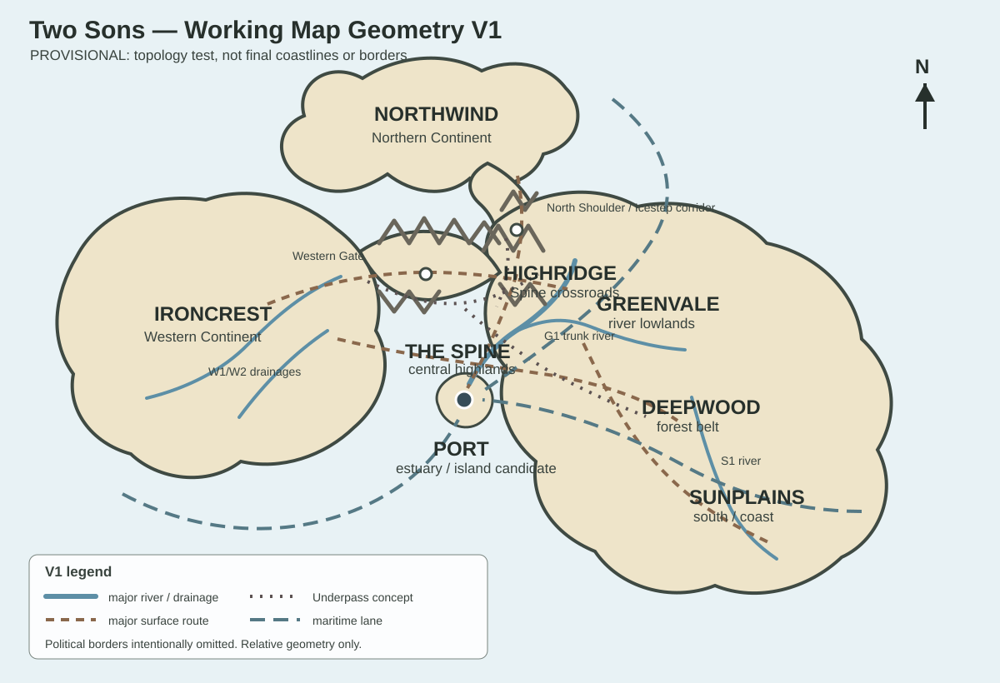

# Working Map Draft — Geometry V1

## Status

**Provisional design artifact — not canon.**

This page turns the established topology in [Geography and Connections](../Geography-and-Connections.md) into one concrete map geometry so the world can be tested spatially.

It deliberately separates:

- **VERIFIED / working-canon constraints** — already required by current owner pages;
- **PROVISIONAL choices** — this draft's proposed physical solution;
- **UNKNOWN details** — still not earned.

The purpose is not to make a pretty final map. It is to discover whether one actual arrangement can satisfy the world's trade, ecology, borders, and story pressures without contradiction.

## Visual draft



The SVG is schematic. Coastlines, borders, distances, and labels are intentionally rough.

## V1 parent outcome

This draft succeeds if a single rough geometry can plausibly explain:

1. why North Coast is maritime but still has a consequential overland connection to High Roads;
2. why High Roads matters to overland circulation;
3. why Stone Hills can interact directly with eastern regions without making The Spine irrelevant;
4. why Low Rivers can support major river agriculture and bulk transport;
5. why Old Cities water politics are structurally important;
6. why Port becomes a multimodal exchange hub;
7. why the Underpass is useful without replacing surface geography;
8. why alternative routes exist but have real cost.

## The central geometric choice

### PROVISIONAL — a Y-shaped convergence zone

V1 treats the three continental blocks as large lobes whose closest approaches form a rough **Y-shaped central zone** around The Spine.

This preserves the old idea of three recognizable continental masses without requiring every one to be completely isolated by open ocean.

The Spine occupies the difficult high ground around the meeting zone and extends into:

- Stone Hills-facing western uplands;
- the High Roads plateau and northern approaches;
- forested southeastern shoulders toward Longwood.

The result is a geography where the continents are visually and historically distinct, but actual travel depends on a small number of land corridors, passes, straits, and coastal approaches.

## Northern Continent

### VERIFIED / working canon

- North Coast occupies most of the Northern Continent.
- The coastline is irregular, cold, and maritime.
- Southward overland movement toward High Roads exists but is constrained.
- North Coast also has strong maritime alternatives.

### PROVISIONAL V1 solution

The southern coast contains a deep fissure / drowned valley system that cuts most easy land access away from the central mountains.

One narrow **southeastern highland shoulder** remains usable as the principal North Coast ↔ High Roads overland approach.

This is not one road. It is a corridor containing:

- one major pass;
- smaller seasonal paths;
- sheltered valleys;
- settlements controlling resupply;
- possible Tunnels entrances.

This solves the apparent tension between older material describing a dramatic fissure and later material requiring meaningful North Coast ↔ High Roads pass traffic.

### Test consequence

Closing this corridor should not isolate North Coast completely.

Instead it should:

- push more goods toward sea transport;
- raise convoy and Port dependence;
- increase prices for inland imports;
- make smuggling and lesser passes more attractive;
- create a reason for High Roads and North Coast to care about the same local crisis.

## Western Continent

### VERIFIED / working canon

- Stone Hills dominates the western uplands.
- Terrain rises toward The Spine.
- Rivers descend through settled valleys.
- Stone Hills has meaningful eastern and southeastern economic frontiers.

### PROVISIONAL V1 solution

The Western Continent bulges west from the central mountain system.

Its eastern edge does not meet the Eastern Continent along one broad flat border. Instead it approaches through **mountain shoulders and narrow intermontane corridors**.

V1 gives Stone Hills:

- one principal eastbound highland corridor toward Low Rivers / High Roads;
- smaller forest-margin approaches toward Longwood;
- western rivers draining away from The Spine;
- secondary southern and western ports that prevent Port from becoming the only maritime option.

This keeps Stone Hills connected while preserving the strategic importance of route control.

## Eastern Continent

### VERIFIED / working canon

The Eastern Continent contains the largest mixture of environments:

- Low Rivers lowlands;
- High Roads plateau / route country;
- Longwood forest systems;
- Old Cities warmer southern and eastern country.

### PROVISIONAL V1 order

From northwest / central highlands toward the southeast:

```text
The Spine / High Roads
        ↓
Low Rivers river lowlands
        ↓ ↘
 Longwood  warmer transition
        ↓        ↓
     Old Cities coast
```

This is not intended as four boxes. The actual boundaries follow:

- watersheds;
- forest edges;
- elevation;
- irrigation systems;
- old roads;
- historical settlement;
- market catchments.

## Port

### PROVISIONAL V1 choice — estuary/island complex

V1 places Port **just south of the central mountain junction**, where a major Low Rivers river reaches a protected inner bay / strait.

The city occupies an island, low peninsula, or closely connected harbor complex immediately beside the estuary.

The exact legal footprint remains unresolved.

This location is being tested because it gives Port access to:

- Low Rivers river-borne grain and bulk goods;
- High Roads roads descending from the plateau;
- North Coast shipping approaching from northern waters;
- Old Cities coastal shipping approaching from the south/east;
- Stone Hills maritime and short overland/ferry connections;
- Tunnels exits near, but not inside, the city.

### Why this is stronger than "Port is in the middle"

Port becomes central through **route intersection**:

```text
North Coast sea lanes
        ↓
   High Roads road
        ↓
Low Rivers river → PORT ← Stone Hills coastal / overland traffic
        ↑
Old Cities sea lanes
```

No one route is enough by itself.

### Falsifier

Reject this Port site if later map work shows that:

- it requires implausible river behavior;
- High Roads roads would naturally terminate somewhere else;
- North Coast and Old Cities routes do not actually converge nearby;
- Stone Hills has a much cheaper equivalent hub;
- the city cannot obtain fresh water / food;
- neutrality would be strategically nonsensical.

## Watershed skeleton

V1 uses **unnamed river systems** rather than prematurely naming them.

### G1 — Low Rivers trunk river

A large river rises in the High Roads / The Spine-facing uplands and crosses Low Rivers before reaching the Port estuary.

Required functions:

- fertile floodplains;
- grain transport;
- mill towns;
- major crossings;
- river quays;
- political linkage between inland agriculture and Port.

This river is one of the strongest reasons for the V1 Port location.

### G2 — eastern Low Rivers / Longwood tributary system

A major tributary drains wetter Longwood margins into the Low Rivers system.

This creates shared stakes in:

- deforestation;
- flooding;
- silt;
- timber transport;
- fisheries;
- bridge and road placement.

It also ensures Longwood water decisions can matter outside Longwood.

### S1 — Old Cities river

A separate system descends toward the southern/eastern coast.

It should have:

- lower average flow;
- greater seasonal variability;
- multiple diversions;
- irrigation towns;
- politically important headwaters or tributaries outside one city-state's full control.

Its exact source is intentionally unresolved.

### W1 / W2 — Stone Hills drainages

Several shorter rivers descend westward from The Spine-facing uplands.

They support:

- mills;
- mine settlements;
- lower-valley farming;
- bulk movement where navigable;
- ports that provide limited alternatives to the central network.

## Surface route skeleton

### R1 — Western Gate

Stone Hills ↔ Low Rivers / High Roads.

A major maintained corridor through lower The Spine terrain.

It should be expensive enough that tolls, maintenance, snow, landslides, and security matter.

### R2 — North Shoulder / Icestep corridor

North Coast ↔ High Roads.

The principal constrained northern overland route.

Its importance comes from being **one of few**, not the only imaginable path.

### R3 — River Road

High Roads / Low Rivers ↔ Port.

A road-and-river transport corridor following G1.

Bulk goods favor water; high-value, time-sensitive, military, and passenger traffic may favor road segments.

### R4 — Forest Edge Road

Stone Hills / Low Rivers ↔ Longwood margins.

This route should repeatedly cross political and ecological boundaries rather than forming one clean imperial highway.

### R5 — Southern Market Road

Low Rivers / Longwood transition ↔ Old Cities city-state network.

This becomes important when coastal shipping is risky or when inland agricultural exchange is cheaper than Port transshipment.

## Maritime skeleton

### M1 — Northern lane

North Coast ports and islands ↔ Port.

Seasonal storms, convoy politics, and piracy affect this route strongly.

### M2 — Southern / eastern lane

Old Cities coastal cities ↔ Port.

This is a chain of coastal markets, not a single origin-to-destination line.

### M3 — Western feeder lanes

Stone Hills's secondary ports ↔ Port and other markets.

They provide alternatives while still making Port attractive for transactions requiring finance, warehousing, arbitration, or onward connections.

## Tunnels skeleton

V1 does **not** map the Underpass completely.

Only three public-level concepts are shown:

### U1 — Western crossing

A known branch that can bypass part of R1.

Useful for winter or political closures, but:

- slower in some seasons;
- capacity-limited;
- toll-controlled;
- vulnerable to collapse.

### U2 — Northern branch

A difficult branch associated with the North Coast / High Roads approach.

It should never make the surface pass irrelevant.

### U3 — Forest branch

A set of poorly unified routes connecting Longwood-side communities to central mountain routes.

This is the best candidate for hidden movement, local trade, refugees, guides, and smuggling.

## Chokepoints created by V1

The draft naturally creates several different chokepoint types:

| Chokepoint | Why it matters | Main failure mode |
| --- | --- | --- |
| North Shoulder | scarce North Coast overland access | winter / landslide / conflict |
| Western Gate | bulk west-east land trade | tolls / damage / military control |
| High Roads junctions | route switching and brokerage | attack / finance / road closure |
| G1 crossings | Low Rivers bulk movement | flood / bridge loss / seizure |
| Port estuary | multimodal transfer | blockade / labor / finance / rumor |
| Old Cities waterworks | agricultural survival | drought / diversion / sabotage |
| Tunnels junctions | bypass capacity | collapse / control / secrecy |

This is preferable to one universal chokepoint because different crises can redirect pressure rather than simply stop the world.

## First causal tests

### Test A — North Coast piracy

```text
piracy rises on M1
→ convoy cost rises
→ Port credit tightens
→ some high-value traffic tries R2 through High Roads
→ High Roads transport prices rise
→ Low Rivers / Stone Hills traders compete for caravan capacity
→ Tunnels alternatives become more valuable
```

**Result:** V1 supports the existing systemic example without requiring Port to monopolize all trade.

### Test B — Western Gate closure

```text
R1 closes
→ Stone Hills food imports become more expensive
→ some traffic shifts to western ports + Port
→ some traffic shifts to U1
→ High Roads loses some toll / brokerage traffic but gains rerouting work
→ Longwood forest-edge paths attract legal and illegal movement
```

**Result:** the map produces substitution rather than binary isolation.

### Test C — Old Cities drought

```text
S1 flow declines
→ upstream/downstream conflict
→ irrigated output falls
→ coastal imports rise
→ M2 traffic toward Port increases
→ Low Rivers food prices rise from external demand
→ water-control politics become continental economics
```

**Result:** Old Cities hydrology connects naturally to the world system.

## Decisions V1 intentionally does not make

Still UNKNOWN:

- final coastline shapes;
- exact scale;
- final Port island vs peninsula vs mainland-estuary form;
- named rivers;
- exact capital locations;
- exact political borders;
- exact number of major passes;
- exact Tunnels entrances;
- whether High Roads has a direct Old Cities border;
- travel times;
- prevailing winds and currents;
- which settlements from the legacy name bank survive.

## Scale test result — 2026-09-23

[Working Map — Scale and Travel-Time Test V1](Working-Map-Scale-and-Travel-Test.md) has now tested this geometry against:

- walking / pack / cart travel;
- mounted dispatch;
- river movement;
- coastal sailing;
- seasonal delay;
- Underpass capacity;
- rerouting after closures.

**Result: V1 passes at the network level.**

Strong surviving geometry:

- the Y-shaped central convergence remains viable;
- Port works best at the G1 estuary / strait system just south of the central junction;
- the southeastern North Coast shoulder remains the strongest constrained overland solution;
- Western Gate remains important without becoming the only west/east route;
- Underpass branches remain useful because capacity, reliability and secrecy differ from surface routes.

Still provisional:

- exact coastlines;
- island vs peninsula vs mainland Port footprint;
- exact miles;
- exact river endpoints;
- exact road engineering;
- final pass / entrance locations.

## Capacity / endpoint test result — 2026-09-23

[Working Map — Network Endpoints and Capacity Test V1](Working-Map-Network-Endpoints-and-Capacity.md) now resolves the next layer: where bulk river navigation ends, which roads carry carts end-to-end, how North Shoulder transshipment works, and why Port is best treated as an estuary / channel complex.

Its strongest result is that **mode-conversion points are strategic chokepoints** because unloading, storage, animals, labor, inspection and finance cluster there.

## What should happen next

The next geography pass should resolve **network endpoints and capacity**, especially:

- where G1 stops being navigable upstream;
- which surface roads carry heavy carts end-to-end;
- final Port local harbor / estuary geometry;
- which chokepoints have enough throughput to become strategic;
- where the major Underpass entrances actually meet surface settlements.

Do not redraw the whole topology unless one of those tests creates a contradiction.
