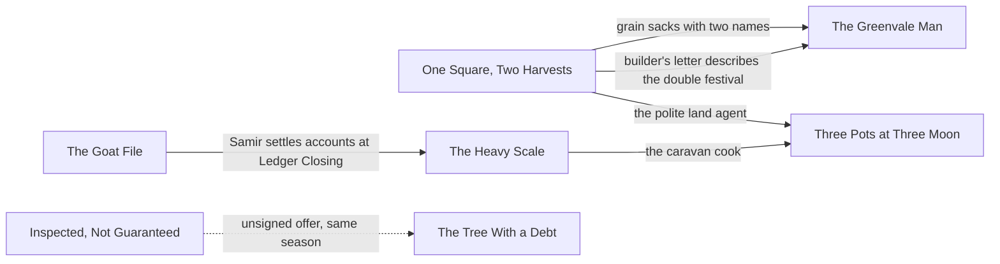

# The Anthology

## Status

**Provisional collection design — writing reference, not setting canon.** This page owns how the seven Sunday Morning stories work *as a collection*: reading order, arc, recurring elements and cross-story promises. Each story page still owns its own story, and [World Threads](World-Threads.md) owns how the stories sit on the domino web.

**Development level: L2 Outlined** — the collection-level THINK and PLAN pass below, run 2026-09-27 at James's request to use THINK and PLAN more fully.

## The collection in one sentence

Seven small communities, one bad year: a domino lands in each, and each holds for its own small reasons, while the reader alone watches the pattern gather.

Working title, provisional: *Sunday Mornings in a Bad Year*.

## Reading order

Read in calendar order. Each story stands alone; read in order, they add up to a year.

| # | Story | When | What the reader gains |
| --- | --- | --- | --- |
| 1 | [One Square, Two Harvests](Stories/One-Square-Two-Harvests.md) | Year 1, early autumn | A rumor dies and a polite land agent leaves. It reads as purely local. |
| 2 | [The Greenvale Man](Stories/The-Greenvale-Man.md) | Year 1, late autumn | A second rumor, on another coast, dies the same way. A sack of Harveston grain turns up in the cove's stores. |
| 3 | [The Goat File](Stories/The-Goat-File.md) | Year 1, late autumn | Credit is tightening somewhere far away. Samir Tareh is in the gallery. |
| 4 | [Inspected, Not Guaranteed](Stories/Inspected-Not-Guaranteed.md) | Year 2, early spring | An unsigned offer arrives at exactly the wrong moment. People gossip about someone who took one. |
| 5 | [The Heavy Scale at Icestep Summit](Stories/The-Heavy-Scale.md) | Year 2, early spring | Samir's survey decides which passes live. The caravan cook complains about mushroom prices. |
| 6 | [The Tree With a Debt](Stories/The-Tree-With-a-Debt.md) | Year 2, midsummer | A second unsigned offer, and plans that leaked. The attentive reader now suspects a hand. |
| 7 | [Three Pots at Three Moon](Stories/Three-Pots-at-Three-Moon.md) | Year 2, early autumn | The polite land agent is mentioned by a family who didn't escape him. One street holds. The reader knows more than anyone in it. |

## How the stories connect

Every connection rides a real flow in the world — grain, credit, caravans, letters, displaced people — never coincidence. Each story links to at most two other stories, so none depends on another to be understood. (One Square, Two Harvests carries three details, but they reach only two stories.)



Solid lines are cross-story promises the reader can check. The dotted line is a deliberate question: two unsigned offers the reader may or may not connect.

## Cross-story promise ledger

| Promise | Set up in | Pays off in | Flow it rides | Recognition needed? |
| --- | --- | --- | --- | --- |
| C1 grain sacks stamped *Commons / Press Yard* | One Square, s8 (the grain handed out) | The Greenvale Man, winter stores | Northwind imports grain in winter ([Trade](../Economy/Trade-and-Dependencies.md#core-model)) | No — a pleasant detail for those who notice |
| C2 the old builder's letter | One Square, s8 (the old builder at the joint table) | The Greenvale Man, s1 letter: "they held two festivals at once and ate everything" | The builder retired to Greenvale | No |
| C3 the polite land agent | One Square, s2 and s8 | Three Pots, Mrs. Arden: "a very polite man bought our notes" | Consolidation continues elsewhere in Greenvale | Optional — the line works without it |
| C4 Samir Tareh | The Goat File, s8 (settling accounts at Ledger Closing) | The Heavy Scale, s9 (his route book already lists Seven Wells) | Caravan negotiators settle debts at Ledger Closing | No |
| C5 the Deepwood caravan cook | The Heavy Scale, s9 (the first caravan's cook, grumbling about mushroom prices) | Three Pots, s5 (his verdict on the stews) | He cooks for caravans since the blight | No |
| C6 unsigned offers | Inspected, s4 (Col's patron) | The Tree With a Debt, s5 (Hollis's buyer) | Offers by letter are ordinary | Open question — see below |

## Development record

### Stage 1 — THINK (collection level)

**Reasoning allocation:** structured single path plus reserve methods. THINK's own tests did not earn extra methods by default. Here they are used at James's request, and each is tied to a specific failure signal found in the collection, which is THINK's rule for bringing reserve methods in.

| Method | Failure signal it answers | Finding |
| --- | --- | --- |
| **Frame challenge** | Are these seven separate stories, or one work? | A linked cycle, read in calendar order, each story standalone. The collection's arc is the reader's growing knowledge, not any character's. |
| **Systems thinking** | The stories touched the domino chain but not each other: seven spokes, no rim. | Links must follow real flows (grain, credit, caravans, letters, displaced people). Six links meet that test; see the ledger. |
| **Inversion / premortem** | Every nail fails. The web is too tidy, and the Villain would never be that unlucky. | Local holds, the system still moves. In every story the same nail succeeds somewhere just offstage; see [Where the nail still fell](World-Threads.md#where-the-nail-still-fell). |
| **Perspective shift** | Nobody has looked at these events from the Villain's or the Council's side. | Recorded as [the view from the desks](World-Threads.md#the-view-from-the-desks). Individually each story is noise; together they are the kind of noise the Villain's canon arc says he eventually notices. |
| **Abduction** | What should an attentive reader be able to infer, and when? | By story 6, "someone is behind the offers" is the best explanation available; nothing in the stories confirms it. See the reading-order table. |
| **Counterexample search** | Do the links become coincidence? | Rejected: Wurdren appearing in a second story (no flow puts him there); the land agent appearing in person in Port (he would have no reason to be there). Kept only links a trade or travel route explains. |

**PLAN handoff**

```text
frame             a linked cycle: seven communities, one year, one domino web the characters never see
selected strategy calendar reading order; each story linked to ≤2 others, each link on a real flow; local holds, system moves
alternatives      A a shared protagonist (Wurdren) across stories — set aside: breaks rule 20 and his canon arc
                  B no links at all — set aside: the collection would not add up to a year
                  C every link explicit — set aside: stories would stop standing alone
assumptions       calendar and all attributions provisional (World Threads)
unknowns          whether the two unsigned offers share an author (question for James)
reconsider if     any story needs another to be understood; a link feels like coincidence in draft;
                  the reader's inference arrives before story 6 or never
```

### Stage 2 — PLAN (collection level)

**Decomposition:** the collection breaks into seven drafting tasks. No finer breakdown is needed: cross-links are cameos and details, not plot dependencies.

**Draft order:** any story can be drafted independently. Cross-story details must match once both ends exist, so the setup end of each link is authoritative:

| Link | Authoritative end | Check when the other end is drafted |
| --- | --- | --- |
| C1, C2, C3 | One Square, Two Harvests | sack stamp wording; festival details in the letter; the agent's manner |
| C4 | The Goat File | Samir's reason for being at Ledger Closing |
| C5 | The Heavy Scale | the cook's name and grievance |
| C6 | open | only after James decides |

**Expected reader state** (PLAN's expected-evidence idea applied to the reader): the reading-order table above states what each story should leave the reader knowing. JUDGE checks drafts against it.

**Reconsideration triggers**

- A draft needs another story's events to make sense → cut the link back to a detail (PLAN).
- Readers of story 1 alone sense a conspiracy → the rumor reads too pointed; soften it (THINK on that story).
- The collection reads as seven identical "the town holds" endings → vary the endings' cost (THINK).

## Open question for James

The two unsigned offers (C6) could be written with a shared detail, such as the same good paper or the same phrasing, which tells the reader one hand is behind both. Or they could stay unconnected, leaving the reader to wonder. Their out-of-story attributions currently differ: Villain for Col's letter, `UNKNOWN` for Hollis's buyer.
