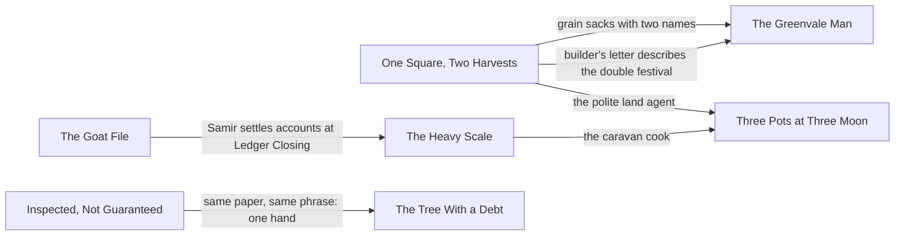

# Collection

## Status

**Provisional collection design and a derived view of the domino web. Writing reference, not setting canon.** This page owns how the seven Sunday Morning stories work *as a set*: reading order and calendar, what the reader knows after each story, the cross-story promises, and how the set sits on the domino web. Each story page still owns its own story and its own Larger-world thread; this page shows how they connect.

The calendar and every attribution below are **provisional**. The Villain's identity and plan remain [open questions](../../Open-Questions.md#villain), and [Current Events](../../Story/Current-Events.md) hasn't been audited against a final map. Rules for the world tie are on [Rules](Rules.md#the-world-tie-rule-connected-not-driven).

**Development level: L2 Outlined** at collection level (the THINK and PLAN pass below, 2026-09-27). All seven stories are drafted to L3; see the [story index](../README.md#read-the-stories).

## The collection in one sentence

Seven small communities, one bad year: a domino lands in each, and each holds for its own small reasons, while the reader alone watches the pattern gather.

Working title, provisional: *Sunday Mornings in a Bad Year*.

## Reading order

Read in calendar order. Each story stands alone; read in order, they add up to a year. The order follows the ripple chain: grain fails in the autumn of year 1, the effects reach the forges and passes the next spring, and displaced families reach Port by the following autumn.

| # | Story | When | Festival clock | What the reader gains |
| --- | --- | --- | --- | --- |
| 1 | [One Square, Two Harvests](../Stories/One-Square-Two-Harvests.md) | Year 1, early autumn | Harvest Home + Wine Crush | A rumor dies and a polite land agent leaves. It reads as purely local. |
| 2 | [The Greenvale Man](../Stories/The-Greenvale-Man.md) | Year 1, late autumn | Last Sail | A second rumor, on another coast, dies the same way. A sack of Harveston grain turns up in the cove's stores. |
| 3 | [The Goat File](../Stories/The-Goat-File.md) | Year 1, late autumn | Ledger Closing | Credit is tightening somewhere far away. Samir Tareh is in the gallery. |
| 4 | [Inspected, Not Guaranteed](../Stories/Inspected-Not-Guaranteed.md) | Year 2, early spring | Forge Reawakening | An unsigned offer arrives at exactly the wrong moment. People gossip about someone who took one. |
| 5 | [The Heavy Scale at Icestep Summit](../Stories/The-Heavy-Scale.md) | Year 2, early spring | Pass Opening + Ice Breaking | Samir's survey decides which passes live. The caravan cook complains about mushroom prices. |
| 6 | [The Tree With a Debt](../Stories/The-Tree-With-a-Debt.md) | Year 2, midsummer | Canopy Vigil + Midsummer Debates | A second unsigned offer, on the same Port paper, in the same turn of phrase. The attentive reader now knows one hand wrote both; nobody in the story does. |
| 7 | [Three Pots at Three Moon](../Stories/Three-Pots-at-Three-Moon.md) | Year 2, early autumn | Three Moon Festival | The polite land agent is mentioned by a family who didn't escape him. One street holds. The reader knows more than anyone in it. |

The last column is the **expected reader state**, PLAN's expected-evidence idea applied to the reader. JUDGE checks drafts against it.

## How the stories connect

Every connection rides a real flow in the world (grain, credit, caravans, letters, displaced people), never coincidence. Each story links to at most two others, so none depends on another to be understood. (One Square carries three details, but they reach only two stories.)



### Cross-story promise ledger

Every line is a promise the reader can check. The links are provisional: a draft that doesn't want one can drop it back to nothing (except C6, which is [D3](Decisions.md)). While a link stands, the setup end is authoritative, and the other end must match it.

| Promise | Set up in (authoritative) | Pays off in | Flow it rides | Must match | Recognition needed? |
| --- | --- | --- | --- | --- | --- |
| **C1** grain sacks stamped *Commons / Press Yard* | One Square, s8 (the grain handed out) | The Greenvale Man, winter stores | Northwind imports grain in winter ([Trade](../../Economy/Trade-and-Dependencies.md#core-model)) | the stamp wording (COMMONS / PRESS YARD and PRESS YARD / COMMONS) | No: a pleasant detail for those who notice |
| **C2** the old builder's letter | One Square, s8 (old Scarth at the joint table) | The Greenvale Man, s1 letter: "they held two festivals at once and ate everything" | Scarth retired to Greenvale; his letter names Harveston Vale | the festival details | No |
| **C3** the polite land agent | One Square, s2 and s8 | Three Pots, Mrs. Arden: "a very polite man bought our notes" | Consolidation continues elsewhere in Greenvale; the Ardens' farm is one that *did* sell, a year after the Vale avoided it | the agent's manner (polite, lunch) | Optional: the line works without it |
| **C4** Samir Tareh | The Goat File, s8 (settling caravan accounts at Ledger Closing; he hears the goat ruling) | The Heavy Scale, s9 (his route book already lists "Seven Wells: water and guides, one roof") | Caravan negotiators settle debts at Ledger Closing | his reason for being at Ledger Closing | No |
| **C5** the Deepwood caravan cook, Garro Sedgewater | The Heavy Scale, s9 (the first caravan's cook, grumbling that mushrooms cost more than meat) | Three Pots, s5 (his verdict on the stews) | He has cooked for caravans since the blight took his village's mushroom harvest; he came over Icestep | his name and grievance | No |
| **C6** the connected offers | Inspected, s4 (Col's patron) | The Tree With a Debt, s5 (Hollis's buyer) | Offers by letter are ordinary; both come through the same Port stationer | unsigned, heavy cream paper, ship's-lantern watermark, "should … fail to recognize" | Yes, for the collection's payoff: the watermark and phrase must be salient in s4 |

C6 is the collection's only link to the hidden hand ([D3](Decisions.md)). No character connects the two letters; the reader who has read both can. Readers keep gist, not wording, so the phrase gets salience where it first appears (Col reads it aloud to Wurdren in s5), and the watermark gets one concrete sentence in each story.

**Saga link, not a cross-story link:** in Inspected, Wurdren meets the anonymous-patron pattern for the first time. It is the first of the recurring "strange orders, inexplicable resources" his [middle arc](../../Story/Wurdren.md#middle) turns on.

## The web

Each story lands on a different link of the ripple chain that [Current Events](../../Story/Current-Events.md#example-ripple-chain) already describes: piracy raises shipping risk, credit tightens, Greenvale grain stops selling, farms fail, tool orders fall, and so on outward.

The whole web, with every story and seed placed on it and the open dominoes marked, is the [Domino Map](Domino-Map.md) ([interactive version](https://claude.ai/artifact/PAf2C4bDk7bfjVunex17Ps)).


### The threads

A summary of each story page's Larger-world thread; the story page owns the detail. "Behind it" is an out-of-story, provisional attribution that nobody inside a story knows.

| Story | Current event | Domino figure | The nail | Behind it | Local outcome | Outward effect |
| --- | --- | --- | --- | --- | --- | --- |
| [One Square, Two Harvests](../Stories/One-Square-Two-Harvests.md) | Greenvale abundance crisis; unsafe-grain rumors; land consolidation | [Rosana Meadowcroft](../../Story/Villains-Dominoes.md#rosana-meadowcroft--greenvale) (her seed strain) | A rumor that Meadowcroft-seed grain is unsafe, and a land agent circling the Vale's indebted farms | Rumor: Villain-amplified. Land agent: `UNKNOWN` (Council-linked finance or ordinary speculators) | The joint festival eats the grain in public; the Salve house buys and distributes it; no farm sells to the agent | A Greenvale co-op and a Sunplains patron house now trade grain together, a precedent rivals could later read as a bloc forming ([Bahriyya's domino](../../Story/Villains-Dominoes.md#bahriyya-nazar--sunplains)) |
| [The Greenvale Man](../Stories/The-Greenvale-Man.md) | Northwind piracy; accusations that clans shelter raiders; convoy politics | [Maris Bleakshore](../../Story/Villains-Dominoes.md#maris-bleakshore--northwind) (her call for convoy patrols) | "It is said" Narrow Sound shelters raiders; some want the regatta cancelled | Villain-amplified rumor | Old Rask asks who *saw* it; nobody did; the coves race anyway | Two coves still sailing together is one less "credible" report feeding the patrol push |
| [The Goat File](../Stories/The-Goat-File.md) | Port credit tightening; Highridge caravan attacks cutting trade | none | Lenders will renew Seven Wells' credit only if deferred claims are cleared | Council finance stabilizing lenders (ordinary pressure, not a scheme) | The file closes with no house losing face; a caravan house and a cistern house will join | A joined house can offer caravans water and guides together, just as routes are being redrawn |
| [Inspected, Not Guaranteed](../Stories/Inspected-Not-Guaranteed.md) | Tool orders fall; forges on short hours; strike talk; good steel vanishing into private contracts | [Orin Slatehallow](../../Story/Villains-Dominoes.md#orin-slatehallow--ironcrest) (the pattern Col nearly follows) | An anonymous patron offers Col funding "should the guild fail to recognize" his work | Villain (provisional): the same approach that took Orin | Col passes his judgment, so the letter goes unanswered; Wurdren notices it | One skilled repairer stays independent; Wurdren has seen his first "convenient offer" |
| [The Heavy Scale at Icestep Summit](../Stories/The-Heavy-Scale.md) | Caravan attacks; route redirection | [Samir Tareh](../../Story/Villains-Dominoes.md#samir-tareh--highridge) (travels with the first caravan) | Samir is judging which passes are reliable this season; a crooked scale would strike Icestep from his list | The scale fault is weather; the concentration pressure is the Villain's pattern | A public correction; Samir lists Icestep as honest | Traffic stays spread across more than one pass, blunting the concentration the domino needs |
| [The Tree With a Debt](../Stories/The-Tree-With-a-Debt.md) | Deepwood road and logging conflict; Council infrastructure interest | [Naruin Mossglade](../../Story/Villains-Dominoes.md#naruin-mossglade--deepwood) (Sessa's senior warden) | An unnamed buyer offers to purchase old pledges along a proposed road; whoever holds a "for as long as it stands" pledge profits if the tree falls | The Villain, through a Port intermediary: the same hand as Col's patron. The pledges are meant to become leaked evidence for Naruin | Hollis renews the pledge as guardianship instead of selling | Sessa brings Naruin a working counterexample: a negotiated path and a Highridge family sworn to a tree |
| [Three Pots at Three Moon](../Stories/Three-Pots-at-Three-Moon.md) | Refugee and worker pressure; smuggling surge; Deepwood fungal disruption | none | A street rumor that the newcomers next door are smugglers, while inspectors are fining unpermitted stalls | Ordinary prejudice | The first bowl goes to the newcomers; Jory files their permit | Three Moon does its civic job on one street: incompatible people share one space |

### Where the nail still fell

Every story holds its own ground, but the same nail succeeds somewhere just offstage. A web where every domino misses would be too tidy, and the Villain's plan too weak to matter. Each of these appears in its story as one line at most, never as the story's subject ([tone guardrails](Rules.md#tone-guardrails)).

| Story | Holds here | Still falls elsewhere |
| --- | --- | --- |
| One Square, Two Harvests | No Vale farm sells to the land agent | Farms elsewhere in Greenvale do; the Ardens in Three Pots are one of them |
| The Greenvale Man | Kettle Cove races Narrow Sound | Other coves take the rumor and leave Narrow Sound out of their convoy |
| The Goat File | Seven Wells closes its file without ruin | In other towns, forced closures ruin families; the tea seller has heard of two |
| Inspected, Not Guaranteed | Col never answers the letter | Orin Slatehallow already answered his |
| The Heavy Scale | Icestep stays on Samir's list | Another pass town, with a genuinely bad scale, comes off it |
| The Tree With a Debt | Hollis won't sell | The buyer has already bought other pledges along the planned road |
| Three Pots at Three Moon | One street shares its space | The smuggling rumors keep running on the next street over |

### The view from the desks

Out of story: what each hidden power could conclude from the seven events, following [World Rules §12](../../World-Rules.md#12-every-major-event-should-have-second--and-third-order-effects). Written for the saga's use, and provisional because the Villain's plan is [open](../../Open-Questions.md#villain).

| Story | The Villain's desk sees | The Council's desk sees |
| --- | --- | --- |
| One Square, Two Harvests | A rumor that didn't take in one valley. Noise. | A Sunplains patron house buying Greenvale grain directly. It looks like the start of cross-border consolidation, and the Council might quietly tighten the Salve house's credit. The Villain could then point to that squeeze as proof that the Council punishes Sunplains cooperation. |
| The Greenvale Man | One cove refused the Narrow Sound story. Noise. | Nothing. Northwind convoy patrols are growing, and one regatta changes no ledger. |
| The Goat File | Nothing. | A town cleaned its books under credit pressure without a scandal: the system working as intended. |
| Inspected, Not Guaranteed | One talent declined the patron. Noise, unless it repeats. | Nothing. |
| The Heavy Scale | A pass he expected to lose traffic kept it. Mildly inconvenient. | A route stayed open. Welcome, and unexamined. |
| The Tree With a Debt | One pledge refused, and Naruin now holds something that argues against the escalation the leaks were meant to provoke. Worth watching. | Pledges changing hands along its planned right of way. The Council assumes ordinary speculators and may pay more to clear them, a misreading the Villain can use. |
| Three Pots at Three Moon | Nothing. | Nothing. |

Individually, every entry is noise. Together they are the kind of pattern the [Villain's page](../../Story/Villain.md#relationship-to-wurdren) says he eventually notices: people repairing connections without being paid or coerced. That realization belongs to the saga, not to any Sunday Morning story.

### What the web adds

Taken together, the seven stories are places where a domino should have fallen and, mostly, didn't, because people acted for small local reasons. That is the setting's claim about ordinary decency ([Villain's Dominoes](../../Story/Villains-Dominoes.md#wurdrens-effect): changing relationships, not knocking dominoes backward). Two stories show the other side: Harveston Vale's good outcome may feed a later suspicion, and Icestep's honest scale is only one pass among many.

## Development record

### Stage 1 — THINK (collection level)

**Reasoning allocation:** structured single path plus reserve methods. THINK's tests didn't earn extra methods by default. Here they were used at James's request, each tied to a specific failure signal found in the collection, which is THINK's rule for bringing reserve methods in.

| Method | Failure signal it answers | Finding |
| --- | --- | --- |
| **Frame challenge** | Are these seven separate stories, or one work? | A linked cycle, read in calendar order, each story standalone. The collection's arc is the reader's growing knowledge, not any character's. |
| **Systems thinking** | The stories touched the domino chain but not each other: seven spokes, no rim. | Links must follow real flows (grain, credit, caravans, letters, displaced people). Six links meet that test; see the ledger. |
| **Inversion / premortem** | Every nail fails. The web is too tidy, and the Villain would never be that unlucky. | Local holds, the system still moves. In every story the same nail succeeds just offstage; see [Where the nail still fell](#where-the-nail-still-fell). |
| **Perspective shift** | Nobody had looked at these events from the Villain's or the Council's side. | Recorded as [the view from the desks](#the-view-from-the-desks). Individually each story is noise; together they are the kind of noise the Villain's canon arc says he eventually notices. |
| **Abduction** | What should an attentive reader be able to infer, and when? | By story 6, "someone is behind the offers" is the best explanation available; nothing in the stories confirms it. See the reading order. |
| **Counterexample search** | Do the links become coincidence? | Rejected: Wurdren appearing in a second story (no flow puts him there); the land agent appearing in person in Port (he'd have no reason to be there). Kept only links a trade or travel route explains. |

**PLAN handoff**

```text
frame             a linked cycle: seven communities, one year, one domino web the characters never see
selected strategy calendar reading order; each story linked to ≤2 others, each link on a real flow; local holds, system moves
alternatives      A a shared protagonist (Wurdren) across stories — set aside: breaks rule 20 and his canon arc
                  B no links at all — set aside: the collection would not add up to a year
                  C every link explicit — set aside: stories would stop standing alone
assumptions       calendar and all attributions provisional
decided           the two offers are connected (James, 2026-09-27; D3)
reconsider if     any story needs another to be understood; a link feels like coincidence in draft;
                  the reader's inference arrives before story 6 or never
```

### Stage 2 — PLAN (collection level)

**Decomposition:** seven drafting tasks. No finer breakdown is needed: cross-links are cameos and details, not plot dependencies. Any story can be drafted independently; the ledger's authoritative end settles any mismatch.

**Reconsideration triggers**

- A draft needs another story's events to make sense → cut the link back to a detail (PLAN).
- Readers of story 1 alone sense a conspiracy → the rumor reads too pointed; soften it (THINK on that story).
- The collection reads as seven identical "the town holds" endings → vary the endings' cost (THINK). The [Registry's story shapes](Registry.md#story-shapes) track this now.
