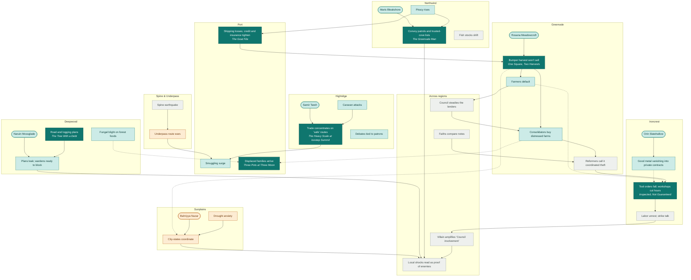

# Domino Map

## Status

**Writing reference, not setting canon.** This page owns the map of the Villain's dominoes and the world's current events, with every Sunday Morning story and seed placed on the domino it touches, so the gaps show. It is **generated**: edit [`domino-map.json`](domino-map.json), then run `python3 tools/domino_map.py` from the repository root. That rewrites this page and the [interactive map](domino-map.html) together; the published copy is at https://claude.ai/artifact/PAf2C4bDk7bfjVunex17Ps (republish it after regenerating). Don't edit this page by hand.

The dominoes come from their owner pages: [Villain's Dominoes](../../Story/Villains-Dominoes.md) and [Current Events](../../Story/Current-Events.md), including its example ripple chain. A **canon** arrow is stated on one of those pages. A **story design** arrow (dotted) was set by the collection and is provisional. How each story sits on its domino in detail is on [Collection: the threads](Collection.md#the-threads); the rules for tying a story in are on [Rules](Rules.md#the-world-tie-rule-connected-not-driven).

**Ground** dominoes are places a Sunday Morning story can live. **Saga** dominoes (the Council's moves, the Villain's amplification, the slide toward war) belong to the main saga; Sunday Morning stories only feel them from the ground, so a gap there is not a Sunday Morning gap.

## Coverage

Of 30 ground-level dominoes: **7** have a story, **14** are touched by one, **4** have only a seed, and **5** are open.

### Open, with nothing on them yet

- **Fish stocks shift** (Northwind, current event): Some fisheries are declining or moving: price rises, clan disputes, illegal fishing, pressure for new agreements. [source](../../Story/Current-Events.md#fish-stocks-and-access)
- **Reformers call it coordinated theft** (Greenvale, ripple-chain step): Ripple chain step 8: religious and guild reformers accuse the buyers of engineering the crisis. [source](../../Story/Current-Events.md#example-ripple-chain)
- **Labor unrest; strike talk** (Ironcrest, current event): Workers organize around wages, safety, debt and guild control. Ripple chain step 11: strike leaders blame owners. [source](../../Story/Current-Events.md#labor-unrest)
- **Spine earthquake** (Spine & Underpass, current event): Land movement damages roads and exposes ruins, caves and sealed routes: resource rushes, religious claims, territorial disputes. [source](../../Story/Current-Events.md#earthquakeland-movement)
- **Faiths compare notes** (Across regions, current event): Faiths begin to read the crises across regions: scholars compare records, Weavers document damage, Compass pilgrims carry rumors. [source](../../Story/Current-Events.md#religious-networks)

### Seed only

- **Drought anxiety** (Sunplains): The Ladder Rules
- **Bahriyya Nazar** (Sunplains): The Ladder Rules
- **City-states coordinate** (Sunplains): The Ladder Rules
- **Underpass route wars** (Spine & Underpass): The Mushrooms From Nowhere

### Touched but not the center of any story

- **Piracy rises** (Northwind): touched by The Greenvale Man
- **Maris Bleakshore** (Northwind): touched by The Greenvale Man
- **Smuggling surge** (Port): touched by Three Pots at Three Moon
- **Rosana Meadowcroft** (Greenvale): touched by One Square, Two Harvests
- **Farmers default** (Greenvale): touched by Inspected, Not Guaranteed
- **Consolidators buy distressed farms** (Greenvale): touched by One Square, Two Harvests, Three Pots at Three Moon
- **Orin Slatehallow** (Ironcrest): touched by Inspected, Not Guaranteed
- **Good metal vanishing into private contracts** (Ironcrest): touched by Inspected, Not Guaranteed
- **Caravan attacks** (Highridge): touched by The Goat File, The Heavy Scale at Icestep Summit
- **Samir Tareh** (Highridge): touched by The Heavy Scale at Icestep Summit
- **Debates tied to patrons** (Highridge): touched by The Tree With a Debt
- **Naruin Mossglade** (Deepwood): touched by The Tree With a Debt
- **Plans leak; wardens ready to block** (Deepwood): touched by The Tree With a Debt
- **Fungal blight on forest foods** (Deepwood): touched by Three Pots at Three Moon

## The map

Solid arrows are canon; dotted arrows are story design. Dark fill: a story sits here. Light fill: a story touches it. Amber: seed only. Grey: open. The [interactive map](https://claude.ai/artifact/PAf2C4bDk7bfjVunex17Ps) is easier to read: click a domino to see what feeds it, what it tips over, and which stories sit on it.

## Every domino

| Region | Domino | Kind | Coverage | Comes from | Leads to |
| --- | --- | --- | --- | --- | --- |
| Northwind | [Piracy rises](../../Story/Current-Events.md#piracy-and-convoy-politics) | current event | touched by a story: [The Greenvale Man](../Drafts/The-Greenvale-Man.md) (touches) | — | Shipping losses; credit and insurance tighten; Convoy patrols and trusted-cove lists |
| Northwind | [Convoy patrols and trusted-cove lists](../../Story/Current-Events.md#piracy-and-convoy-politics) | current event | has a story: [The Greenvale Man](../Drafts/The-Greenvale-Man.md) | Piracy rises; Maris Bleakshore | Local shocks read as proof of enemies |
| Northwind | [Maris Bleakshore](../../Story/Villains-Dominoes.md#maris-bleakshore--northwind) | character domino | touched by a story: [The Greenvale Man](../Drafts/The-Greenvale-Man.md) (touches) | — | Convoy patrols and trusted-cove lists |
| Northwind | [Fish stocks shift](../../Story/Current-Events.md#fish-stocks-and-access) | current event | open | — | — |
| Port | [Shipping losses; credit and insurance tighten](../../Story/Current-Events.md#merchant-conflict) | current event | has a story: [The Goat File](../Drafts/The-Goat-File.md) | Piracy rises | Bumper harvest won't sell |
| Port | [Smuggling surge](../../Story/Current-Events.md#smuggling-surge) | current event | touched by a story: [Three Pots at Three Moon](../Drafts/Three-Pots-at-Three-Moon.md) (touches) | Trade concentrates on 'safe' routes; Underpass route wars | — |
| Port | [Displaced families arrive](../../Story/Current-Events.md#refugeeworker-pressure) | current event | has a story: [Three Pots at Three Moon](../Drafts/Three-Pots-at-Three-Moon.md) | Consolidators buy distressed farms *(story design)*; Fungal blight on forest foods *(story design)* | — |
| Greenvale | [Rosana Meadowcroft](../../Story/Villains-Dominoes.md#rosana-meadowcroft--greenvale) | character domino | touched by a story: [One Square, Two Harvests](../Drafts/One-Square-Two-Harvests.md) (touches) | — | Bumper harvest won't sell |
| Greenvale | [Bumper harvest won't sell](../../Story/Current-Events.md#abundance-crisis) | current event | has a story: [One Square, Two Harvests](../Drafts/One-Square-Two-Harvests.md) | Shipping losses; credit and insurance tighten; Rosana Meadowcroft | Farmers default; Consolidators buy distressed farms; City-states coordinate *(story design)* |
| Greenvale | [Farmers default](../../Story/Current-Events.md#example-ripple-chain) | ripple-chain step | touched by a story: [Inspected, Not Guaranteed](../Drafts/Inspected-Not-Guaranteed.md) (touches) | Bumper harvest won't sell | Council steadies the lenders; Tool orders fall; workshops cut hours *(story design)* |
| Greenvale | [Consolidators buy distressed farms](../../Story/Current-Events.md#land-and-seed-politics) | current event | touched by a story: [One Square, Two Harvests](../Drafts/One-Square-Two-Harvests.md) (touches), [Three Pots at Three Moon](../Drafts/Three-Pots-at-Three-Moon.md) (touches) | Council steadies the lenders; Bumper harvest won't sell | Reformers call it coordinated theft; Displaced families arrive *(story design)* |
| Greenvale | [Reformers call it coordinated theft](../../Story/Current-Events.md#example-ripple-chain) | ripple-chain step | open | Consolidators buy distressed farms; Faiths compare notes | Tool orders fall; workshops cut hours |
| Ironcrest | [Orin Slatehallow](../../Story/Villains-Dominoes.md#orin-slatehallow--ironcrest) | character domino | touched by a story: [Inspected, Not Guaranteed](../Drafts/Inspected-Not-Guaranteed.md) (touches) | — | Good metal vanishing into private contracts |
| Ironcrest | [Good metal vanishing into private contracts](../../Story/Current-Events.md#unusual-metal-movements) | current event | touched by a story: [Inspected, Not Guaranteed](../Drafts/Inspected-Not-Guaranteed.md) (touches), [The Bathhouse Compact](../Stories/Story-Seeds.md) (seed) | Orin Slatehallow | Tool orders fall; workshops cut hours *(story design)* |
| Ironcrest | [Tool orders fall; workshops cut hours](../../Story/Current-Events.md#example-ripple-chain) | ripple-chain step | has a story: [Inspected, Not Guaranteed](../Drafts/Inspected-Not-Guaranteed.md) | Reformers call it coordinated theft; Farmers default *(story design)*; Good metal vanishing into private contracts *(story design)* | Labor unrest; strike talk |
| Ironcrest | [Labor unrest; strike talk](../../Story/Current-Events.md#labor-unrest) | current event | open | Tool orders fall; workshops cut hours | Villain amplifies 'Council involvement' |
| Highridge | [Caravan attacks](../../Story/Current-Events.md#caravan-attacks) | current event | touched by a story: [The Goat File](../Drafts/The-Goat-File.md) (touches), [The Heavy Scale at Icestep Summit](../Drafts/The-Heavy-Scale.md) (touches) | — | Trade concentrates on 'safe' routes |
| Highridge | [Samir Tareh](../../Story/Villains-Dominoes.md#samir-tareh--highridge) | character domino | touched by a story: [The Heavy Scale at Icestep Summit](../Drafts/The-Heavy-Scale.md) (touches) | — | Trade concentrates on 'safe' routes |
| Highridge | [Trade concentrates on 'safe' routes](../../Story/Current-Events.md#caravan-attacks) | current event | has a story: [The Heavy Scale at Icestep Summit](../Drafts/The-Heavy-Scale.md), [The Goat File](../Drafts/The-Goat-File.md) (touches) | Caravan attacks; Samir Tareh | Smuggling surge |
| Highridge | [Debates tied to patrons](../../Story/Current-Events.md#political-debate) | current event | touched by a story: [The Tree With a Debt](../Drafts/The-Tree-With-a-Debt.md) (touches) | — | — |
| Deepwood | [Road and logging plans](../../Story/Current-Events.md#logging-and-road-conflict) | current event | has a story: [The Tree With a Debt](../Drafts/The-Tree-With-a-Debt.md) | — | Plans leak; wardens ready to block |
| Deepwood | [Naruin Mossglade](../../Story/Villains-Dominoes.md#naruin-mossglade--deepwood) | character domino | touched by a story: [The Tree With a Debt](../Drafts/The-Tree-With-a-Debt.md) (touches) | — | Plans leak; wardens ready to block |
| Deepwood | [Plans leak; wardens ready to block](../../Story/Villains-Dominoes.md#naruin-mossglade--deepwood) | current event | touched by a story: [The Tree With a Debt](../Drafts/The-Tree-With-a-Debt.md) (touches) | Road and logging plans; Naruin Mossglade | Local shocks read as proof of enemies |
| Deepwood | [Fungal blight on forest foods](../../Story/Current-Events.md#fungalecological-disruption) | current event | touched by a story: [Three Pots at Three Moon](../Drafts/Three-Pots-at-Three-Moon.md) (touches), [The Mushrooms From Nowhere](../Stories/Story-Seeds.md) (seed), [The Talker](../Stories/Story-Seeds.md) (seed) | — | Displaced families arrive *(story design)* |
| Sunplains | [Drought anxiety](../../Story/Current-Events.md#drought-anxiety) | current event | seed only: [The Ladder Rules](../Stories/Story-Seeds.md) (seed) | — | City-states coordinate |
| Sunplains | [Bahriyya Nazar](../../Story/Villains-Dominoes.md#bahriyya-nazar--sunplains) | character domino | seed only: [The Ladder Rules](../Stories/Story-Seeds.md) (seed) | — | City-states coordinate |
| Sunplains | [City-states coordinate](../../Story/Current-Events.md#city-state-coordination) | current event | seed only: [The Ladder Rules](../Stories/Story-Seeds.md) (seed) | Drought anxiety; Bahriyya Nazar; Bumper harvest won't sell *(story design)* | Local shocks read as proof of enemies |
| Spine & Underpass | [Spine earthquake](../../Story/Current-Events.md#earthquakeland-movement) | current event | open | — | Underpass route wars |
| Spine & Underpass | [Underpass route wars](../../Story/Current-Events.md#route-wars) | current event | seed only: [The Mushrooms From Nowhere](../Stories/Story-Seeds.md) (seed) | Spine earthquake | Smuggling surge |
| Across regions | [Council steadies the lenders](../../Story/Current-Events.md#example-ripple-chain) | ripple-chain step, saga | open | Farmers default | Consolidators buy distressed farms |
| Across regions | [Faiths compare notes](../../Story/Current-Events.md#religious-networks) | current event | open | — | Reformers call it coordinated theft |
| Across regions | [Villain amplifies 'Council involvement'](../../Story/Current-Events.md#example-ripple-chain) | ripple-chain step, saga | open | Labor unrest; strike talk | Local shocks read as proof of enemies |
| Across regions | [Local shocks read as proof of enemies](../../Story/Current-Events.md#example-ripple-chain) | ripple-chain step, saga | open | Villain amplifies 'Council involvement'; Convoy patrols and trusted-cove lists; Plans leak; wardens ready to block; City-states coordinate | — |

## Links between stories

- **C1** One Square, Two Harvests → The Greenvale Man: grain sacks stamped with both of the square's names
- **C2** One Square, Two Harvests → The Greenvale Man: old Scarth's letter
- **C3** One Square, Two Harvests → Three Pots at Three Moon: the polite land agent
- **C4** The Goat File → The Heavy Scale at Icestep Summit: Samir Tareh
- **C5** The Heavy Scale at Icestep Summit → Three Pots at Three Moon: Garro the caravan cook
- **C6** Inspected, Not Guaranteed → The Tree With a Debt: the two unsigned offers: one hand

The full cross-story promise ledger is on [Collection](Collection.md#cross-story-promise-ledger).

## Adding to the map

- **A new story or seed:** add it under `stories` in the JSON with the domino it sits `on` and any it `touches`, then run the script.
- **A new domino:** add it under `nodes` only if its owner page ([Current Events](../../Story/Current-Events.md) or [Villain's Dominoes](../../Story/Villains-Dominoes.md)) has it first. The map follows the wiki; it never leads it.
- **A new connection:** mark it `canon` only if an owner page states it; otherwise `story`.
