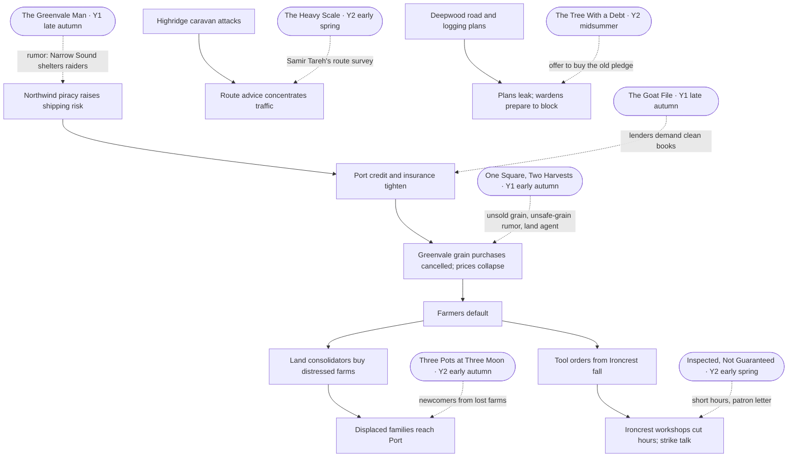

# World Threads

## Status

**Writing reference — derived view, not setting canon.** Each story page owns its own Larger-world thread; this page only shows how the threads connect. The story calendar and every attribution below are **provisional**: the Villain's identity and plan remain [open questions](../Open-Questions.md#villain), and [Current Events](../Story/Current-Events.md) has not yet been audited against a final map.

Rule: [connected, not driven](Applying-to-Two-Sons.md#the-world-tie-rule-connected-not-driven).

## The seven stories sit along one ripple chain

The seven stories fall across a working two-year calendar, and each lands on a different link of the ripple chain that [Current Events](../Story/Current-Events.md#example-ripple-chain) already describes: piracy raises shipping risk, credit tightens, Greenvale grain stops selling, farms fail, tool orders fall, and so on outward.

Rectangles are the canon ripple chain and related current events; rounded boxes are stories. Every story is a place where one link of the chain touches a single community.

## Story calendar (working, provisional)

The order follows the chain: grain fails in the autumn of year 1, the effects reach the forges and passes the next spring, and displaced families reach Port by the following autumn.

| When | Story | Festival clock |
| --- | --- | --- |
| Year 1, early autumn | [One Square, Two Harvests](Stories/One-Square-Two-Harvests.md) | Harvest Home + Wine Crush |
| Year 1, late autumn | [The Greenvale Man](Stories/The-Greenvale-Man.md) | Last Sail |
| Year 1, late autumn | [The Goat File](Stories/The-Goat-File.md) | Ledger Closing |
| Year 2, early spring | [Inspected, Not Guaranteed](Stories/Inspected-Not-Guaranteed.md) | Forge Reawakening |
| Year 2, early spring | [The Heavy Scale at Icestep Summit](Stories/The-Heavy-Scale.md) | Pass Opening + Ice Breaking |
| Year 2, midsummer | [The Tree With a Debt](Stories/The-Tree-With-a-Debt.md) | Canopy Vigil + Midsummer Debates |
| Year 2, early autumn | [Three Pots at Three Moon](Stories/Three-Pots-at-Three-Moon.md) | Three Moon Festival |

## The threads

"Behind it" is an out-of-story, provisional attribution. Nobody inside a story knows it.

| Story | Current event | Domino figure | The nail | Behind it | Local outcome | Outward effect |
| --- | --- | --- | --- | --- | --- | --- |
| [One Square, Two Harvests](Stories/One-Square-Two-Harvests.md) | Greenvale abundance crisis; unsafe-grain rumors; land consolidation | [Rosana Meadowcroft](../Story/Villains-Dominoes.md#rosana-meadowcroft--greenvale) (her seed strain) | A rumor that Meadowcroft-seed grain is unsafe, and a land agent circling the Vale's indebted farms | Rumor: Villain-amplified. Land agent: `UNKNOWN` (Council-linked finance or ordinary speculators) | The joint festival eats the grain in public; the Salve house buys and distributes it; no farm sells to the agent | A Greenvale co-op and a Sunplains patron house now trade grain together — a precedent rivals could later read as a bloc forming ([Bahriyya's domino](../Story/Villains-Dominoes.md#bahriyya-nazar--sunplains)) |
| [The Greenvale Man](Stories/The-Greenvale-Man.md) | Northwind piracy; accusations that clans shelter raiders; convoy politics | [Maris Bleakshore](../Story/Villains-Dominoes.md#maris-bleakshore--northwind) (her call for convoy patrols) | "It is said" Narrow Sound shelters raiders; some want the regatta cancelled | Villain-amplified rumor | Old Rask asks who *saw* it; nobody did; the coves race anyway | Two coves still sailing together is one less "credible" report feeding the patrol push |
| [The Goat File](Stories/The-Goat-File.md) | Port credit tightening; Highridge caravan attacks cutting trade | — | Lenders will renew Seven Wells' credit only if deferred claims are cleared | Council finance stabilizing lenders (ordinary pressure, not a scheme) | The file closes with no house losing face; a caravan house and a cistern house will join | A joined house can offer caravans water and guides together, just as routes are being redrawn |
| [Inspected, Not Guaranteed](Stories/Inspected-Not-Guaranteed.md) | Tool orders fall; forges on short hours; strike talk; good steel vanishing into private contracts | [Orin Slatehallow](../Story/Villains-Dominoes.md#orin-slatehallow--ironcrest) (the pattern Col nearly follows) | An anonymous patron offers Col funding "should the guild fail to recognize" his work | Villain (provisional): the same approach that took Orin | Col passes his judgment, so the letter goes unanswered; Wurdren notices it | One skilled repairer stays independent; Wurdren has seen his first "convenient offer" |
| [The Heavy Scale at Icestep Summit](Stories/The-Heavy-Scale.md) | Caravan attacks; route redirection | [Samir Tareh](../Story/Villains-Dominoes.md#samir-tareh--highridge) (travels with the first caravan) | Samir is judging which passes are reliable this season; a crooked scale would strike Icestep from his list | The scale fault is weather; the concentration pressure is the Villain's pattern | A public correction; Samir lists Icestep as honest | Traffic stays spread across more than one pass, blunting the concentration the domino needs |
| [The Tree With a Debt](Stories/The-Tree-With-a-Debt.md) | Deepwood road and logging conflict; Council infrastructure interest | [Naruin Mossglade](../Story/Villains-Dominoes.md#naruin-mossglade--deepwood) (Sessa's senior warden) | An unnamed buyer offers to purchase old pledges along a proposed road; whoever holds a "for as long as it stands" pledge profits if the tree falls | Buyer: `UNKNOWN` (possibly a Council Works interest). Naruin's alarm: fed by leaked plans | Hollis renews the pledge as guardianship instead of selling | Sessa brings Naruin a working counterexample — a negotiated path and a Highridge family sworn to a tree |
| [Three Pots at Three Moon](Stories/Three-Pots-at-Three-Moon.md) | Refugee and worker pressure; smuggling surge; Deepwood fungal disruption | — | A street rumor that the newcomers next door are smugglers, while inspectors are fining unpermitted stalls | Ordinary prejudice | The first bowl goes to the newcomers; Jory files their permit | Three Moon does its civic job on one street: incompatible people share one space |

## Cross-story links

These are provisional and can be dropped if a draft doesn't want them. The full cross-story promise ledger, with the flow each link rides, is owned by [The Anthology](Anthology.md#cross-story-promise-ledger).

- **The newcomers in Three Pots** come from a Greenvale farm that *did* sell to a consolidator, the outcome Harveston Vale avoided a year earlier.
- **The Deepwood cook** is on the caravans because the fungal blight took his village's mushroom harvest. He cooks for the first caravan over Icestep in The Heavy Scale, and reaches Port in time for Three Pots.
- **Samir Tareh** settles caravan accounts at Seven Wells' Ledger Closing in The Goat File and hears the goat ruling. By The Heavy Scale his route book already lists Seven Wells: water and guides under one roof.
- **Harveston grain** turns up in Kettle Cove's winter stores in The Greenvale Man, in sacks stamped with both of the square's names.
- **Wurdren** meets the anonymous-patron pattern for the first time in Inspected, Not Guaranteed. It is the first of the recurring "strange orders, inexplicable resources" his [middle arc](../Story/Wurdren.md#middle) turns on.

## Where the nail still fell

Every story holds its own ground, but the same nail succeeds somewhere just offstage. A web where every domino misses would be too tidy, and the Villain's plan would be too weak to matter. Each of these appears in its story as one line at most, and never as the story's subject.

| Story | Holds here | Still falls elsewhere |
| --- | --- | --- |
| One Square, Two Harvests | No Vale farm sells to the land agent | Farms elsewhere in Greenvale do; the Ardens in Three Pots are one of them |
| The Greenvale Man | Kettle Cove races Narrow Sound | Other coves take the rumor and leave Narrow Sound out of their convoy |
| The Goat File | Seven Wells closes its file without ruin | In other towns, forced closures ruin families; the tea seller has heard of two |
| Inspected, Not Guaranteed | Col never answers the letter | Orin Slatehallow already answered his |
| The Heavy Scale | Icestep stays on Samir's list | Another pass town, with a genuinely bad scale, comes off it |
| The Tree With a Debt | Hollis won't sell | The buyer has already bought other pledges along the planned road |
| Three Pots at Three Moon | One street shares its space | The smuggling rumors keep running on the next street over |

## The view from the desks

Out of story. This is what each hidden power could conclude from the seven events, following [World Rules §12](../World-Rules.md#12-every-major-event-should-have-second--and-third-order-effects). It is written for the saga's use, and it is provisional because the Villain's plan is [open](../Open-Questions.md#villain).

| Story | The Villain's desk sees | The Council's desk sees |
| --- | --- | --- |
| One Square, Two Harvests | A rumor that didn't take in one valley. Noise. | A Sunplains patron house buying Greenvale grain directly. It looks like the start of cross-border consolidation, and the Council might quietly tighten the Salve house's credit. The Villain could then point to that squeeze as proof that the Council punishes Sunplains cooperation. |
| The Greenvale Man | One cove refused the Narrow Sound story. Noise. | Nothing. Northwind convoy patrols are growing, and one regatta changes no ledger. |
| The Goat File | Nothing. | A town cleaned its books under credit pressure without a scandal: the system working as intended. |
| Inspected, Not Guaranteed | One talent declined the patron. Noise, unless it repeats. | Nothing. |
| The Heavy Scale | A pass he expected to lose traffic kept it. Mildly inconvenient. | A route stayed open. Welcome, and unexamined. |
| The Tree With a Debt | Naruin has received something that argues against the escalation the leaks were meant to provoke. Worth watching. | If the buyer is a Council Works interest, one pledge short on a planned right of way. The road's planners may reroute, and that reroute could leak too. |
| Three Pots at Three Moon | Nothing. | Nothing. |

Individually, every entry is noise. Together they are the kind of pattern the [Villain's page](../Story/Villain.md#relationship-to-wurdren) says he eventually notices: people repairing connections without being paid or coerced. That realization belongs to the saga, not to any Sunday Morning story.

## What the web adds

Taken together, the seven stories are places where a domino should have fallen and, mostly, didn't — because people acted for small local reasons. That is the setting's claim about ordinary decency ([Villain's Dominoes](../Story/Villains-Dominoes.md#wurdrens-effect): changing relationships, not knocking dominoes backward). Two stories show the other side: Harveston Vale's good outcome may feed a later suspicion, and Icestep's honest scale is only one pass among many.
